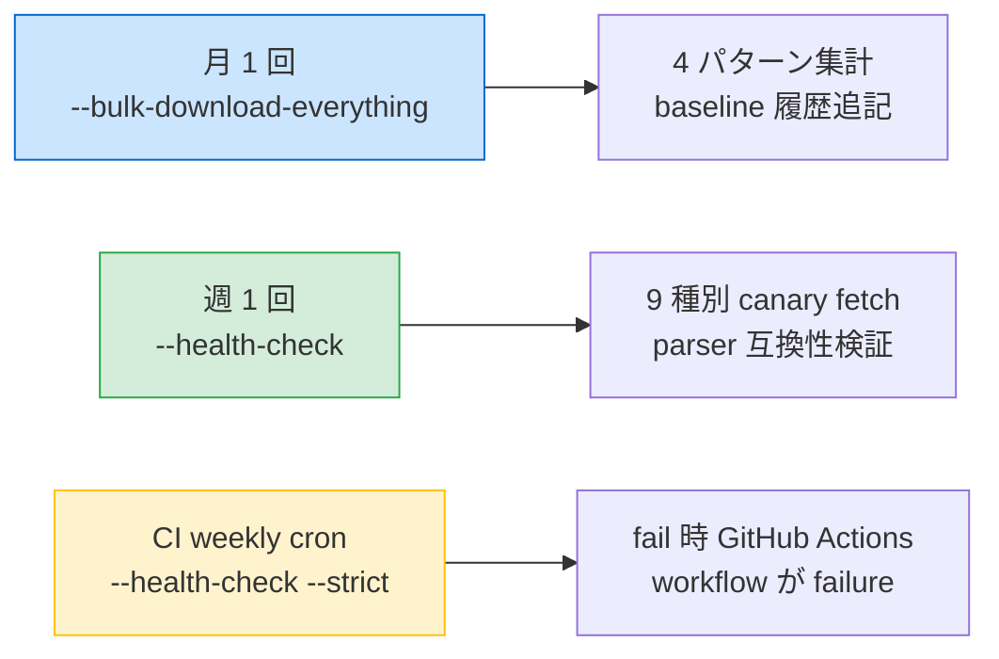

# Houki NTA MCP Server

[](https://github.com/shuji-bonji/houki-nta-mcp/actions/workflows/ci.yml)
[](LICENSE)
[](https://nodejs.org/)

国税庁（NTA）の **通達・質疑応答事例・タックスアンサー**を取得する MCP サーバ。

法律本文は houki-hub family の別 MCP（[`@shuji-bonji/houki-egov-mcp`](https://github.com/shuji-bonji/houki-egov-mcp)）が担当します。

## 状態: v0.6.0 — Resilience 機能を実装、運用に耐える品質に 🛡️

**Phase 2**: 4 つの基本通達（消基通 / 所基通 / 法基通 / 相基通）の bulk DL +
ローカル SQLite (FTS5) 全文検索 + DB-first / live fallback + 改正検知 + Normalize-everywhere。

**Phase 3b** (v0.4.0): 改正通達 + 事務運営指針 + 文書回答事例 を `document` テーブルで統一管理。

**Phase 3c** (v0.5.0): タックスアンサー + 質疑応答事例の bulk DL + FTS5 検索を本実装。
全件 bulk DL は **2,710 件 / 51 分 / fail rate 0%** で安定動作（HP 構造変更検知の baseline として記録）。

**Phase 5** (v0.6.0): Resilience 機能を本実装。HTML 構造変更を 4 パターン（新規 / 更新 / 削除 / 移動）で集計、
二重 threshold で誤検知を抑制、`--health-check` CLI で 9 種別の代表 URL を canary 検証。
レスポンスに `freshness` フィールドを付与し、利用者（LLM）が staleness を判定できるように。
設計詳細: [docs/RESILIENCE.md](docs/RESILIENCE.md)

```bash
# 6 種別を一括投入する統合 CLI（推奨）
houki-nta-mcp --bulk-download-everything \
  --bunsho-taxonomy=shotoku \
  --tax-answer-taxonomy=shotoku,shohi \
  --qa-topic=shotoku,shohi
```

実装ロードマップは [`docs/DESIGN.md`](docs/DESIGN.md) を参照。

## 提供ツール（v0.6.0 確定版 / 13 ツール、search 系には `freshness` フィールド付き）

| Tool                         | 用途                                                   | 状態      |
| ---------------------------- | ------------------------------------------------------ | --------- |
| `nta_get_tsutatsu`           | 通達本文を取得（DB-first → live fallback、4 通達対応） | ✅ v0.3.0 |
| `nta_search_tsutatsu`        | 通達を FTS5 全文検索                                   | ✅ v0.3.0 |
| `nta_get_kaisei_tsutatsu`    | 改正通達を docId で取得（本文 + 添付 PDF URL）         | ✅ v0.4.0 |
| `nta_search_kaisei_tsutatsu` | 改正通達を FTS5 検索                                   | ✅ v0.4.0 |
| `nta_get_jimu_unei`          | 事務運営指針を取得                                     | ✅ v0.4.0 |
| `nta_search_jimu_unei`       | 事務運営指針を FTS5 検索                               | ✅ v0.4.0 |
| `nta_get_bunshokaitou`       | 文書回答事例を取得                                     | ✅ v0.4.0 |
| `nta_search_bunshokaitou`    | 文書回答事例を FTS5 検索                               | ✅ v0.4.0 |
| `nta_get_tax_answer`         | タックスアンサー本文を取得                             | ✅ v0.2.0 |
| `nta_search_tax_answer`      | タックスアンサーを FTS5 全文検索                       | ✅ v0.5.0 |
| `nta_get_qa`                 | 質疑応答事例の本文を取得                               | ✅ v0.2.0 |
| `nta_search_qa`              | 質疑応答事例を FTS5 全文検索                           | ✅ v0.5.0 |
| `resolve_abbreviation`       | 略称→エントリ解決（houki-abbreviations 経由）          | ✅ v0.0.1 |

### 対応通達（4 種、bulk DL 済みなら DB lookup で即時応答）

| 通達             | 略称   | TOC スタイル | clause 番号体系                                |
| ---------------- | ------ | ------------ | ---------------------------------------------- |
| 消費税法基本通達 | 消基通 | shohi        | 3 階層 `1-4-13の2`                             |
| 所得税法基本通達 | 所基通 | shotoku      | 2 階層 `2-4の2` / 共通通達 `183~193共-1`       |
| 法人税基本通達   | 法基通 | hojin        | 3 階層、節の2 を含む `1-3の2-N`                |
| 相続税法基本通達 | 相基通 | sozoku       | flat 構造、ナカグロ複数条共通 `1の3・1の4共-1` |

clause 番号は **Normalize-everywhere** で全角→半角統一されているため、ユーザーが
半角・全角どちらで入力してもヒットします。

## 使い方の例

```jsonc
// nta_get_tsutatsu — DB-first lookup（bulk DL 済みなら即時応答 ~10ms）
{ "name": "消基通", "clause": "1-4-13の2" }
// → "## 1-4-13の2（分割があった場合の課税事業者選択届出書の効力等）..."
//    + 出典 URL + 取得時刻 + legal_status の note + source: 'db' | 'live'

// 所基通（2 階層 clause / の付き）
{ "name": "所基通", "clause": "2-4の2" }

// 所基通源泉（チルダ複数条共通）
{ "name": "所基通", "clause": "183~193共-1" }

// 相基通（ナカグロ複数条共通）
{ "name": "相基通", "clause": "1の3・1の4共-5" }

// nta_search_tsutatsu — FTS5 全文検索（4 通達横断）
{ "keyword": "電子帳簿", "limit": 10 }
// → { hits: [{ tsutatsu, clauseNumber, title, snippet, sourceUrl }, ...] }

// nta_get_kaisei_tsutatsu — 改正通達取得 (Phase 3b)
{ "docId": "0026003-067" }
// → "# 消費税法基本通達の一部改正について（法令解釈通達）" + 発出日 + 宛先 + 本文 + 添付 PDF URL
//    PDF 本文は pdf-reader-mcp に委譲

// nta_search_kaisei_tsutatsu — 改正通達検索（taxonomy 絞り込み可）
{ "keyword": "インボイス", "taxonomy": "shohi", "limit": 5 }

// nta_get_tax_answer — 番号で取得（先頭桁から税目自動判定）
{ "no": "6101" }
// → "# No.6101 消費税の基本的なしくみ ..." 7 sections + 法令時点 + 出典

// nta_get_qa — 質疑応答事例を取得
{ "topic": "shohi", "category": "02", "id": "19" }
// → "# 個人事業者が所有するゴルフ会員権の譲渡 ## 【照会要旨】 ... ## 【回答要旨】 ..."

// 管轄外（消法 = 消費税法本体）→ houki-egov-mcp に誘導
{ "name": "消法", "clause": "9" }
// → { error: "...houki-egov の管轄...", hint: "houki-egov-mcp で取得してください" }
```

## 初回セットアップ（bulk DL）

通達本体・改正通達・事務運営指針・文書回答事例を事前に bulk DL してローカル
SQLite (FTS5) に投入します。1 度実行すれば DB から即時応答（fetch なし）、改正があれば
`--refresh-stale` で差分更新できます。

```bash
# 推奨: 4 種別を一括投入（約 50 分。--bunsho-taxonomy で短縮可）
houki-nta-mcp --bulk-download-everything --bunsho-taxonomy=shotoku

# 個別実行も可
houki-nta-mcp --bulk-download-all          # 通達本体（消基通/所基通/法基通/相基通、計 10-15 分）
houki-nta-mcp --bulk-download-kaisei       # 改正通達（4 通達分、約 5-10 分）
houki-nta-mcp --bulk-download-jimu-unei    # 事務運営指針（約 1 分）
houki-nta-mcp --bulk-download-bunshokaitou # 文書回答事例（全税目で 30 分超）

# 30 日以上古い節を再取得（差分更新）
houki-nta-mcp --refresh-stale=30 --apply

# DB は ${XDG_CACHE_HOME:-~/.cache}/houki-nta-mcp/cache.db
```

| コンテンツ        | 件数の目安        | 投入時間                   |
| ----------------- | ----------------- | -------------------------- |
| 通達本体 (4 通達) | 約 2,800 clauses  | 10-15 分                   |
| 改正通達          | 約 125 docs       | 5-10 分                    |
| 事務運営指針      | 約 32 docs        | 約 1 分                    |
| 文書回答事例      | 数百〜2,000+ docs | 約 30 分超（絞り込み推奨） |
| タックスアンサー  | 約 750 docs       | 約 14 分                   |
| 質疑応答事例      | 約 1,840 docs     | 約 35 分                   |

`--bulk-download` を実行していなくても、消基通はライブ取得経路でフォールバック動作します
（応答時間は ~700ms/件）。所基通・法基通・相基通および周辺コンテンツ（改正通達 / 事務運営指針 /
文書回答事例）は bulk DL 必須。

## 通達の法的位置付け（重要）

通達は **行政内部文書**であり、国民・裁判所には直接的な法的拘束力を持ちません（最高裁 昭和43.12.24 墓地埋葬法事件）。ただし税務署員は職務命令として守る義務があり、**実務上は事実上の規範**として機能します。

```
┌──────────────────────────────────────────────────┐
│ 法律 (国会制定)              → 全員に拘束力     │
│ 政令・省令・告示             → 同上             │
│ ─── ここまでが houki-egov-mcp ─── │
│ 通達 (行政内部)              → 税務署員のみ拘束 │
│ 質疑応答事例                 → 参考情報         │
│ タックスアンサー             → 一般向け解説     │
│ ─── ここが houki-nta-mcp ─── │
└──────────────────────────────────────────────────┘
```

## 運用フロー（v0.6.0 Resilience）

スクレイピング主体のため、国税庁 HP の構造変更で bulk DL や parse が静かに壊れるリスクがあります。
v0.6.0 では検知・可視化を実装しました。実運用では以下を組み合わせて使ってください:



| 頻度         | コマンド                                   | 用途                                               | 所要時間 |
| ------------ | ------------------------------------------ | -------------------------------------------------- | -------- |
| 月 1 回      | `houki-nta-mcp --bulk-download-everything` | 4 パターン集計 + baseline 永続化                   | 〜51 分  |
| 週 1 回      | `houki-nta-mcp --health-check`             | 9 種別の代表 URL を canary fetch                   | 〜数十秒 |
| 週 1 回 (CI) | GitHub Actions cron                        | `--health-check --strict` で workflow に fail 連動 | 〜1 分   |

cron / launchd の設定例:

```cron
# 月初に bulk DL（毎月 1 日 03:00 JST）
0 3 1 * *  /usr/local/bin/houki-nta-mcp --bulk-download-everything > ~/.cache/houki-nta-mcp/last-bulk.log 2>&1

# 月曜に health-check（毎週月曜 09:00 JST）
0 9 * * 1  /usr/local/bin/houki-nta-mcp --health-check >> ~/.cache/houki-nta-mcp/health.log 2>&1
```

レスポンスには `freshness` フィールドが付き、利用者（LLM）は `staleness` から再 bulk DL の必要性を判断できます:

```json
{
  "results": [...],
  "freshness": {
    "oldest_fetched_at": "2026-04-15T08:00:00Z",
    "newest_fetched_at": "2026-05-03T23:22:31Z",
    "staleness": "stale",  // fresh < 1w / stale < 1m / outdated > 1m
    "days_since_oldest": 19
  }
}
```

`outdated` 時は `warning` フィールドが付与され、再 bulk DL を促す案内が含まれます。

設計詳細は [`docs/RESILIENCE.md`](docs/RESILIENCE.md) を参照。

## なぜ通達まで取得するのか

法律本文だけでは判断できないケースが多数あります。例えば消費税の軽減税率:

- **法律**（消費税法 4条）「飲食料品の譲渡には軽減税率を適用」
- **政令**: 飲食料品の定義
- **基本通達 5-1-9**: 「社内会議で出した飲食料品」「会議室への提供」「テイクアウト」の区分
- **質疑応答事例**: 個別事例（「テレワーク手当に含まれる飲料水」等）

会計・経理・税務系プロダクトを開発する場合、**通達レベルまで参照しないと正しい判定ができない**ことが多く、houki-nta-mcp はその領域をカバーします。

詳細は [`docs/DESIGN.md`](docs/DESIGN.md) を参照。

## houki-hub MCP family

| パッケージ                                                                               | 役割（束ねる単位 + 初版スコープ）                                                                                            | 状態      |
| ---------------------------------------------------------------------------------------- | ---------------------------------------------------------------------------------------------------------------------------- | --------- |
| [`@shuji-bonji/houki-abbreviations`](https://github.com/shuji-bonji/houki-abbreviations) | 略称辞書（共有ライブラリ）                                                                                                   | ✅ v0.2.0 |
| [`@shuji-bonji/houki-egov-mcp`](https://github.com/shuji-bonji/houki-egov-mcp)           | e-Gov 法令 API クライアント。法律・政令・省令・規則・告示の本文取得                                                          | ✅ v0.2.0 |
| **`@shuji-bonji/houki-nta-mcp`**                                                         | **国税庁の通達・改正通達・事務運営指針・文書回答事例・Q&A・タックスアンサー（このリポジトリ）**                              | ✅ v0.6.0 |
| `@shuji-bonji/houki-mhlw-mcp`                                                            | 厚労省の通達・通知・指針                                                                                                     | 📅 計画中 |
| `@shuji-bonji/houki-saiketsu-mcp`                                                        | **裁決全般**。初版は国税不服審判所 (kfs.go.jp、約 1,950 件)。将来的に公正取引委員会・特許庁審判部・各省庁不服審査会 等へ拡張 | 💭 構想中 |
| `@shuji-bonji/houki-court-mcp`                                                           | **判例全般**。初版は民事判決オープンデータ API。将来的に courts.go.jp の全公開判例（最高裁・高裁・地裁）へ拡張               | 💭 構想中 |
| `@shuji-bonji/houki-hub`                                                                 | meta-package（一括 install）                                                                                                 | 📅 計画中 |

## インストール

```json
// claude_desktop_config.json
{
  "mcpServers": {
    "houki-egov": {
      "command": "npx",
      "args": ["-y", "@shuji-bonji/houki-egov-mcp"]
    },
    "houki-nta": {
      "command": "npx",
      "args": ["-y", "@shuji-bonji/houki-nta-mcp"]
    }
  }
}
```

法律本文と通達の両方を引けるよう、両方を併用することを推奨します。

### bulk DL の注意

- **初回 bulk DL** は `npx -y @shuji-bonji/houki-nta-mcp --bulk-download-all` を別シェルで
  事前実行することを推奨（MCP サーバ起動とは別プロセス、計 10-15 分）。
- `pdf-reader-mcp` を併用すると、改正通達の添付 PDF（新旧対照表など）も内容取得できます。

### prerelease (alpha) チャンネル

```json
"args": ["-y", "@shuji-bonji/houki-nta-mcp@next"]   // alpha 系を追従
"args": ["-y", "@shuji-bonji/houki-nta-mcp@latest"] // 安定版（既定）
```

## ローカル開発

```bash
git clone git@github.com:shuji-bonji/houki-nta-mcp.git
cd houki-nta-mcp
npm install
npm run build
npm test
```

```json
// 開発中の動作確認 (.mcp.json)
{
  "mcpServers": {
    "houki-nta-local": {
      "command": "node",
      "args": ["/absolute/path/to/houki-nta-mcp/dist/index.js"]
    }
  }
}
```

## ドキュメント

- [`docs/DESIGN.md`](docs/DESIGN.md) — 設計原則・houki-hub family 内の位置付け・ツール設計
- [`docs/DATA-SOURCES.md`](docs/DATA-SOURCES.md) — 国税庁公開コンテンツの URL 構造・スクレイピング方針・ライセンス
- [`DISCLAIMER.md`](DISCLAIMER.md) — 通達の法的位置付け・利用範囲
- [`CONTRIBUTING.md`](CONTRIBUTING.md) — 貢献方法
- [`CHANGELOG.md`](CHANGELOG.md) — リリースノート

## 業法との関係

本MCP は **一次情報の取得・提示のみ** を担います。分析は LLM、判断は利用者（または有資格者）の責任です。

**業としての税務代理・税務書類作成・税務相談（税理士法52条）への利用は想定外**です。詳細は [DISCLAIMER.md](DISCLAIMER.md) 参照。

## ライセンス

MIT — 個人利用・学習用途のフォーク・改変・再配布を自由に許可します。

国税庁コンテンツの著作権は **国（国税庁）**にあり、再配布・改変は[政府標準利用規約（第2.0版）](https://cio.go.jp/policy-opendata)の範囲内で可能です。本MCP は出典 URL を必ず付与する設計とし、利用者は元情報を確認できます。

ただし、**業としての使用（税理士法52条が定める独占業務）** については想定外であり、作者は一切の責任を負いません。[DISCLAIMER.md](DISCLAIMER.md) を必ずご確認ください。
