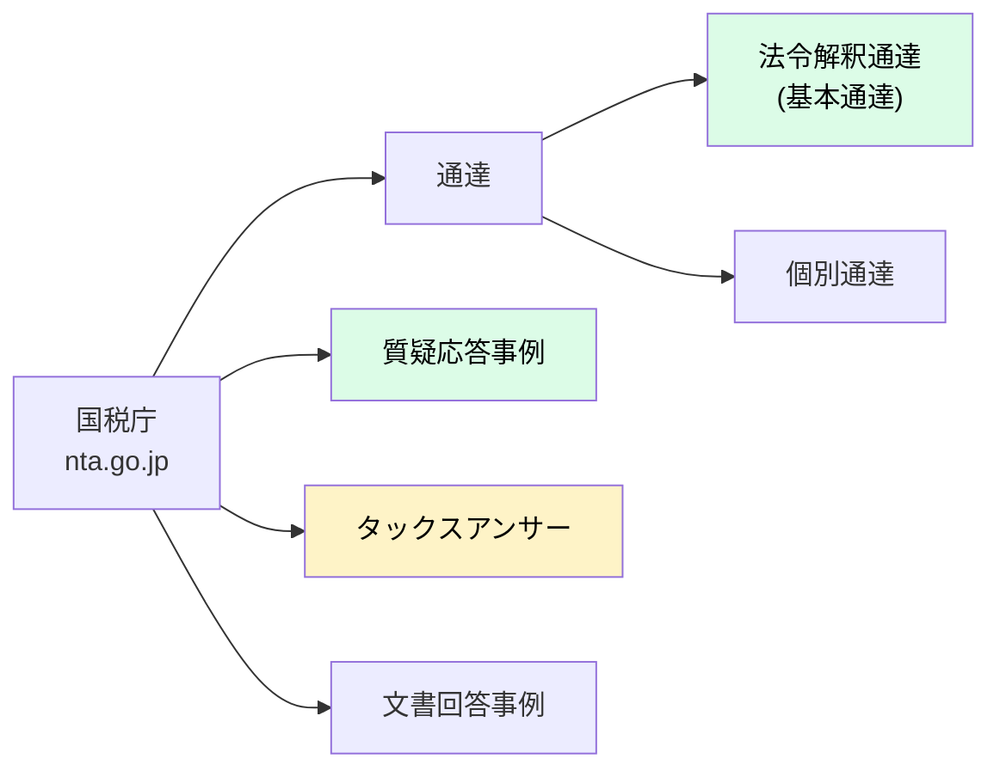
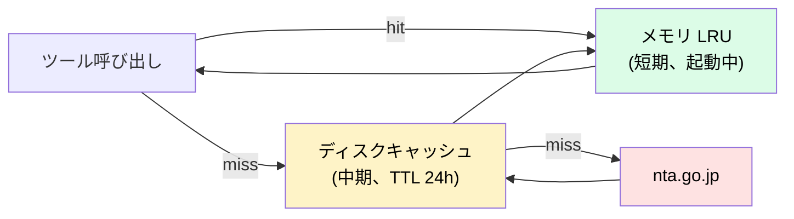

# Data Sources — 国税庁公開コンテンツの調査

`houki-nta-mcp` が取得対象とする国税庁公開コンテンツの調査メモ。Phase 1 実装前のリファレンス。

## 国税庁の公開コンテンツ一覧



緑 = Phase 1 で取得予定 / 黄 = Phase 2 以降

## API の有無

| ソース | API 有無 | 取得手段 |
|---|---|---|
| 通達 | ❌ なし | HTML スクレイピング |
| 質疑応答事例 | ❌ なし | HTML スクレイピング |
| タックスアンサー | ❌ なし | HTML スクレイピング |
| 文書回答事例 | ❌ なし | HTML スクレイピング |
| 法人番号 Web-API | ✅ あり | 別 MCP の対象（houki-nta-mcp スコープ外） |
| 適格請求書発行事業者 Web-API | ✅ あり | 同上 |

公式 RSS フィードは廃止済み。更新検知は **定期スクレイピング + ハッシュ比較**で対応する。

## URL 構造（Phase 1 実装前の想定 — 要実地確認）

### 通達（法令解釈通達）

```
索引: https://www.nta.go.jp/law/tsutatsu/menu.htm
基本通達トップ:
  消費税法基本通達: https://www.nta.go.jp/law/tsutatsu/kihon/shohi/01/01.htm
  所得税基本通達:   https://www.nta.go.jp/law/tsutatsu/kihon/shotoku/...
  法人税基本通達:   https://www.nta.go.jp/law/tsutatsu/kihon/houjin/...
  相続税法基本通達: https://www.nta.go.jp/law/tsutatsu/kihon/sozoku/...

各通達ページの構造（想定）:
  - HTML
  - 文字コード: Shift_JIS（要確認）
  - 章 → 項 → 号 の階層構造
  - URL は章単位で分かれている可能性高
```

### 質疑応答事例

```
索引: https://www.nta.go.jp/law/shitsugi/01.htm

カテゴリ:
  01_所得税
  02_法人税
  03_相続税
  04_消費税
  05_印紙税
  ...

各事例ページ:
  - 1ページ1Q&A
  - URL: https://www.nta.go.jp/law/shitsugi/{税目}/{番号}/{事例ID}.htm
```

### タックスアンサー

```
索引: https://www.nta.go.jp/taxes/shiraberu/taxanswer/index2.htm

各記事:
  - URL: https://www.nta.go.jp/taxes/shiraberu/taxanswer/{税目}/{番号}.htm
  - 番号体系:
    - 1xxx: 所得税
    - 4xxx: 相続税・贈与税
    - 5xxx: 法人税
    - 6xxx: 消費税
    - 7xxx: 印紙税・その他
    - 8xxx: 国税通則法・徴収
    - 9xxx: 申告・納税
  - 例: 6101 = 消費税の納税義務者
```

### 文書回答事例

```
索引: https://www.nta.go.jp/about/organization/ntc/bunsyokaito/index.htm

特徴:
  - PDF が多い
  - 個別企業からの照会に対する回答
  - 当該照会者にのみ拘束力（参考情報）
```

## 文字コード

国税庁サイトは伝統的に **Shift_JIS** ページが多い。Node.js の標準 `fetch` ではデコードを自前で行う必要がある。

```ts
// 想定実装（Phase 1）
import { decode } from 'iconv-lite';

const res = await fetch(url);
const buf = Buffer.from(await res.arrayBuffer());

// Content-Type ヘッダから charset を取得
const charset = res.headers.get('content-type')?.match(/charset=([^;]+)/)?.[1] ?? 'shift_jis';

const html = decode(buf, charset);
```

依存追加候補:
- `iconv-lite` — 文字コード変換
- `cheerio` — HTML パース（jQuery ライク）

## ライセンス・著作権

国税庁コンテンツの著作権は **国（国税庁）**にある。再配布・改変は **[政府標準利用規約（第2.0版）](https://cio.go.jp/policy-opendata)** の範囲内であれば可能。

houki-nta-mcp は以下のスタンスで運用:

1. **取得結果に常に出典 URL を付ける** — 一次情報源を必ず示す
2. **取得時刻を付ける** — 再現性確保
3. **改変はしない** — テキストはそのまま、Markdown 整形のみ
4. **大量取得は深夜帯** — サイトに負荷をかけない
5. **robots.txt 順守** — 拒否されているパスは叩かない

## スクレイピングのマナー

| 観点 | 方針 |
|---|---|
| User-Agent | `@shuji-bonji/houki-nta-mcp/x.y.z (+github URL)` を明示 |
| リクエスト間隔 | 1リクエスト/秒以下 |
| 並列度 | 同一ホスト 1 並列まで |
| エラー時 | 指数バックオフでリトライ |
| 大量取得 | bulk DL モード（Phase 2）でローカルキャッシュ |
| robots.txt | 起動時に取得して順守 |

## キャッシュ戦略

通達は改正があるが頻度は低い（年1〜数回）。質疑応答事例・タックスアンサーは年複数回更新。



ディスクキャッシュ場所: `~/.cache/houki-nta-mcp/` (XDG_CACHE_HOME 配下)

## 既存実装の参考

`kentaroajisaka/tax-law-mcp` v0.5.4（npm 公開、MIT、現役メンテ）が同じアプローチを実装済み:

- 取得元: `nta.go.jp`（通達）、`kfs.go.jp`（不服審判所裁決）
- 件数: 通達 17件、裁決 1,950件
- 文字コード: Shift_JIS 対応済み

houki-nta-mcp は **ラップせず参考にする**方針:

- メンテ責任の分散リスク
- ライセンス再配布要件の追跡困難
- Architecture E の「独立 MCP」設計に整合

ただし、URL 構造・パース手法は参考にして実装時間を短縮する。

## 検討中: bulk DL モード

Phase 2 で「初回起動時に通達一式をダウンロードしてローカル SQLite に格納」モードを検討。`HOUKI_NTA_BULK_CACHE=1` で有効化。

メリット:
- オフライン動作
- FTS5 による横断全文検索
- レスポンス速度向上

デメリット:
- 初回 DL に時間（数分〜十数分）
- ストレージ使用（数百 MB 想定）
- 改正検知の仕組みが別途必要

この機能は houki-egov-mcp の Phase 2 と同じ設計思想で揃える。

## TODO（Phase 1 着手前）

- [ ] 国税庁サイトの実地調査（URL 構造、Shift_JIS の有無、HTML 構造）
- [ ] `kentaroajisaka/tax-law-mcp` のソースコード詳読（パース手法）
- [ ] robots.txt 確認
- [ ] サンプル通達（消基通 5-1-9 等）を実際に fetch して構造把握
- [ ] cheerio + iconv-lite の動作確認
