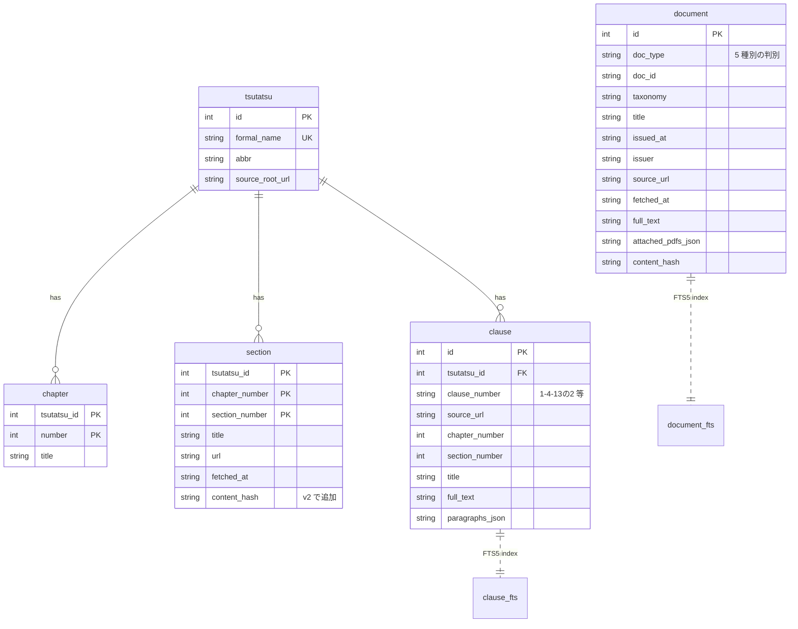

# DATABASE — SQLite + FTS5 スキーマ

houki-nta-mcp は国税庁公式サイトから取得したコンテンツをローカル SQLite に永続化し、FTS5（trigram tokenizer）で全文検索する。本ドキュメントは DB スキーマ・テーブル仕様・運用上の挙動をまとめる。

## DB ファイルの場所

```
${XDG_CACHE_HOME:-~/.cache}/houki-nta-mcp/cache.db
```

優先順:

1. `HOUKI_NTA_DB_PATH` 環境変数（`--db-path` と同等）
2. `XDG_CACHE_HOME/houki-nta-mcp/cache.db`
3. `~/.cache/houki-nta-mcp/cache.db`

加えて Phase 5 Resilience の baseline ファイルが同じディレクトリに作られる:

```
${XDG_CACHE_HOME:-~/.cache}/houki-nta-mcp/
├── cache.db                              # 本体
├── baseline-tsutatsu-shohi.json          # 4 通達分の bulk DL 履歴
├── baseline-tsutatsu-shotoku.json
├── baseline-tsutatsu-hojin.json
├── baseline-tsutatsu-sozoku.json
├── baseline-kaisei.json                  # 改正通達
├── baseline-jimu-unei.json               # 事務運営指針
├── baseline-bunshokaitou.json            # 文書回答事例
├── baseline-tax-answer.json              # タックスアンサー
└── baseline-qa-jirei.json                # 質疑応答事例
```

## スキーマ全体像



## 設計判断: clause table と document table の使い分け

| テーブル   | 担当                                                                 | 構造                            | キー                           | 検索           |
| ---------- | -------------------------------------------------------------------- | ------------------------------- | ------------------------------ | -------------- |
| `clause`   | 基本通達 4 種（消基通・所基通・法基通・相基通）                      | 階層的（章 → 節 → 条）          | `(tsutatsu_id, clause_number)` | `clause_fts`   |
| `document` | 改正通達・事務運営指針・文書回答事例・タックスアンサー・質疑応答事例 | フラット（1 文書 = 1 レコード） | `(doc_type, doc_id)`           | `document_fts` |

**なぜ分けているか**: 基本通達は「章 → 節 → 条」の階層構造が固有（消基通の `1-4-13の2` のような）で、章番号や節番号のクエリが頻出する。一方、改正通達以下は番号体系が個別の文書 ID（`0026003-067` / `240401` / `shotoku/250416` など）に多様化していて、単一の `doc_id` で扱う方が自然。

## 各テーブル仕様

### `schema_meta`

スキーマバージョンを保持する key-value テーブル。

| カラム  | 型      | 説明                   |
| ------- | ------- | ---------------------- |
| `key`   | TEXT PK | 例: `'schema_version'` |
| `value` | TEXT    | バージョン番号文字列   |

### `tsutatsu` — 基本通達のメタ

4 通達の identity を保持。

| カラム            | 型          | 説明           | 例                                                  |
| ----------------- | ----------- | -------------- | --------------------------------------------------- |
| `id`              | INTEGER PK  | autoincrement  | 1                                                   |
| `formal_name`     | TEXT UNIQUE | 正式名         | `'消費税法基本通達'`                                |
| `abbr`            | TEXT        | 略称           | `'消基通'`                                          |
| `source_root_url` | TEXT        | 通達ルート URL | `'https://www.nta.go.jp/law/tsutatsu/kihon/shohi/'` |

### `chapter` — 章

```
PRIMARY KEY (tsutatsu_id, number)
```

| カラム        | 型         | 説明                |
| ------------- | ---------- | ------------------- |
| `tsutatsu_id` | INTEGER FK | `tsutatsu.id`       |
| `number`      | INTEGER    | 章番号（1-indexed） |
| `title`       | TEXT       | 例: `'第１章 通則'` |

### `section` — 節

```
PRIMARY KEY (tsutatsu_id, chapter_number, section_number)
```

| カラム           | 型         | 説明                                    |
| ---------------- | ---------- | --------------------------------------- |
| `tsutatsu_id`    | INTEGER FK | `tsutatsu.id`                           |
| `chapter_number` | INTEGER    | 章番号                                  |
| `section_number` | INTEGER    | 節番号                                  |
| `title`          | TEXT       | 例: `'第４節 課税事業者の選択'`         |
| `url`            | TEXT       | 節 HTML の URL                          |
| `fetched_at`     | TEXT       | ISO 8601 取得時刻                       |
| `content_hash`   | TEXT       | **v2 で追加**。SHA-1 ハッシュで改正検知 |

### `clause` — 条（検索の最小単位）

```
UNIQUE INDEX idx_clause_lookup (tsutatsu_id, clause_number)
```

| カラム            | 型         | 説明                        | 例            |
| ----------------- | ---------- | --------------------------- | ------------- |
| `id`              | INTEGER PK | autoincrement               |               |
| `tsutatsu_id`     | INTEGER FK | `tsutatsu.id`               |               |
| `clause_number`   | TEXT       | 条番号文字列                | `'1-4-13の2'` |
| `source_url`      | TEXT       | 取得元 URL                  |               |
| `chapter_number`  | INTEGER    | 章番号                      |               |
| `section_number`  | INTEGER    | 節番号                      |               |
| `title`           | TEXT       | 条の見出し                  |               |
| `full_text`       | TEXT       | 本文（normalize 済み）      |               |
| `paragraphs_json` | TEXT       | JSON: `TsutatsuParagraph[]` |               |

**clause_number の体系は通達ごとに違う**:

- 消基通（shohi）: 3 階層 `1-4-13の2`
- 所基通（shotoku）: 2 階層 `2-4の2` / 共通通達 `183~193共-1`
- 法基通（hojin）: 3 階層、節の2 を含む `1-3の2-N`
- 相基通（sozoku）: flat 構造、ナカグロ複数条共通 `1の3・1の4共-1`

### `document` — 5 種別の統一テーブル（v3 で追加）

```
UNIQUE (doc_type, doc_id)
INDEX idx_document_lookup (doc_type, doc_id)
INDEX idx_document_taxonomy (doc_type, taxonomy)
```

| カラム               | 型            | 説明                              | 例                                                                            |
| -------------------- | ------------- | --------------------------------- | ----------------------------------------------------------------------------- |
| `id`                 | INTEGER PK    | autoincrement                     |                                                                               |
| `doc_type`           | TEXT NOT NULL | 種別判別                          | `'kaisei'` / `'jimu-unei'` / `'bunshokaitou'` / `'tax-answer'` / `'qa-jirei'` |
| `doc_id`             | TEXT NOT NULL | 種別内ユニーク ID                 | `'0026003-067'` / `'shohi/02/19'` / `'6101'`                                  |
| `taxonomy`           | TEXT          | 税目フォルダ                      | `'shohi'` / `'shotoku'` / `'hojin'` / `'sisan/sozoku'`                        |
| `title`              | TEXT NOT NULL | タイトル                          |                                                                               |
| `issued_at`          | TEXT          | 発出日（ISO YYYY-MM-DD）          | `'2024-04-01'`                                                                |
| `issuer`             | TEXT          | 宛先・発出者                      | `'国税庁長官'`                                                                |
| `source_url`         | TEXT NOT NULL | 個別 HTML の URL                  |                                                                               |
| `fetched_at`         | TEXT NOT NULL | ISO 8601 取得時刻                 |                                                                               |
| `full_text`          | TEXT NOT NULL | 本文（normalize 済み）            |                                                                               |
| `attached_pdfs_json` | TEXT NOT NULL | JSON: `[{ title, url, sizeKb? }]` |                                                                               |
| `content_hash`       | TEXT          | SHA-1 で改正検知                  |                                                                               |

**5 種別の doc_id 形式**:

| doc_type       | doc_id 例                                                 | 説明                                     |
| -------------- | --------------------------------------------------------- | ---------------------------------------- |
| `kaisei`       | `0026003-067` (新形式) / `240401` (旧形式)                | 改正通達                                 |
| `jimu-unei`    | `shotoku/shinkoku/170331` / `sozoku/170111_1`             | 事務運営指針                             |
| `bunshokaitou` | `shotoku/250416` (本庁) / `tokyo/shotoku/260218` (国税局) | 文書回答事例                             |
| `tax-answer`   | `6101` / `1120`                                           | タックスアンサー番号                     |
| `qa-jirei`     | `shohi/02/19`                                             | 質疑応答事例 (`{topic}/{category}/{id}`) |

## FTS5 全文検索

### `clause_fts` — 基本通達の FTS5 インデックス

```sql
CREATE VIRTUAL TABLE clause_fts USING fts5(
  clause_number,
  title,
  full_text,
  content='clause',
  content_rowid='id',
  tokenize='trigram'
);
```

- **trigram tokenizer**: 日本語（漢字混じり）を 3 文字 N-gram で分割。形態素解析不要、誤りに強い
- **contentless**: `content='clause'` で実体は `clause` テーブル参照、容量を節約
- **trigger 連動**: `clause_ai` / `clause_ad` / `clause_au` で INSERT/DELETE/UPDATE 時に自動同期

### `document_fts` — 5 種別の FTS5 インデックス

```sql
CREATE VIRTUAL TABLE document_fts USING fts5(
  doc_type UNINDEXED,
  taxonomy UNINDEXED,
  title,
  full_text,
  content='document',
  content_rowid='id',
  tokenize='trigram'
);
```

- `doc_type` / `taxonomy` は UNINDEXED（FTS では検索しないがフィルタ用に保持）
- 検索は `title` / `full_text` の trigram 一致

### 検索クエリ例

```sql
-- 基本通達を横断して "インボイス" を検索
SELECT c.tsutatsu_id, c.clause_number, c.title, c.source_url,
       snippet(clause_fts, 2, '<b>', '</b>', ' … ', 16) AS snippet
FROM clause_fts
JOIN clause c ON c.id = clause_fts.rowid
WHERE clause_fts MATCH 'インボイス'
ORDER BY clause_fts.rank
LIMIT 10;

-- 質疑応答事例だけを検索（doc_type で絞り込み）
SELECT d.doc_id, d.title, d.source_url,
       snippet(document_fts, 3, '<b>', '</b>', ' … ', 16) AS snippet
FROM document_fts
JOIN document d ON d.id = document_fts.rowid
WHERE document_fts MATCH '医療費控除'
  AND d.doc_type = 'qa-jirei'
ORDER BY document_fts.rank
LIMIT 10;
```

## 改正検知（`content_hash`）

通達は半年〜年単位で改正される。同じ doc が改正されたかどうかを **SHA-1 ハッシュ** で判定する設計。

- `section.content_hash`: その section 内の全 clauses（normalize 済 fullText）連結の SHA-1
- `document.content_hash`: 各 document の (docType + docId + title + fullText) 連結の SHA-1

bulk DL 時に `content_hash` の変化を集計（Phase 5 で `updatedDocs` カウンタ化）。一斉に変わった場合は「無症状の構造変質」を疑う signal となる。

## スキーマバージョン履歴

| Version | Phase      | 追加内容                                                                               |
| ------- | ---------- | -------------------------------------------------------------------------------------- |
| **v1**  | Phase 2a-c | 初版: tsutatsu / chapter / section / clause + clause_fts                               |
| **v2**  | Phase 2e   | `section.content_hash` 追加（改正検知用 SHA-1）                                        |
| **v3**  | Phase 3b   | `document` / `document_fts` 追加（改正通達・事務運営指針・文書回答事例の統一テーブル） |

**マイグレーション戦略（v0.6.0 時点）**: `SCHEMA_VERSION` 不一致なら **DROP & CREATE** で再構築。bulk DL のキャッシュなのでデータロスは許容（次回 bulk DL で復元できる）。

## Normalize-everywhere 原則

DB に格納する `title` / `full_text` / `paragraphs_json` 内の文字列は **すべて normalize 済み**:

- 全角英数 → 半角英数
- 全角空白 → 半角空白
- 改行コードを LF に統一
- ゆらぎのある記号（チルダなど）の正規化

これは検索時のゆらぎ（ユーザーが `"1-4-13の2"` で引いても `"１－４－１３の２"` がヒット）を吸収するための一貫性。詳細は [`src/services/text-normalize.ts`](../src/services/text-normalize.ts) と [`@shuji-bonji/houki-abbreviations`](https://github.com/shuji-bonji/houki-abbreviations) v0.3.0+ の text-normalize 共通パッケージ。

## 関連ドキュメント

- [DESIGN.md](DESIGN.md): 全体アーキテクチャ・実装ロードマップ
- [DATA-SOURCES.md](DATA-SOURCES.md): 国税庁サイトの URL 構造・ライセンス・Shift_JIS 注意点
- [RESILIENCE.md](RESILIENCE.md): 検知層・可視化層・通知層の設計（baseline ファイル含む）
- [`src/db/schema.ts`](../src/db/schema.ts): 実装本体
- [`src/db/index.ts`](../src/db/index.ts): `openDb()` / `defaultDbPath()` 等
