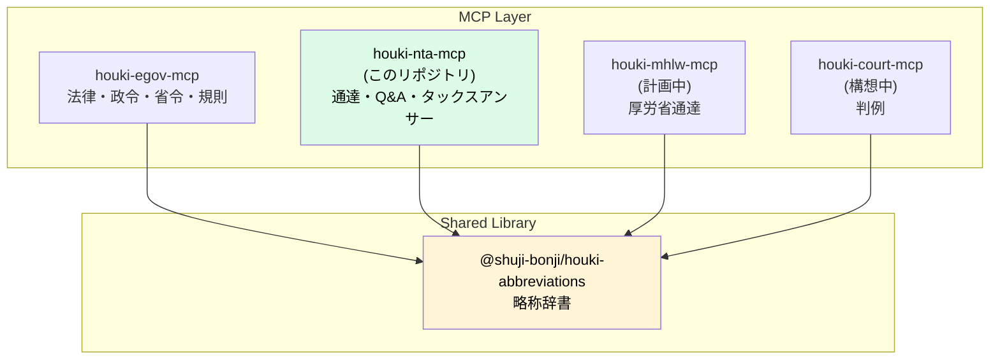

# 設計ノート — houki-nta-mcp

## 設計の3原則

1. **国税庁コンテンツのみに責務を絞る** — 法律本文は houki-egov-mcp、判例は houki-court-mcp 等が担当
2. **共有辞書は houki-abbreviations 経由** — 通達略称（消基通・所基通 等）はそちらにエントリ追加
3. **取得は深夜帯バッチ + キャッシュ** — サイト負荷を最小化

## houki-hub MCP family の中の位置付け



このリポジトリが担うのは **国税庁公開コンテンツの取得・整形**のみ。

## 提供ツール（Phase 1 の予定）

| Tool | 用途 |
|---|---|
| `nta_search_tsutatsu` | 通達（法令解釈通達・個別通達）をキーワード検索 |
| `nta_get_tsutatsu` | 通達本文を取得（章-項-号 単位指定可） |
| `nta_search_qa` | 質疑応答事例をキーワード検索 |
| `nta_get_qa` | 質疑応答事例の本文を取得 |
| `nta_search_tax_answer` | タックスアンサーをキーワード検索 |
| `nta_get_tax_answer` | タックスアンサー本文を取得（番号指定）|
| `resolve_abbreviation` | 略称→エントリ解決。管轄外の場合は誘導ヒント返却 |

## 通達の法的位置付け（実装上の留意点）

最高裁 昭和43.12.24（墓地埋葬法事件）の論理に基づき、通達は **行政内部文書**であり、国民・裁判所には直接的拘束力なし。ただし税務署は職務命令として守る義務あり。

実装上、各レスポンスに **法的位置付けの注記**を含める:

```json
{
  "title": "消費税法基本通達 5-1-9",
  "body": "...",
  "category": "kihon-tsutatsu",
  "legal_status": {
    "binds_citizens": false,
    "binds_courts": false,
    "binds_tax_office": true,
    "note": "通達は行政内部文書。納税者・裁判所には直接的拘束力なし。ただし税務署員は職務として守る義務あり"
  },
  "source_url": "https://www.nta.go.jp/law/tsutatsu/...",
  "retrieved_at": "2026-04-27T..."
}
```

## ツール設計の原則

### 命名規則

houki-egov-mcp が `verb_noun`（`get_law`, `search_law`）なのに対し、houki-nta-mcp は **`{namespace}_{verb}_{noun}`**（`nta_get_tsutatsu`, `nta_search_qa`）形式。

理由:
- houki-hub family で複数 MCP が並列起動するケースを想定
- ツール名の衝突を防ぐため
- LLM がどの MCP にディスパッチすべきか判定しやすい

### 入出力

入力: 略称・通称・正式名のいずれでもOK（houki-abbreviations 経由で正規化）
出力: Markdown（デフォルト）/ JSON 構造化 を選択可能

### 管轄外への誘導

`resolve_abbreviation` で houki-nta 管轄外（例: `消法` → `houki-egov` 管轄）と判定した場合:

```json
{
  "abbr": "消法",
  "resolved": { "formal": "消費税法", "source_mcp_hint": "houki-egov" },
  "in_scope": false,
  "hint": "このエントリは houki-egov の管轄です。houki-egov-mcp で取得してください。"
}
```

LLM がこの hint を見て、自動的に houki-egov-mcp 側で `get_law` を呼ぶ流れを期待。

## houki-abbreviations への通達系エントリ追加（前提作業）

houki-nta-mcp Phase 1 を始める前に、houki-abbreviations v0.2.0 で以下のエントリを追加する必要がある:

| abbr | formal | category | source_mcp_hint |
|---|---|---|---|
| 消基通 | 消費税法基本通達 | kihon-tsutatsu | houki-nta |
| 所基通 | 所得税基本通達 | kihon-tsutatsu | houki-nta |
| 法基通 | 法人税基本通達 | kihon-tsutatsu | houki-nta |
| 相基通 | 相続税法基本通達 | kihon-tsutatsu | houki-nta |
| 通法基通 | 国税通則法基本通達 | kihon-tsutatsu | houki-nta |
| 措通 | 租税特別措置法関係通達 | kihon-tsutatsu | houki-nta |
| 電帳法取通 | 電子帳簿保存法取扱通達 | kobetsu-tsutatsu | houki-nta |
| 印基通 | 印紙税法基本通達 | kihon-tsutatsu | houki-nta |

これにより houki-egov-mcp で「消法」を引くと `houki-egov`、houki-nta-mcp で「消基通」を引くと `houki-nta` が `source_mcp_hint` として返る。

## 開発フェーズ

| Phase | 内容 | 状態 |
|---|---|---|
| Phase 0 | スケルトン整備（package.json / tsconfig / ツール定義スタブ / 設計ドキュメント） | ✅ 着手中 |
| Phase 1a | houki-abbreviations v0.2.0 で通達系エントリ追加 | 計画中 |
| Phase 1b | 通達取得（消基通・所基通・法基通） | 計画中 |
| Phase 1c | 質疑応答事例取得 | 計画中 |
| Phase 1d | タックスアンサー取得 | 計画中 |
| Phase 2 | bulk DL モード（SQLite FTS5） | 構想中 |
| Phase 3 | 文書回答事例 | 構想中 |

## 実装タスク（Phase 1）

1. **依存追加**: `iconv-lite`, `cheerio`
2. **scraper 層** (`src/services/nta-scraper.ts`): fetch + Shift_JIS 変換 + cheerio
3. **parser 層** (`src/services/tsutatsu-parser.ts` 等): HTML 構造ごとの抽出ロジック
4. **キャッシュ層** (`src/utils/cache.ts`): メモリ + ディスク 2層
5. **handlers 本実装**: スタブを実装に置き換え

## 業法との関係（DISCLAIMER との接続）

houki-nta-mcp は税務情報の一次資料を取得するが、税理士法 52 条が定める **税理士業務（税務代理・税務書類作成・税務相談）** の独占を尊重する。本 MCP の出力を以下の形で使うことは想定外:

- ❌ 業として税務相談に応じる（弁護士・税理士・他者の業務）
- ❌ 個別事案の判断結果を「通達がそう言ったから正しい」と断定する

想定されるのは:

- ✅ 個人が自分の事業の調査
- ✅ プロダクト開発時の法令調査（電帳法・インボイス対応 等）
- ✅ 税理士相談前の論点整理
- ✅ セカンドオピニオン的な裏取り

詳細は [DISCLAIMER.md](../DISCLAIMER.md) 参照。

## 参考実装

- `kentaroajisaka/tax-law-mcp` — 通達 17 件 + 裁決 1,950 件をスクレイピング実装。Shift_JIS 対応済み

## 関連ドキュメント

- [docs/DATA-SOURCES.md](DATA-SOURCES.md) — 国税庁公開コンテンツの調査・URL 構造・スクレイピング方針
- [DISCLAIMER.md](../DISCLAIMER.md) — 通達の法的位置付け・利用範囲
- [README.md](../README.md) — プロジェクト概要
