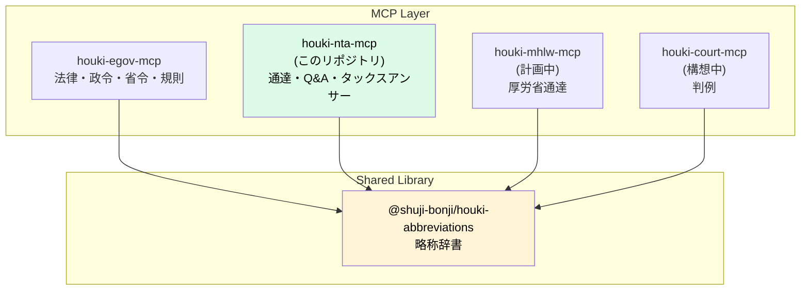
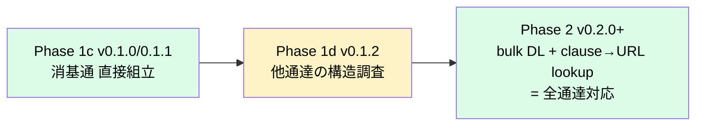
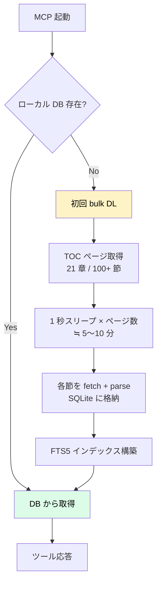

# 設計ノート — houki-nta-mcp

## 設計の3原則

1. **国税庁コンテンツのみに責務を絞る** — 法律本文は houki-egov-mcp、判例は houki-court-mcp 等が担当
2. **共有辞書は houki-abbreviations 経由** — 通達略称（消基通・所基通 等）はそちらにエントリ追加
3. **取得は深夜帯バッチ + キャッシュ** — サイト負荷を最小化

## houki-hub MCP family の中の位置付け



このリポジトリが担うのは **国税庁公開コンテンツの取得・整形**のみ。

## 提供ツール（Phase 1 の予定）

| Tool | 用途 |
|---|---|
| `nta_search_tsutatsu` | 通達（法令解釈通達・個別通達）をキーワード検索 |
| `nta_get_tsutatsu` | 通達本文を取得（章-項-号 単位指定可） |
| `nta_search_qa` | 質疑応答事例をキーワード検索 |
| `nta_get_qa` | 質疑応答事例の本文を取得 |
| `nta_search_tax_answer` | タックスアンサーをキーワード検索 |
| `nta_get_tax_answer` | タックスアンサー本文を取得（番号指定）|
| `resolve_abbreviation` | 略称→エントリ解決。管轄外の場合は誘導ヒント返却 |

## 通達の法的位置付け（実装上の留意点）

最高裁 昭和43.12.24（墓地埋葬法事件）の論理に基づき、通達は **行政内部文書**であり、国民・裁判所には直接的拘束力なし。ただし税務署は職務命令として守る義務あり。

実装上、各レスポンスに **法的位置付けの注記**を含める:

```json
{
  "title": "消費税法基本通達 5-1-9",
  "body": "...",
  "category": "kihon-tsutatsu",
  "legal_status": {
    "binds_citizens": false,
    "binds_courts": false,
    "binds_tax_office": true,
    "note": "通達は行政内部文書。納税者・裁判所には直接的拘束力なし。ただし税務署員は職務として守る義務あり"
  },
  "source_url": "https://www.nta.go.jp/law/tsutatsu/...",
  "retrieved_at": "2026-04-27T..."
}
```

## ツール設計の原則

### 命名規則

houki-egov-mcp が `verb_noun`（`get_law`, `search_law`）なのに対し、houki-nta-mcp は **`{namespace}_{verb}_{noun}`**（`nta_get_tsutatsu`, `nta_search_qa`）形式。

理由:
- houki-hub family で複数 MCP が並列起動するケースを想定
- ツール名の衝突を防ぐため
- LLM がどの MCP にディスパッチすべきか判定しやすい

### 入出力

入力: 略称・通称・正式名のいずれでもOK（houki-abbreviations 経由で正規化）
出力: Markdown（デフォルト）/ JSON 構造化 を選択可能

### 管轄外への誘導

`resolve_abbreviation` で houki-nta 管轄外（例: `消法` → `houki-egov` 管轄）と判定した場合:

```json
{
  "abbr": "消法",
  "resolved": { "formal": "消費税法", "source_mcp_hint": "houki-egov" },
  "in_scope": false,
  "hint": "このエントリは houki-egov の管轄です。houki-egov-mcp で取得してください。"
}
```

LLM がこの hint を見て、自動的に houki-egov-mcp 側で `get_law` を呼ぶ流れを期待。

## houki-abbreviations への通達系エントリ追加（前提作業）

houki-nta-mcp Phase 1 を始める前に、houki-abbreviations v0.2.0 で以下のエントリを追加する必要がある:

| abbr | formal | category | source_mcp_hint |
|---|---|---|---|
| 消基通 | 消費税法基本通達 | kihon-tsutatsu | houki-nta |
| 所基通 | 所得税基本通達 | kihon-tsutatsu | houki-nta |
| 法基通 | 法人税基本通達 | kihon-tsutatsu | houki-nta |
| 相基通 | 相続税法基本通達 | kihon-tsutatsu | houki-nta |
| 通法基通 | 国税通則法基本通達 | kihon-tsutatsu | houki-nta |
| 措通 | 租税特別措置法関係通達 | kihon-tsutatsu | houki-nta |
| 電帳法取通 | 電子帳簿保存法取扱通達 | kobetsu-tsutatsu | houki-nta |
| 印基通 | 印紙税法基本通達 | kihon-tsutatsu | houki-nta |

これにより houki-egov-mcp で「消法」を引くと `houki-egov`、houki-nta-mcp で「消基通」を引くと `houki-nta` が `source_mcp_hint` として返る。

## 開発フェーズ

| Phase | 内容 | 状態 |
|---|---|---|
| Phase 0 | スケルトン整備（package.json / tsconfig / ツール定義スタブ / 設計ドキュメント） | ✅ 完了 (v0.0.1) |
| Phase 1a | houki-abbreviations v0.2.0 で通達系エントリ追加 | ✅ 完了 (v0.0.2) |
| Phase 1b | 節ページ parser（cheerio + iconv-lite で章-項-号抽出） | ✅ 完了 |
| Phase 1b' | TOC parser（章→節→款の階層抽出） | ✅ 完了 |
| Phase 1c | `nta_get_tsutatsu` 本実装（消基通のみ）+ CI canary | ✅ 完了 |
| Phase 1d | 他通達の URL/clause 体系の実地調査 | ✅ 完了（v0.1.2、調査のみ） |
| Phase 1d' | 他通達 (所基通・法基通・相基通 等) の本対応 | Phase 2 と統合（後述） |
| Phase 1e | 質疑応答事例 / タックスアンサー取得 | 計画中 |
| Phase 2 | bulk DL モード（SQLite FTS5）+ 改正検知 | 設計中（下記） |
| Phase 3 | 文書回答事例（PDF）— pdf-reader-mcp 連携 | 構想中 |

## Phase 1d 調査結果: 通達ごとの URL/clause 体系の差異

v0.1.2 で実施した実地調査の結果、houki-abbreviations の通達系 9 件のうち
**消基通スタイル（章-節-条 の 3 階層 clause + URL 直接組立）が成立するのは消基通のみ**であることが判明した。

### 通達ごとの差異

| 通達 | URL ルート | URL 規則 | clause 体系 | 直接組立 |
|---|---|---|---|---|
| 消基通 | `/law/tsutatsu/kihon/shohi/` | `{root}{章}/{節}.htm` | 3 階層 `章-節-条`（例: `1-4-13の2`） | ✅ |
| 所基通 | `/law/tsutatsu/kihon/shotoku/` | `{root}{章}/{節}.htm` | 2 階層 `条-項`（例: `2-4の2`） | ❌ TOC 必須 |
| 法基通 | `/law/tsutatsu/kihon/hojin/` | `{root}{章}/{章}_{節}.htm` | 2 階層（推定） | ❌ |
| 相基通 | `/law/tsutatsu/kihon/sisan/sozoku2/` | `{root}{章}/{連番}.htm`（00.htm 等） | 未調査 | ❌ |
| 通基通 | `/law/tsutatsu/kihon/tsusoku/` | TOP は 00.htm | 未調査 | ❌ |
| 徴基通 | `/law/tsutatsu/kihon/chosyu/` | TOP は index.htm | 未調査 | ❌ |
| 印基通 | `/law/tsutatsu/kihon/inshi/` | TOP は mokuji.htm | 未調査 | ❌ |
| 措通 | `/law/tsutatsu/kobetsu/{税目}/sochiho/` | 税目ごとに別ツリー | 未調査 | ❌ |
| 電帳法取通 | `/law/tsutatsu/kobetsu/denshichoubo/` | TOP は index.htm | 未調査 | ❌ |

### 何が問題か

- **clause だけでは URL が組立られない**。例えば所基通 `2-4の2` を URL に変換するには、
  「2-4の2 がどの章・節のページにあるか」の対応表が必要
- **URL 規則が通達ごとに違う**。法基通の `01_01.htm` のような形式は、消基通の `01/01.htm`
  とは別の builder が要る

### 解決方針: Phase 2 と統合

これらは「TOC ページを事前 DL し、各通達の `{clause → URL}` lookup table を構築する」
ことで一括解決できる。これは Phase 2（bulk DL + SQLite）の主機能と完全に重なるため、
Phase 1d を中止し Phase 2 に統合した。



## Phase 2 設計: bulk DL + ローカル SQLite FTS5

### 動機

Phase 1 のライブスクレイピングは、以下の構造的弱点がある:

1. **HTML 構造変更で即死する**。国税庁サイトのリニューアルが起きた瞬間、parser が動かなくなる
2. **検索インデックスが無い**。`nta_search_tsutatsu` は本実装できない
3. **レスポンスが遅い**。1 clause 取得に毎回 fetch + parse が走る
4. **オフライン動作不可**
5. **他通達対応が不可**（Phase 1d 調査の通り）— これが新たに追加された動機

Phase 2 は「初回起動時に通達一式をローカル SQLite (FTS5) にダンプし、以降はそこから引く」モードを追加する。

### 全体フロー



### スキーマ案

```sql
-- 通達メタ
CREATE TABLE tsutatsu (
  id INTEGER PRIMARY KEY,
  formal_name TEXT NOT NULL,        -- 例: '消費税法基本通達'
  abbr TEXT NOT NULL,               -- 例: '消基通'
  source_root_url TEXT NOT NULL     -- 例: 'https://www.nta.go.jp/law/tsutatsu/kihon/shohi/'
);

-- 章
CREATE TABLE chapter (
  tsutatsu_id INTEGER REFERENCES tsutatsu(id),
  number INTEGER,
  title TEXT,
  PRIMARY KEY (tsutatsu_id, number)
);

-- 節
CREATE TABLE section (
  tsutatsu_id INTEGER,
  chapter_number INTEGER,
  section_number INTEGER,
  title TEXT,
  url TEXT,
  fetched_at TEXT,
  PRIMARY KEY (tsutatsu_id, chapter_number, section_number)
);

-- clause（条）
CREATE TABLE clause (
  id INTEGER PRIMARY KEY,
  tsutatsu_id INTEGER,
  clause_number TEXT NOT NULL,      -- '1-4-1', '1-4-13の2', '2-4の2' （通達ごとに体系が違う）
  source_url TEXT NOT NULL,         -- ← Phase 1d 調査結果反映: 各 clause の取得元 URL
  chapter_number INTEGER,
  section_number INTEGER,
  title TEXT NOT NULL,
  full_text TEXT NOT NULL,
  paragraphs_json TEXT NOT NULL     -- JSON 配列
);
-- (tsutatsu_id, clause_number) で一意検索 = clause→URL lookup
CREATE UNIQUE INDEX idx_clause_lookup ON clause(tsutatsu_id, clause_number);

-- 全文検索（FTS5）
CREATE VIRTUAL TABLE clause_fts USING fts5(
  clause_number,
  title,
  full_text,
  content='clause',
  tokenize='trigram'  -- 日本語の bi/trigram 検索向け
);
```

### キャッシュ戦略

- 場所: `${XDG_CACHE_HOME:-~/.cache}/houki-nta-mcp/cache.db`
- 改正検知: 各節の `fetched_at` + ETag 風のハッシュ比較
- 強制再取得: 環境変数 `HOUKI_NTA_REFRESH=1` で全件再 DL

### ツール挙動の変化

`nta_get_tsutatsu` は引数互換のまま、内部で:

1. ローカル DB に該当 clause があれば即返す
2. 無ければ Phase 1 のライブ取得経路にフォールバック
3. ライブ取得結果を DB に書き戻す

`nta_search_tsutatsu` が初めて本実装される（FTS5 経由）。

### HTML 構造変更耐性

- 初回 DL に成功して DB が出来てしまえば、その後の構造変更は影響しない
- 改正があっても再 DL が成功する限りは追従できる
- 構造変更で初回 DL が失敗するケースは CI canary（毎週月曜）で先に検知する

### 配布戦略の選択肢

| 方式 | メリット | デメリット |
|---|---|---|
| A. 毎ユーザー初回 DL | パッケージ軽量、最新版 | 初回 5〜10 分待ち、サイト負荷分散 |
| B. リポジトリに snapshot をコミット | 即起動、サイト負荷ゼロ | リポジトリ容量増、ライセンス確認要 |
| C. 別パッケージ `@shuji-bonji/houki-nta-snapshot` を月次更新 | 軽量本体 + 任意導入 | 二重メンテ |

採用案: **A をデフォルト + C を将来オプション**。B はライセンスとリポジトリ管理上のリスクが大きい。

### TODO

- [ ] better-sqlite3 / node:sqlite のどちらを使うか確定
- [ ] tokenize の選定（trigram / mecab / icu）
- [ ] 改正検知ハッシュの仕様
- [ ] CLI `houki-nta-mcp --refresh-cache` を追加

## 実装タスク（Phase 1）

1. **依存追加**: `iconv-lite`, `cheerio`
2. **scraper 層** (`src/services/nta-scraper.ts`): fetch + Shift_JIS 変換 + cheerio
3. **parser 層** (`src/services/tsutatsu-parser.ts` 等): HTML 構造ごとの抽出ロジック
4. **キャッシュ層** (`src/utils/cache.ts`): メモリ + ディスク 2層
5. **handlers 本実装**: スタブを実装に置き換え

## 業法との関係（DISCLAIMER との接続）

houki-nta-mcp は税務情報の一次資料を取得するが、税理士法 52 条が定める **税理士業務（税務代理・税務書類作成・税務相談）** の独占を尊重する。本 MCP の出力を以下の形で使うことは想定外:

- ❌ 業として税務相談に応じる（弁護士・税理士・他者の業務）
- ❌ 個別事案の判断結果を「通達がそう言ったから正しい」と断定する

想定されるのは:

- ✅ 個人が自分の事業の調査
- ✅ プロダクト開発時の法令調査（電帳法・インボイス対応 等）
- ✅ 税理士相談前の論点整理
- ✅ セカンドオピニオン的な裏取り

詳細は [DISCLAIMER.md](../DISCLAIMER.md) 参照。

## 参考実装

- `kentaroajisaka/tax-law-mcp` — 通達 17 件 + 裁決 1,950 件をスクレイピング実装。Shift_JIS 対応済み

## 関連ドキュメント

- [docs/DATA-SOURCES.md](DATA-SOURCES.md) — 国税庁公開コンテンツの調査・URL 構造・スクレイピング方針
- [DISCLAIMER.md](../DISCLAIMER.md) — 通達の法的位置付け・利用範囲
- [README.md](../README.md) — プロジェクト概要
