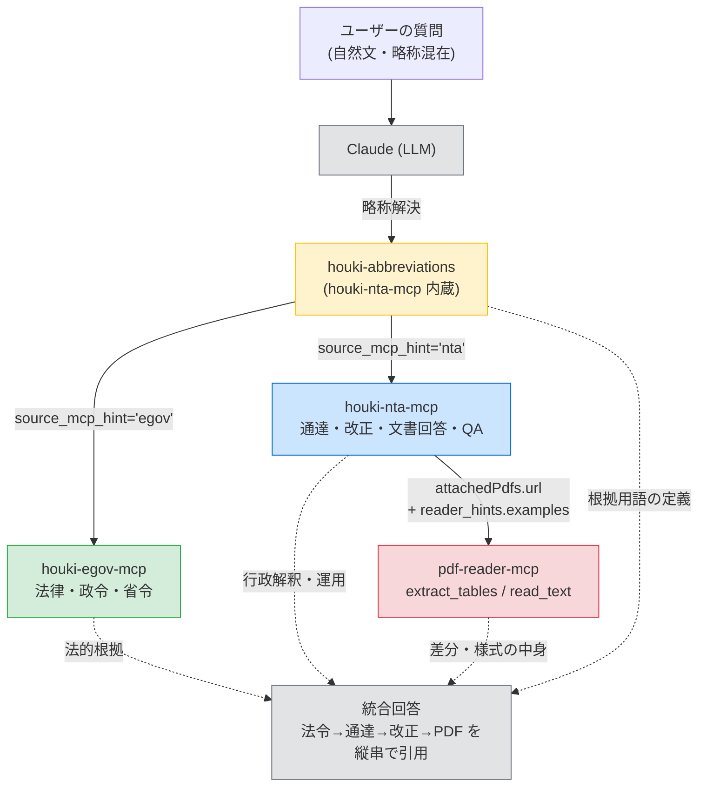
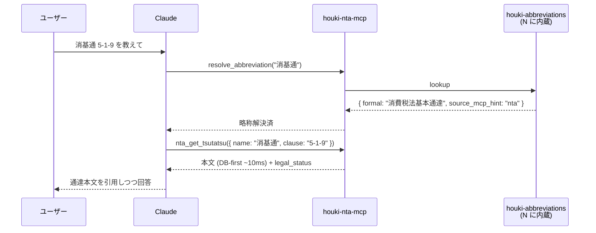
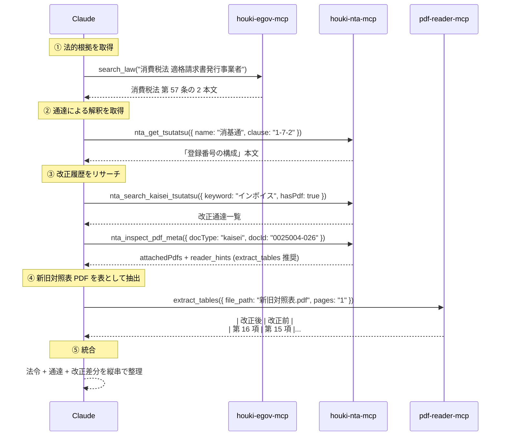

# houki-hub MCP family 統合利用ガイド

LLM (Claude Desktop / Claude Code 等) から **`houki-nta-mcp` を中心に 3 つの MCP server + 1 つの辞書パッケージを連携**させ、日本の税務関連法令を「**法律本文 → 通達 → 改正履歴 → 添付 PDF の中身**」まで縦串で引用しながら扱う方法をまとめたガイド。

> **対象読者**: Claude Desktop / Claude Code / VS Code 系 MCP クライアントを使う方
> **想定シナリオ**: 税務リサーチ・改正履歴の追跡・通達の横断検索・士業による参考文献調査
> **本ドキュメントの位置付け**: houki-nta-mcp 単体の README とは別に「**4 つを併用したときに何ができるか・どう設定するか**」だけに絞った導入ガイド

---

## 目次

1. [なぜ 4 つを連携するのか](#1-なぜ-4-つを連携するのか)
2. [構成と責務](#2-構成と責務)
3. [インストール](#3-インストール)
4. [連携ワークフロー（実例 4 つ）](#4-連携ワークフロー実例-4-つ)
5. [業法独占への配慮（重要）](#5-業法独占への配慮重要)
6. [トラブルシューティング](#6-トラブルシューティング)
7. [関連リンク](#7-関連リンク)

---

## 1. なぜ 4 つを連携するのか

日本の税務関連の情報は、**「制定主体」「URL 構造」「PDF 形式の有無」が階層ごとにまったく異なる**。法律 (国会) は e-Gov、通達 (国税庁長官) は国税庁公式 HP、改正通達の差分は国税庁が個別に公開する PDF (新旧対照表) という具合に、横断的に扱おうとすると手数が爆発する。

本 family は **各 MCP が階層を 1 つだけ責任を持つ** 設計 (Architecture E) をとり、**横串の orchestration は LLM 側 (将来の `houki-research-skill`) に委ねる**。これにより:

- 各 MCP は単体で `npm install` & `npx` できる
- 1 つの MCP の障害が他に波及しない
- 通達と法令で異なる citation 形式を、それぞれの MCP が自律的に整える


緑 = `houki-egov-mcp` 担当 / 青 = `houki-nta-mcp` 担当 / 赤 = `pdf-reader-mcp` で本文抽出。

## 2. 構成と責務

| パッケージ                       | 種類           | 責務                                                                                                                                                       |
| -------------------------------- | -------------- | ---------------------------------------------------------------------------------------------------------------------------------------------------------- |
| `@shuji-bonji/houki-abbreviations` | npm パッケージ | 法令略称辞書。「消基通」「所基通」「インボイス」などを **正式名 + どの MCP に問い合わせるべきか (`source_mcp_hint`)** に解決。**houki-nta-mcp 等に内蔵されており単独インストール不要** |
| `@shuji-bonji/houki-egov-mcp`    | MCP server     | e-Gov 法令検索 API 経由で **法律・政令・省令** の本文と検索を提供                                                                                          |
| `@shuji-bonji/houki-nta-mcp`     | MCP server     | 国税庁公式の **基本通達 4 種・改正通達・事務運営指針・文書回答事例・タックスアンサー・質疑応答事例** + 添付 PDF メタ + `extract_tables` 推奨例まで提供     |
| `@shuji-bonji/pdf-reader-mcp`    | MCP server     | houki-nta-mcp が返す **添付 PDF (新旧対照表・別紙・様式・厚労省通知等) の本文** を抽出。v0.3.0 の `extract_tables` で表構造のまま取り出せる                |



## 3. インストール

### 3.1 前提

- **Node.js >= 20** (houki-nta-mcp の `engines` 要件)
- **Claude Desktop** または **Claude Code** または互換 MCP クライアント
- インターネット接続 (各 MCP の起動時に npm レジストリから取得 + houki-nta-mcp の bulk DL 時に国税庁 HP から HTML を取得)

### 3.2 Claude Desktop の場合

設定ファイル `claude_desktop_config.json` に **3 つの MCP server** を登録します (パスは OS によって異なります)。

| OS      | 設定ファイルパス                                                       |
| ------- | ---------------------------------------------------------------------- |
| macOS   | `~/Library/Application Support/Claude/claude_desktop_config.json`      |
| Windows | `%APPDATA%\Claude\claude_desktop_config.json`                          |
| Linux   | `~/.config/Claude/claude_desktop_config.json`                          |

```jsonc
{
  "mcpServers": {
    "houki-nta": {
      "command": "npx",
      "args": ["-y", "@shuji-bonji/houki-nta-mcp"]
    },
    "houki-egov": {
      "command": "npx",
      "args": ["-y", "@shuji-bonji/houki-egov-mcp"]
    },
    "pdf-reader": {
      "command": "npx",
      "args": ["-y", "@shuji-bonji/pdf-reader-mcp"]
    }
  }
}
```

設定後 **Claude Desktop を再起動**すると、3 つの MCP server が利用可能になります。

> `@shuji-bonji/houki-abbreviations` は MCP ではなく npm パッケージで、**houki-nta-mcp および houki-egov-mcp に依存ライブラリとして内蔵**されています。単独でインストール・登録する必要はありません (Claude からは `resolve_abbreviation` tool 経由で利用可能)。

### 3.3 Claude Code の場合

```bash
claude mcp add houki-nta -- npx -y @shuji-bonji/houki-nta-mcp
claude mcp add houki-egov -- npx -y @shuji-bonji/houki-egov-mcp
claude mcp add pdf-reader -- npx -y @shuji-bonji/pdf-reader-mcp
```

登録後 `claude mcp list` で 3 つが認識されていることを確認。

### 3.4 初回 bulk DL (houki-nta-mcp 必須)

**houki-nta-mcp は事前に bulk DL してローカル SQLite に投入することで、応答が DB-first (≈10ms) になります**。未投入のまま検索を呼ぶと「DB に未登録」エラーが返ります。

別ターミナルで以下を実行してください (合計 30〜60 分。範囲を絞れば短縮可):

```bash
# 推奨: 6 種別を一括投入
npx -y @shuji-bonji/houki-nta-mcp --bulk-download-everything --bunsho-taxonomy=shotoku

# または個別実行 (必要なものだけ)
npx -y @shuji-bonji/houki-nta-mcp --bulk-download-all          # 通達本体 4 種 (10-15 分)
npx -y @shuji-bonji/houki-nta-mcp --bulk-download-kaisei       # 改正通達 (5-10 分)
npx -y @shuji-bonji/houki-nta-mcp --bulk-download-jimu-unei    # 事務運営指針 (1 分)
npx -y @shuji-bonji/houki-nta-mcp --bulk-download-tax-answer   # タックスアンサー (14 分)
npx -y @shuji-bonji/houki-nta-mcp --bulk-download-bunshokaitou --bunsho-taxonomy=shotoku
npx -y @shuji-bonji/houki-nta-mcp --bulk-download-qa --qa-topic=shotoku
```

DB は `${XDG_CACHE_HOME:-~/.cache}/houki-nta-mcp/cache.db` に保存されます。

#### 投入済みかどうかを素早く確認する

```bash
sqlite3 "$HOME/.cache/houki-nta-mcp/cache.db" \
  "SELECT doc_type, COUNT(*) FROM document GROUP BY doc_type ORDER BY doc_type;"
```

未投入の `doc_type` があれば対応する bulk DL コマンドを実行してください (詳細は houki-nta-mcp README §「投入済みかどうかを素早く確認する」)。

### 3.5 houki-egov-mcp の準備

`houki-egov-mcp` も初回起動時に法令メタを軽くキャッシュします。詳細は [`@shuji-bonji/houki-egov-mcp` の README](https://github.com/shuji-bonji/houki-egov-mcp) を参照。

### 3.6 pdf-reader-mcp の準備

`pdf-reader-mcp` は **bulk DL 不要**。`npx` 起動だけで `read_text` / `extract_tables` / `inspect_*` が利用可能です。**v0.3.0 以降** で `extract_tables` (Tagged PDF Table → Markdown) が利用できます。

### 3.7 動作確認

Claude に以下のように指示して、各 MCP が応答することを確認してください。

```text
@houki-nta で消基通 5-1-9 を取得してください。
```

```text
@houki-egov で消費税法 第 57 条の 2 を取得してください。
```

```text
@pdf-reader で /path/to/sample.pdf のメタデータを取得してください。
```

各 MCP が正常応答すれば準備完了です。

## 4. 連携ワークフロー（実例 4 つ）

以下はすべて、ユーザーが **自然文** で投げる質問から、Claude が複数 MCP を自律的に組み合わせて回答するシナリオです。各シナリオで、Claude が**どの MCP・どの tool をどの順番で叩くべきか**の想定動線を示します。

### 4.1 直球クエリ — 「消基通 5-1-9 の取扱は?」

> **ユーザープロンプト例**:
> 「消基通 5-1-9 を教えてください。」



**ポイント**:

- 略称解決は **houki-nta-mcp が内蔵する resolve_abbreviation** で完結 (houki-abbreviations を別途叩く必要なし)
- DB-first lookup なので一瞬 (≈10ms)。bulk DL 済みでない場合は live fallback (~700ms)
- レスポンスの `legal_status` から「通達は税務署員のみ拘束、納税者には直接的拘束力なし」も自動引用される

### 4.2 三層回答 — 「インボイス制度の登録番号の扱いは?」

> **ユーザープロンプト例**:
> 「インボイス制度の適格請求書発行事業者の登録番号について、法律本文と通達と最近の改正点を併せて教えてください。」



**ポイント**:

- houki-nta-mcp v0.7.2 + pdf-reader-mcp v0.3.0 の組み合わせで、**新旧対照表 PDF の改正前/改正後カラムが自動で分離**される (それ以前は LLM が左右を判別できなかった)
- `nta_inspect_pdf_meta.reader_hints.examples` が **kind 別に**「`comparison` → `extract_tables` を最優先」と推奨してくれるため、Claude が自然に正しい tool を選ぶ

### 4.3 改正リサーチ — 「2025 年の消費税法基本通達の改正点を整理して」

> **ユーザープロンプト例**:
> 「2025 年に消費税法基本通達でどんな改正があったか、新旧対照表を表として整理してください。」

1. **houki-nta-mcp** `nta_search_kaisei_tsutatsu({ keyword: "消費税", taxonomy: "shohi", hasPdf: true })` で 2025 年の改正通達を一覧
2. ヒットした各 docId に対して **houki-nta-mcp** `nta_inspect_pdf_meta` で添付 PDF メタを取得 (`reader_hints.examples` に `extract_tables` の URL が並ぶ)
3. **pdf-reader-mcp** `extract_tables({ file_path: ..., pages: "1-N" })` で新旧対照表を構造化抽出
4. **houki-egov-mcp** で改正対象条文の現行版を引いて、通達と齟齬がないか確認
5. Claude が「条文ごとの改正前 / 改正後 + 通達該当箇所」のテーブルを統合

**得られる回答イメージ**:

```markdown
## 2025 年 消費税法基本通達 改正サマリー

| 条 | 改正後 (2025) | 改正前 | 根拠条文 (e-Gov) |
| --- | --- | --- | --- |
| 1-7-2 | 法人番号法第 2 条 **第 16 項** … | 法人番号法第 2 条 **第 15 項** … | 消費税法 57 条の 2 |
| 5-6-6 | 海上運送法 同条 **第 10 項** … | 海上運送法 同条 **第 7 項** … | 消費税法 7 条 |
...
```

これは LLM 自身が `extract_tables` の出力を読んで生成。改正後と改正前のカラムが**機械的に分離されている**ため、項番ずれのような細かい改正も LLM が見落としにくい。

### 4.4 文書回答事例の調査 — 「過去にこんな取引で文書回答事例はあるか?」

> **ユーザープロンプト例**:
> 「フリーランスが業務委託料をオンラインプラットフォーム経由で受領した場合の消費税の取扱について、文書回答事例があれば教えてください。」

1. **houki-nta-mcp** `nta_search_bunshokaitou({ keyword: "オンラインプラットフォーム" })` (見つからなければキーワードを変えて再検索)
2. **houki-nta-mcp** `nta_get_bunshokaitou({ docId: ... })` で本文 + 添付 (様式・別紙)
3. 添付があれば **pdf-reader-mcp** で:
   - 様式 → `extract_tables` (帳票)
   - 説明文 → `read_text`
4. **houki-egov-mcp** で関連法令の **現行条文** を取得し、当時の事例が現在も通用するかを判断材料に提示
5. Claude が「事例の事実関係 / 結論 / 法的根拠 / 現在も通用するか」を整理

**ポイント**:

- 文書回答事例は法的拘束力はないが「実務上の参考」になる
- 様式や別紙が PDF で添付されている場合、`extract_tables` で帳票を構造化することで Claude が「申告書のどの欄に何を書く」というレベルの解説まで踏み込める

## 5. 業法独占への配慮（重要）

これらの組み合わせは **「文献調査・情報整理」までを担うツール** であり、**具体的な税務相談に直接回答する行為は税理士法第 52 条 (税理士業務の制限) に抵触する可能性があります**。

各 MCP のレスポンスには `legal_status` フィールドで以下を明示しています:

| 種類                     | binds_citizens | binds_tax_office | 備考                                                                              |
| ------------------------ | -------------- | ---------------- | --------------------------------------------------------------------------------- |
| 法律 (e-Gov)             | true           | true             | 国会が制定した法律本文                                                            |
| 通達 (houki-nta-mcp)     | **false**      | true             | 行政内部文書。納税者・裁判所には直接的拘束力なし (最高裁 昭和 43.12.24)         |
| 文書回答事例             | **false**      | **false**        | 参考情報                                                                          |
| タックスアンサー / 質疑応答 | **false**      | **false**        | 国税庁の参考解説資料                                                              |

LLM が回答する際は **これらのフィールドを引用し、「最終的な実務判断は税理士・公認会計士・弁護士などの専門家へ」という案内を必ず添える運用**が望ましいです。本ツール群は士業を**置き換える**ものではなく、**士業がリサーチに費やす時間を圧縮するための補助ツール**として位置づけています。

## 6. トラブルシューティング

### 6.1 「ローカル DB に検索対象がありません」と言われる

**原因**: houki-nta-mcp の bulk DL が未実行 / 期待していた docType が未投入

**対処**: §3.4 のコマンドを実行。`sqlite3` ワンライナーで `doc_type` ごとの件数を確認。

### 6.2 `inspect_structure` / `inspect_fonts` がエラーで失敗する

**原因**: pdf-reader-mcp v0.2.2 以前で、Linearized PDF (国税庁 PDF はほぼすべて該当) を扱おうとしている

**対処**: `pdf-reader-mcp` を **v0.2.3 以降** に更新 (`npx` キャッシュをクリア: `rm -rf ~/.npm/_npx`)。詳細は pdf-reader-mcp の CHANGELOG。

### 6.3 新旧対照表 PDF の表が崩れる / 改正前と改正後がプレーンテキストに連結される

**原因**: pdf-reader-mcp v0.2.x で `read_text` を使っている (Y-coordinate ベースで 2 カラムが連結する)

**対処**: pdf-reader-mcp を **v0.3.0 以降** に更新し、`extract_tables` を使う。houki-nta-mcp v0.7.2 以降の `nta_inspect_pdf_meta.reader_hints.examples` は **comparison/attachment 系 PDF に対して自動で extract_tables を推奨**してくれるので、Claude が自然に切り替わります。

### 6.4 「新旧対応表」と書かれた PDF が `comparison` ではなく `related` に分類されている

**原因**: houki-nta-mcp v0.7.1 以前の `extractPdfKind` が `/新旧対照表|対比表/` のみで、「新旧対**応**表」(国税庁が一部で使う表記) にマッチしない

**対処**: houki-nta-mcp を **v0.7.2 以降** に更新。v0.7.2 で `/新旧対(照|応)表|対比表/` に拡張済み。既存 DB レコードでも応答時に `fillMissingKinds` で動的補完されるため bulk DL の再実行は不要。

### 6.5 npx キャッシュが古い

```bash
rm -rf ~/.npm/_npx
# または特定のパッケージだけ
npm cache clean --force
```

その後 Claude Desktop / Claude Code を再起動すると、最新版の MCP server が起動します。

## 7. 関連リンク

### 各 MCP / パッケージ

- **houki-nta-mcp** — [GitHub](https://github.com/shuji-bonji/houki-nta-mcp) / [npm](https://www.npmjs.com/package/@shuji-bonji/houki-nta-mcp)
- **houki-egov-mcp** — [GitHub](https://github.com/shuji-bonji/houki-egov-mcp) / [npm](https://www.npmjs.com/package/@shuji-bonji/houki-egov-mcp)
- **pdf-reader-mcp** — [GitHub](https://github.com/shuji-bonji/pdf-reader-mcp) / [npm](https://www.npmjs.com/package/@shuji-bonji/pdf-reader-mcp)
- **houki-abbreviations** — [GitHub](https://github.com/shuji-bonji/houki-abbreviations) / [npm](https://www.npmjs.com/package/@shuji-bonji/houki-abbreviations)

### 内部ドキュメント

- [houki-nta-mcp README](../README.md) — houki-nta-mcp 単体の利用ガイド
- [docs/DESIGN.md](DESIGN.md) — houki-nta-mcp の全体アーキテクチャ
- [docs/PHASE4-PDF.md](PHASE4-PDF.md) — Phase 4: PDF メタデータ強化と pdf-reader-mcp 連携の責務分離
- [docs/PHASE4-PDF-FIXTURES.md](PHASE4-PDF-FIXTURES.md) — kind 別代表 PDF カタログ + Phase 4-3 実機テスト結果

### Anthropic 公式

- [Model Context Protocol specification](https://modelcontextprotocol.io/)
- [Claude Desktop での MCP 設定](https://docs.claude.com/en/docs/build-with-claude/computer-use)
