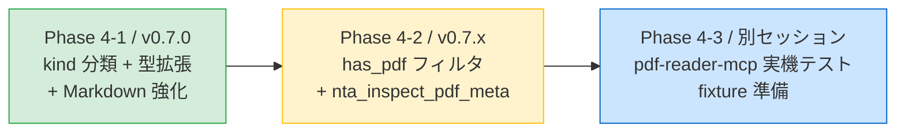

# PHASE 4 — PDF メタデータ強化と pdf-reader-mcp 連携

houki-nta-mcp が扱う 6 大コンテンツのうち、改正通達・事務運営指針・文書回答事例・タックスアンサーには **添付 PDF** が含まれる。これまで（v0.6.0 まで）は `attached_pdfs: [{ title, url, sizeKb? }]` という最小限のメタしか持たず、LLM は「どの PDF を読むべきか」を判断しにくい状態だった。

Phase 4 では PDF **メタデータ** を強化し、pdf-reader-mcp への誘導を構造化する。**PDF 本文取得は houki-nta-mcp に取り込まない**（責務分離）。

> **方針**: houki-nta-mcp は PDF "メタ情報の整理と分類" を担い、本文取得は pdf-reader-mcp に完全委譲する。

## 1. 背景と問題

### 1.1 現状の attached_pdfs

```json
{
  "attachedPdfs": [
    { "title": "新旧対照表（PDF/470KB）", "url": "https://...", "sizeKb": 470 },
    { "title": "別紙（PDF/120KB）", "url": "https://...", "sizeKb": 120 }
  ]
}
```

### 1.2 何が問題か

- LLM が「どの PDF が新旧対照表で、どれが別紙か」を **タイトル文字列のヒューリスティックに頼って判定** している
- pdf-reader-mcp 呼び出しの **形式が標準化されていない**（自由テキストで「PDF 本文は pdf-reader-mcp で取得してください」と書いているだけ）
- 用途別に PDF を絞り込めない（例: 改正点だけ知りたいときに新旧対照表だけを取得したい、等）

### 1.3 Phase 4 のゴール

- PDF タイトルから **kind を自動分類** し、構造化メタデータを付ける
- pdf-reader-mcp 呼び出し用の **reader_hint** を構造化して返す
- search 系で **has_pdf フィルタ** を提供（PDF 添付がある重要文書だけ抽出）
- 専用 tool **`nta_inspect_pdf_meta`** で PDF メタだけを取得できる経路を追加

## 2. 責務分離

```mermaid
graph TB
  subgraph nta["houki-nta-mcp の責務"]
    direction TB
    N1[PDF タイトルから kind 推定]:::nta
    N2[ファイルサイズ抽出]:::nta
    N3[pdf-reader-mcp 呼び出しの hint 整形]:::nta
    N4[has_pdf フィルタ提供]:::nta
  end

  subgraph reader["pdf-reader-mcp の責務"]
    direction TB
    R1[PDF 本文取得 (read_text)]:::reader
    R2[PDF 構造解析 (inspect_structure)]:::reader
    R3[PDF 表組み解析]:::reader
    R4[PDF メタデータ取得 (get_metadata)]:::reader
  end

  N1 -.URL を渡す.-> R1
  N3 -.呼び出し例.-> R1

  classDef nta fill:#d4edda,stroke:#28a745
  classDef reader fill:#cce5ff,stroke:#0066cc
```

houki-nta-mcp は **PDF を 1 byte も読まない**。HTML 内のリンクから抽出したメタ情報のみ持つ。

## 3. kind 分類

### 3.1 分類カテゴリ

国税庁の代表的な PDF タイトルパターンから、以下の 6 種別を提案:

| kind         | パターン例                       | 用途 / 想定 LLM 行動                                                       |
| ------------ | -------------------------------- | -------------------------------------------------------------------------- |
| `comparison` | 「新旧対照表」「対比表」         | 改正前後の比較。**改正通達で頻出**。LLM は改正点を知りたい時に最優先で読む |
| `attachment` | 「別紙」「別表」「様式」「付録」 | 通達本体に対する付属資料。本文の参照先                                     |
| `qa-pdf`     | 「Q&A」「質疑応答」「FAQ」       | PDF 形式の Q&A（HTML 化されていないもの）                                  |
| `related`    | 「参考資料」「関連資料」「参考」 | 周辺情報。LLM は文脈次第で読む                                             |
| `notice`     | 「通知」「お知らせ」「連絡」     | 改正等の連絡                                                               |
| `unknown`    | 上記いずれにもマッチしない       | フォールバック                                                             |

### 3.2 推定アルゴリズム

純関数 `extractPdfKind(title: string): PdfKind` をパターンマッチで実装:

```typescript
// 概念
const PATTERNS: Array<[PdfKind, RegExp]> = [
  ['comparison', /新旧対照表|対比表/],
  ['qa-pdf', /Q&\s*A|Ｑ&Ａ|質疑応答|FAQ/],
  ['attachment', /別紙|別表|様式|付録|添付/],
  ['notice', /通知|お知らせ|連絡/],
  ['related', /参考(資料)?|関連資料/],
];
function extractPdfKind(title: string): PdfKind {
  const normalized = normalizeJpText(title);
  for (const [kind, pattern] of PATTERNS) {
    if (pattern.test(normalized)) return kind;
  }
  return 'unknown';
}
```

優先順位は配列の上から（`comparison` を先に判定）。Normalize-everywhere 原則に従い、全角・半角ゆらぎ対応。

## 4. 拡張する型・スキーマ

### 4.1 `AttachedPdf` 型（後方互換拡張）

```typescript
export interface AttachedPdf {
  title: string;
  url: string;
  sizeKb?: number;
  /** v0.7.0 で追加。タイトルから自動分類した PDF 種別 */
  kind?: PdfKind;
}

export type PdfKind =
  | 'comparison' // 新旧対照表
  | 'attachment' // 別紙・別表・様式
  | 'qa-pdf' // Q&A PDF
  | 'related' // 参考資料
  | 'notice' // 通知・お知らせ
  | 'unknown'; // 分類不能
```

`kind` は **optional** なので既存の `attached_pdfs_json` 内に kind が無いレコードも壊れない（v0.6.0 の bulk DL 結果は再投入なしで読める）。

### 4.2 DB スキーマ変更

**変更なし**。`attached_pdfs_json` は JSON 文字列なので、kind を含む JSON を書き込めば自動的に保存できる。マイグレーション不要。

## 5. レスポンス形式

### 5.1 get 系（既存ハンドラの拡張）

```json
{
  "doc": {
    "docType": "kaisei",
    "docId": "0026003-067",
    "title": "消費税法基本通達の一部改正について（法令解釈通達）",
    "issuedAt": "2024-04-01",
    "fullText": "...",
    "attachedPdfs": [
      {
        "title": "新旧対照表",
        "url": "https://www.nta.go.jp/.../shinkyu.pdf",
        "sizeKb": 470,
        "kind": "comparison"
      },
      {
        "title": "別紙",
        "url": "https://www.nta.go.jp/.../bessi.pdf",
        "sizeKb": 120,
        "kind": "attachment"
      }
    ]
  },
  "freshness": { ... },
  "legal_status": { ... }
}
```

### 5.2 Markdown 出力の reader_hint 構造化

現状（v0.6.0）:

```markdown
## 添付 PDF

> PDF 本文は `pdf-reader-mcp` で取得してください。

- [新旧対照表 (470KB)](https://...)
- [別紙 (120KB)](https://...)
```

Phase 4 (v0.7.0) で構造化:

```markdown
## 添付 PDF (2 件)

> PDF 本文は `pdf-reader-mcp` の `read_text` で取得してください。

| 種別          | タイトル   | サイズ | URL                 |
| ------------- | ---------- | ------ | ------------------- |
| 🔄 新旧対照表 | 新旧対照表 | 470KB  | [link](https://...) |
| 📎 別紙       | 別紙       | 120KB  | [link](https://...) |

### pdf-reader-mcp 呼び出し例

\`\`\`json
// 新旧対照表を読む（改正点を知りたい時に最優先）
{ "tool": "read_text", "url": "https://www.nta.go.jp/.../shinkyu.pdf" }
\`\`\`
```

**LLM の判断材料**:

- `comparison`（新旧対照表）→ 改正点を知りたい問い合わせなら必読
- `attachment`（別紙・別表）→ 通達本文中の参照先として読む
- `qa-pdf` → 検索クエリにマッチしたら読む
- `related` → 文脈次第
- `notice` → 一般的には読まない（要約には含まない）

## 6. 新規 tool: `nta_inspect_pdf_meta` (Phase 4-2)

PDF メタだけを返す軽量 tool。get 系で全文を取得すると重いので、PDF だけを確認したい時用。

```typescript
// schema 概念
{
  name: 'nta_inspect_pdf_meta',
  description: '指定した文書の添付 PDF メタ一覧（kind / size / URL）のみを返す。本文は含まない。',
  inputSchema: {
    type: 'object',
    properties: {
      docType: { enum: ['kaisei', 'jimu-unei', 'bunshokaitou', 'tax-answer'] },
      docId: { type: 'string' }
    },
    required: ['docType', 'docId']
  }
}
```

レスポンス:

```json
{
  "docType": "kaisei",
  "docId": "0026003-067",
  "title": "消費税法基本通達の一部改正について",
  "attachedPdfs": [{ "title": "新旧対照表", "url": "...", "sizeKb": 470, "kind": "comparison" }],
  "reader_hints": {
    "tool": "pdf-reader-mcp",
    "primary_action": "read_text",
    "examples": [{ "kind": "comparison", "args": { "url": "..." } }]
  }
}
```

これは Phase 4-2 で実装。

## 7. search 系の `has_pdf` フィルタ (Phase 4-2)

```json
// nta_search_kaisei_tsutatsu の引数に追加
{
  "keyword": "インボイス",
  "has_pdf": true,
  "limit": 10
}
```

SQL レベルでは `WHERE attached_pdfs_json != '[]'` で絞り込み。

## 8. 段階リリース



### Phase 4-1 (v0.7.0 first wave)

| #   | タスク                                    | ファイル                                                                  |
| --- | ----------------------------------------- | ------------------------------------------------------------------------- |
| 1   | kind 推定ヘルパ + テスト                  | `src/services/pdf-meta.ts` (新規)                                         |
| 2   | `AttachedPdf` 型拡張                      | `src/types/document.ts`                                                   |
| 3   | bulk-downloader 4 種別で kind 埋め込み    | `kaisei` / `jimu-unei` / `bunshokaitou` / `tax-answer` の bulk-downloader |
| 4   | Markdown 出力に kind ラベル + reader_hint | `src/tools/handlers.ts`                                                   |
| 5   | v0.7.0 リリース                           | `package.json` / CHANGELOG / README / `index.ts`                          |

### Phase 4-2 (v0.7.x second wave)

| #   | タスク                           | 内容                                             |
| --- | -------------------------------- | ------------------------------------------------ |
| 6   | search 系 `has_pdf` フィルタ     | 5 つの search ハンドラ + db-search の SQL 拡張   |
| 7   | `nta_inspect_pdf_meta` 新規 tool | tool definition + handler                        |
| 8   | fixture 準備                     | 代表的な PDF URL を 6 種別 + kind パターンごとに |

### Phase 4-3 (別セッション、pdf-reader-mcp workspace mount)

| #   | タスク                     | 内容                                         |
| --- | -------------------------- | -------------------------------------------- |
| 9   | pdf-reader-mcp 実機テスト  | houki-nta-mcp の代表 PDF を実際に読む        |
| 10  | 取得不可パターン記録       | 表組み崩れ / 縦書き / 段組 / フォント問題 等 |
| 11  | pdf-reader-mcp に issue 化 | 改善要望を投げる                             |

## 9. テスト方針

### Phase 4-1

- `pdf-meta.test.ts`: 各 kind パターンの分類精度（正例 / 反例）
- 既存 bulk-downloader のテストは破壊しない（kind は optional なので互換）
- handler テストの Markdown スナップショット更新は許容（kind ラベル追加のため）

### Phase 4-2

- `nta_inspect_pdf_meta` のテスト（in-memory DB）
- `has_pdf` フィルタのテスト

## 10. 関連ドキュメント

- [DESIGN.md](DESIGN.md) — 全体アーキテクチャ
- [DATABASE.md](DATABASE.md) — `attached_pdfs_json` カラム仕様
- [DATA-SOURCES.md](DATA-SOURCES.md) — 国税庁 PDF の URL パターン
- [RESILIENCE.md](RESILIENCE.md) — HP 構造変更への対応
- [memory: houki_pdf_reader_synergy.md](pdf-reader-mcp との相互フィードバック方針) — 責務分離原則

## Future work (v0.8+)

- PDF の SHA-1 を取得して `content_hash` に組み込む（HEAD リクエストか軽量 fetch）→ PDF も改正検知の対象に
- pdf-reader-mcp が houki-nta-mcp の PDF パターンに対応した結果を fixture でテスト
- 「PDF kind ごとの推奨アクション」を houki-research-skill 側で集約
