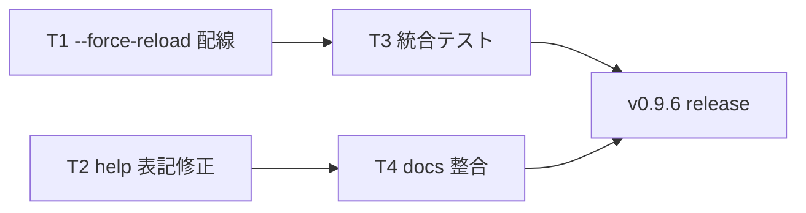

# Phase 6-2 仕上げ計画（v0.9.6 パッチ）

作成日: 2026-07-19 / 対象バージョン: v0.9.5 → v0.9.6

## 0. 前提の訂正（重要）

Phase 6-2「bulk DL 差分更新（conditional GET）」の**中核は v0.9.0 で実装・リリース済み**。
2026-07-19 のコード監査で以下を確認した:

| 項目 | 状態 | 根拠 |
|---|---|---|
| schema v4 (`last_modified`/`etag` カラム + v3→v4 migration) | ✅ 実装済み | `src/db/schema.ts` L53-66, L118-135, `migrateV3ToV4` L204-219 |
| `fetchNtaPage` の conditional GET (`ifModifiedSince`/`ifNoneMatch`、304 早期 return) | ✅ 実装済み | `src/services/nta-scraper.ts` L177-183, L191-213 |
| 6 downloader の 3-way 分岐（304 / 200+hash一致 / 変更） | ✅ 実装済み | `bulk-downloader.ts` L253-373 + `document-conditional-fetch.ts`（5 種共通ヘルパー） |
| downloader 側 `forceReload` オプション | ✅ 実装済み | 6 サービスファイルすべて |
| テスト | ✅ 24 ケース | `nta-scraper.test.ts`(6) / `document-conditional-fetch.test.ts`(15) / `schema.test.ts`(3) |
| CHANGELOG v0.9.0 / v0.9.1 | ✅ 記載あり | L176-220 / L134-174（「欠落」は誤認だった） |
| git tag v0.9.0〜v0.9.5 | ✅ すべて存在 | v0.9.0 = `eb9f6d7`（実装本体は親 `dfad77f`） |

よって本計画は「実装計画」ではなく **仕上げ（closeout）パッチ計画**である。

## 1. 残タスク

### T1: CLI `--force-reload` フラグの配線（本命）

downloader 側の受け口（`forceReload?: boolean`）は 6 種すべて完成済み。`src/cli.ts` の配線のみ欠けている。
CHANGELOG L219 で「将来 `--force-reload` フラグを追加予定 (v0.9.x)」と予告済み。

変更箇所（4 点）:

1. 引数パーサ（L102-127 付近）に追加:
   ```ts
   } else if (a === '--force-reload' || a === '--no-conditional') {
     args.forceReload = true;
   ```
   `--no-conditional` はエイリアスとして受ける（SPIKE 時の呼称との互換）。
2. `CliArgs` 型に `forceReload?: boolean` を追加。
3. 各ランナー（`runBulkDownloadEverything` / `runBulkDownloadKaisei` 等）で `bulkDownload*(..., { forceReload: args.forceReload })` を渡す。**6 ランナーすべて**に配線すること。
4. help テキスト（L149-167）に 1 行追記:
   `--force-reload   conditional GET / content_hash 比較をスキップして全再構築`

### T2: help テキストの所要時間表記修正

`src/cli.ts` L149 の「約 50 分」→「初回 約 50 分 / 2 回目以降 5〜10 分」。
usage コメント（L6）は既に「5〜10 分」で正しいため、help 側だけの不整合。

### T3: downloader 統合テストの拡充（任意・推奨）

現状、conditional GET のテストは fetch 層とヘルパー単体に集中しており、
**downloader レベルで 3-way 分岐を end-to-end 検証するテストが手薄**。

- 対象: `bulk-downloader.test.ts`（tsutatsu = section 単位の専用実装）+ document 系 1 種（kaisei を代表に）
- 方式: in-memory DB + `fetchImpl` stub（既存の手書き stub DI パターン踏襲。msw 不使用）
- ケース:
  1. 初回（state なし）→ 全 INSERT、`last_modified`/`etag` が保存される
  2. 2 回目 304 → `fetched_at` のみ更新、clause/document 本体は不変
  3. 2 回目 200 + hash 一致 → メタのみ更新
  4. 2 回目 200 + hash 不一致 → DELETE+INSERT（tsutatsu）/ upsert（document）
  5. `forceReload: true` → conditional ヘッダを送らず wholesale 再構築
- SPIKE Step 4 が予告した `tests/spikes/last-modified.spike.ts` は**作らない**（テストは src co-located 方針で確定しているため。本計画で予告を正式に取り下げる）

### T4: ドキュメント整合

- `docs/PHASE6.md` §6-2 に「v0.9.0 で完了」を明記（チェックボックス更新）
- `docs/PHASE6.md` §6-3 の「houki-hub-doc サイト」記述を **mikuro.net 統合方針（2026-05-10 確定）** に書き換え。
  起点リポジトリは `houki-hub`（2026-07-19 確定）
- CHANGELOG `[0.9.6]` を起票（Added: `--force-reload` / Fixed: help 表記 / Tests: 統合テスト）

## 2. 作業順序



T1+T2 で 1 コミット、T3 で 1 コミット、T4 で 1 コミット、計 3 コミット想定。
リリースは `npm version patch` → tag push → publish workflow（既存手順）。

## 3. 完了判定

- [ ] `--force-reload` が 6 種すべての bulk DL で有効（`--bulk-download-everything --force-reload` で内訳が `(304: 0, 同内容: 0, 更新: N)` になる）
- [ ] `--help` の表記が実態と一致
- [ ] `vitest --run` 全緑（統合テスト 5 ケース以上追加）
- [ ] PHASE6.md の 6-2 が完了扱い、6-3 が mikuro.net 方針に更新済み
- [ ] CHANGELOG v0.9.6 起票、tag・npm publish 完了

## 4. スコープ外（Phase 6 の別タスク）

- 6-1 relevance ranking: `relevance-scoring.ts` + `db-search.ts` の re-rank は実装済み。
  PHASE6.md 判定基準の「e2e 非破壊確認」だけ残っているため、別途小タスクとして扱う
- 6-3 llms.txt / mikuro.net 公開: houki-hub リポジトリ側の作業と連動するため別計画
- v1.0.0 判定: 6-1〜6-3 完了後に判定 8 項目を再確認 → 1 ヶ月 soft 期間
