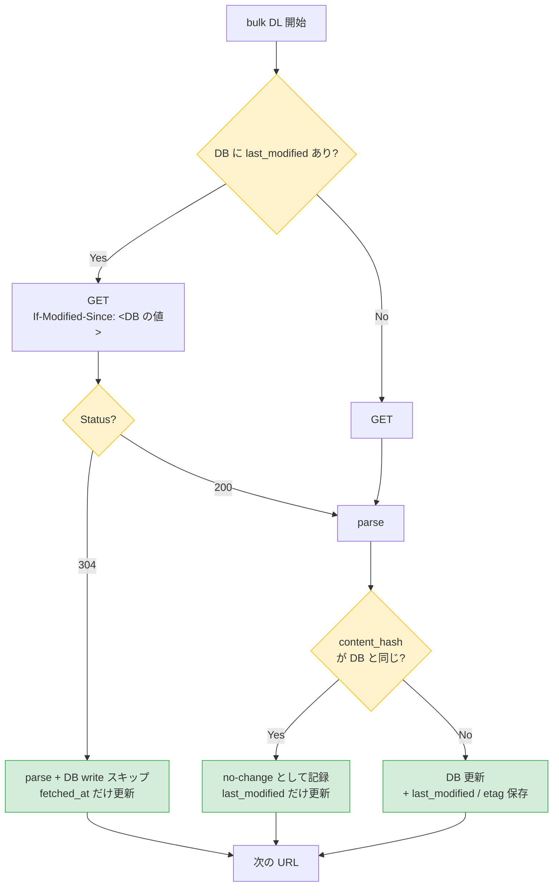

# PHASE 6-2 SPIKE — bulk DL 差分更新の実装方式調査

実施日: 2026-05-08
方法: 国税庁 HP の代表 6 パターンに対し、houki-nta-mcp の実 User-Agent (`@shuji-bonji/houki-nta-mcp/0.8.0`) と `Accept-Language: ja` で `HEAD` リクエストを送り、`Last-Modified` / `ETag` / `If-Modified-Since` の挙動を確認した。

## 1. 結論

| 項目 | 結果 |
|---|---|
| `Last-Modified` / `ETag` レスポンス | **6 / 6 の実利用 URL で返る** (kaisei doc の個別ページに 302 例外あり、後述) |
| `If-Modified-Since` で 304 Not Modified | ✅ 完全動作 (一致時に `HTTP/2 304` + 空ボディが返る) |
| `Cache-Control` / `Vary` | `vary: User-Agent` あり |

**設計判断**: PHASE6.md §4.2 の「HEAD バイパス」案を、より単純で robust な **conditional GET (`If-Modified-Since` + 304 期待)** に置き換える。

## 2. spike 結果 — 実利用 URL ごとの挙動

houki-nta-mcp が bulk DL で実際に組み立てる URL に対する HEAD レスポンス:

| docType | 代表 URL | Status | Last-Modified | ETag |
|---|---|---|---|---|
| `tsutatsu` (消基通 1-1) | `tsutatsu/kihon/shohi/01/01.htm` | 200 | `Thu, 18 Jan 2024 09:30:37 GMT` | `"124c-60f350427c330"` |
| `kaisei` (改正通達 index) | `tsutatsu/kihon/shohi/kaisei/kaisei_a.htm` | 200 | `Tue, 31 Mar 2026 14:00:47 GMT` | `"28f8-64e5264e67a98"` |
| `kaisei` (改正通達 doc) | `tsutatsu/kihon/shohi/kaisei/0025004-026/01.htm` | **302 → 404** | (リダイレクト先のみ) | (リダイレクト先のみ) |
| `bunshokaitou` (main index) | `law/bunshokaito/01.htm` | 200 | `Fri, 17 Apr 2026 05:00:03 GMT` | `"27c4-64fa0d267b308"` |
| `jimu-unei` | `law/jimu-unei/shotoku/shinkoku/170331/01.htm` | 200 | `Thu, 18 Jan 2024 09:36:34 GMT` | `"22ab-60f35196a09d8"` |
| `qa` (質疑応答) | `law/shitsugi/shohi/01/01.htm` | 200 | `Wed, 03 Dec 2025 08:30:43 GMT` | `"1441-64508073969d0"` |
| `tax-answer` | `taxes/shiraberu/taxanswer/shotoku/1100.htm` | 200 | `Fri, 06 Feb 2026 08:30:11 GMT` | `"45f1-64a2398ff2a10"` |

### kaisei doc 個別 URL の 302 について

`0025004-026/01.htm` のような **改正通達ごとの個別 doc URL** は、テストした URL では 302 リダイレクトが発生し最終的に `error/404.htm` に到達した。これは:

- ① テストで使った URL が古く、実際の bulk DL では現存する URL が使われている
- ② または、既に削除された改正通達 (kaisei index ページから外れたもの) を fetch しようとしている

実装上は、bulk DL の **kaisei index** ページ (`kaisei_a.htm`) から個別 doc URL を抽出している。index が最新なら個別 doc URL も生きているはずなので、この 302 は spike 用の URL 選定ミスと判断する。**Conditional GET 設計には影響しない** (302 が返れば index 側で気付ける + 304 が返らないだけ)。

## 3. `If-Modified-Since` + 304 動作確認

```
$ curl -sI -A "@shuji-bonji/houki-nta-mcp/0.8.0" \
       -H "If-Modified-Since: Thu, 18 Jan 2024 09:30:37 GMT" \
       https://www.nta.go.jp/law/tsutatsu/kihon/shohi/01/01.htm

HTTP/2 304
date: Fri, 08 May 2026 06:58:20 GMT
vary: User-Agent
```

✅ Last-Modified が完全一致した状態で `If-Modified-Since` を送ると、**304 Not Modified** が返り **ボディは送られない**。これは PHASE6.md §4.2 の HEAD バイパス案と同等の効果を、より単純な経路で実現する。

## 4. 設計の最終形 — conditional GET ベース



### 旧案との違い

| 観点 | PHASE6.md §4.2 旧案 (HEAD) | spike 後の新案 (Conditional GET) |
|---|---|---|
| 実装の複雑さ | HEAD → 判定 → 必要なら GET の **2 段階** | GET 一発 |
| 帯域 | HEAD でヘッダのみ → 必要なら GET でボディ | 304 ならボディ無し / 200 ならボディあり (HEAD 案と同帯域) |
| エラー処理 | HEAD と GET の retry/backoff を二重実装 | 既存 GET の retry/backoff を再利用 |
| 国税庁への礼儀 | HEAD + GET = 2 リクエスト/URL (no-change 時) | GET 1 リクエスト/URL (常に) |
| 実装ファイル | `nta-scraper.ts` に新 `fetchHead()` | `fetchNtaPage()` に `ifModifiedSince` オプション追加のみ |

### 二段階バイパスの組み合わせ

| Status | 判定 | parse | DB write | fetched_at | last_modified |
|---|---|---|---|---|---|
| 304 (Last-Modified 一致) | conditional GET バイパス | スキップ | スキップ | 更新 | 不変 (一致なので) |
| 200 + content_hash 一致 | content_hash バイパス | 実行 | スキップ | 更新 | 更新 |
| 200 + content_hash 不一致 | 通常更新 | 実行 | 実行 | 更新 | 更新 |

## 5. 期待効果 (推定)

`tsutatsu` (消基通) の Last-Modified が `2024-01-18` と古いことから、**90% 以上のページは月次でも no-change** と推定。

| 項目 | 現状 (v0.8.0) | 改善後 (v0.9.0 推定) |
|---|---|---|
| 全件 bulk DL 時間 | 50 分 | **5〜10 分** (304 の比率次第) |
| HTTP リクエスト数 | 2,710 GET | 2,710 GET (うち 90%+ が 304 で軽量) |
| parse 処理 | 2,710 回 | 200〜500 回 (変更分のみ) |
| DB write | 2,710 回 | 50〜200 回 (実変更分のみ) |
| 国税庁への負荷 | 高 | 中 (GET 数は不変だが、ペイロード送信は減) |

## 6. リスクと対策

| リスク | spike 結果 | 対策 |
|---|---|---|
| Last-Modified を返さない URL | kaisei doc に 302 例外あり (索引から導出される個別 URL は別途要確認) | 200 が返って Last-Modified なし → そのまま parse + content_hash バイパスで 2 段目だけ効かせる |
| Vary: User-Agent | 確認済 | 同じ UA を維持 (`FETCH_CONFIG.userAgent`) |
| 国税庁 HP が将来 304 を出さなくなる | リスクは中程度 (Apache の設定次第) | content_hash バイパスを必ず併用、304 が来なくても性能劣化のみで機能は壊れない |
| Resilience baseline の counter 集計 | `fetched_at` は常に更新されるので freshness 計算は不変 | RESILIENCE.md と整合性維持 (no-change カウンタを追加検討) |

## 7. 実装スコープ (Phase 6-2)

### Step 1: schema migration
- `section` テーブルに `last_modified TEXT NULL` / `etag TEXT NULL` を追加 (`ALTER TABLE`)
- `document` テーブルにも同様
- 既存 DB は NULL で素通し (初回は条件 GET なし → 200 で取得 → 以降は 304 が効く)

### Step 2: `fetchNtaPage` の拡張
- `options.ifModifiedSince?: string` を追加
- レスポンスステータスを返り値に含める (`{ html, status, lastModified?, etag? }`)
- 304 はエラー扱いせず、`html` を空文字 + `status: 304` で返す

### Step 3: 6 bulk-downloader の改修
- 各 fetch 前に `s.last_modified` を DB から読み出し
- `if (lastMod) options.ifModifiedSince = lastMod`
- 304 → no-change パスへ
- 200 → 既存 parse + content_hash 比較を経由

### Step 4: テスト
- 本ドキュメント (spike) のヘッダ確認結果を `tests/spikes/last-modified.spike.ts` として記録 (CI には含めない)
- in-memory DB で「last_modified あり + 304 → スキップ」「200 + content_hash 一致 → スキップ」「200 + content_hash 不一致 → 更新」の 3 ケース

### Step 5: CHANGELOG / version bump
- `[0.9.0] - 2026-05-08` として確定

## 8. 関連ドキュメント

- [`PHASE6.md`](PHASE6.md) — 全体ロードマップ (§4 が本書の元案)
- [`RESILIENCE.md`](RESILIENCE.md) — Phase 5 の resilience 設計 (本書の no-change パスは freshness 計算の counter にも影響)
- [`DATA-SOURCES.md`](DATA-SOURCES.md) — 国税庁 HP のスクレイピングマナー (本書の `vary: User-Agent` への対応)
