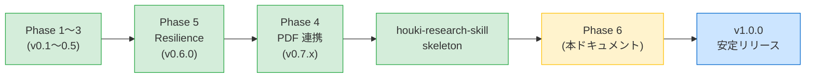
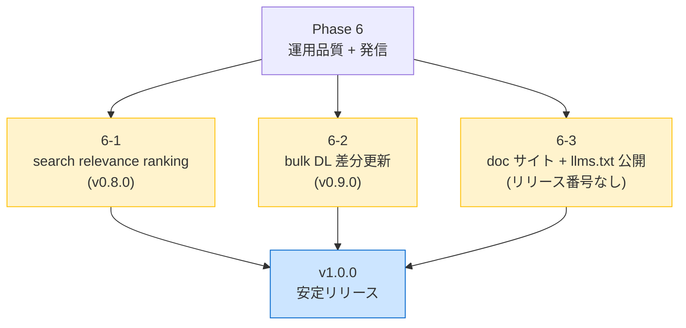
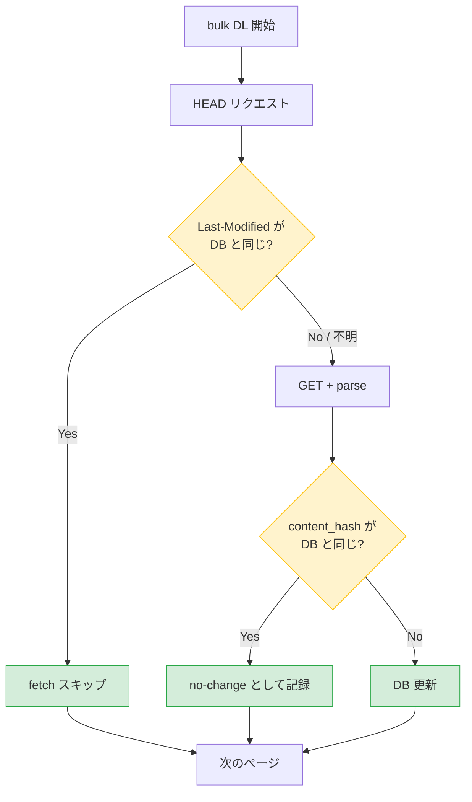

# PHASE 6 — 運用品質と発信の底上げ (v1.0.0 への道)

houki-nta-mcp は v0.7.x 時点で **6 大コンテンツの本実装 (Phase 1〜3) + Resilience (Phase 5) + PDF メタデータ強化 (Phase 4)** が揃い、機能面では一段落した。Phase 6 は新機能の大幅追加ではなく、**「すでにあるものを、より使いやすくする・伝える」** に重点を置き、**v1.0.0 安定リリース** をゴールとする。

> **方針**: 機能拡張ではなく **運用品質と発信の底上げ**。利用者 (LLM / 人間) にとっての体感品質を引き上げ、family の中核 MCP として安定供給される状態を作る。

## 1. 背景



これまで houki-nta-mcp は「機能の幅を拡げる」フェーズを重ねてきた。一方で利用してみると以下のような **体感品質の課題** が見えている:

- **検索結果の relevance が単純** — FTS5 BM25 デフォルトで、clause 番号完全一致や doc_type の階層を考慮していない
- **bulk DL が重い** — 全件 50 分前後。月次運用が現実的でなく、変更がないページも毎回 fetch + parse する
- **発信の動線がない** — 各 MCP の README 中心で family 全体の動線がなく、`llms.txt` も未公開 (Phase 5 完了後の予定だった)

これらは Phase 1〜5 のスコープから意図的に外してきた領域で、機能が一巡した今が改善のタイミング。

## 2. Phase 6 の構成



3 つのサブフェーズはほぼ独立に進行可能。順序の推奨は **6-1 → 6-2 → 6-3** (体感品質の順) だが、6-3 (発信) は他と並行できる。

## 3. Phase 6-1 — search relevance ranking 精度向上 (v0.8.0)

### 3.1 現状の課題

`nta_search_*` ハンドラは現在、SQLite FTS5 のデフォルト BM25 + 単純 LIMIT で結果を返している ([`src/services/db-search.ts`](../src/services/db-search.ts))。これにより以下の問題が生じる:

- **clause 番号が完全一致するエントリが上位に来ない**: 「`5-1-9`」を検索しても他にマッチする clause が大量にある通達では埋もれる
- **doc_type の階層を無視**: 通達 / 改正通達 / 文書回答事例 / Q&A / タックスアンサー の法的拘束力の差を反映していない
- **略称展開が検索で効かない**: 「消基通」を検索すると通達タイトルに含まれるエントリにマッチするだけで、消費税法基本通達の本文には届かない
- **relevance score が応答に含まれない**: LLM が「このヒットはどのくらい確からしい」を判断できない

### 3.2 改善案

| # | 改善 | 仕組み |
|---|---|---|
| 1 | **clause 番号 boost** | クエリが `5-1-9` `1-4-13の2` 等の clause 番号パターンを含む場合、`clauseNumber` 完全一致を最優先にスコアブースト |
| 2 | **doc_type 重み付け** | BM25 score × doc_type 重み (法律 > 通達 > 改正通達 > 文書回答事例 > Q&A > タックスアンサー) |
| 3 | **略称展開** | houki-abbreviations の `resolve_abbreviation` を search 前段に挟み、formal_name を OR でクエリに追加 |
| 4 | **relevance score をレスポンスに** | `score: 0.84` のような正規化された値を各 hit に付与 |
| 5 | **ハイライト精度** | FTS5 の snippet に加え、clause 番号一致箇所も明示 (任意) |

### 3.3 API 変更 (互換性維持)

既存の応答型を **拡張** する形で score を追加。新フィールドはオプションなので既存利用者は破壊されない:

```typescript
interface SearchHit {
  // 既存フィールド
  tsutatsu: string;
  abbr: string;
  clauseNumber: string;
  title: string;
  snippet: string;
  sourceUrl: string;
  // Phase 6-1 で追加
  score?: number;          // 0.0〜1.0 の正規化スコア
  scoreReasons?: string[]; // 例: ["clause exact match", "doc_type=tsutatsu boost"]
}
```

### 3.4 実装ファイル

- [`src/services/db-search.ts`](../src/services/db-search.ts) — SQL を BM25 + boost 合成に変更
- [`src/services/relevance-scoring.ts`](../src/services/relevance-scoring.ts) (新規) — boost factor 計算ロジック
- [`src/tools/handlers.ts`](../src/tools/handlers.ts) — 5 つの search ハンドラに score を伝搬
- [`src/types/index.ts`](../src/types/index.ts) — `SearchHit` 型に `score?` / `scoreReasons?` を追加
- テスト: `relevance-scoring.test.ts` 新規 + 既存 search テストの非破壊確認

## 4. Phase 6-2 — bulk DL 差分更新 (v0.9.0)

### 4.1 現状の課題

`--bulk-download-everything` は約 50 分かかり、月次の cron 運用前提でも重い。実態として **ほとんどのページは前回から変更されていない** にもかかわらず、毎回 fetch + parse + content_hash 計算を行っている。

### 4.2 改善案



二段階のバイパスで fetch / parse / DB write を最小化:

| 段階 | 仕組み | スキップする処理 |
|---|---|---|
| ① HEAD バイパス | `Last-Modified` / `ETag` を DB の `fetched_at` / 別カラムと比較 | GET + parse + DB write |
| ② content_hash バイパス | parse 後の hash が DB と同じならスキップ | DB write |

### 4.3 期待効果

| 項目 | 現状 | 改善後 (推定) |
|---|---|---|
| 全件 bulk DL 時間 | 50 分 | **5〜10 分** |
| HTTP リクエスト数 | 2,710 (GET) | 2,710 (HEAD) + ~50〜200 (GET) |
| 国税庁 HP への負荷 | 重い | 軽い (HEAD 中心) |

### 4.4 リスク

- **国税庁 HP が `Last-Modified` を返さない可能性** — spike (試運転) 段階で確認必要
- **CDN や reverse proxy で `Last-Modified` が信頼できないケース** — content_hash バイパスを必ず併用
- **bulk DL の挙動が変わると Resilience の baseline と齟齬** — `RESILIENCE.md` の counter 集計と整合性を取る

### 4.5 実装ファイル

- [`src/services/bulk-downloader.ts`](../src/services/bulk-downloader.ts) — conditional fetch を追加
- [`src/services/nta-scraper.ts`](../src/services/nta-scraper.ts) — `fetchHead()` 関数追加
- [`src/db/schema.ts`](../src/db/schema.ts) — `last_modified` / `etag` カラムを `document` に追加 (マイグレーション)
- spike: `tests/spikes/last-modified.test.ts` で国税庁 HP のヘッダ調査

## 5. Phase 6-3 — doc サイト + llms.txt 公開

### 5.1 現状の課題

- 各 MCP のドキュメントが **散らばっている** (それぞれの GitHub リポジトリの README + `docs/`)
- `houki-research-skill` skeleton と family 全体の動線がない
- **`llms.txt` が未公開** — memory `houki_phase_ordering.md` で「Phase 5 完了後に公開」と決めていたが、Phase 4 を先に終えた現在、まだ公開していない

### 5.2 改善案

**houki-hub-doc サイト**を構築 (memory `houki_hub_doc.md`):

- URL: `houki-hub.mikuro.net` (構築中)
- ツール: Material for MkDocs
- 内容:
  - 各 MCP の README + `docs/DESIGN.md` を集約
  - houki-research-skill の skeleton を統合
  - 横断的な「使い方ガイド」(houki-nta-mcp の `HOUKI-FAMILY-INTEGRATION.md` を起点に拡張)
  - `legal_status` / `freshness` / `reader_hints` のような **family 横断プロトコル** を 1 ページで説明

**llms.txt 公開**:

- 各 MCP のリポジトリ root に `llms.txt` を配置
- houki-nta-mcp の Resilience caveats は v0.6.0 で解決済 → 肯定形に書き換え
- 草案は `docs/llms-txt-draft.md` に保管済 (memory より)

### 5.3 実装

| 項目 | リポジトリ | 内容 |
|---|---|---|
| houki-hub-doc サイト | `shuji-bonji/houki-hub-doc` (新規) | Material for MkDocs + GitHub Pages |
| 共通 npm パッケージ | `@shuji-bonji/houki-llms-txt-gen` (構想中) | llms.txt 共通テンプレ生成 |
| llms.txt 公開 | 各 MCP リポジトリ | houki-egov / houki-nta / pdf-reader / houki-abbreviations |
| 統合ガイド連動 | houki-nta-mcp の `docs/HOUKI-FAMILY-INTEGRATION.md` | hub サイトから参照 |

## 6. 段階リリース計画

| Phase | バージョン | 主成果 | 完了予定 |
|---|---|---|---|
| 6-1 | v0.8.0 | search relevance ranking 精度向上 | TBD |
| 6-2 | v0.9.0 | bulk DL 差分更新 | TBD |
| 6-3 | (リリース番号なし) | houki-hub-doc サイト + llms.txt 公開 | TBD |
| **完成** | **v1.0.0** | **安定リリース宣言** | TBD |

並行で進められるもの:

- 6-1 と 6-3 は並行可 (依存関係なし)
- 6-2 は spike が必要なので、6-1 の途中で spike だけ先行させる手もある

## 7. v1.0.0 リリース判定基準

以下がすべて満たされたら v1.0.0 を切る:

- [x] **Phase 1〜5 が完了** (機能の幅 + Resilience + PDF 連携)
- [x] **houki-research-skill skeleton** 完成
- [ ] **Phase 6-1**: search relevance ranking 改善が実装され、e2e テストで以前の挙動を破壊していないことを確認
- [ ] **Phase 6-2**: bulk DL 差分更新が実装され、国税庁 HP の `Last-Modified` で 80% 以上のスキップ率を達成
- [ ] **Phase 6-3**: houki-hub-doc サイト公開 + llms.txt 公開
- [ ] **CI が pass** (lint / format / typecheck / unit / e2e すべて緑)
- [ ] **CHANGELOG.md** が完全に整っている
- [ ] **DISCLAIMER.md** が業法独占規定の最新の理解を反映

## 8. スコープ外 (Phase 7+ に持ち越し)

以下は明示的に Phase 6 の範囲外とする。Phase 6 を膨らませない。

| 項目 | 理由 | 持ち越し先 |
|---|---|---|
| 別 docType 追加 (個別通達 / 取扱通達 / 解釈通達速報 等) | カバレッジ拡大は Phase 6 の主軸ではない | Phase 7 |
| AI 士業基盤への踏み込み (改正影響範囲解析 / 関連通達クラスター化) | 大規模な設計変更が必要 | Phase 7+ |
| `documentShape` ヒント (pdf-reader-mcp Issue #5) | houki-research-skill 実利用後に必要性を判定 | houki-research-skill 利用フィードバック |
| 別 family メンバー (houki-mhlw-mcp / houki-saiketsu-mcp / houki-court-mcp) | 各 MCP 独立フェーズ | 各リポジトリ |
| Phase 4 取り残し (extract_tables の nested table / 複数ページ table 跨ぎ) | pdf-reader-mcp 側の改善が主 | pdf-reader-mcp v0.6+ |

## 9. テスト方針

### 9.1 Phase 6-1 (search relevance)

- 既存 e2e テスト (`tests/e2e/`) を **破壊しない**ことを regression guard
- 新規 unit テスト: `relevance-scoring.test.ts` でスコア計算の境界値テスト
- 新規 e2e テスト: 「`5-1-9` を検索して該当 clause が 1 位」「通達と Q&A を同時にヒットさせて通達が上位」など

### 9.2 Phase 6-2 (差分更新)

- spike: `tests/spikes/last-modified.test.ts` で国税庁 HP のヘッダの実態調査 (CI には含めない、手動実行)
- 通常テスト: in-memory DB で「`Last-Modified` 一致時はスキップ」「不一致時は GET」の挙動確認
- 既存 bulk DL テストは `--no-conditional` フラグで従来挙動を維持

### 9.3 Phase 6-3 (doc / llms.txt)

- llms.txt の Markdown lint
- houki-hub-doc サイトのビルドが CI で通ること

## 10. リスクと対策

| リスク | 対策 |
|---|---|
| Phase 6-2 で国税庁 HP が `Last-Modified` を返さない | spike 段階で確認 / ETag fallback / content_hash バイパスを必ず併用 |
| Phase 6-1 の relevance 変更で既存ヒット順が壊れる | opt-in で `nta_search_*` に `useV2Ranking?: boolean` を追加 (将来 default 化) |
| v1.0.0 リリースを急ぎすぎて品質低下 | Phase 6 完了後に 1 ヶ月の **soft 期間** を設けて bug fix のみで beta タグ |
| Phase 6-3 の doc サイトが大きすぎて完成しない | 最小構成 (各 MCP README + 横断ガイド + llms.txt) で v1.0.0 を切る |

## 11. 関連ドキュメント

- [`DESIGN.md`](DESIGN.md) — 全体アーキテクチャ
- [`PHASE4-PDF.md`](PHASE4-PDF.md) — PDF 連携 (前フェーズ)
- [`RESILIENCE.md`](RESILIENCE.md) — Resilience 設計 (Phase 5)
- [`HOUKI-FAMILY-INTEGRATION.md`](HOUKI-FAMILY-INTEGRATION.md) — family 統合利用ガイド
- [memory: `houki_hub_doc.md`](#) — doc サイト構築方針
- [memory: `houki_phase_ordering.md`](#) — llms.txt 公開順序の判断
- [memory: `houki_abbreviations_v04_roadmap.md`](#) — houki-abbreviations 側のロードマップ (略称展開と連動)

## 12. Future work (Phase 7+ の予告)

Phase 6 完了 (= v1.0.0) 後に検討する項目:

- 別 docType 追加 (個別通達・解釈通達速報・税制改正の解説 等)
- 改正影響範囲解析 (改正された clause が他のどこから参照されているかの逆引き)
- 関連通達のクラスター化 (機械学習ベース)
- Skill 層との双方向連携 (houki-research-skill から houki-nta-mcp への hint feedback)
- 国際展開 (英語版 README / llms.txt の english edition)
