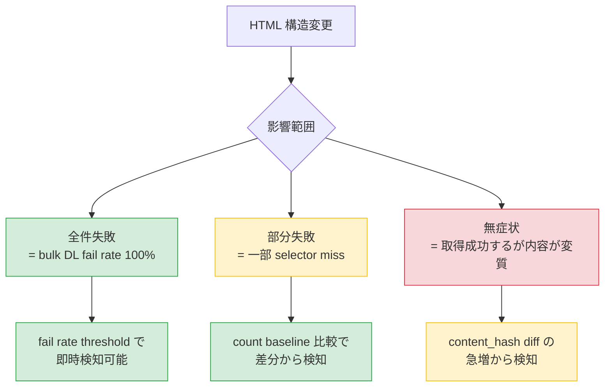
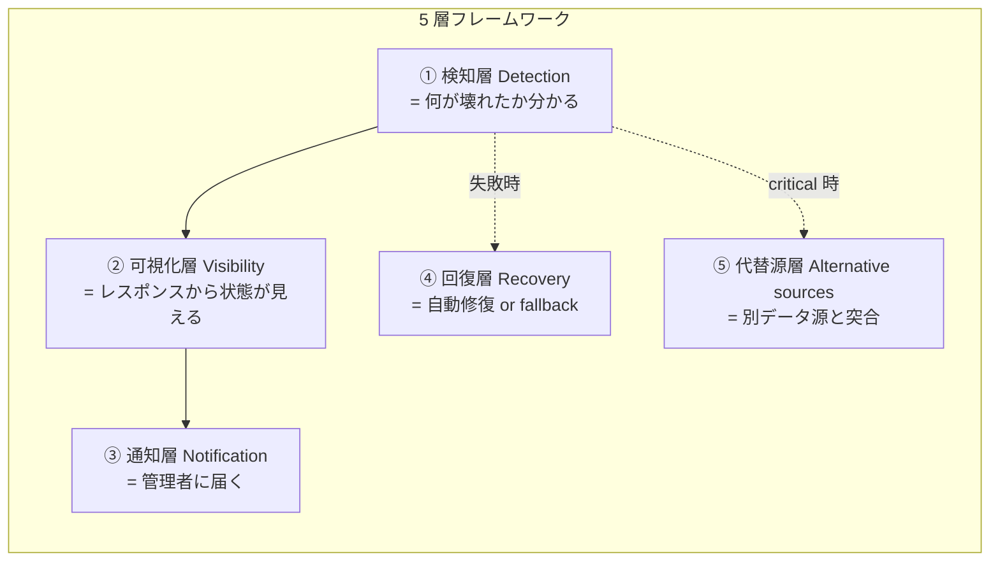
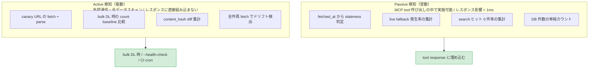
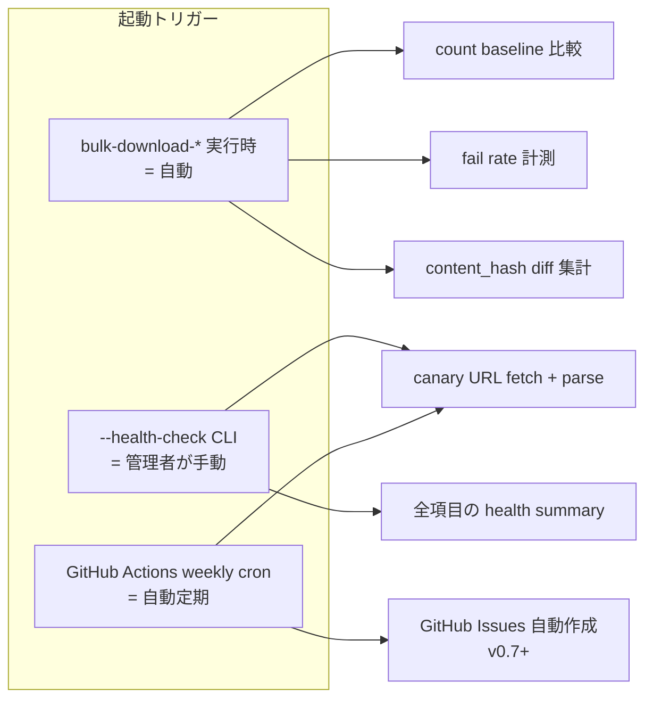
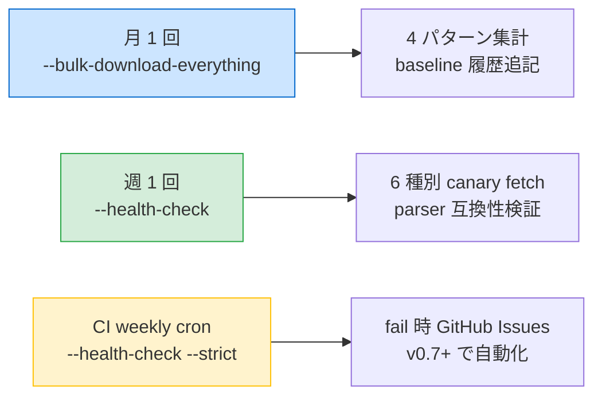
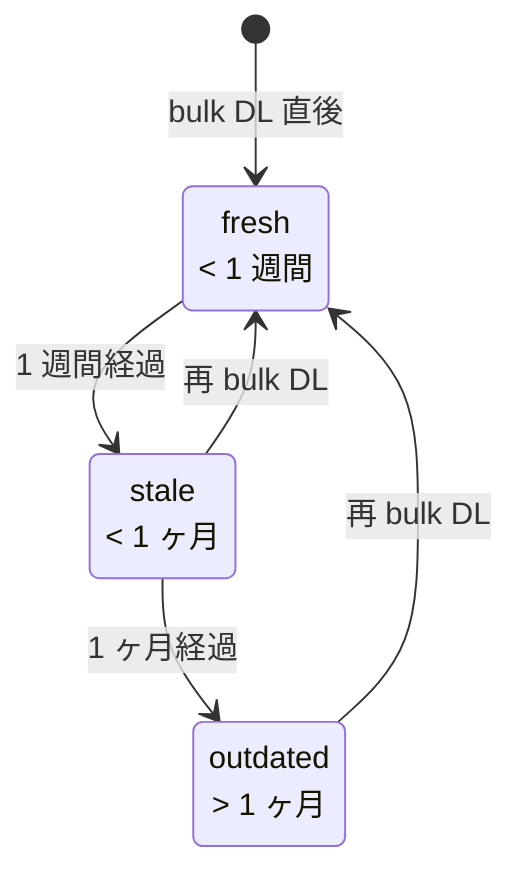

# RESILIENCE — 国税庁 HP の構造変更に対する設計

houki-nta-mcp はスクレイピング主体の MCP server なので、データ源（国税庁 HP）の HTML 構造変更によって突然 bulk DL や parse が壊れるリスクが常にある。本ドキュメントは、その**検知・可視化・回復**の設計方針を整理する。

> **対象範囲**: v0.6.0 で実装する内容と、v0.7+ に先送りする内容の線引きを明示。

## 1. Background

スクレイピング系 MCP の最大のリスクは **silent failure**。
取得そのものが失敗するなら CI で気づけるが、過去のデータが DB に残っているために「動いているように見えるが、実際は最新が取れていない」状態になると、利用者は最大の被害（古い情報で判断する）を受けたまま気づかない。

houki-nta-mcp は v0.5.0 時点で全件 bulk DL **2,710 件 / 51 分 / fail rate 0%** という極めてクリーンな baseline を取得済。これを基準として、ここからの逸脱を Resilience の signal として活用する。

## 2. Threat model

国税庁 HP の構造変更は、影響範囲ごとに 3 通りに分類できる:



最も恐ろしいのは「無症状」のケース。selector がたまたま別の場所にマッチして、似て非なる内容を DB に書き込んでしまう状態。これは **bulk DL 全件の content_hash がほぼ一斉に変化する** という signal で検知できる。

## 3. 5-layer framework

Resilience は 5 つの責務レイヤーに分けて設計する:



### 各層の優先順位

| 層       | 優先度 | 理由                                 | v0.6.0 で対応? |
| -------- | ------ | ------------------------------------ | -------------- |
| ① 検知   | 必須   | 検知できなければ何も始まらない       | ✅             |
| ② 可視化 | 必須   | LLM/利用者がレスポンスから判断できる | ✅             |
| ③ 通知   | 中     | cron + 手動でも代替可能              | △（CI のみ）   |
| ④ 回復   | 低     | 問題が具体化してから設計             | ❌             |
| ⑤ 代替源 | 低     | family が揃ってから                  | ❌             |

## 4. Passive vs Active 検知の分類

検知は「**MCP 利用時に副次的に得る情報（passive）**」と「**外部に通信して能動的に確認（active）**」に分けて設計する。レスポンスへの影響を避けるための重要な分類。



## 5. Detection design (Active 検知)

Active 検知は 3 つのトリガーで起動する:



### 5.1 Bulk DL 時の自動記録（baseline 永続化）

bulk-downloader 実行時に **doc_type ごとに分離した baseline ファイル**を永続化する。
パス: `~/.cache/houki-nta-mcp/baseline-{doc_type}.json`

例: `baseline-qa-jirei.json`、`baseline-tax-answer.json`、`baseline-kaisei.json`、…

直近 12 回（≒ 月 1 bulk DL × 1 年分）をローテーション保持。

```json
{
  "doc_type": "qa-jirei",
  "history": [
    {
      "ranAt": "2026-05-04T00:00:00Z",
      "totalEntries": 1841,
      "documentsFetched": 1841,
      "documentsFailed": 0,
      "newDocs": 0,
      "updatedDocs": 0,
      "orphanedDocs": 0,
      "movedDocs": 0,
      "failRate": 0,
      "durationMs": 2087000
    }
  ]
}
```

### 5.2 集計指標（4 パターン検知）

国税庁 HP の 4 つの変更パターンを検知するため、bulk DL 時に以下を集計する:

| 指標 | 意味 | 検知できる変更パターン |
|---|---|---|
| `newDocs` | 索引にある doc_id で DB に無いもの → INSERT した件数 | **新規追加**（新通達公布等）|
| `updatedDocs` | 既存 doc_id で content_hash が前回と違うもの → UPDATE した件数 | **既存更新**（通達改正等）|
| `orphanedDocs` | DB にあるが索引から消えた doc_id の件数（DELETE せず保持）| **既存削除**（通達廃止等）|
| `movedDocs` | orphaned + 同タイトル new がペアで存在する推定件数 | **既存移動**（URL 変更等）|
| `documentsFailed` | parse / fetch に失敗した件数 | **構造変更**（HTML 構造変化等）|

### 5.3 二重 threshold（絶対数 × 比率）

`fail rate` 単独では doc_type サイズに応じて感度が偏る（小さい種別は過敏 / 大きい種別は鈍感）ので、**絶対数 AND 比率の両方を満たした時に警告** する設計。

```typescript
// 概念
function shouldWarn(failedCount: number, totalCount: number, doc_type: DocType): boolean {
  const minAbs = THRESHOLDS[doc_type].MIN_ABS;
  const minRate = THRESHOLDS[doc_type].MIN_RATE; // 共通 0.01 = 1%
  return failedCount >= minAbs && (failedCount / totalCount) >= minRate;
}
```

種別ごとの `MIN_ABS`（v0.5.0 ベンチマーク fail rate 0% を基準に決定）:

| 種別 | サイズ | MIN_ABS | MIN_RATE | 発火条件 |
|---|---|---|---|---|
| `kaisei` | 125 | 3 | 1% | 3 件失敗 + 比率 1% 以上で発火 |
| `jimu-unei` | 32 | 2 | 1% | 2 件失敗で発火（小規模） |
| `bunshokaitou` | 152 | 3 | 1% | 3 件失敗で発火 |
| `tax-answer` | 744 | 5 | 1% | 5 件失敗で発火 |
| `qa-jirei` | 1841 | 10 | 1% | 10 件失敗で発火 |
| `tsutatsu`（4 通達合計） | 〜数千 clause | 30 | 1% | 30 clause 失敗で発火 |

### 5.4 count drift threshold

`totalEntries`（索引から得た件数）が baseline 履歴の中央値から **±20% 以上ズレ** たら警告。

例: qa-jirei の baseline 中央値 1,841 件に対し、新規 bulk DL で 1,200 件しか取れなかった（35% 減）場合 → 警告 + exit code 非ゼロ。

### 5.5 構造変質の検知（無症状ケース）

bulk DL 全件のうち **updatedDocs 比率が 50% を超えた**場合は「無症状の構造変質」を疑う signal として警告。通常の通達改正で content_hash が一斉に変わることはあり得ない（個別改正が多い）ため。

### 5.6 `--health-check` CLI（v0.6.0 で実装）

オンデマンド診断コマンド。各 doc_type の代表 URL を 1 件ずつライブ fetch して parser 互換性を確認する。

```bash
houki-nta-mcp --health-check
```

出力例（pseudo-code）:

```
[health-check] 2026-05-04 09:00 — checking 6 contents

  ✓ tsutatsu (消基通)         5-1-9        parse OK    fetched 234ms
  ✓ kaisei                   0026003-067  parse OK    fetched 312ms
  ✓ jimu-unei (shotoku)      shinkoku/170331  parse OK  fetched 267ms
  ✓ bunshokaitou             shotoku/250416   parse OK  fetched 289ms
  ✓ tax-answer               6101         parse OK    fetched 198ms
  ✓ qa-jirei                 shohi/02/19  parse OK    fetched 224ms

[summary]
  health: ok
  baseline staleness: 1d (last bulk DL: 2026-05-03)
  recommended action: none
```

### 5.7 CI canary 拡充

既存の Phase 1c で導入した canary integration test を 6 種別に拡張。週次 cron で実行し、失敗時に GitHub Issues 自動作成（v0.7+ で対応）。

```yaml
# .github/workflows/canary.yml （概念）
on:
  schedule: [cron: '0 0 * * 1'] # 毎週月曜 UTC 00:00
jobs:
  canary:
    runs-on: ubuntu-latest
    steps:
      - run: npm ci
      - run: npm run build
      - run: ./dist/index.js --health-check --strict
```

### 5.8 推奨運用フロー（README にも記載）

bulk DL は 51 分かかる重い処理なので、定期実行は **月次** が現実的。一方 `--health-check` は数秒で済むので **週次** 実行可能。階層化することで「日々のドリフトは canary」「累積変化は月次 bulk DL」と分担する。



| 頻度 | コマンド | 用途 | 所要時間 |
|---|---|---|---|
| 月 1 回 | `houki-nta-mcp --bulk-download-everything` | 4 パターン集計、baseline 履歴 | 〜51 分 |
| 週 1 回 | `houki-nta-mcp --health-check` | 6 種別 canary fetch | 〜数秒 |
| 週 1 回（CI） | GitHub Actions cron | parser 互換性確認 | 〜数十秒 |

ローカル運用例（cron / launchd）:

```cron
# 月初に bulk DL（毎月 1 日 03:00 JST）
0 3 1 * *  /usr/local/bin/houki-nta-mcp --bulk-download-everything > ~/.cache/houki-nta-mcp/last-bulk.log 2>&1

# 月曜に health-check（毎週月曜 09:00 JST）
0 9 * * 1  /usr/local/bin/houki-nta-mcp --health-check >> ~/.cache/houki-nta-mcp/health.log 2>&1
```

## 6. Visibility design (Passive 検知)

レスポンスに staleness 情報を埋め込む。実装コストは DB の `fetched_at` 1 列読むだけで、追加コストは < 1ms。

### 6.1 Staleness state machine



| 閾値 | 通達は半年単位の改正があるため、1 ヶ月で outdated 警告は厳しめだが、無症状リスクを避けるため厳しい側に倒す |

### 6.2 Response への埋め込み

`nta_get_*` / `nta_search_*` のレスポンスに `freshness` フィールドを追加:

```json
{
  "results": [...],
  "freshness": {
    "oldest_fetched_at": "2026-04-15T08:00:00Z",
    "newest_fetched_at": "2026-05-03T23:22:31Z",
    "staleness": "stale",
    "days_since_oldest": 19,
    "warning": "一部ドキュメントが 19 日前のデータです。最新化するには `--bulk-download-everything` を実行してください"
  }
}
```

`outdated` 時のみ warning を出す。`fresh` / `stale` でも staleness フィールドは入れるが、`warning` は省略 or 任意。

### 6.3 既存のレスポンスとの互換性

`freshness` は新規フィールドなので、既存クライアントは無視可能。MCP プロトコル的に破壊的変更にはならない。

## 7. Notification design (v0.7+)

v0.6.0 では実装しないが、設計だけ書いておく。

### 7.1 GitHub Issues 自動作成

CI canary が fail rate threshold を超えた場合、`gh issue create` で Issues を自動作成する。

```yaml
# 概念
- if: failure()
  run: |
    gh issue create \
      --title "Canary fail: $(date)" \
      --body "fail rate: ${FAIL_RATE} / details: ${SUMMARY}" \
      --label "resilience,auto"
  env:
    GH_TOKEN: ${{ secrets.GITHUB_TOKEN }}
```

### 7.2 Slack/Discord webhook

GitHub Issues だけでは見落とすため、希望者は webhook で通知を受ける選択肢を提供する（環境変数で URL 設定）。これは v0.7+ で検討。

### 7.3 family 横断のヘルスダッシュボード

houki-hub-doc サイトに family 全体の health summary を集約する案。各 MCP が `~/.cache/{mcp}/health.json` を書き出し、CI でそれを fetch + 集約 + 可視化。

**重要**: ダッシュボードや通知の集約レイヤーで「クローラを共有実装」しないこと。各 MCP のクローラと 2 重実装になり Architecture E が崩れる。集約は **結果（report）の取り回し** に限定する。

## 8. v0.6.0 scope

```mermaid
graph LR
  subgraph v060["v0.6.0 で実装"]
    direction TB
    A[① Passive 検知<br/>= freshness in response]:::high
    B[② bulk DL 時の active 検知<br/>= 4 パターン集計 + 二重 threshold]:::high
    C[③ --health-check CLI<br/>= 6 種別 canary 手動起動]:::high
    D[④ CI canary 拡充<br/>= 週次自動]:::mid
    E[⑤ 運用フロー README<br/>= 月次 bulk DL + 週次 canary]:::high
  end

  subgraph future["v0.7+ で対応"]
    F[⑥ GitHub Issues 通知]:::low
    G[⑦ Slack/Discord webhook]:::low
    H[⑧ 回復層 (selector fallback)]:::low
    I[⑨ 代替源層 (e-Gov 突合)]:::low
  end

  classDef high fill:#d4edda,stroke:#28a745
  classDef mid fill:#fff3cd,stroke:#ffc107
  classDef low fill:#e2e3e5,stroke:#6c757d
```

### 実装タスク（v0.6.0）

| #   | タスク                                                                                     | ファイル / 領域                            |
| --- | ------------------------------------------------------------------------------------------ | ------------------------------------------ |
| 1   | `~/.cache/houki-nta-mcp/baseline-{doc_type}.json` 永続化基盤（直近 12 回ローテーション）   | `src/services/health-store.ts`（新規）     |
| 2   | 二重 threshold（`MIN_ABS` 種別別 + `MIN_RATE: 1%`）+ count drift（±20%）+ 構造変質（>50%） | `src/services/health-thresholds.ts`（新規）|
| 3   | bulk-downloader に 4 パターン集計（new / updated / orphaned / moved）を統合                | 各 bulk-downloader                         |
| 4   | `--health-check` CLI 実装（6 種別の代表 URL を canary fetch + parse）                      | `src/cli.ts` + `src/services/health-check.ts`（新規） |
| 5   | tool response に `freshness` フィールド追加（passive 検知、< 1ms）                         | `src/tools/handlers.ts`                    |
| 6   | CI canary workflow 追加（週次 cron）                                                       | `.github/workflows/canary.yml`             |
| 7   | README に運用フロー（月次 bulk DL + 週次 canary）+ cron 例を記載                           | `README.md`                                |
| 8   | テスト追加（health-store / threshold / canary）                                            | 各 test ファイル                           |
| 9   | CHANGELOG 更新 + version bump 0.5.0 → 0.6.0 + publish                                      | repo root                                  |

## 9. Family-wide considerations

houki-nta-mcp の Resilience 設計は family の他 MCP（houki-egov / houki-saiketsu / houki-court / houki-mhlw）にも横展開可能な雛形になる。ただし以下の原則を守る:

- **検知ロジックは各 MCP の中に閉じ込める**（クローラ集約は禁止）
- **共有レイヤーは結果の集約・通知・可視化に限定**
- **共通基盤化するなら `@shuji-bonji/houki-resilience` のような薄いライブラリ**（health-store の I/F・staleness 判定・fail rate threshold ロジックのみ）

houki-nta-mcp の v0.6.0 で抽出された共通パターンを `houki-resilience` パッケージに昇格させるかは v0.7+ で判断する（houki-abbreviations の text-normalize 昇格と同じ流儀）。

## 10. Future work

- v0.7: GitHub Issues 通知 + CI canary workflow の本格運用
- v0.7: 回復層 — selector fallback の試験実装（最も壊れやすい parser から）
- v0.8: 代替源層 — e-Gov 法令 API との突合（kaisei tsutatsu 検知のクロスチェック）
- v0.x: `@shuji-bonji/houki-resilience` 共通パッケージへの昇格判断
