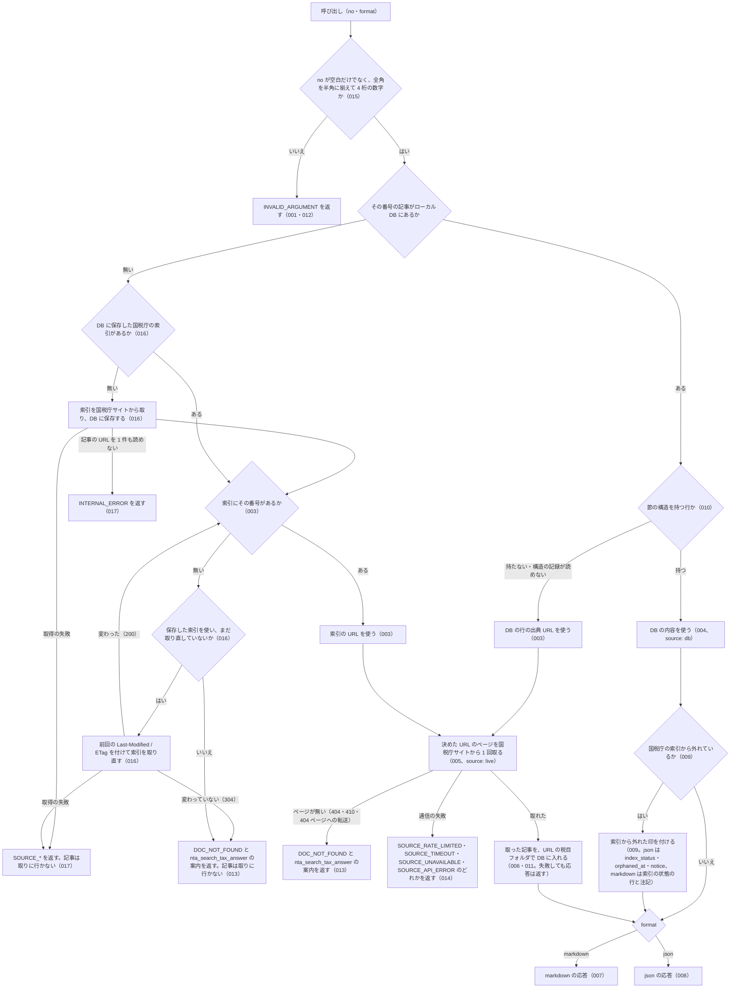

# 差分: nta_get_tax_answer（記事の URL を国税庁の索引で決める・8xxx 帯・通信の失敗の code）

この差分は `specs/current/nta_get_tax_answer/spec.md` に対するものです。見出し単位で、足す（ADDED）・置き換える（MODIFIED）・外す（REMOVED）を書きます。ID の無い節の変更は末尾の「ID の無い節の変更」に書きます。

## ADDED

### SPEC-NTA-GET-TAX-ANSWER-016 国税庁の索引を DB に保存して使い回し、番号が見つからないときにだけ取り直す

記事の URL を決める（SPEC-NTA-GET-TAX-ANSWER-003）ために、国税庁のタックスアンサーの索引 `https://www.nta.go.jp/taxes/shiraberu/taxanswer/code/` を使う。索引は、記事ごとに番号・記事の URL・税目フォルダ（URL の `taxanswer/` の次の要素）を持つ一覧である。

- 索引を国税庁サイトから取ったときは、その一覧と、応答の `Last-Modified` / `ETag` を DB に保存する。次の呼び出しでは国税庁サイトから取り直さずに保存した一覧を使う。使い回す期間は設けない
- 保存した一覧にその番号が無いときは、1 回の呼び出しにつき 1 回だけ、前回の `Last-Modified` / `ETag` を付けて索引を取り直す。変わっていれば（200）一覧を保存し直して探し直す。変わっていない（304）か、取り直しても無ければ、SPEC-NTA-GET-TAX-ANSWER-013 の `DOC_NOT_FOUND` を返す
- その呼び出しで索引を取った（保存が無かった）ときは取り直さない
- 1 回の呼び出しで国税庁サイトから取るページは、索引（取り直しを含めて最大 2 回）と記事の 1 ページまで。ページとページのあいだは 0.3 秒あける（SPEC-NTA-GET-TSUTATSU-015 と同じ）
- `--bulk-download-tax-answer` も同じ索引から記事を集める。bulk download が索引を DB に保存するかは cli_bulk_download で決める

国税庁サイトに新しい記事が足されたときは、保存した一覧に無い番号として取り直しが起き、そこで見つかる。記事が消えたときは、保存した一覧の URL を取りに行き、ページが無い（404 ページへの転送）ので SPEC-NTA-GET-TAX-ANSWER-013 の `DOC_NOT_FOUND` になる。

例（2026-10-03 13:37 JST に確かめた値）: 索引は 200 で `last-modified: Tue, 15 Sep 2026 08:58:03 GMT`、`etag: "25b0a-65b81bf96ae40"` を返し、`If-None-Match` か `If-Modified-Since` を付けると 304 を返した。索引の記事の URL は 755 件で、番号の重複は無く、`0` で始まる番号は無かった。

### SPEC-NTA-GET-TAX-ANSWER-017 索引の取得に失敗したときは、記事を取りに行かずに `SOURCE_*` を返す

索引（SPEC-NTA-GET-TAX-ANSWER-016）の取得が失敗したときは、記事のページを取りに行かず、SPEC-NTA-COMMON-ERRORS-018 の表の code・`retryable`・`next_actions` のエラーを返す。`url` と `detail.url` は索引の URL、`tool` は `nta_get_tax_answer`。

- 索引のページが 404・410・404 ページへの転送で終わったときは、索引の URL はこのサーバーが決めた値なので、`DOC_NOT_FOUND` ではなく `SOURCE_API_ERROR`（`retryable: false`、`detail.status`）にする。国税庁サイトの構成が変わったと考えられるので、`hint` に報告を求める文を入れる
- 取り直し（016 の条件付きの取り直し）が失敗したときも同じ

索引を読み取れた（200）が記事の URL が 1 件も無いときは、SPEC-NTA-COMMON-ERRORS-009 の `INTERNAL_ERROR`（`error: "タックスアンサーの索引のパースに失敗: <理由>"`）にし、保存してあった一覧は書き換えない。

例: DB に無い番号を `{ no: "6101" }` で求め、保存した索引も無く、国税庁サイトが索引に 503 を返し続けると、`code: "SOURCE_API_ERROR"`、`retryable: true`、`url` は索引の URL で、記事のページ `/shohi/6101.htm` は取りに行かない。

## MODIFIED

### SPEC-NTA-GET-TAX-ANSWER-003 記事の URL は国税庁の索引で決め、DB にある行はその行の URL を使う

国税庁サイトから記事を取りに行くときの URL は、番号の先頭の桁ではなく、次の順に決める。

1. DB にその番号の行があり、節の構造を持たない（SPEC-NTA-GET-TAX-ANSWER-010）ときは、その行の出典 URL
2. DB にその番号の行が無いときは、国税庁の索引（SPEC-NTA-GET-TAX-ANSWER-016）でその番号の URL を探す。索引に無ければ取りに行かずに SPEC-NTA-GET-TAX-ANSWER-013 の `DOC_NOT_FOUND`

決めた URL を 1 回だけ取得する。税目フォルダは、取得した URL の `taxanswer/` の次の要素である。

例（2026-10-03 JST の索引）:

| `no` | 取りに行く URL | 税目フォルダ | v0.23.0 で取りに行った URL |
|---|---|---|---|
| `6101` | `/taxes/shiraberu/taxanswer/shohi/6101.htm` | `shohi` | 同じ |
| `2010` | `/taxes/shiraberu/taxanswer/shotoku/2010.htm` | `shotoku` | `/gensen/2010.htm`（404 ページへの転送） |
| `4402` | `/taxes/shiraberu/taxanswer/zoyo/4402.htm` | `zoyo` | `/sozoku/4402.htm`（転送） |
| `7400` | `/taxes/shiraberu/taxanswer/hotei/7400.htm` | `hotei` | `/inshi/7400.htm`（転送） |
| `3429` | `/taxes/shiraberu/taxanswer/hojin/3429.htm` | `hojin` | `/joto/3429.htm`（転送） |
| `8001` | `/taxes/shiraberu/taxanswer/saigai/8001.htm` | `saigai` | 取りに行かず `INVALID_ARGUMENT` |

索引の 755 件のうち、番号の先頭の桁から決めていた税目フォルダと違うものは 129 件（先頭 `2` の `shotoku` 37 件、`3` の `shotoku`・`hojin` 各 1 件、`4` の `hyoka`・`zoyo` 各 29 件、`7` の `hotei` 14 件・`fufuku` 2 件、`8` の `saigai` 16 件）。

### SPEC-NTA-GET-TAX-ANSWER-005 DB に無い記事は国税庁サイトから取る

その番号の記事が DB に無いときは、SPEC-NTA-GET-TAX-ANSWER-003 で決めた URL のページを取得して返す。json の応答の `source` は `live`。`8xxx` 帯（災害を受けたら、`saigai` フォルダ）の記事も同じく取る。

例: DB に無い `{ no: "8001" }` は、索引で `/saigai/8001.htm` を決めて取り、`taxAnswer.title` に「災害等による期限の延長」を含む応答を `source: "live"` で返す（v0.23.0 では `INVALID_ARGUMENT`）。

### SPEC-NTA-GET-TAX-ANSWER-006 国税庁サイトから取った記事は DB に入り、次からは DB から返す

SPEC-NTA-GET-TAX-ANSWER-005 で取得した記事は DB に入る。行の税目は、取得した URL の税目フォルダ（SPEC-NTA-GET-TAX-ANSWER-003）で、`--bulk-download-tax-answer` が同じ記事に入れる値と同じになる。同じ番号をもう一度求められたときは国税庁サイトに取りに行かず、`source` が `db` の応答を返す。このときの応答は、国税庁サイトから取ったときと同じ構造である（`taxAnswer.sections` の節の数が同じで、`taxAnswer.fetchedAt` は最初に取得した日時のまま）。DB への書き込みに失敗しても、その呼び出しの応答は返す。

例: `{ no: "2010" }` を国税庁サイトから取ると、DB の行の税目は `shotoku`（v0.23.0 の先頭の桁の表なら `gensen` だったが、v0.23.0 ではその URL が 404 ページへの転送で、行は作られなかった）。

### SPEC-NTA-GET-TAX-ANSWER-011 記事番号は引数の no で決め、応答と DB の行に空の番号を入れない

記事番号は、ページの見出しではなく引数の `no`（前後の空白を除いたもの）で決める。ページの見出しが `No.<番号> <題名>` の形でなくても、次のとおりになる。

- json の `taxAnswer.no` と markdown の見出し `# No.<番号> <題名>` の番号は `no`。題名は見出しの文字列のまま
- 国税庁サイトから取った記事を DB に書き戻す行（SPEC-NTA-GET-TAX-ANSWER-006）の文書 ID は `no`、税目は取得した URL の税目フォルダ。文書 ID が空の行は作らない。次の呼び出しは DB から返す（`source: "db"`）
- DB から返すとき（SPEC-NTA-GET-TAX-ANSWER-004）、行に記録された番号が空でも `taxAnswer.no` は `no`

例: 見出しが `消費税の基本的なしくみ`（`No.` が無い）のページを `no: "6101"` で取ると、`taxAnswer.no` は `"6101"`、`taxAnswer.title` は `"消費税の基本的なしくみ"`、DB の行の文書 ID は `6101`、税目は `shohi`。同じ番号をもう一度求めると `source` は `db` で `taxAnswer.no` は `"6101"`。

### SPEC-NTA-GET-TAX-ANSWER-012 番号は 4 桁で、桁数が違えば取りに行かずに `INVALID_ARGUMENT` を返す

`no` は、前後の空白を除いて半角の数字 4 桁である（SPEC-NTA-COMMON-ERRORS-015）。数字だけだが 4 桁でない（`"61"`、`"61011"`）ときは、DB と索引を引く前に、`INVALID_ARGUMENT`（`tool: "nta_get_tax_answer"`、`error: "no の形が受け付ける形ではありません: <渡した値>"`、`detail.issues: [{ path: "no", message: "半角の数字 4 桁で指定してください" }]`、`hint` に `"6101"`・`"1120"` のような例）を返す。DB も国税庁サイトも引かない。先頭の桁では断らない（4 桁の数字ならどの番号帯も DB と索引で探す）。

例: `no: "6101"`・`"8001"`・`"0101"` は検査を通る。`no: "61"` と `no: "61011"` は `code: "INVALID_ARGUMENT"`・`detail.issues[0].path: "no"` で、DB も国税庁サイトも引かない。`no: "0101"` は、DB にも索引にも無ければ SPEC-NTA-GET-TAX-ANSWER-013 の `DOC_NOT_FOUND`（v0.23.0 では先頭の桁が未対応の `INVALID_ARGUMENT`）。

### SPEC-NTA-GET-TAX-ANSWER-013 索引に番号が無いとき、または国税庁サイトにページが無い（404・410・404 ページへの転送）ときは `DOC_NOT_FOUND` を返し、検索ツールを案内する

次のどちらかのときは、エラー `DOC_NOT_FOUND`（`retryable: false`）を返す（SPEC-NTA-COMMON-ERRORS-016）。`SOURCE_*` にはしない。

- `no` の記事が DB に無く、国税庁の索引（SPEC-NTA-GET-TAX-ANSWER-016。取り直しの後も）にもその番号が無い。記事のページは取りに行かない
- 記事のページを取りに行き、国税庁サイトが HTTP 404 か 410 を返した、または `https://www.nta.go.jp/error/404.htm` に転送した

本文は次のとおり。

- `error`: 渡した引数の値と、そのタックスアンサーが国税庁の索引に無いこと（前者）／そのページが国税庁サイトに無いこと（後者）
- `hint`: 番号を確かめる案内（nta_search_tax_answer で探す）
- `next_actions`: `{ action: "nta_search_tax_answer", reason: "キーワード検索で正しい番号を探せます", example: { keyword: "<探したい語>" } }` の 1 件。`retry_later` は入れない
- `detail`: 前者は `url` に索引の URL（`status` は付けない）。後者は `status` に国税庁サイトが返した HTTP ステータス（転送のときは 404）、`url` に取りに行った URL
- `tool`: `nta_get_tax_answer`

例: 索引に無い `{ no: "6999" }` は、記事のページを取りに行かずに `code: "DOC_NOT_FOUND"`、`retryable: false`、`next_actions[0].action: "nta_search_tax_answer"`。索引にあるが国税庁サイトが記事のページを `/error/404.htm` に転送したときも、410 を返したときも同じ code（`detail.status` は 404 か 410）。

### SPEC-NTA-GET-TAX-ANSWER-014 国税庁サイトとの通信が失敗したときは、失敗の種類ごとの `SOURCE_*` を返す

記事のページを国税庁サイトから取るときに、要求がページが無い（SPEC-NTA-GET-TAX-ANSWER-013）以外の形で失敗したときは、SPEC-NTA-COMMON-ERRORS-018 の表の code・`retryable`・`next_actions`・`detail` のエラーを返す。`tool` は `nta_get_tax_answer`。索引の取得の失敗は SPEC-NTA-GET-TAX-ANSWER-017。

| 国税庁サイト | `code` | `retryable` | `next_actions` |
|---|---|---|---|
| HTTP 429 | `SOURCE_RATE_LIMITED` | `true` | `retry_later` |
| 30 秒以内に応答しない（取り直しても） | `SOURCE_TIMEOUT` | `true` | `retry_later` |
| HTTP 5xx（取り直しても） | `SOURCE_API_ERROR` | `true` | `retry_later` |
| HTTP 403・400 など（404・410・429 を除く 4xx） | `SOURCE_API_ERROR` | `false` | 付けない |
| 接続できない（取り直しても。SPEC-NTA-COMMON-ERRORS-019） | `SOURCE_UNAVAILABLE` | `true` | `retry_later` |

例: 国税庁サイトが記事のページに 503 を返す状態で `{ no: "6101" }` を渡すと、`code: "SOURCE_API_ERROR"`、`retryable: true`、`detail.status: 503`。403 なら `retryable: false`・`next_actions` 無し、接続できない（`cause.code: "ENOTFOUND"`）なら `SOURCE_UNAVAILABLE`（v0.23.0 ではどれも `SOURCE_API_ERROR`・`retryable: true`）。

### SPEC-NTA-GET-TAX-ANSWER-015 `no` は半角に揃えてから形を確かめる

`no` は、前後の空白を除いた値を houki-abbreviations の `normalizeJpText` の規則（全角英数字を半角に、ダッシュ類 `－` `‐` `‑` `–` `—` `―` `−` を `-` に、全角チルダ `～` `〜` を `~` に、全角空白を半角空白にし、前後の空白を除く。罫線 `─` と長音 `ー` は変えない。大文字と小文字は区別する）で揃えてから、SPEC-NTA-GET-TAX-ANSWER-001・012 の形の検査に進む（SPEC-NTA-SEARCH-RULES-019）。揃えた後の値で DB と国税庁の索引を引く。

例: `{ no: "６１０１" }` は `{ no: "6101" }` と同じ応答（v0.21.3 では数字以外として `INVALID_ARGUMENT` だった）。

## REMOVED

### SPEC-NTA-GET-TAX-ANSWER-002 対応していない先頭の桁は取りに行かない

外す理由: 記事の URL を国税庁の索引で決める（SPEC-NTA-GET-TAX-ANSWER-003）ので、先頭の桁で番号帯を断る必要が無くなる。`8xxx` 帯は索引にあるので取れ、`0xxx` 帯は索引に無いので SPEC-NTA-GET-TAX-ANSWER-013 の `DOC_NOT_FOUND` になる。

## ID の無い節の変更

- 「入力」の表の `no` の行: 「先頭の桁で税目が決まる（下の表）」を「税目フォルダは国税庁の索引で決める（003・016）」にし、先頭の桁と税目フォルダの表を消す。代わりに次の文を置く: 「記事は国税庁の索引（`/taxes/shiraberu/taxanswer/code/`）で番号から URL を決める。番号の先頭の桁はおおむね税目を表すが、`2xxx` の一部は所得税（`shotoku`）、`4xxx` は相続税（`sozoku`）・贈与税（`zoyo`）・財産の評価（`hyoka`）、`7xxx` は印紙税（`inshi`）・法定調書（`hotei`）・不服申立て（`fufuku`）、`8xxx` は災害（`saigai`）のように分かれる」
- 「処理の流れ」の図を次に置き換える

- 「できないこと」の「`8xxx` 帯（酒税など）の記事を取ること（先頭の桁の表に無い）」を消し、「国税庁の索引に無い番号の記事を取ること（`DOC_NOT_FOUND`。`0xxx` 帯は索引に無い）」を足す
- 「未決」の 4 を消す（番号は振り直さない。#70 の行 1 の文はこの差分の実装 PR で直す）
- 冒頭の「関連する Issue」に `#128（8xxx 帯と税目フォルダ）`、`#120（通信の失敗の code）` を足す
