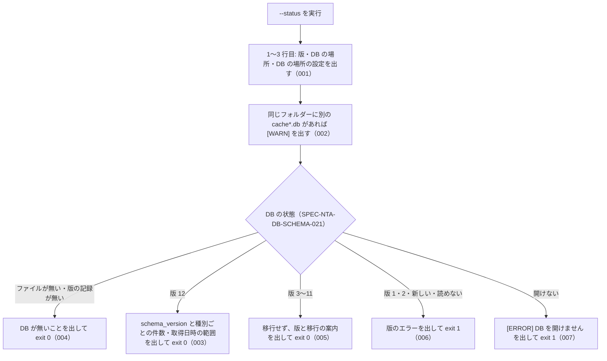

# 差分: cli_status（20261004-db-location。新しい spec.md）

`specs/current/cli_status/spec.md` はまだ無い。この差分で新しく置く（初版起こしではなく、この仕様 PR の ADDED として承認を受ける）。

取り込むとき（Publisher）は、次の順で `specs/current/cli_status/spec.md` を作る。

1. 下の「取り込むときの冒頭」の節の中身（`# 機能: cli_status …` から「処理の流れ」の図まで）。`### アクター`・`### 入力`・`### 処理の流れ` は `## ` の見出しにする
2. `## できること` の見出しに続けて、`## ADDED` の `### SPEC-…` をすべて番号の順に
3. 下の「取り込むときの末尾」の節の中身。`### できないこと`・`### 未決` は `## ` の見出しにする

## 取り込むときの冒頭

# 機能: cli_status（`--status` で DB の場所と中身を確かめる）

- 機能 ID: NTA
- 種類: CLI
- 版: current
- 承認日: （差分 `20261004-db-location` の承認日と PR 番号を書く）
- 起こした元: 差分 `20261004-db-location`（v0.25.0 で新しく足す CLI のフラグ。houki-egov-mcp の cli_status の SPEC-EGOV-CLI-STATUS-005・010・011・013・014 と同じ形）
- 関連する Issue: houki-nta-mcp #138（開いている DB のパスが応答に出ず、残っている別の DB にも気付けない）

この文書は「このコマンドは何をするか」を書きます。どう実装しているか（関数名）は書きません。テーブル名・列名は、出力の行の元として書きます。

### アクター

- 利用者（ターミナルから `houki-nta-mcp --status` を実行する人）。MCP サーバーと CLI が同じ DB を開いているか、DB に何がどれだけ入っているかを、DB を書き換えずに確かめたい
- 案内の文（SPEC-NTA-DB-SCHEMA-029 の「投入したはずの場合は、投入したシェルで … --status を実行し」）を読んで実行する人

### 入力

| フラグ・環境変数 | 必須 | 内容 |
| --- | --- | --- |
| `--status` | 必須 | この処理を選ぶ（SPEC-NTA-CLI-ENTRY-007。一緒に使えるのは `--db-path` だけ） |
| `--db-path=<path>` | 任意 | 確かめる DB のファイル（SPEC-NTA-CLI-ENTRY-004） |
| 環境変数 `HOUKI_NTA_DB_PATH` / `XDG_CACHE_HOME` | 任意 | `--db-path` が無いときの DB の場所（SPEC-NTA-DB-SCHEMA-026） |

### 処理の流れ

図の中の番号は「できること」の仕様 ID の末尾 3 桁です。



## ADDED

### SPEC-NTA-CLI-STATUS-001 1〜3 行目に、版・DB の場所・DB の場所を決めた設定を出す

`--status` は、DB の状態によらず、まず次の 3 行を標準出力に出す。国税庁サイトには接続しない。MCP サーバーは起動しない。

1. `[status] <パッケージ名> v<版>`
2. `  DB: <DB の場所>`（`--db-path` か `HOUKI_NTA_DB_PATH` を指定していればその値のまま。どちらも無ければ `$XDG_CACHE_HOME/houki-nta-mcp/cache.db` か `~/.cache/houki-nta-mcp/cache.db` を絶対パスにしたもの。SPEC-NTA-DB-SCHEMA-026）
3. `  DB の場所の設定: <設定の名前>…`（下の表）

| DB の場所の設定（SPEC-NTA-DB-SCHEMA-026） | 3 行目 |
| --- | --- |
| `--db-path` | `  DB の場所の設定: --db-path（MCP サーバーは --db-path を受け取りません。MCP サーバーが開く DB は HOUKI_NTA_DB_PATH・XDG_CACHE_HOME・既定のどれかで決まります）` |
| `HOUKI_NTA_DB_PATH` | `  DB の場所の設定: HOUKI_NTA_DB_PATH（MCP クライアントから起動したサーバーは、シェルの環境変数を受け継がないことがあります）` |
| `XDG_CACHE_HOME` | `  DB の場所の設定: XDG_CACHE_HOME（MCP クライアントから起動したサーバーは、シェルの環境変数を受け継がないことがあります）` |
| `既定` | `  DB の場所の設定: 既定` |

例: 環境変数を付けずに、ホームディレクトリが `/Users/bonji` の環境で実行すると、1〜3 行目は `[status] @shuji-bonji/houki-nta-mcp v0.25.0`・`  DB: /Users/bonji/.cache/houki-nta-mcp/cache.db`・`  DB の場所の設定: 既定`。`--db-path=/tmp/x.db` を付けると 2 行目は `  DB: /tmp/x.db`、3 行目は `  DB の場所の設定: --db-path（…）`。houki-egov-mcp の SPEC-EGOV-CLI-STATUS-013 と同じ形で、`--db-path` の行だけが houki-nta-mcp にある。

### SPEC-NTA-CLI-STATUS-002 同じフォルダーに別の `cache*.db` があれば `[WARN]` で知らせる

3 行目の次に、DB の絶対パス（SPEC-NTA-DB-SCHEMA-026）のフォルダーにある普通のファイルのうち、名前が `cache` で始まり `.db` で終わり、DB のファイルそのものでないものを探す。1 つ以上あれば、標準出力に次の 1 行を出す。無ければ出さない。

```
[WARN] 同じフォルダーに、この DB のほかに cache*.db のファイルがあります: <名前> (<大きさ>, <最終更新>)[, <名前> (<大きさ>, <最終更新>)…]。MCP サーバーと CLI が別のファイルを開いていないか確かめてください
```

- 並びはファイルの名前の順。`<大きさ>` は 1,024 バイト未満は `<n> B`、次は小数 1 桁の `KB`・`MB`、1 GiB 以上は小数 2 桁の `GB`（1 KB = 1,024 バイト）、`<最終更新>` は実行した環境の時刻の `YYYY-MM-DD HH:MM`
- フォルダーは数えない（添付 PDF の保存先 `files/` も同じ場所にある）。`-wal`・`-shm` のファイルは名前が `.db` で終わらないので数えない。bulk download の記録 `baseline-*.json` も数えない。退避したファイル（`cache.v11.bak.db` など）は数える
- 見つけたファイルは開かない（版を読まない。名前・大きさ・最終更新だけを出す）
- DB のファイルが無いとき（004）、版が違うとき（005・006）、開けないとき（007）も、3 行目の次に同じように確かめて出す
- フォルダーが無い・読めないときは何も出さず、エラーにしない
- 終了コードは変えない。標準エラー出力には出さない

例: `~/.cache/houki-nta-mcp/` に `cache.db`（DB のファイル）と、`cache.dev.db`（2,048 バイト、最終更新 2026-10-04 12:00）・`cache.db-wal`・`baseline-qa-jirei.json`・`files/` があるとき、環境変数を付けずに `--status` を実行すると、3 行目の次に `[WARN] 同じフォルダーに、この DB のほかに cache*.db のファイルがあります: cache.dev.db (2.0 KB, 2026-10-04 12:00)。MCP サーバーと CLI が別のファイルを開いていないか確かめてください` を出す。`HOUKI_NTA_DB_PATH` が `~/.cache/houki-nta-mcp/cache.dev.db`（無いファイル）を指し、同じフォルダーに `cache.db` があるときは、`cache.db` を挙げた `[WARN]` を出し、DB が無いこと（004）を出して終了コード 0。`cache.db` だけのフォルダーでは出さない。

### SPEC-NTA-CLI-STATUS-003 版 12 の DB では、版と種別ごとの件数・取得日時の範囲を出して exit 0

DB の版が 12（SPEC-NTA-DB-SCHEMA-021 の「版が同じ」）のときは、1〜3 行目と、あれば SPEC-NTA-CLI-STATUS-002 の `[WARN]` の行の後に、次の 7 行を標準出力に出し、終了コード 0 で終わる。標準エラー出力には何も出さない。

1. `  schema_version: 12`
2. `  tsutatsu: <通達の数> (clause: <条項の数>[, fetched_at: <最古> 〜 <最新>])`。通達の数は条項を 1 件以上持つ通達の数、条項の数は `clause` の行の数。`fetched_at` は `section` のすべての行の `fetched_at` の最小と最大（`nta_search_tsutatsu` の `freshness` と同じ範囲。SPEC-NTA-SEARCH-RULES-017）で、`section` に行が無ければ書かない
3. `  qa-jirei: <件数>[ (<括弧の中>)]`
4. `  tax-answer: <件数>[ (<括弧の中>)]`
5. `  kaisei: <件数>[ (<括弧の中>)]`
6. `  jimu-unei: <件数>[ (<括弧の中>)]`
7. `  bunshokaitou: <件数>[ (<括弧の中>)]`

3〜7 行目の `<件数>` は `document` のその `doc_type` の行の数（国税庁の索引から消えた文書を含む）。`<括弧の中>` は次の 2 つを、あるものだけ `, ` でつないだもの。どちらも無ければ括弧を書かない。

- `国税庁の索引から消えた: <件数>`（`orphaned_at` の付いた行の数。1 件以上のときだけ）
- `fetched_at: <最古> 〜 <最新>`（`orphaned_at` の無い行の `fetched_at` の最小と最大。検索の `freshness` と同じ範囲。SPEC-NTA-SEARCH-RULES-017。そういう行が 1 件以上のときだけ）

数は区切りの `,` を付けない。`fetched_at` の値は DB の文字列のまま出し、日付として読まない（読めない値でもエラーにしない）。鮮度の段階（`staleness`）は出さない。

例: 次の DB で、環境変数を付けずに実行すると、標準出力は下のとおりで終了コード 0。

- 消費税法基本通達の条項 2 件（節の `fetched_at` は `2026-10-04T03:14:49.904Z` と `2026-10-04T03:24:14.467Z`）
- タックスアンサー 3 件（No.2882 は `orphaned_at` 付きで `fetched_at` `2026-09-07T21:06:49.516Z`、ほかの 2 件は `2026-10-04T03:00:00.000Z` と `2026-10-04T03:51:17.445Z`）
- 質疑応答事例 1 件（`2026-10-04T04:26:15.744Z`）、改正通達・事務運営指針・文書回答事例は 0 件
- `~/.cache/houki-nta-mcp/` にほかの `cache*.db` は無い

```
[status] @shuji-bonji/houki-nta-mcp v0.25.0
  DB: /Users/bonji/.cache/houki-nta-mcp/cache.db
  DB の場所の設定: 既定
  schema_version: 12
  tsutatsu: 1 (clause: 2, fetched_at: 2026-10-04T03:14:49.904Z 〜 2026-10-04T03:24:14.467Z)
  qa-jirei: 1 (fetched_at: 2026-10-04T04:26:15.744Z 〜 2026-10-04T04:26:15.744Z)
  tax-answer: 3 (国税庁の索引から消えた: 1, fetched_at: 2026-10-04T03:00:00.000Z 〜 2026-10-04T03:51:17.445Z)
  kaisei: 0
  jimu-unei: 0
  bunshokaitou: 0
```

### SPEC-NTA-CLI-STATUS-004 DB が無いときは作らずに、そのことを出して exit 0

DB のファイルが無いとき（置き場所のフォルダーも無いときを含む）と、ファイルはあるが版の記録が無いときは、1〜3 行目と、あれば SPEC-NTA-CLI-STATUS-002 の `[WARN]` の行の後に、次の 1 行を標準出力に出し、件数を出さずに終了コード 0 で終わる。`<コマンド>` は `--quickstart` を付けた案内のコマンド（SPEC-NTA-DB-SCHEMA-027。`--db-path` を付けて実行したときは後ろに `--db-path=…` が付く）。

| DB の状態 | 行 |
| --- | --- |
| ファイルが無い | `  (DB がまだありません — <コマンド> などの投入のフラグで作ります)` |
| ファイルはあるが版の記録が無い | `  (DB のファイルはありますが、まだ何も投入されていません — <コマンド> などの投入のフラグで、このファイルに投入します)` |

DB のファイル・フォルダー・テーブルを作らない（SPEC-NTA-CLI-STATUS-008）。

例: `HOUKI_NTA_DB_PATH=<空のフォルダー>/a/cache.db`（`<空のフォルダー>` はホームディレクトリの外）で実行すると、標準出力は `[status] …`・`  DB: <空のフォルダー>/a/cache.db`・`  DB の場所の設定: HOUKI_NTA_DB_PATH（…）`・`  (DB がまだありません — HOUKI_NTA_DB_PATH='<空のフォルダー>/a/cache.db' npx -y @shuji-bonji/houki-nta-mcp@latest --quickstart などの投入のフラグで作ります)` の 4 行で終了コード 0、終わった後も `<空のフォルダー>/a` は無い。

### SPEC-NTA-CLI-STATUS-005 版 3〜11 の DB は移行せず、版と移行の案内を出して exit 0

DB の版が 3〜11（SPEC-NTA-DB-SCHEMA-021 の「版が古く、移行できる」）のときは、1〜3 行目と、あれば `[WARN]` の行の後に、次の 2 行を標準出力に出し、件数を出さずに終了コード 0 で終わる。DB を移行せず、書き込まない（SPEC-NTA-CLI-STATUS-008）。

```
  schema_version: <DB の版>
  (この版の DB は、次に投入のフラグかツールで開いたときに、行を保ったまま 12 に移行します。--status は移行しないので、件数は出しません)
```

例: `schema_version` が `11` の DB で実行すると、4 行目は `  schema_version: 11` で終了コード 0、実行した後も `schema_version` は `11` のまま、`tax_answer_index` の表もできない。その後に `nta_search_qa` を呼ぶと、今までどおり 12 に移行してから引く（SPEC-NTA-DB-SCHEMA-021）。

### SPEC-NTA-CLI-STATUS-006 版 1・2・新しい版・読めない版の DB には書き込まずに exit 1

古く移行できない版（1・2）・新しい版（13 以上の整数）・読めない版のときは、1〜3 行目と、あれば `[WARN]` の行を標準出力に出した後、SPEC-NTA-DB-SCHEMA-021 の CLI のエラーの文を標準エラー出力に出し、件数を出さずに終了コード 1 で終わる。DB を作り直さず、書き換えない。

例: 環境変数を付けずに、`schema_version` が `13` の DB で実行すると、標準エラー出力に `[ERROR] DB の版 (13) がこの houki-nta-mcp の版 (12) より新しいため、DB を変更しません。…` を出して終了コード 1。`schema_version` が `2` の DB では `[ERROR] DB の版 (2) は古く移行できないため使えません。npx -y @shuji-bonji/houki-nta-mcp@latest --quickstart などの投入のフラグを実行すると作り直します（取り込んだ中身は消えます）` を出して終了コード 1 で、`schema_version` は `2` のまま、行も残る。

### SPEC-NTA-CLI-STATUS-007 DB を開けないときは exit 1

DB のパスがフォルダー、SQLite でないファイル、パスの途中が普通のファイル、権限が無いなどで開けないときは、1〜3 行目と、あれば `[WARN]` の行を標準出力に出した後、標準エラー出力に `[ERROR] DB を開けません: <エラーの文>` を出し、件数を出さずに終了コード 1 で終わる（SPEC-NTA-DB-SCHEMA-021 の開けない行と同じ文）。

例: `--db-path` に SQLite でない中身のファイルを指定すると `[ERROR] DB を開けません: file is not a database` を出して終了コード 1。

### SPEC-NTA-CLI-STATUS-008 `--status` は DB に書き込まず、移行もしない

`--status` は、DB のどの状態でも、DB のファイル・置き場所のフォルダー・テーブル・`schema_meta` を作らず、行を書かず、版 3〜11 の DB も移行しない（DB を開くときは読み取り専用で開く。SQLite が `-wal` / `-shm` のファイルを置くことはある）。SPEC-NTA-DB-SCHEMA-021 の「確かめる」入口である。

例: DB のファイルが無い場所、0 バイトのファイル、版 11 の DB、版 13 の DB のどれで `--status` を実行しても、実行の前後で DB のファイルの有無・大きさ・`schema_version`・各テーブルの行の数は変わらない。

## 取り込むときの末尾

### できないこと

- DB を作る・移行する・作り直すこと（投入のフラグか、DB を開くツールが行う。SPEC-NTA-DB-SCHEMA-021）
- MCP サーバーが開いている DB を直接調べること（`--status` は実行したシェルの設定で DB を決める。MCP サーバーが開く DB は、起動時のログ（SPEC-NTA-CLI-ENTRY-009）と、`freshness.db_path`・`hint` の中のパスで分かる）
- 見つけた別の `cache*.db` の版や中身を読むこと（名前・大きさ・最終更新だけ）
- 国税庁サイトの確認（`--health-check` が行う）

### 未決

無し。
