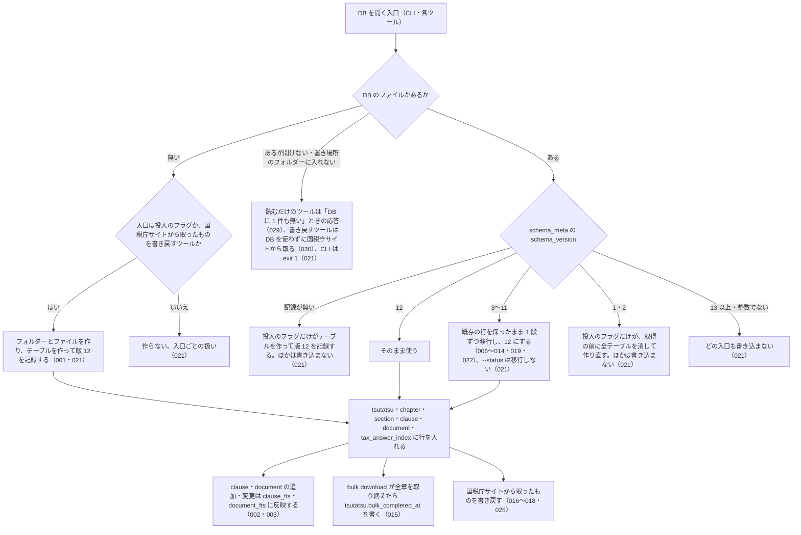

# 差分: db_schema（20261009-db-folder-access-and-tsutatsu-guide）

`specs/current/db_schema/spec.md` に対する差分です。見出しの単位で置き換えます。

- `MODIFIED` の `### SPEC-…` は、current の同じ ID の節（見出しから次の `###` または `##` の手前まで）を、見出しの行（題）も含めて丸ごと置き換える
- 冒頭の「関連する Issue」の末尾に `、#154（置き場所のフォルダーに入る権限が無いときの判定。0.27.0）、#155（ライブ取得に対応していない通達に、実行できない投入のコマンドを案内しない。0.27.0）` を足す
- `## 処理の流れ` は、current の同じ見出しの節を丸ごと置き換える
- 「入力」の表、「できないこと」、「未決」は変えない

## 処理の流れ

DB を開いたときに何が起きるかを示します。図の中の番号は「できること」の仕様 ID の末尾 3 桁です。



## MODIFIED

### SPEC-NTA-DB-SCHEMA-021 DB の状態と入口ごとの扱い

DB を開く入口は、DB の状態によって次のように扱う。「版」は `schema_meta` の `schema_version` の値で、v0.27.0 の版は 12。入口は次の 6 つに分ける。

- 投入: CLI の `--quickstart`・`--bulk-download`・`--bulk-download-all`・`--bulk-download-kaisei`・`--bulk-download-jimu-unei`・`--bulk-download-bunshokaitou`・`--bulk-download-tax-answer`・`--bulk-download-qa`・`--bulk-download-everything`
- 取り直し: CLI の `--refresh-stale=<日数> --apply`
- 一覧: CLI の `--refresh-stale=<日数>`（`--apply` なし）
- 確かめる: CLI の `--status`（cli_status の spec.md）
- 読むだけのツール: `nta_search_tsutatsu`・`nta_search_kaisei_tsutatsu`・`nta_search_jimu_unei`・`nta_search_bunshokaitou`・`nta_search_tax_answer`・`nta_search_qa`・`nta_get_kaisei_tsutatsu`・`nta_get_jimu_unei`・`nta_get_bunshokaitou`・`nta_inspect_pdf_meta`
- 書き戻すツール: `nta_get_tsutatsu`・`nta_get_qa`・`nta_get_tax_answer`（国税庁サイトから取った条項・事例・記事と、目次・タックスアンサーの索引を DB に書く）

`--health-check`・`--check-baseline-drift`・`--help`・`--version` と `resolve_abbreviation` は DB を開かない。

| DB の状態 | 投入 | 取り直し | 一覧 | 確かめる | 読むだけのツール | 書き戻すツール |
| --- | --- | --- | --- | --- | --- | --- |
| ファイルが無い（置き場所のフォルダーも無いときを含む。置き場所のフォルダーに入る権限が無いときは含まず、「開けない」の行） | フォルダーとファイルを作り、テーブルを作って版 12 を記録し、取り込む（001） | 作らない。DB が無いエラーで終了コード 1 | 作らない。DB が無いことを標準エラー出力に出し、標準出力に `[]` を出して終了コード 0 | 作らない。DB が無いことを出して終了コード 0（SPEC-NTA-CLI-STATUS-004） | 作らない。各ツールの「DB に 1 件も無い」ときの応答（注 1）を返し、`hint` は SPEC-NTA-DB-SCHEMA-029 のファイルが無いときの文 | 国税庁サイトから取る。取れたら、フォルダーとファイルを作り、テーブルを作って版 12 を記録し、書き戻す |
| ファイルはあるが版の記録が無い（0 バイトのファイル、`schema_meta` の無い SQLite のファイル） | テーブルを作り、版 12 を記録して取り込む | 書き込まない。ファイルが無いときと同じ | 書き込まない。ファイルが無いときと同じ | 書き込まない。ファイルが無いときと同じ | 書き込まない。注 1 の応答で、`hint` は SPEC-NTA-DB-SCHEMA-029 の版の記録が無いときの文 | 国税庁サイトから取って返す。DB には書かない |
| 版が同じ（12） | 取り込む | 取り直す | 列挙する | 件数を出す（SPEC-NTA-CLI-STATUS-003） | 引く | 引き、無ければ取って書き戻す |
| 版が古く、移行できる（3〜11） | 行を保ったまま 12 に移行してから取り込む（006〜014・019・022） | 移行してから取り直す | 移行してから列挙する | 移行しない。書き込まない。版と、次に開く入口が移行することを出して終了コード 0（SPEC-NTA-CLI-STATUS-005） | 移行してから引く | 移行してから引き、書き戻す |
| 版が古く、移行できない（1・2） | 国税庁サイトを取りに行く前に、標準エラー出力に `  DB の版 (<DB の版>) は移行できないため、作り直します（取り込んだ中身は消えます）` を出し、全テーブルを消して版 12 で作り直してから取り込む | 書き込まない。古い版のエラーで終了コード 1 | 書き込まない。古い版のエラーで終了コード 1 | 書き込まない。古い版のエラーで終了コード 1（SPEC-NTA-CLI-STATUS-006） | 書き込まない。注 1 の応答の `hint` を注 2 の古い版の文にする | 国税庁サイトから取って返す。DB には書かない |
| 版が新しい（13 以上の整数） | 国税庁サイトを取りに行く前に止める。新しい版のエラーで終了コード 1 | 書き込まない。新しい版のエラーで終了コード 1 | 書き込まない。新しい版のエラーで終了コード 1 | 書き込まない。新しい版のエラーで終了コード 1（SPEC-NTA-CLI-STATUS-006） | 書き込まない。注 1 の応答の `hint` を注 2 の新しい版の文にし、`next_actions` に投入の案内を入れない | 国税庁サイトから取って返す。DB には書かない |
| 版を読めない（10 進の整数の文字列でない値。`abc`・空文字・`12abc` など） | 国税庁サイトを取りに行く前に止める。読めない版のエラーで終了コード 1 | 書き込まない。読めない版のエラーで終了コード 1 | 書き込まない。読めない版のエラーで終了コード 1 | 書き込まない。読めない版のエラーで終了コード 1（SPEC-NTA-CLI-STATUS-006） | 書き込まない。注 1 の応答の `hint` を注 2 の読めない版の文にし、`next_actions` に投入の案内を入れない | 国税庁サイトから取って返す。DB には書かない |
| 開けない（SQLite でないファイル、フォルダー、パスの途中が普通のファイル、DB のファイルを読む権限が無い、置き場所のフォルダー（またはパスの途中のフォルダー）に入る権限が無い） | 国税庁サイトを取りに行く前に止める。`[ERROR] DB を開けません: <エラーの文>` で終了コード 1 | 同じ文で終了コード 1 | 同じ文で終了コード 1 | 同じ文で終了コード 1（SPEC-NTA-CLI-STATUS-007） | 書き込まない。注 1 の応答で、`hint` は SPEC-NTA-DB-SCHEMA-029 の開けないときの文にし、`retryable: false` と `detail.cause` を付け、`next_actions` に投入の案内を入れない | DB を使わずに国税庁サイトから取って返す。DB には書かず、MCP サーバーのログに `warn` を出す（SPEC-NTA-DB-SCHEMA-030） |

「開けない」は、次のどちらかのときである。

- DB のパスに何かがあるか、パスの途中が普通のファイルであることを確かめられ、DB として開こうとして失敗した
- 置き場所のフォルダー（またはパスの途中のフォルダー）に入る権限が無く、DB のパスに何があるかを確かめられない（DB のパスの情報を読む（stat）と `EACCES` になる）。DB のファイルがあるかどうかを確かめられないので、ファイルが無くても「開けない」にする。投入のフラグも、入る権限の無いフォルダーの下にはファイルを作れない。v0.26.x では「ファイルが無い」と判定し、読むだけのツール・`--status`・`--refresh-stale` は DB が無いときの扱い、投入のフラグは `[ERROR] DB を開けません` で、入口ごとに扱いが食い違っていた（#154）

入る権限の無いフォルダーで開けないときの `<エラーの文>` は `EACCES: パスの途中のフォルダーに入る権限がありません (<そのフォルダーのパス>)` にする。`<そのフォルダーのパス>` は、DB のパスを上にたどって、あることを確かめられた最も深いフォルダー（入る権限が無いのはこのフォルダー）の絶対パス（SPEC-NTA-DB-SCHEMA-026 の絶対パスと同じ作り方）。CLI はこのパスをそのまま出し、MCP の応答ではホームディレクトリの部分を `~` にする（SPEC-NTA-DB-SCHEMA-029 の `detail.cause`）。

「DB には書かない」「書き込まない」は、ファイル・フォルダー・テーブル・`schema_meta` を作らず、行も書かないことをいう（SQLite が `-wal` / `-shm` のファイルを置くことはある）。国税庁サイトから取った応答の中身は、DB に書いたときと同じである。

「確かめる」入口だけは、版 3〜11 の DB も移行しない。`--status` は DB の場所と中身を確かめるための入口で、確かめただけで DB を書き換えないためである。移行は、次にほかの入口（投入・取り直し・一覧・読むだけのツール・書き戻すツール）が開いたときに行う（houki-hub DECISIONS.md 2026-10-04 の houki-nta-mcp 0.24.0 の (2) は、この入口を除いて当てはまる）。

注 1（読むだけのツールの「DB に 1 件も無い」ときの応答）: `nta_search_tsutatsu` は SPEC-NTA-SEARCH-TSUTATSU-003 の `TSUTATSU_NOT_FOUND`、ほかの検索ツールはその種別の文書が 1 件も無いときの `DOC_NOT_FOUND`、`nta_get_kaisei_tsutatsu`・`nta_get_jimu_unei`・`nta_get_bunshokaitou` は SPEC-NTA-GET-KAISEI-TSUTATSU-001・SPEC-NTA-GET-JIMU-UNEI-001・SPEC-NTA-GET-BUNSHOKAITOU-002、`nta_inspect_pdf_meta` は SPEC-NTA-INSPECT-PDF-META-001。`code` は変えない。

注 2（読むだけのツールの `hint` の文。`<パス>` は MCP サーバーが開いた DB のパス（SPEC-NTA-DB-SCHEMA-028 の形）、`<--quickstart のコマンド>` は `--quickstart` を付けた案内のコマンド（SPEC-NTA-DB-SCHEMA-027））:

| 場面 | `hint` |
| --- | --- |
| 古い版（1・2） | ``ローカル DB（<パス>）の版 (<DB の版>) は古く移行できないため、使っていません。`<--quickstart のコマンド>` などの投入のフラグを実行すると作り直します（取り込んだ中身は消えます）`` |
| 新しい版 | `ローカル DB（<パス>）の版 (<DB の版>) がこの houki-nta-mcp の版 (12) より新しいため、使っていません（DB は変更しません）。houki-nta-mcp を新しい版に更新してください` |
| 読めない版 | ``ローカル DB（<パス>）の版を読めないため (schema_version: <値>)、使っていません（DB は変更しません）。DB ファイルを消してから `<--quickstart のコマンド>` などの投入のフラグを実行してください`` |

CLI のエラーの文は、標準エラー出力に次のとおり出す（`<DB の場所>` は各フラグが出す `DB: ` の行と同じ。`<--quickstart のコマンド>` は SPEC-NTA-DB-SCHEMA-027 の形で、`--db-path` を付けて実行したときは後ろに `--db-path=…` が付く）。

| 場面 | 文 |
| --- | --- |
| DB が無い（取り直し） | `[ERROR] DB がまだありません (<DB の場所>)。<--quickstart のコマンド> か --bulk-download-all で作ってください` |
| DB が無い（一覧） | `[refresh-stale] DB がまだありません (<DB の場所>)。<--quickstart のコマンド> か --bulk-download-all で作ってください` |
| 古い版（1・2） | `[ERROR] DB の版 (<DB の版>) は古く移行できないため使えません。<--quickstart のコマンド> などの投入のフラグを実行すると作り直します（取り込んだ中身は消えます）` |
| 新しい版 | `[ERROR] DB の版 (<DB の版>) がこの houki-nta-mcp の版 (12) より新しいため、DB を変更しません。houki-nta-mcp を新しい版に更新するか、--db-path（MCP サーバーでは HOUKI_NTA_DB_PATH）で別のファイルを指定してください` |
| 読めない版 | `[ERROR] DB の版を読めないため (schema_version: <値>)、DB を変更しません。DB ファイル (<DB の場所>) を消してから <--quickstart のコマンド> などの投入のフラグを実行してください` |

例:

- `schema_version` を `13` に書き換えた DB で `--bulk-download-jimu-unei` を実行すると、国税庁サイトを取りに行かずに新しい版の文を出して終了コード 1 で終わり、`schema_version` は `13` のまま、`document` の行も残る（v0.23.x では全テーブルを消して作り直していた）
- 同じ DB を開いた MCP サーバー（環境変数なし、ホームディレクトリが `/Users/bonji`）で `nta_search_jimu_unei { keyword: "書面添付" }` を呼ぶと、`code: "DOC_NOT_FOUND"` で `hint` は `ローカル DB（~/.cache/houki-nta-mcp/cache.db）の版 (13) がこの houki-nta-mcp の版 (12) より新しいため、…`、DB は変わらない（v0.24.x では `MCP サーバーが開いている DB（/Users/bonji/.cache/houki-nta-mcp/cache.db）の版 (13) が…`）
- DB ファイルの無い場所で `nta_search_qa { keyword: "社内会議" }` を呼んでも、`--refresh-stale=30` を実行しても、`--status` を実行しても、ファイルとフォルダーはできない（v0.23.x までは空の DB ができた）
- DB ファイルの無い場所で `nta_get_tax_answer { no: "6101" }` を呼ぶと、国税庁サイトから記事を返し、DB のファイルができて `document` に `tax-answer`・`6101` の行が入る
- `schema_version` を `abc` に書き換えた DB で `--refresh-stale=30` を実行すると、`[refresh-stale] DB: …` の行の後に読めない版の文を出して終了コード 1（v0.23.x では `UNIQUE constraint failed: schema_meta.key` の例外）
- 環境変数を付けずに、`schema_version` が `2` の DB で `--refresh-stale=30 --apply` を実行すると、`[ERROR] DB の版 (2) は古く移行できないため使えません。npx -y @shuji-bonji/houki-nta-mcp@latest --quickstart などの投入のフラグを実行すると作り直します（取り込んだ中身は消えます）` を出して終了コード 1（v0.24.x では `houki-nta-mcp --quickstart`）。`--db-path=/tmp/old.db` を付けて実行したときのコマンドは `npx -y @shuji-bonji/houki-nta-mcp@latest --quickstart --db-path='/tmp/old.db'`
- `schema_version` が `11` の DB で `--status` を実行すると、`schema_version` は `11` のまま、行も変わらない。その後に `nta_search_qa` を呼ぶと、今までどおり 12 に移行してから引く
- `HOUKI_NTA_DB_PATH` で SQLite でない中身のファイルを指して起動した MCP サーバーで `nta_search_qa { keyword: "社内会議" }` を呼ぶと、`code: "DOC_NOT_FOUND"`・`retryable: false` で、`hint` は SPEC-NTA-DB-SCHEMA-029 の開けないときの文（v0.25.x では `code: "INTERNAL_ERROR"`、`error` は `内部エラーが発生しました: file is not a database`）。同じサーバーで `nta_get_qa { topic: "shohi", category: "02", id: "19" }` を呼ぶと、国税庁サイトから取った事例を返し（`source: "live"`）、ファイルの中身は変わらない（v0.25.x では国税庁サイトに取りに行かずに `INTERNAL_ERROR`）
- `HOUKI_NTA_DB_PATH=/tmp/locked/cache.db`（`/tmp/locked` は `chmod 000` のフォルダー）で `--status` を実行すると、1〜3 行目の後に `[ERROR] DB を開けません: EACCES: パスの途中のフォルダーに入る権限がありません (/tmp/locked)` を出して終了コード 1。`--refresh-stale=30`・`--refresh-stale=30 --apply`・`--bulk-download-qa` も同じ文で終了コード 1。同じ設定で起動した MCP サーバーで `nta_search_qa { keyword: "社内会議" }` を呼ぶと、SPEC-NTA-DB-SCHEMA-029 の開けないときの応答（`code: "DOC_NOT_FOUND"`、`retryable: false`、`detail.cause` は上と同じ文）。`/tmp/locked` の中に `cache.db` があってもなくても同じ（v0.26.x では、`--status` は `  (DB がまだありません — …)` で終了コード 0、`--refresh-stale=30` は `[refresh-stale] DB がまだありません (…)` と `[]` で終了コード 0、`--refresh-stale=30 --apply` は `[ERROR] DB がまだありません (…)` で終了コード 1、`--bulk-download-qa` は `[ERROR] DB を開けません: unable to open database file` で終了コード 1、`nta_search_qa` はファイルが無いときの `hint` と `cli_bulk_download`）

### SPEC-NTA-DB-SCHEMA-027 案内のコマンドは `npx -y @shuji-bonji/houki-nta-mcp@latest <フラグ>` で、DB の場所を決めた設定を同じ形で付ける

MCP の応答と CLI の出力で利用者に実行を勧めるコマンドは、次の形にする。

```
[<前に付ける変数>=<シェルに書くパス> ]npx -y @shuji-bonji/houki-nta-mcp@latest <フラグ>[ --db-path=<シェルに書くパス>]
```

前と後ろに付けるものは、DB の場所の設定（SPEC-NTA-DB-SCHEMA-026）で決める。

| DB の場所の設定 | 前に付けるもの | 後ろに付けるもの |
| --- | --- | --- |
| `既定` | 何も付けない | 何も付けない |
| `--db-path` | 何も付けない | ` --db-path=<DB の絶対パスをシェルに書くパス>` |
| `HOUKI_NTA_DB_PATH` | `HOUKI_NTA_DB_PATH=<DB の絶対パスをシェルに書くパス>` | 何も付けない |
| `XDG_CACHE_HOME` | `XDG_CACHE_HOME=<XDG_CACHE_HOME の値を絶対パスにしたものをシェルに書くパス>` | 何も付けない |

`<フラグ>` には、そのフラグに続ける値も含む（例: `--bulk-download --tsutatsu="消費税法基本通達"`、`--bulk-download-qa --qa-topic=shohi`）。`--db-path` は MCP サーバーでは当てはまらないので、MCP の応答のコマンドの後ろに付くことはない。

シェルに書くパスは、bash・zsh・sh でそのまま動き、MCP の応答に利用者名を出さない形にする。

1. ホームディレクトリの下（SPEC-NTA-DB-SCHEMA-028 の 2〜5 と同じ判定）なら `"$HOME/<残り>"`。`<残り>` に `"`・`$`・`` ` ``・`\`・`!` のどれかを含むときは `"$HOME"'/<残り>'` にし、`<残り>` の `'` は `'\''` にする
2. ホームディレクトリの下でないなら `'<絶対パス>'`。`'` は `'\''` にする

当てはまる箇所:

| 出る場所 | 箇所 | 仕様 ID |
| --- | --- | --- |
| MCP の応答 | `next_actions[]` のうち `action: "cli_bulk_download"` の `example.command` | SPEC-NTA-DB-SCHEMA-029、SPEC-NTA-COMMON-ERRORS-017、SPEC-NTA-GET-TSUTATSU-010 |
| MCP の応答 | 「DB に 1 件も無い」ときの `hint` と、版の合わない DB の `hint` の中のコマンド | SPEC-NTA-DB-SCHEMA-029、021 の注 2 |
| MCP の応答 | DB を開けないときの `hint` の中の `--status` のコマンド | SPEC-NTA-DB-SCHEMA-029 |
| MCP の応答 | 税目を絞って追加する案内のコマンド | SPEC-NTA-SEARCH-QA-005、SPEC-NTA-SEARCH-BUNSHOKAITOU-002 |
| MCP の応答 | 「DB を投入した後に公開された文書は、`<コマンド>` をもう一度実行すると取り込めます」 | SPEC-NTA-GET-KAISEI-TSUTATSU-002、SPEC-NTA-GET-JIMU-UNEI-002、SPEC-NTA-GET-BUNSHOKAITOU-003 |
| MCP の応答 | 取得時点を読めないときの `hint` | SPEC-NTA-COMMON-ERRORS-017 |
| MCP の応答 | `nta_get_tsutatsu` の `hint` の `--bulk-download --tsutatsu="<正式名>"` を付けたコマンド（基本通達 4 種で、候補ページに条項が無いとき。ライブ取得に対応していない通達（SPEC-NTA-GET-TSUTATSU-007）にはコマンドを案内しない） | SPEC-NTA-GET-TSUTATSU-010 |
| MCP の応答 | `freshness.warning` の中のコマンド | SPEC-NTA-SEARCH-RULES-017 |
| CLI の出力 | SPEC-NTA-DB-SCHEMA-021 の CLI のエラーの文の中のコマンド、`--status` の `(DB がまだありません — …)` の行 | SPEC-NTA-DB-SCHEMA-021、SPEC-NTA-CLI-STATUS-004 |

CLI の出力でも同じ形にする（CLI を `HOUKI_NTA_DB_PATH=… npx …` のように 1 回だけ変数を付けて実行した人や、`--db-path` を付けて実行した人が、案内のコマンドをそのまま実行して同じ DB を開けるようにするため）。

次の箇所はこの形にしない: `--help` の使い方（SPEC-NTA-CLI-ENTRY-002）、SPEC-NTA-DB-SCHEMA-029 の「その種別が 1 件も無い」ときの文の「投入したシェルで `npx -y @shuji-bonji/houki-nta-mcp@latest --status` を実行し」（MCP サーバーの設定ではなく、投入したシェルの設定で開く DB を確かめるためのコマンドなので、変数も `--db-path` も付けない。029 の DB を開けないときの文の `--status` は、MCP サーバーが開こうとした DB を確かめるためのものなので、この形にする）、`--quickstart` が終わった後の「次に試すこと」の行（SPEC-NTA-CLI-BULK-DOWNLOAD-007）、tools/list のツールの説明（フラグだけを書いている）、フラグだけを書いた文（`nta_get_tsutatsu` の `ARTICLE_NOT_FOUND` の `` `--bulk-download` で再取得してください``、SPEC-NTA-INSPECT-PDF-META-001 の DB はあるがその文書が無いときの `hint`、SPEC-NTA-DB-SCHEMA-021 の CLI のエラーの文の `か --bulk-download-all で作ってください` の `--bulk-download-all`）。

例（ホームディレクトリが `/Users/bonji`）:

| 起動・実行したときの設定 | `--bulk-download-qa` の案内のコマンド |
| --- | --- |
| 環境変数なし | `npx -y @shuji-bonji/houki-nta-mcp@latest --bulk-download-qa` |
| `HOUKI_NTA_DB_PATH=/Users/bonji/.cache/houki-nta-mcp/cache.dev.db` | `HOUKI_NTA_DB_PATH="$HOME/.cache/houki-nta-mcp/cache.dev.db" npx -y @shuji-bonji/houki-nta-mcp@latest --bulk-download-qa` |
| `HOUKI_NTA_DB_PATH=/tmp/x/cache.db` | `HOUKI_NTA_DB_PATH='/tmp/x/cache.db' npx -y @shuji-bonji/houki-nta-mcp@latest --bulk-download-qa` |
| `XDG_CACHE_HOME=/Users/bonji/Library/Caches` | `XDG_CACHE_HOME="$HOME/Library/Caches" npx -y @shuji-bonji/houki-nta-mcp@latest --bulk-download-qa` |
| CLI に `--db-path=/Users/bonji/dev$1/cache.db`（`'…'` で囲んで渡す） | `npx -y @shuji-bonji/houki-nta-mcp@latest --bulk-download-qa --db-path="$HOME"'/dev$1/cache.db'` |

v0.24.x のコマンドは、どの場合も `houki-nta-mcp --bulk-download-qa`（グローバルにインストールしていないと `command not found`、`npx houki-nta-mcp` は npm に無い名前で 404。houki-egov-mcp #108 の 2 と同じ）。

### SPEC-NTA-DB-SCHEMA-029 読むだけのツールの「DB に 1 件も無い」ときの `hint` は、DB の状態ごとに先頭の文を決め、開こうとしたパスを入れる

読むだけのツール（SPEC-NTA-DB-SCHEMA-021 の入口の分け方）が「DB に 1 件も無い」ときの応答（021 の注 1）を返すとき、`hint` は DB の状態ごとに次の表の文にする。`code`・`error` は変えない。`next_actions` から `cli_bulk_download` を外す場面は、表の後に書く。`<パス>` は開こうとした DB のパス（SPEC-NTA-DB-SCHEMA-028 の形）、`<コマンド>` は下の表のフラグを付けた案内のコマンド（SPEC-NTA-DB-SCHEMA-027。`HOUKI_NTA_DB_PATH` などで DB の場所を決めて起動したときは、その変数を前に付けた形）、`<種別>` は下の表の名前、`<--status のコマンド>` は `--status` を付けた案内のコマンド（027。MCP サーバーと同じ DB の場所の設定を付けた形）。

| DB の状態 | `hint` |
| --- | --- |
| ファイルが無い（DB の場所の設定が `既定` か `XDG_CACHE_HOME`） | ``ローカル DB（<パス>）がありません。`<コマンド>` で<種別>を投入してください`` |
| ファイルが無い（DB の場所の設定が `HOUKI_NTA_DB_PATH`） | ``HOUKI_NTA_DB_PATH が指すファイル（<パス>）がありません。HOUKI_NTA_DB_PATH を投入した DB のファイルに直すか、`<コマンド>` でこのパスに<種別>を投入してください`` |
| ファイルはあるが版の記録が無い（0 バイトのファイル、`schema_meta` の無い SQLite のファイル） | ``ローカル DB（<パス>）にはまだ何も投入されていません。`<コマンド>` で<種別>を投入してください`` |
| 版が古い・新しい・読めない | SPEC-NTA-DB-SCHEMA-021 の注 2 の文 |
| 開けない（SQLite でないファイル、フォルダー、パスの途中が普通のファイル、DB のファイルを読む権限が無い、置き場所のフォルダー（またはパスの途中のフォルダー）に入る権限が無い） | ``ローカル DB（<パス>）を開けません。パスがフォルダーを指していないか、途中に普通のファイルが無いか、読む権限があるか、SQLite の DB のファイルかを確かめてください（HOUKI_NTA_DB_PATH を設定しているときはその値を直します）。`<--status のコマンド>` を実行すると、開けない理由が出ます`` |
| DB は使えるが、その種別が 1 件も無い（他の種別だけがある DB を含む） | 文書系の 8 ツール（`nta_search_tsutatsu`・`nta_inspect_pdf_meta` を除く）は ``ローカル DB（<パス>）に<種別>（doc_type="<doc_type>"）が入っていません。`<コマンド>` で投入してください。投入したはずの場合は、投入したシェルで `npx -y @shuji-bonji/houki-nta-mcp@latest --status` を実行し、表示される DB がこの DB と同じか確かめてください（MCP クライアントから起動したサーバーは、シェルの環境変数 HOUKI_NTA_DB_PATH・XDG_CACHE_HOME を受け継がないことがあります）``。`nta_search_tsutatsu` は SPEC-NTA-SEARCH-TSUTATSU-003、`nta_inspect_pdf_meta` は SPEC-NTA-INSPECT-PDF-META-001 の文 |

| ツール | `<種別>` | フラグ | 「DB に 1 件も無い」ときの応答 |
| --- | --- | --- | --- |
| `nta_search_tsutatsu` | 基本通達 | `--bulk-download-all` | SPEC-NTA-SEARCH-TSUTATSU-003 |
| `nta_search_qa` | 質疑応答事例 | `--bulk-download-qa` | SPEC-NTA-SEARCH-QA-001 |
| `nta_search_tax_answer` | タックスアンサー | `--bulk-download-tax-answer` | SPEC-NTA-SEARCH-TAX-ANSWER-001 |
| `nta_search_kaisei_tsutatsu`・`nta_get_kaisei_tsutatsu` | 改正通達 | `--bulk-download-kaisei` | SPEC-NTA-SEARCH-KAISEI-TSUTATSU-001、SPEC-NTA-GET-KAISEI-TSUTATSU-001 |
| `nta_search_jimu_unei`・`nta_get_jimu_unei` | 事務運営指針 | `--bulk-download-jimu-unei` | SPEC-NTA-SEARCH-JIMU-UNEI-001、SPEC-NTA-GET-JIMU-UNEI-001 |
| `nta_search_bunshokaitou`・`nta_get_bunshokaitou` | 文書回答事例 | `--bulk-download-bunshokaitou` | SPEC-NTA-SEARCH-BUNSHOKAITOU-001、SPEC-NTA-GET-BUNSHOKAITOU-002 |
| `nta_inspect_pdf_meta` | `docType` の種別（`kaisei` は改正通達、`jimu-unei` は事務運営指針、`bunshokaitou` は文書回答事例、`tax-answer` はタックスアンサー） | `docType` の投入のフラグ（`--bulk-download-<docType>`） | SPEC-NTA-INSPECT-PDF-META-001 |

`next_actions` の `cli_bulk_download` の `example.command` は、どの状態でも上の `<コマンド>`。版が新しい・読めない DB では、今までどおり `cli_bulk_download` を入れない（021）。

DB を開けないときは、`hint` のほかに次のようにする（v0.25.x では SPEC-NTA-COMMON-ERRORS-006 の `INTERNAL_ERROR` で、`hint` は `バグの可能性があります。再現手順を添えて GitHub issue でご報告ください` だった）。

- `code` は表の「DB に 1 件も無い」ときの応答のもの（`DOC_NOT_FOUND`、`nta_search_tsutatsu` は `TSUTATSU_NOT_FOUND`）。`error` も変えない
- `retryable: false` を付ける（DB のファイルを直すまで、同じ呼び出しの結果は変わらない）。ほかの状態の応答には、今までどおり `retryable` を付けない
- `next_actions` に `cli_bulk_download` を入れない（投入のフラグも、同じ DB では国税庁サイトを取りに行く前に `[ERROR] DB を開けません` で止まる。021）。ほかの action はそのまま残し、残りが無ければ `next_actions` を付けない
- `detail.cause` に、開けない理由の文を入れる。`--status` が `[ERROR] DB を開けません: ` の後に出す文（SPEC-NTA-CLI-STATUS-007）と同じ文で、文の中に MCP サーバーのホームディレクトリに `/` が続く部分があれば、そのホームディレクトリを `~` にする（028 の 3〜5 と同じ判定）。SQLite でないファイルは `file is not a database`、パスの途中が普通のファイルは `ENOTDIR: パスの途中が普通のファイルです (<その普通のファイルのパス>)`、置き場所のフォルダー（またはパスの途中のフォルダー）に入る権限が無いときは `EACCES: パスの途中のフォルダーに入る権限がありません (<そのフォルダーのパス>)`（SPEC-NTA-DB-SCHEMA-021）。フォルダーと、読む権限が無いファイルの文は SQLite と OS が決めるので、この仕様では固定しない
- `hint` には開けない理由の文を入れない。理由は `detail.cause` と、`hint` が案内する `--status` で確かめる

置き場所のフォルダー（またはパスの途中のフォルダー）に入る権限が無いときは、DB のファイルがあるかどうかによらず、この開けないときの応答にする（021。v0.26.x では、ファイルが無いときの `hint` と `cli_bulk_download` を返していた。#154）。

例（ホームディレクトリが `/Users/bonji`）:

- 環境変数を付けずに起動し、`~/.cache/houki-nta-mcp/cache.db` が無いときに `nta_search_qa { keyword: "社内会議" }` を呼ぶと、`code: "DOC_NOT_FOUND"`、`hint` は ``ローカル DB（~/.cache/houki-nta-mcp/cache.db）がありません。`npx -y @shuji-bonji/houki-nta-mcp@latest --bulk-download-qa` で質疑応答事例を投入してください``、`next_actions[0].example.command` は `npx -y @shuji-bonji/houki-nta-mcp@latest --bulk-download-qa`（v0.24.x では `hint` が `MCP サーバーが開いている DB（/Users/bonji/.cache/houki-nta-mcp/cache.db）に質疑応答事例（doc_type="qa-jirei"）が入っていません。…` で、ファイルがあるかどうかを区別せず、コマンドは `houki-nta-mcp --bulk-download-qa`）
- `HOUKI_NTA_DB_PATH=/Users/bonji/.cache/houki-nta-mcp/cache.v12.db` で起動し、そのファイルが無いときに `nta_get_jimu_unei { docId: "shotoku/000101" }` を呼ぶと、`hint` は ``HOUKI_NTA_DB_PATH が指すファイル（~/.cache/houki-nta-mcp/cache.v12.db）がありません。HOUKI_NTA_DB_PATH を投入した DB のファイルに直すか、`HOUKI_NTA_DB_PATH="$HOME/.cache/houki-nta-mcp/cache.v12.db" npx -y @shuji-bonji/houki-nta-mcp@latest --bulk-download-jimu-unei` でこのパスに事務運営指針を投入してください``
- 0 バイトの `cache.db` で `nta_search_tsutatsu { keyword: "役員" }` を呼ぶと、`code: "TSUTATSU_NOT_FOUND"`、`hint` は ``ローカル DB（~/.cache/houki-nta-mcp/cache.db）にはまだ何も投入されていません。`npx -y @shuji-bonji/houki-nta-mcp@latest --bulk-download-all` で基本通達を投入してください``
- 環境変数を付けずに起動し、タックスアンサーだけを入れた版 12 の DB で `nta_search_qa { keyword: "社内会議" }` を呼ぶと、`hint` は ``ローカル DB（~/.cache/houki-nta-mcp/cache.db）に質疑応答事例（doc_type="qa-jirei"）が入っていません。`npx -y @shuji-bonji/houki-nta-mcp@latest --bulk-download-qa` で投入してください。投入したはずの場合は、投入したシェルで `npx -y @shuji-bonji/houki-nta-mcp@latest --status` を実行し、…`` で始まる（v0.24.x では ``MCP サーバーが開いている DB（/Users/bonji/.cache/houki-nta-mcp/cache.db）に質疑応答事例（doc_type="qa-jirei"）が入っていません。`houki-nta-mcp --bulk-download-qa` で投入してください。…``）
- `HOUKI_NTA_DB_PATH=/Users/bonji/.cache/houki-nta-mcp/cache.db` で起動し、そのファイルが SQLite でない中身のときに `nta_search_qa { keyword: "社内会議" }` を呼ぶと、`code: "DOC_NOT_FOUND"`、`retryable: false`、`hint` は ``ローカル DB（~/.cache/houki-nta-mcp/cache.db）を開けません。パスがフォルダーを指していないか、途中に普通のファイルが無いか、読む権限があるか、SQLite の DB のファイルかを確かめてください（HOUKI_NTA_DB_PATH を設定しているときはその値を直します）。`HOUKI_NTA_DB_PATH="$HOME/.cache/houki-nta-mcp/cache.db" npx -y @shuji-bonji/houki-nta-mcp@latest --status` を実行すると、開けない理由が出ます``、`detail.cause` は `file is not a database`、`next_actions` は無い。DB のファイルは変わらない（v0.25.x では `code: "INTERNAL_ERROR"`、`error` は `内部エラーが発生しました: file is not a database`、`next_actions` は無かった）
- 環境変数を付けずに起動し、`~/.cache/houki-nta-mcp/cache.db` がフォルダーのときに `nta_search_tsutatsu { keyword: "役員" }` を呼ぶと、`code: "TSUTATSU_NOT_FOUND"`、`retryable: false`、`hint` は ``ローカル DB（~/.cache/houki-nta-mcp/cache.db）を開けません。…`npx -y @shuji-bonji/houki-nta-mcp@latest --status` を実行すると、開けない理由が出ます``、`next_actions` は無い
- `HOUKI_NTA_DB_PATH=/Users/bonji/plain/cache.db`（`/Users/bonji/plain` は普通のファイル）で起動し、`nta_get_jimu_unei { docId: "shotoku/000101" }` を呼ぶと、`code: "DOC_NOT_FOUND"`、`retryable: false`、`detail.cause` は `ENOTDIR: パスの途中が普通のファイルです (~/plain)`。フォルダーの `plain` は作られない
- `HOUKI_NTA_DB_PATH=/Users/bonji/locked/cache.db`（`/Users/bonji/locked` は `chmod 000` のフォルダー）で起動し、`nta_search_qa { keyword: "社内会議" }` を呼ぶと、`code: "DOC_NOT_FOUND"`、`retryable: false`、`hint` は ``ローカル DB（~/locked/cache.db）を開けません。…`HOUKI_NTA_DB_PATH="$HOME/locked/cache.db" npx -y @shuji-bonji/houki-nta-mcp@latest --status` を実行すると、開けない理由が出ます``、`detail.cause` は `EACCES: パスの途中のフォルダーに入る権限がありません (~/locked)`、`next_actions` は無い。`~/locked` の中に `cache.db` があってもなくても同じ（v0.26.x では `hint` が ``HOUKI_NTA_DB_PATH が指すファイル（~/locked/cache.db）がありません。…`` で、`next_actions` は `cli_bulk_download`）
- タックスアンサーが 1 件も無い DB（版 12）で `nta_inspect_pdf_meta { docType: "tax-answer", docId: "6101" }` を呼ぶと、DB はあるので SPEC-NTA-INSPECT-PDF-META-001 の文。ファイルが無いときは ``ローカル DB（~/.cache/houki-nta-mcp/cache.db）がありません。`npx -y @shuji-bonji/houki-nta-mcp@latest --bulk-download-tax-answer` でタックスアンサーを投入してください``

### SPEC-NTA-DB-SCHEMA-030 書き戻すツールは、DB を開けないときも DB を使わずに国税庁サイトから取って返し、DB に書かないことを MCP サーバーのログに `warn` で残す

書き戻すツール（`nta_get_tsutatsu`・`nta_get_qa`・`nta_get_tax_answer`。SPEC-NTA-DB-SCHEMA-021 の入口の分け方）は、DB を開けない（021 の開けない行）とき、例外にせず次のとおりにする。

- DB に何も入っていないものとして扱う。DB の行を引かず、DB に書かない（ファイル・フォルダー・テーブルも作らない）
- 国税庁サイトから取る（SPEC-NTA-GET-TSUTATSU-006・014、SPEC-NTA-GET-QA-005、SPEC-NTA-GET-TAX-ANSWER-005・016）。取れたら、DB を使えるときに国税庁サイトから取ったときと同じ応答を返す（`source: "live"`）。目次（`tsutatsu_toc`）とタックスアンサーの索引も保存しないので、呼び出しのたびに国税庁サイトから取り直す
- 国税庁サイトとの通信の失敗（`SOURCE_*`）、ページが無い（`DOC_NOT_FOUND`）、ページの解析の失敗（`INTERNAL_ERROR`）、候補ページに条項が無い（`ARTICLE_NOT_FOUND`）は、DB を使えるときと同じ応答を返す。ただし `next_actions` に `cli_bulk_download` を入れない（SPEC-NTA-GET-TSUTATSU-010）
- 国税庁サイトに取りに行く先の無い通達（SPEC-NTA-GET-TSUTATSU-007）は、DB を開けるときと同じ 007 の応答（今は取り込めないことを書いた `hint`。`next_actions` は無い）にする。SPEC-NTA-DB-SCHEMA-029 の開けないときの応答（`retryable: false`・`detail.cause`）にはしない（v0.26.x では 029 の開けないときの応答だった）。DB を開けないことは、下の `warn` の行で残る
- 引数の検査と略称辞書で返す応答（`INVALID_ARGUMENT`・`ABBREVIATION_NOT_FOUND`・`OUT_OF_SCOPE` など）は、DB を開く前に返すので変わらない
- DB を開こうとした呼び出しごとに、MCP サーバーの標準エラー出力に `warn` の JSON の行を 1 行出す。国税庁サイトから取れたかどうかによらない。保存したタックスアンサーの索引は読みに行かないので、SPEC-NTA-GET-TAX-ANSWER-018 の `warn` は出さない

ログの行は、`level` が `warn`、`scope` が呼んだツールの名前、`msg` が `ローカル DB を開けないため、DB を使わずに国税庁サイトから取ります。取った内容は DB に書きません（DB: <DB の絶対パス>）`、`meta` が `{ db_path: "<DB の絶対パス>", cause: "<開けない理由の文>" }`。`<DB の絶対パス>` は SPEC-NTA-DB-SCHEMA-026 の絶対パスで、ホームディレクトリを `~` に置き換えない（SPEC-NTA-GET-TAX-ANSWER-018 のログと同じ）。`<開けない理由の文>` は 029 の `detail.cause` と同じ文で、ホームディレクトリを `~` に置き換えない。

例: `HOUKI_NTA_DB_PATH` で SQLite でない中身のファイルを指して起動した MCP サーバーで `nta_get_tax_answer { no: "6101", format: "json" }` を呼ぶと、索引と記事を国税庁サイトから取り、記事を返す（`source: "live"`、`taxAnswer.no: "6101"`、`isError` は無い）。標準エラー出力の `warn` は `scope` が `nta_get_tax_answer` の 1 行で、`meta.cause` は `file is not a database`。ファイルの大きさと中身は変わらない。同じ番号でもう一度呼ぶと、DB から返さずに、索引と記事をもう一度取り、同じ `warn` を出す（v0.25.x では国税庁サイトに取りに行かずに `INTERNAL_ERROR`、`error` は `内部エラーが発生しました: file is not a database`）。同じサーバーで `nta_get_tsutatsu { name: "電帳法取通", clause: "4-1" }` を呼ぶと、`code: "TSUTATSU_NOT_FOUND"` で、`hint` は SPEC-NTA-GET-TSUTATSU-007 の今は取り込めないことの文、`retryable` と `detail` は付かず、`next_actions` は無い。標準エラー出力には `scope` が `nta_get_tsutatsu` の `warn` の行を出す（v0.26.x では `retryable: false` で、`hint` は ``ローカル DB（<パス>）を開けません。…`` で始まっていた）。

置き場所のフォルダーに入る権限が無いとき（SPEC-NTA-DB-SCHEMA-021 の開けない行）も同じで、`meta.cause` は `EACCES: パスの途中のフォルダーに入る権限がありません (<そのフォルダーの絶対パス>)`（v0.26.x では「ファイルが無い」と判定し、国税庁サイトから取った後に DB に書こうとして書けず、`warn` も出さなかった）。
