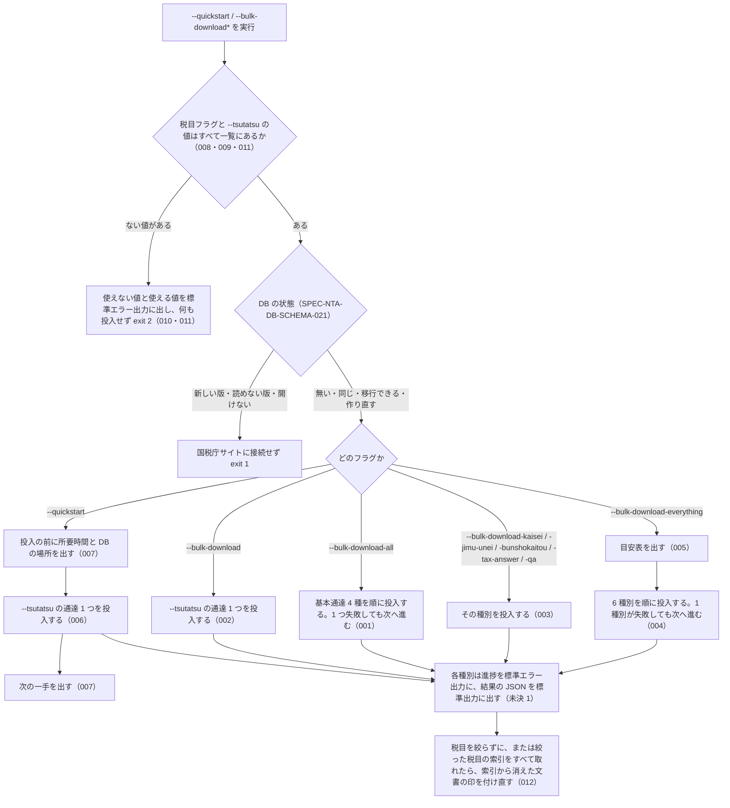

# 機能: cli_bulk_download（国税庁サイトから通達と文書を取得してローカル DB に入れる）

- 機能 ID: NTA
- 種類: CLI
- 版: current
- 承認日: 2026-09-29（PR #103）。差分 `20260930-cli-db-undecided-to-issues` は 2026-09-30（PR #114）。差分 `20261003-source-paths` は 2026-10-03（PR #134）。差分 `20261003-db-cli` は 2026-10-04（PR #135）。差分 `20261006-db-failure-paths` は 2026-10-06（PR #152）
- 起こした元: v0.21.2 の `src/cli.ts`、`src/constants.ts`（`TSUTATSU_URL_ROOTS`・`QA_TOPICS`・`TAX_ANSWER_FOLDER_MAP`・`BUNSHO_MAIN_TAXONOMIES`・`BUNSHO_TAXONOMY_GROUPS`）、`src/services/bulk-downloader.ts`、`src/services/kaisei-bulk-downloader.ts`、`src/services/jimu-unei-bulk-downloader.ts`、`src/services/bunshokaitou-bulk-downloader.ts`、`src/services/tax-answer-bulk-downloader.ts`、`src/services/qa-bulk-downloader.ts`、`src/services/index-status.ts`、`src/cli.test.ts`
- 関連する Issue: houki-nta-mcp #23（投入していない種別の検索は `DOC_NOT_FOUND`）、#25（税目フラグの値の検査）、#30（索引から消えた文書の印）、#35（`--quickstart`）、#54（`bulk_completed_at`）、#106（--tsutatsu の値と終了コード）、#110（税目を絞った投入での索引から消えた文書の印）、#128（タックスアンサーの索引の保存）、#145（タックスアンサーの索引を保存できないとき。0.26.0）

この文書は「このコマンドは何をするか」を書きます。どう実装しているか（関数名・テーブル名）は書きません。DB に入った後の約束は db_schema、取り直し（`--refresh`）は cli_refresh の spec.md に書きます。

## アクター

- 利用者（ターミナルから `houki-nta-mcp --quickstart` や `--bulk-download-*` を実行する人）。国税庁サイトから基本通達の条項と 5 種別の文書を取得し、ローカル DB に入れる。入れた DB は `nta_search_*`（検索は DB が無いと `TSUTATSU_NOT_FOUND` / `DOC_NOT_FOUND` になる）と `nta_get_*`（DB にあれば国税庁サイトに取りに行かない）が引く

## 入力

| フラグ                         | 必須        | 内容                                                                                                                                                                                                                     |
| ------------------------------ | ----------- | ------------------------------------------------------------------------------------------------------------------------------------------------------------------------------------------------------------------------ |
| `--quickstart`                 | どれか 1 つ | `--tsutatsu` の通達 1 つ（既定: 消費税法基本通達）だけを投入する。中身は `--bulk-download` と同じで、前後に所要時間と次の一手を出す                                                                                      |
| `--bulk-download`              | どれか 1 つ | `--tsutatsu` の通達 1 つを投入する                                                                                                                                                                                       |
| `--bulk-download-all`          | どれか 1 つ | 基本通達 4 種（消費税法基本通達・所得税基本通達・法人税基本通達・相続税法基本通達）を順に投入する                                                                                                                        |
| `--bulk-download-kaisei`       | どれか 1 つ | 4 通達分の改正通達を投入する                                                                                                                                                                                             |
| `--bulk-download-jimu-unei`    | どれか 1 つ | 事務運営指針を投入する                                                                                                                                                                                                   |
| `--bulk-download-bunshokaitou` | どれか 1 つ | 文書回答事例を投入する                                                                                                                                                                                                   |
| `--bulk-download-tax-answer`   | どれか 1 つ | タックスアンサーを投入する                                                                                                                                                                                               |
| `--bulk-download-qa`           | どれか 1 つ | 質疑応答事例を投入する                                                                                                                                                                                                   |
| `--bulk-download-everything`   | どれか 1 つ | 通達本体（4 種）→ 改正通達 → 事務運営指針 → 文書回答事例 → タックスアンサー → 質疑応答事例 の 6 種別を順に投入する                                                                                                       |
| `--tsutatsu=<正式名>`          | 任意        | `--quickstart` / `--bulk-download` の通達。既定は `消費税法基本通達`。投入できるのは基本通達 4 種の正式名（ほかの値は SPEC-NTA-CLI-BULK-DOWNLOAD-011）                                                                                                      |
| `--bunsho-taxonomy=<csv>`      | 任意        | 文書回答事例の税目の絞り込み。値は `shotoku` / `gensen` / `joto-sanrin` / `sozoku` / `zoyo` / `hyoka` / `hojin` / `shohi` / `shozei` / `sonota`。国税局の別表記 `souzoku` / `gensenshotoku` / `joto_sanrin` も受け付ける |
| `--tax-answer-taxonomy=<csv>`  | 任意        | タックスアンサーの税目の絞り込み。値は国税庁のタックスアンサーの索引にある税目フォルダ 13 個: `shotoku` / `gensen` / `joto` / `sozoku` / `zoyo` / `hyoka` / `hojin` / `shohi` / `inshi` / `hotei` / `fufuku` / `saigai` / `osirase`（2026-10-03 JST の索引で確かめた値）。国税庁の索引にこの一覧に無い税目フォルダが現れても、`--tax-answer-taxonomy` を付けない投入では取り込む。絞り込みに使えるのはこの一覧の値だけ |
| `--qa-topic=<csv>`             | 任意        | 質疑応答事例の税目の絞り込み。値は `shotoku` / `gensen` / `joto` / `sozoku` / `hyoka` / `hojin` / `shohi` / `inshi` / `hotei`                                                                                            |
| `--refresh`                    | 任意        | 条件付き取得を使わずに全部取り直す（cli_refresh）                                                                                                                                                                        |
| `--db-path=<path>`             | 任意        | 投入先の DB ファイル（cli_entry）                                                                                                                                                                                        |

投入のフラグは 1 回の実行で 1 つだけ。一緒に使えるフラグは cli_entry の SPEC-NTA-CLI-ENTRY-007。DB の版による扱いは SPEC-NTA-DB-SCHEMA-021

## 処理の流れ

実行してから終わるまでに、何をどの順で行うかを示します。図の中の番号は「できること」の仕様 ID の末尾 3 桁です。



## できること

### SPEC-NTA-CLI-BULK-DOWNLOAD-001 `--bulk-download-all` は基本通達 4 種を順に投入する

`--bulk-download-all` は、消費税法基本通達・所得税基本通達・法人税基本通達・相続税法基本通達の 4 通達を順に投入する。1 通達が失敗しても次の通達へ進み、最後に通達ごとの結果（`formalName`・`status`・`detail`）をまとめて出す。`--bulk-download` は同時に選ばれない。

### SPEC-NTA-CLI-BULK-DOWNLOAD-002 `--bulk-download` は `--tsutatsu` の通達 1 つを差分更新で投入する

`--bulk-download` は、`--tsutatsu=<正式名>` の通達（省略すると `消費税法基本通達`）1 つを投入する。`--refresh` を付けないときは差分更新（前に取り込んだ節は条件付き取得で確かめ、変わっていない節は入れ直さない。cli_refresh の spec.md）である。例: `--bulk-download --tsutatsu=所得税基本通達 --db-path=/tmp/cache.db` は、`/tmp/cache.db` に所得税基本通達を投入する。

### SPEC-NTA-CLI-BULK-DOWNLOAD-003 文書系 5 種別のフラグは、その種別を差分更新で投入する

`--bulk-download-kaisei`（改正通達）・`--bulk-download-jimu-unei`（事務運営指針）・`--bulk-download-bunshokaitou`（文書回答事例）・`--bulk-download-tax-answer`（タックスアンサー）・`--bulk-download-qa`（質疑応答事例）は、それぞれの種別を投入する。`--refresh` を付けないときは差分更新である。改正通達は 4 通達分の索引を順に取り、1 通達が失敗しても次へ進む。

### SPEC-NTA-CLI-BULK-DOWNLOAD-004 `--bulk-download-everything` は 6 種別を順に投入する

`--bulk-download-everything` は、通達本体（`--bulk-download-all` と同じ 4 通達）→ 改正通達 → 事務運営指針 → 文書回答事例 → タックスアンサー → 質疑応答事例 の順に、6 種別すべてを投入する。1 種別が失敗しても次の種別へ進む（失敗した種別は DB に入らないので、その種別の検索は `DOC_NOT_FOUND` を返す）。`--refresh` を付けると 6 種別すべてを取り直す（SPEC-NTA-CLI-REFRESH-003）。

### SPEC-NTA-CLI-BULK-DOWNLOAD-005 `--bulk-download-everything` は開始時に種別ごとの目安表を出す

`--bulk-download-everything` は投入を始める前に、標準エラー出力に 6 種別（通達本体・改正通達・事務運営指針・文書回答事例・タックスアンサー・質疑応答事例）の件数と所要時間の目安を並べた表を出す。表の先頭は `合計 約 100 分` と、税目フラグで短くできることの案内、末尾は `--quickstart` を先に使う案内である。

### SPEC-NTA-CLI-BULK-DOWNLOAD-006 `--quickstart` は通達 1 つだけを差分更新で投入する

`--quickstart` は、`--tsutatsu=<正式名>` の通達（省略すると `消費税法基本通達`）1 つだけを、`--bulk-download` と同じ差分更新で投入する。ほかの種別は投入しない。例: `--quickstart --tsutatsu=所得税基本通達` は所得税基本通達 1 つを投入する。

### SPEC-NTA-CLI-BULK-DOWNLOAD-007 `--quickstart` は実行前と完了後に、所要時間と次の一手を標準エラー出力に出す

`--quickstart` は、投入の前に `[quickstart] まず <通達> 1 本だけを投入します（約 3〜5 分）` と DB の場所、終わると `nta_search_tsutatsu` と `nta_get_tsutatsu` が使えることを出す。投入の後に `[quickstart] 完了しました。次に試すこと:` に続けて、Claude からの呼び出し例（`nta_search_tsutatsu { "keyword": "インボイス" }`）、別の通達を足す `--bulk-download --tsutatsu=…`、`--bulk-download-all`、`--bulk-download-everything` を出す。

### SPEC-NTA-CLI-BULK-DOWNLOAD-008 税目フラグはコンマ区切りの値を読み、一覧にあるものだけを絞り込みに使う

`--bunsho-taxonomy=<csv>`・`--tax-answer-taxonomy=<csv>`・`--qa-topic=<csv>` は、値をコンマで分けて読む。各フラグの一覧（入力の表）にある値は絞り込みに使い、無い値は「使えない値」として集める（SPEC-NTA-CLI-BULK-DOWNLOAD-010）。一覧はフラグごとに別で、質疑応答事例の税目は `--qa-topic` の一覧で判定する（文書回答事例にある `zoyo` は `--qa-topic` では使えない）。

例: `--bunsho-taxonomy=shotoku,hojin` は `shotoku`・`hojin` に絞り、使えない値は無い。`--tax-answer-taxonomy=shohi,zzz --qa-topic=shohi,ZZZ` は、どちらも `shohi` に絞り、`zzz`・`ZZZ` を使えない値として集める。

### SPEC-NTA-CLI-BULK-DOWNLOAD-009 `--bunsho-taxonomy` の国税局の別表記は本庁の表記に直す

`--bunsho-taxonomy` に国税局の別表記を渡すと、本庁の表記に直してから絞り込みに使う。`souzoku` → `sozoku`、`gensenshotoku` → `gensen`、`joto_sanrin` → `joto-sanrin`。例: `--bunsho-taxonomy=souzoku,gensenshotoku,joto_sanrin` は `sozoku`・`gensen`・`joto-sanrin` に絞る。

### SPEC-NTA-CLI-BULK-DOWNLOAD-010 税目フラグに一覧に無い値があれば、何も投入せずに exit 2 で終わる

税目フラグの値に一覧に無いものが 1 つでもあれば（複数指定で 1 つだけ誤っているときを含む）、国税庁サイトを取りに行かず、DB を開かず、MCP サーバーも起動せずに、終了コード 2 で終わる。標準エラー出力に、使えない値 1 つにつき 1 行、`[houki-nta-mcp] <フラグ>="<値>" は使えません。使える値: <一覧>` を出す。`--bunsho-taxonomy` では続けて `（国税局の別表記 souzoku・gensenshotoku・joto_sanrin も使えます）` を付ける。終了コード 2 は、cli_entry の引数の誤り（SPEC-NTA-CLI-ENTRY-006〜008）と同じである（v0.23.x までは 1。#106）。

例: `--bulk-download-bunshokaitou --bunsho-taxonomy=zzz` は `--bunsho-taxonomy="zzz" は使えません` と `shotoku` を含む一覧を出して終了コード 2。`--bulk-download-qa --qa-topic=shohi,zzz` も投入せず終了コード 2。

### SPEC-NTA-CLI-BULK-DOWNLOAD-011 `--tsutatsu` が基本通達 4 種の正式名でなければ、何も投入せずに exit 2 で終わる

`--tsutatsu=<値>` の値が `消費税法基本通達`・`所得税基本通達`・`法人税基本通達`・`相続税法基本通達` のどれでもないときは、国税庁サイトを取りに行かず、DB を開かず、MCP サーバーも起動せずに、標準エラー出力に `[houki-nta-mcp] --tsutatsu="<値>" は使えません。使える値: 消費税法基本通達, 所得税基本通達, 法人税基本通達, 相続税法基本通達` を出して終了コード 2 で終わる（SPEC-NTA-CLI-BULK-DOWNLOAD-010 と同じ形）。略称（`消基通` など）も使えない値として扱う。

例: `--bulk-download --tsutatsu=国税通則法基本通達` は上の文を出して終了コード 2 で、DB のファイルはできない（v0.23.x では DB を開いた後に `[server] fatal error` のログを出して終了コード 1 だった。#106）。`--quickstart --tsutatsu=消基通` も同じ。

### SPEC-NTA-CLI-BULK-DOWNLOAD-012 税目を絞った投入でも、絞った税目の索引をすべて取れたときは、その税目の文書に限って索引から消えた文書の印を付け直す

`--bulk-download-bunshokaitou --bunsho-taxonomy=<csv>`・`--bulk-download-tax-answer --tax-answer-taxonomy=<csv>`・`--bulk-download-qa --qa-topic=<csv>`（`--bulk-download-everything` に付けたときを含む）は、絞った税目の索引をすべて取れたときは、DB のその種別の行のうち `taxonomy` が絞った税目の行についてだけ、索引から消えた文書の印（`orphaned_at`。SPEC-NTA-SEARCH-RULES-011）を付け直す。印の付け方（索引にある・この実行で取った・題名が同じなら移動）は税目を絞らない投入と同じである。

- 文書回答事例は、絞った税目の国税局の別表記（`sozoku` に対する `souzoku` など。SPEC-NTA-CLI-BULK-DOWNLOAD-009）の行も対象にする
- 絞った税目の索引を 1 つでも取れなかったときは、印を付け直さない（税目を絞らない投入と同じ）
- 絞らなかった税目の行の `orphaned_at` は変えない
- 種別ごとの件数の記録（baseline ファイル、SPEC-NTA-CLI-HEALTH-CHECK-006）と `⚠ health warning` は、今までどおり税目を絞らない投入だけが行う。絞った実行の件数を全体の履歴と比べると警告が誤って出るためである

例: DB に質疑応答事例の `shohi` の行 A・B と `hojin` の行 C があり、国税庁の `shohi` の索引に A だけがあるとき、`--bulk-download-qa --qa-topic=shohi` を実行すると、B に `orphaned_at` が付き、A と C は NULL のまま（v0.23.x では税目を絞った投入は印を付け直さなかったので、B も NULL のままだった。#110）。

### SPEC-NTA-CLI-BULK-DOWNLOAD-013 `--bulk-download-tax-answer` は、取ったタックスアンサーの索引を DB に保存する

`--bulk-download-tax-answer`（`--bulk-download-everything` のタックスアンサーを含む）は、国税庁のタックスアンサーの索引を取って読み取れたら、SPEC-NTA-DB-SCHEMA-025 のとおり `tax_answer_index` と `tax_answer_index_page` に保存する。`--tax-answer-taxonomy` で絞ったときも、絞る前の索引のすべての記事を保存する。`--refresh` の有無によらず、取った索引で置き換える。保存した後の `nta_get_tax_answer` は、この索引を使う（SPEC-NTA-GET-TAX-ANSWER-016）。

例: `--bulk-download-tax-answer --tax-answer-taxonomy=saigai` を実行すると、投入する記事は `saigai` の記事だけだが、`tax_answer_index` には索引の全記事（2026-10-03 JST の索引では 755 行）が入る。

### SPEC-NTA-CLI-BULK-DOWNLOAD-014 `--bulk-download-tax-answer` は、取った索引を DB に保存できなくても記事の取り込みを続け、標準エラー出力に `[WARN]` の行を出す

`--bulk-download-tax-answer`（`--bulk-download-everything` のタックスアンサーを含む）で、取った索引の保存（SPEC-NTA-CLI-BULK-DOWNLOAD-013、SPEC-NTA-DB-SCHEMA-025 の `tax_answer_index` の置き換えと `tax_answer_index_page` の書き換え）が失敗したときは、次のとおりにする。

- 取った索引で記事の URL を決め、記事の取り込み（SPEC-NTA-CLI-BULK-DOWNLOAD-003）を続ける。`--tax-answer-taxonomy` の絞り込み、差分更新、`--refresh` も、保存できたときと同じ
- 2 つのテーブルの行は前のまま（SPEC-NTA-DB-SCHEMA-025 の「途中で失敗したら前の行を残す」）
- 標準エラー出力に次の 1 行を出す。`<表の名前>` は失敗した SQL の表（`tax_answer_index` か `tax_answer_index_page`）、`<DB の場所>` は同じ実行の `[bulk-download-tax-answer] DB: ` の行と同じ値、`<エラーの文>` は SQLite の例外の文

```
[WARN] タックスアンサーの索引を DB に保存できませんでした（表: <表の名前>、DB: <DB の場所>）: <エラーの文>。記事の取り込みは続けます
```

- 標準出力の結果の JSON（未決 1）にはフィールドを足さない
- 終了コードは、保存できたときと同じ（ほかに失敗が無ければ 0）。記事ごとの取得の失敗があっても終了コードを 0 にしている今の決まり（未決 1）と同じ考え方で、`[WARN]` の行で気付けるようにする
- `--bulk-download-everything` では、タックスアンサーの段は失敗にならないので `[bulk-download-everything] (5/6) タックスアンサー 失敗: …` の行を出さず、続けて質疑応答事例を投入する（種別ごとの失敗を受け取って次へ進む作り（SPEC-NTA-CLI-BULK-DOWNLOAD-004）は変えない）

索引の保存は、`nta_get_tax_answer` が索引を取り直さずに記事の URL を決めるための写しである（SPEC-NTA-GET-TAX-ANSWER-016）。記事の URL はこの実行で取った索引で決まるので、保存できなくても取り込みの目的は果たせる。保存できない DB では、`nta_get_tax_answer` が保存した索引を読めないときの扱い（SPEC-NTA-GET-TAX-ANSWER-018）になる。

例: 版 12 の DB で、`tax_answer_index` を `url` の列の無い表に作り替え（SPEC-NTA-GET-TAX-ANSWER-018 の例と同じ）、`tax_answer_index_page` に `fetched_at` が `2026-10-01T00:00:00.000Z` の行を入れておく。国税庁の索引が No.6101 の 1 件のとき、`--bulk-download-tax-answer --db-path=<この DB>` を実行すると次のようになる。

- 標準エラー出力に `[WARN] タックスアンサーの索引を DB に保存できませんでした（表: tax_answer_index、DB: <この DB>）: table tax_answer_index has no column named url。記事の取り込みは続けます` の 1 行
- `document` に `doc_type` が `tax-answer`、`doc_id` が `6101` の行が入る
- `tax_answer_index_page` の行の `fetched_at` は `2026-10-01T00:00:00.000Z` のまま
- 標準出力に結果の JSON（`documentsFetched: 1`）を出し、終了コード 0

同じ DB で `--bulk-download-everything` を実行すると、タックスアンサーの段で同じ `[WARN]` の行を出し、`(5/6) タックスアンサー 失敗:` の行は出さずに質疑応答事例へ進み、終了コード 0。

v0.25.x では、`--bulk-download-tax-answer` は記事を 1 件も取らずに止まり、SQLite の例外が MCP サーバーの入口まで伝わって `fatal error` のログを出し、終了コード 1 で終わる。`--bulk-download-everything` では `(5/6) タックスアンサー 失敗: table tax_answer_index has no column named url` を出してタックスアンサーを飛ばし、質疑応答事例へ進んで終了コード 0 で終わる（proposal.md の「今の動き」）。

## できないこと

- 基本通達 4 種以外の通達を投入すること（`--tsutatsu` に 4 種以外の値を渡すと SPEC-NTA-CLI-BULK-DOWNLOAD-011 のエラー）
- 通達の章や節を絞って投入すること（CLI にはフラグが無い。章を絞った実行は `bulk_completed_at` を書かない。SPEC-NTA-DB-SCHEMA-015）
- 投入する前に、国税庁サイト側に更新があるかだけを確かめること（`--refresh-stale` は DB の取得日時で見る。cli_refresh）
- 国税庁の索引から消えた文書を DB から消すこと（印を付けて残す。SPEC-NTA-SEARCH-RULES-011）
- 途中で止めた投入を、止めたところから再開すること（同じフラグをもう一度実行すると、差分更新で取り込み済みの分は確かめるだけになる）

## 未決

初版起こしで見つけた、意図か不具合かを人が決める項目です。決まったら「できること」に ID を振るか、`specs/changes/` の差分にします。

意図か不具合かの判断が要る項目は houki-nta-mcp の Issue に移し、ここには題と Issue の番号だけを残します。今の振る舞いのままでよくテストが無いだけの項目は、受入テストを書いてから「できること」に ID を振ります。

1. **進捗の表示と結果の JSON、終了コード。** 各種別は標準エラー出力に `[<種別>] DB: <DB の場所>`、索引や節ごとの進捗（`[<n>/<N>] …`）、終わりに `完了: <取れた数>/<全体> …` を出し、標準出力に結果の JSON（通達は `sections`・`sectionsFetched`・`sectionsFailed`・`clauses`・`sectionsNotModified`・`sectionsContentSame`・`sectionsContentChanged`、文書系は `totalEntries`・`documentsFetched`・`documentsFailed`・種別ごとの内訳・`aggregation`・`health`）を出す。`--bulk-download-all` / `--bulk-download-kaisei` は通達ごとの `summary` を、`--bulk-download-everything` は種別ごとの JSON を続けて出す。終了コードは、種別の中で節や文書の取得に失敗しても 0 である。どれもテストが無い（houki-egov-mcp の SPEC-EGOV-CLI-BULK-DOWNLOAD-019〜021 に当たる）。ID を振るのは受入テストを書いてから。
2. **取得の順序と間隔。** 節・文書は 1 件ずつ順に取り、間に約 1.1 秒あける。取得や解析に失敗した節・文書は数えて飛ばし、残りを続ける。テストは通達の失敗数（`sectionsFailed`）だけを確かめている。ID を振るのは受入テストを書いてから。
5. **`--bulk-download-everything` に渡した税目フラグは、その種別にだけ効く。** `--bunsho-taxonomy` は文書回答事例、`--tax-answer-taxonomy` はタックスアンサー、`--qa-topic` は質疑応答事例にだけ渡り、`bunshokaitou は <税目> に絞り込み` を出す。絞り込みを渡さないと `bunshokaitou は全税目（30 分超）…` の案内を出す。テストが無い。ID を振るのは受入テストを書いてから。
6. **投入した節・文書の文字列の揃え方。** DB に入れる題名・本文は SPEC-NTA-SEARCH-RULES-007 の揃え方で入る。種別ごとの証拠は search_rules の未決 7 と同じ。
