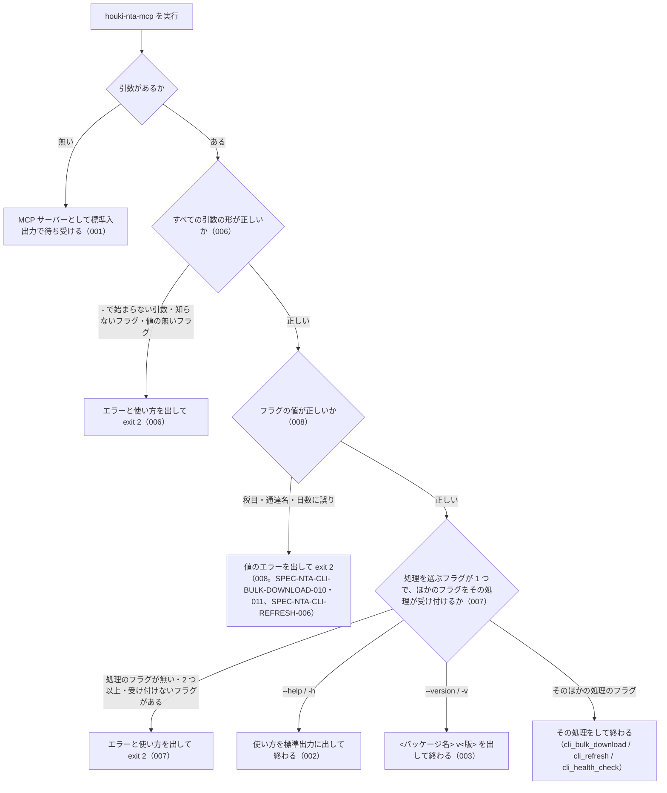

# 機能: cli_entry（`houki-nta-mcp` コマンドの起動と引数の振り分け）

- 機能 ID: NTA
- 種類: CLI
- 版: current
- 承認日: 2026-09-29（PR #103）。差分 `20261003-t5-docs-mismatch` は 2026-10-03（PR #126）。差分 `20261003-db-cli` は 2026-10-04（PR #135）
- 起こした元: v0.21.2 の `src/index.ts`、`src/cli.ts`（引数の読み方・`--help`・`--version`・処理の振り分け）、`src/config.ts`、`src/db/index.ts`（`--db-path` の既定）、`src/cli.test.ts`
- 関連する Issue: houki-nta-mcp #25（税目フラグの値の検査。cli_bulk_download に書く）、#35（`--quickstart` と使い方の並び）、#106（引数の検査と --version の文。0.24.0）

この文書は「このコマンドは何をするか」を書きます。どう実装しているか（関数名・テーブル名）は書きません。各フラグの処理の中身は cli_bulk_download・cli_refresh・cli_health_check の spec.md に書きます。

## アクター

- 利用者（ターミナルから `houki-nta-mcp` を実行する人）。フラグを付けずに実行して MCP サーバーを起動するか、フラグを付けて使い方・版を見る、ローカル DB を作る・最新化する、国税庁サイトの構造を確かめる
- MCP クライアント（Claude Desktop などの設定で `houki-nta-mcp` を引数なしで起動し、標準入出力で MCP のやり取りをする）

## 入力

フラグはすべて `--名前` または `--名前=値` の形で、値は `=` で続ける（`--db-path /path` のように空白で分けた形は受け付けない）。フラグの並び順は問わない。フラグは、処理を選ぶフラグ（`--help`・`--version`・`--quickstart`・`--bulk-download*`・`--refresh-stale=<日数>`・`--health-check`・`--check-baseline-drift`）を 1 つと、その処理と一緒に使えるフラグ（SPEC-NTA-CLI-ENTRY-007 の表）だけを受け付ける。それ以外の引数は SPEC-NTA-CLI-ENTRY-006・007 のエラーにする。

| フラグ                                                                                                                                                                                                                   | 必須 | 内容                                                                                                                                  |
| ------------------------------------------------------------------------------------------------------------------------------------------------------------------------------------------------------------------------ | ---- | ------------------------------------------------------------------------------------------------------------------------------------- |
| （なし）                                                                                                                                                                                                                 | 任意 | MCP サーバーとして起動する                                                                                                            |
| `--help` / `-h`                                                                                                                                                                                                          | 任意 | 使い方を標準出力に出して終わる                                                                                                        |
| `--version` / `-v`                                                                                                                                                                                                       | 任意 | `<パッケージ名> v<版>` を標準出力に出して終わる                                                                                                            |
| `--db-path=<path>`                                                                                                                                                                                                       | 任意 | 投入と `--refresh-stale` だけで使う。CLI の処理で使う DB ファイルの場所。既定は環境変数 `HOUKI_NTA_DB_PATH`、無ければ `${XDG_CACHE_HOME:-~/.cache}/houki-nta-mcp/cache.db` |
| `--quickstart`                                                                                                                                                                                                           | 任意 | 通達 1 つを投入する（cli_bulk_download）                                                                                              |
| `--bulk-download` / `--bulk-download-all` / `--bulk-download-kaisei` / `--bulk-download-jimu-unei` / `--bulk-download-bunshokaitou` / `--bulk-download-tax-answer` / `--bulk-download-qa` / `--bulk-download-everything` | 任意 | 種別ごとの投入（cli_bulk_download）                                                                                                   |
| `--tsutatsu=<正式名>` / `--bunsho-taxonomy=<csv>` / `--tax-answer-taxonomy=<csv>` / `--qa-topic=<csv>`                                                                                                                   | 任意 | 投入の対象の絞り込み（cli_bulk_download）                                                                                             |
| `--refresh` / `--refresh-stale=<日数>` / `--apply`                                                                                                                                                                       | 任意 | 取り直しと古い節の列挙・再取得（cli_refresh）                                                                                         |
| `--health-check` / `--check-baseline-drift` / `--strict`                                                                                                                                                                 | 任意 | 国税庁サイトの代表ページの確認（cli_health_check）                                                                                    |

## 処理の流れ

起動してから、MCP サーバーとして待ち受けるか、フラグの処理をして終わるかを決める順を示します。図の中の番号は「できること」の仕様 ID の末尾 3 桁です。

## できること

### SPEC-NTA-CLI-ENTRY-001 フラグを付けないときは、どの CLI の処理も選ばず MCP サーバーとして起動する

引数を付けずに実行したときは、使い方・版の表示、投入、古い節の列挙、国税庁サイトの確認のどれも選ばれず、MCP サーバーとして標準入出力で待ち受ける。引数を読んだ結果は、投入の対象が `消費税法基本通達`（`--tsutatsu` の既定）で、ほかはすべて指定なしである。

### SPEC-NTA-CLI-ENTRY-002 `--help` と `-h` は使い方を標準出力に出して終わり、MCP サーバーを起動しない

`--help` または `-h` があるときは、使い方を標準出力に出し、ほかの処理をせずに終わる。使い方には次が載る。

- 先頭にパッケージ名と版（`@shuji-bonji/houki-nta-mcp v<版>`）
- 「まず試す」の節に `--quickstart`。この節は `--bulk-download-everything` の説明より前にある
- 種別を足すフラグと、税目フラグに使える値の一覧。`--qa-topic の値: shotoku, gensen, …`、`--bunsho-taxonomy の値: shotoku, gensen, joto-sanrin, …`（国税局の別表記も添える）、`--tax-answer-taxonomy の値: …`
- 保守のフラグ（`--refresh-stale`・`--apply`・`--health-check`・`--check-baseline-drift`・`--strict`）、オプション（`--tsutatsu`・`--db-path`・`--refresh`）、環境変数 `HOUKI_NTA_DB_PATH`・`XDG_CACHE_HOME`

### SPEC-NTA-CLI-ENTRY-003 `--version` と `-v` は `<パッケージ名> v<版>` の 1 行を出して終わる

`--version` または `-v` だけを渡したときは、`<パッケージ名> v<版>` の 1 行（例: `@shuji-bonji/houki-nta-mcp v0.24.0`）を標準出力に出し、ほかの処理をせずに終了コード 0 で終わる。houki-egov-mcp の SPEC-EGOV-CLI-ENTRY-003 と同じ形である（v0.23.x までは版の数字だけ、例: `0.23.0`。#106）。ほかの引数と一緒に渡したときは SPEC-NTA-CLI-ENTRY-007 のエラーにする。

### SPEC-NTA-CLI-ENTRY-004 `--db-path=<path>` で、投入と `--refresh-stale` が使う DB ファイルを指定できる

`--db-path=<path>` を投入のフラグ（`--quickstart`・`--bulk-download*`）か `--refresh-stale=<日数>` と一緒に付けると、その処理は環境変数によらずそのパスの DB を使う。`:memory:` を渡すとファイルを作らない一時的な DB になる。例: `--bulk-download --tsutatsu=所得税基本通達 --db-path=/tmp/cache.db` は、`/tmp/cache.db` に所得税基本通達を投入する。

`--db-path=<path>` だけを渡したとき、または DB を使わない処理（`--health-check`・`--check-baseline-drift`・`--help`・`--version`）と一緒に渡したときは、SPEC-NTA-CLI-ENTRY-007 のエラーにする。MCP サーバーの DB の場所は `--db-path` では変わらない（v0.23.x までは `--db-path=<path>` だけを渡すと MCP サーバーが起動し、そのパスは使わなかった。#106）。`--db-path=`（値が空）は SPEC-NTA-CLI-ENTRY-006 の値の無いフラグのエラーにする。

### SPEC-NTA-CLI-ENTRY-005 `--help` はほかの引数と一緒に渡すとエラーにし、値の誤りがあれば値のエラーを先に出す

`--help` / `-h` は、それだけを渡したときに使い方を出して終了コード 0 で終わる（SPEC-NTA-CLI-ENTRY-002）。ほかの引数と一緒に渡したときは、使い方を出さずに次のエラーにする。

- ほかの引数の形が誤っていれば SPEC-NTA-CLI-ENTRY-006 のエラー（終了コード 2）
- 値に誤りがあれば SPEC-NTA-CLI-ENTRY-008 の値のエラー（終了コード 2）。例: `--help --qa-topic=zzz` は `[houki-nta-mcp] --qa-topic="zzz" は使えません。使える値: …` を出して終了コード 2
- 値が正しければ SPEC-NTA-CLI-ENTRY-007 の余分な引数のエラー（終了コード 2）。例: `--help --version` は `ERROR: 余分な引数: --version`

値のエラーは、使える値の一覧を文に含むので、使い方を見なくても正しい値を確かめられる（v0.23.x までは `--help --qa-topic=zzz` は値の誤りを報告せずに使い方を出し、終了コード 0 だった。#106）。

### SPEC-NTA-CLI-ENTRY-006 形の誤った引数は、何もせずにエラーと使い方を出して exit 2

引数を前から順に見て、次のどれかに当たる最初の引数があれば、そのことを標準エラー出力に出し、続けて使い方（SPEC-NTA-CLI-ENTRY-002 と同じ文。下の値の無いフラグを除く）を標準出力に出して、終了コード 2 で終わる。DB を開かず、国税庁サイトに接続せず、MCP サーバーも起動しない。

| 引数 | 標準エラー出力 |
| --- | --- |
| `-` で始まらない（`status`・`/path` など） | `ERROR: 未知の引数: <引数>` |
| `-` で始まり、入力の表のどのフラグでもない（打ち間違い、`-x`、値を取らないフラグに `=` を付けたもの。例: `--bulk-downlod`、`--refresh=1`） | `ERROR: 未知のフラグ: <フラグ>`（`=` 以降も含めて出す） |
| 値を取るフラグ（`--db-path`・`--tsutatsu`・`--bunsho-taxonomy`・`--tax-answer-taxonomy`・`--qa-topic`・`--refresh-stale`）に `=` が無い、または `=` の後が空 | `ERROR: <フラグ> は値を必要とします（<フラグ>=<値> の形で指定してください）` |

例:

| 実行 | 標準エラー出力 | 終了コード |
| --- | --- | --- |
| `houki-nta-mcp --bulk-downlod` | `ERROR: 未知のフラグ: --bulk-downlod` | 2 |
| `houki-nta-mcp --db-path /tmp/x.db --bulk-download` | `ERROR: --db-path は値を必要とします（--db-path=<値> の形で指定してください）` | 2 |
| `houki-nta-mcp status` | `ERROR: 未知の引数: status` | 2 |
| `houki-nta-mcp --refresh-stale` | `ERROR: --refresh-stale は値を必要とします（--refresh-stale=<値> の形で指定してください）` | 2 |

値を取るフラグに値が無いときだけは、使い方を出さない（houki-egov-mcp の SPEC-EGOV-CLI-BULK-DOWNLOAD-001 で日付が無いときと同じ）。

v0.23.x では、上の引数を読み飛ばし、処理を選ぶフラグが残らなければ MCP サーバーとして起動して標準入力を待ち続けた（#106）。houki-egov-mcp の SPEC-EGOV-CLI-ENTRY-004・008 と同じ文である。

### SPEC-NTA-CLI-ENTRY-007 処理を選ぶフラグは 1 つだけで、その処理が受け付けないフラグはエラーにして exit 2

形と値が正しい（SPEC-NTA-CLI-ENTRY-006・008）引数について、次を確かめる。当たれば、そのフラグの処理を何もせず（DB を開かず、国税庁サイトに接続せず）、標準エラー出力にエラーを出し、続けて使い方を標準出力に出して、終了コード 2 で終わる。

| 場面 | 標準エラー出力 |
| --- | --- |
| 処理を選ぶフラグが 2 つ以上ある | `ERROR: 余分な引数: <前から 2 つ目の処理を選ぶフラグ>` |
| 処理を選ぶフラグが受け付けないフラグがある（下の表）。同じフラグを 2 回渡したときの 2 回目を含む | `ERROR: 余分な引数: <前から最初のそのフラグ>` |
| 処理を選ぶフラグが無く、ほかのフラグだけがある（`--db-path=<path>` だけ、`--strict` だけなど） | `ERROR: 処理を選ぶフラグがありません（<前から最初のフラグ> だけでは何もしません）` |

処理を選ぶフラグと、一緒に使えるフラグは次のとおり。

| 処理を選ぶフラグ | 一緒に使えるフラグ |
| --- | --- |
| `--help` / `-h`、`--version` / `-v` | なし |
| `--quickstart`、`--bulk-download` | `--tsutatsu`・`--refresh`・`--db-path` |
| `--bulk-download-all`、`--bulk-download-kaisei`、`--bulk-download-jimu-unei` | `--refresh`・`--db-path` |
| `--bulk-download-bunshokaitou` | `--bunsho-taxonomy`・`--refresh`・`--db-path` |
| `--bulk-download-tax-answer` | `--tax-answer-taxonomy`・`--refresh`・`--db-path` |
| `--bulk-download-qa` | `--qa-topic`・`--refresh`・`--db-path` |
| `--bulk-download-everything` | `--bunsho-taxonomy`・`--tax-answer-taxonomy`・`--qa-topic`・`--refresh`・`--db-path` |
| `--refresh-stale=<日数>` | `--apply`・`--db-path`。`--refresh` は `--apply` があるときだけ（SPEC-NTA-CLI-REFRESH-007） |
| `--health-check`、`--check-baseline-drift` | `--strict` |

例:

| 実行 | 標準エラー出力 | 終了コード |
| --- | --- | --- |
| `houki-nta-mcp --bulk-download-qa --health-check` | `ERROR: 余分な引数: --health-check` | 2 |
| `houki-nta-mcp --bulk-download-all --tsutatsu=所得税基本通達` | `ERROR: 余分な引数: --tsutatsu=所得税基本通達` | 2 |
| `houki-nta-mcp --refresh-stale=30 --refresh` | `ERROR: 余分な引数: --refresh` | 2 |
| `houki-nta-mcp --apply` | `ERROR: 処理を選ぶフラグがありません（--apply だけでは何もしません）` | 2 |
| `houki-nta-mcp --db-path=/tmp/x.db` | `ERROR: 処理を選ぶフラグがありません（--db-path=/tmp/x.db だけでは何もしません）` | 2 |

v0.23.x では、処理を選ぶフラグが 2 つ以上あると決まった順で最初の 1 つだけを行い（上の 1 行目は投入だけを行った）、受け付けないフラグは黙って使わず、処理を選ぶフラグが無ければ MCP サーバーとして起動した（#106）。houki-egov-mcp の SPEC-EGOV-CLI-ENTRY-009 と同じ文である。

### SPEC-NTA-CLI-ENTRY-008 引数の検査は「形 → 値 → 組み合わせ」の順に行い、値の誤りはすべてを並べて exit 2

引数は、形（SPEC-NTA-CLI-ENTRY-006）、値（下の表）、組み合わせ（SPEC-NTA-CLI-ENTRY-007）の順に確かめる。形の誤りがあれば値と組み合わせは確かめない。値の誤りがあれば組み合わせは確かめない。

値の誤りは、誤った値 1 つにつき 1 行を標準エラー出力にすべて出し（使い方は出さない）、終了コード 2 で終わる。DB を開かず、国税庁サイトに接続せず、MCP サーバーも起動しない。

| フラグ | 正しい値 | 文 |
| --- | --- | --- |
| `--bunsho-taxonomy`・`--tax-answer-taxonomy`・`--qa-topic` | 各フラグの一覧の値（SPEC-NTA-CLI-BULK-DOWNLOAD-008） | SPEC-NTA-CLI-BULK-DOWNLOAD-010 |
| `--tsutatsu` | 基本通達 4 種の正式名 | SPEC-NTA-CLI-BULK-DOWNLOAD-011 |
| `--refresh-stale` | 0 以上の整数（数字だけ） | SPEC-NTA-CLI-REFRESH-006 |

引数の誤りの終了コードは 2、処理の失敗（DB を開けない、DB の版が合わない。SPEC-NTA-DB-SCHEMA-021）は 1 に分ける。houki-egov-mcp の 0.19.0 と同じ分け方である。

例: `houki-nta-mcp --bulk-download-everything --qa-topic=zzz --tax-answer-taxonomy=yyy` は、`--qa-topic="zzz"` と `--tax-answer-taxonomy="yyy"` の 2 行をこの引数の順に出して終了コード 2。`houki-nta-mcp --bulk-downlod --qa-topic=zzz` は形の誤りが先なので `ERROR: 未知のフラグ: --bulk-downlod` だけを出す。

## できないこと

- `--名前 値` のように空白で分けた値を受け付けること（`--db-path=<path>` の形だけ）
- 処理を選ぶフラグを 2 つ以上同時に実行すること（SPEC-NTA-CLI-ENTRY-007 のエラーにする）
- MCP サーバーに CLI のフラグで DB の場所を渡すこと（MCP サーバーの DB の場所は環境変数 `HOUKI_NTA_DB_PATH` / `XDG_CACHE_HOME` だけで決まる。`--db-path=<path>` だけを渡すと SPEC-NTA-CLI-ENTRY-007 のエラー）
- MCP サーバーを標準入出力以外（HTTP など）で起動すること
- 設定ファイルを読むこと（設定はフラグと環境変数だけ）

## 未決

初版起こしで見つけた、意図か不具合かを人が決める項目です。決まったら「できること」に ID を振るか、`specs/changes/` の差分にします。

意図か不具合かの判断が要る項目は houki-nta-mcp の Issue に移し、ここには題と Issue の番号だけを残します。今の振る舞いのままでよくテストが無いだけの項目は、受入テストを書いてから「できること」に ID を振ります。

4. **MCP サーバーの終わり方。** 起動すると標準エラー出力に `[server] <パッケージ名> v<版> started …` を JSON のログとして出す。SIGINT / SIGTERM を受けると標準入出力の接続を閉じる。起動の途中で想定外の例外が起きると `fatal error` のログを出して `exit 1`。どれもテストが無い（houki-egov-mcp の SPEC-EGOV-CLI-ENTRY-006・007 に当たる）。ID を振るのは受入テストを書いてから。
6. **`--db-path` の既定の決め方。** `HOUKI_NTA_DB_PATH` → `$XDG_CACHE_HOME/houki-nta-mcp/cache.db` → `~/.cache/houki-nta-mcp/cache.db` の順で、テストが無い。db_schema の未決 1 と同じ。
