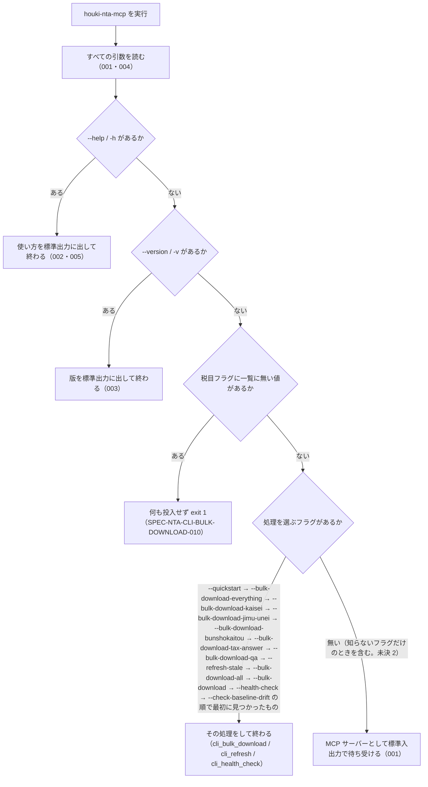

# 機能: cli_entry（`houki-nta-mcp` コマンドの起動と引数の振り分け）

- 機能 ID: NTA
- 種類: CLI
- 版: current
- 承認日:
- 起こした元: v0.21.2 の `src/index.ts`、`src/cli.ts`（引数の読み方・`--help`・`--version`・処理の振り分け）、`src/config.ts`、`src/db/index.ts`（`--db-path` の既定）、`src/cli.test.ts`
- 関連する Issue: houki-nta-mcp #25（税目フラグの値の検査。cli_bulk_download に書く）、#35（`--quickstart` と使い方の並び）

この文書は「このコマンドは何をするか」を書きます。どう実装しているか（関数名・テーブル名）は書きません。各フラグの処理の中身は cli_bulk_download・cli_refresh・cli_health_check の spec.md に書きます。

## アクター

- 利用者（ターミナルから `houki-nta-mcp` を実行する人）。フラグを付けずに実行して MCP サーバーを起動するか、フラグを付けて使い方・版を見る、ローカル DB を作る・最新化する、国税庁サイトの構造を確かめる
- MCP クライアント（Claude Desktop などの設定で `houki-nta-mcp` を引数なしで起動し、標準入出力で MCP のやり取りをする）

## 入力

フラグはすべて `--名前` または `--名前=値` の形で、値は `=` で続ける（`--db-path /path` のように空白で分けた形は受け付けない）。フラグの並び順は問わない。

| フラグ | 必須 | 内容 |
|---|---|---|
| （なし） | 任意 | MCP サーバーとして起動する |
| `--help` / `-h` | 任意 | 使い方を標準出力に出して終わる |
| `--version` / `-v` | 任意 | 版を標準出力に出して終わる |
| `--db-path=<path>` | 任意 | CLI の処理で使う DB ファイルの場所。既定は環境変数 `HOUKI_NTA_DB_PATH`、無ければ `${XDG_CACHE_HOME:-~/.cache}/houki-nta-mcp/cache.db` |
| `--quickstart` | 任意 | 通達 1 つを投入する（cli_bulk_download） |
| `--bulk-download` / `--bulk-download-all` / `--bulk-download-kaisei` / `--bulk-download-jimu-unei` / `--bulk-download-bunshokaitou` / `--bulk-download-tax-answer` / `--bulk-download-qa` / `--bulk-download-everything` | 任意 | 種別ごとの投入（cli_bulk_download） |
| `--tsutatsu=<正式名>` / `--bunsho-taxonomy=<csv>` / `--tax-answer-taxonomy=<csv>` / `--qa-topic=<csv>` | 任意 | 投入の対象の絞り込み（cli_bulk_download） |
| `--refresh` / `--refresh-stale=<日数>` / `--apply` | 任意 | 取り直しと古い節の列挙・再取得（cli_refresh） |
| `--health-check` / `--check-baseline-drift` / `--strict` | 任意 | 国税庁サイトの代表ページの確認（cli_health_check） |

## 処理の流れ

起動してから、MCP サーバーとして待ち受けるか、フラグの処理をして終わるかを決める順を示します。図の中の番号は「できること」の仕様 ID の末尾 3 桁です。

## できること

### SPEC-NTA-CLI-ENTRY-001 フラグを付けないときは、どの CLI の処理も選ばず MCP サーバーとして起動する

引数を付けずに実行したときは、使い方・版の表示、投入、古い節の列挙、国税庁サイトの確認のどれも選ばれず、MCP サーバーとして標準入出力で待ち受ける。引数を読んだ結果は、投入の対象が `消費税法基本通達`（`--tsutatsu` の既定）で、ほかはすべて指定なしである。

### SPEC-NTA-CLI-ENTRY-002 `--help` と `-h` は使い方を標準出力に出して終わり、MCP サーバーを起動しない

`--help` または `-h` があるときは、使い方を標準出力に出し、ほかの処理をせずに終わる。使い方には次が載る。

- 先頭にパッケージ名と版（`@shuji-bonji/houki-nta-mcp v<版>`）
- 「まず試す」の節に `--quickstart`。この節は `--bulk-download-everything` の説明より前にある
- 種別を足すフラグと、税目フラグに使える値の一覧。`--qa-topic の値: shotoku, gensen, …`、`--bunsho-taxonomy の値: shotoku, gensen, joto-sanrin, …`（国税局の別表記も添える）、`--tax-answer-taxonomy の値: …`
- 保守のフラグ（`--refresh-stale`・`--apply`・`--health-check`・`--check-baseline-drift`・`--strict`）、オプション（`--tsutatsu`・`--db-path`・`--refresh`）、環境変数 `HOUKI_NTA_DB_PATH`・`XDG_CACHE_HOME`

### SPEC-NTA-CLI-ENTRY-003 `--version` と `-v` は版を出して終わる

`--version` または `-v` があるときは、版を標準出力に出し、ほかの処理をせずに終わる（出す文の形は未決 1）。

### SPEC-NTA-CLI-ENTRY-004 `--db-path=<path>` で CLI の処理が使う DB ファイルを指定できる

`--db-path=<path>` を付けると、そのフラグと同時に指定した処理（投入・古い節の列挙）は、環境変数によらずそのパスの DB を使う。`:memory:` を渡すとファイルを作らない一時的な DB になる。ほかのフラグと組み合わせられる。例: `--bulk-download --tsutatsu=所得税基本通達 --db-path=/tmp/cache.db` は、`/tmp/cache.db` に所得税基本通達を投入する。

### SPEC-NTA-CLI-ENTRY-005 `--help` は税目フラグの値が誤っていても使い方を出し、終了コードを変えない

`--help` と、一覧に無い値の税目フラグ（例: `--qa-topic=zzz`）を同時に渡したときは、値の誤りを報告せずに使い方を出し、終了コードを設定しない（0 のまま）。使い方の税目フラグの値の一覧で、正しい値を確かめられる。

## できないこと

- `--名前 値` のように空白で分けた値を受け付けること（`--db-path=<path>` の形だけ）
- 処理を選ぶフラグを 2 つ以上同時に実行すること（上の順で最初の 1 つだけを行う。`--bulk-download-qa --health-check` は投入だけを行う）
- MCP サーバーを標準入出力以外（HTTP など）で起動すること
- 設定ファイルを読むこと（設定はフラグと環境変数だけ）

## 未決

初版起こしで見つけた、意図か不具合かを人が決める項目です。決まったら「できること」に ID を振るか、`specs/changes/` の差分にします。

意図か不具合かの判断が要る項目は houki-nta-mcp の Issue に移し、ここには題と Issue の番号だけを残します。今の振る舞いのままでよくテストが無いだけの項目は、受入テストを書いてから「できること」に ID を振ります。

1. **`--version` が出す文と、`--help` / `--version` の終了コード。** `--version` は版の数字だけ（例: `0.21.2`）を 1 行出し、パッケージ名を付けない（houki-egov-mcp は `<パッケージ名> v<版>`）。`--help` / `--version` は終了コードを設定せず 0 で終わる。文の形はテストが無く、family で揃えるかは人が決める。終了コードは受入テストを書いてから ID を振る。
2. **知らないフラグと、`=` の無いフラグを黙って無視し、MCP サーバーを起動する。** `--bulk-downlod`（打ち間違い）、`--db-path /path`（空白で分けた形）、`--refresh-stale=abc`（数でない日数）のように、どのフラグにも当たらない引数は読み飛ばす。ほかに処理を選ぶフラグが無ければ、ターミナルで MCP サーバーが起動して待ち続ける。`--db-path=<path>` だけを渡したときも同じで、MCP サーバーはそのパスを使わない（MCP サーバーの DB は環境変数 `HOUKI_NTA_DB_PATH` / `XDG_CACHE_HOME` だけで決まる）。houki-egov-mcp は知らないフラグを `exit 2` にする（SPEC-EGOV-CLI-ENTRY-004）。エラーにするかは人が決める。
3. **処理を選ぶフラグを複数渡したときの優先順。** 処理の流れの図の順（`--quickstart` が最初、`--check-baseline-drift` が最後）で 1 つだけを行う。`--refresh-stale` は `--bulk-download-all` / `--bulk-download` より先で、`--health-check` は投入のどれよりも後である。テストが無い。ID を振るのは受入テストを書いてから。
4. **MCP サーバーの終わり方。** 起動すると標準エラー出力に `[server] <パッケージ名> v<版> started …` を JSON のログとして出す。SIGINT / SIGTERM を受けると標準入出力の接続を閉じる。起動の途中で想定外の例外が起きると `fatal error` のログを出して `exit 1`。どれもテストが無い（houki-egov-mcp の SPEC-EGOV-CLI-ENTRY-006・007 に当たる）。ID を振るのは受入テストを書いてから。
5. **使い方に載っていない環境変数。** `HOUKI_NTA_BASELINE_DIR`（cli_health_check）と `HOUKI_NTA_FILES_DIR`（`nta_inspect_pdf_meta` の保存先）は使い方の「環境変数」に無い。載せるかは人が決める（案内と実際の動きの食い違いとして houki-nta-mcp #70 と同じ種類）。
6. **`--db-path` の既定の決め方。** `HOUKI_NTA_DB_PATH` → `$XDG_CACHE_HOME/houki-nta-mcp/cache.db` → `~/.cache/houki-nta-mcp/cache.db` の順で、テストが無い。db_schema の未決 1 と同じ。
