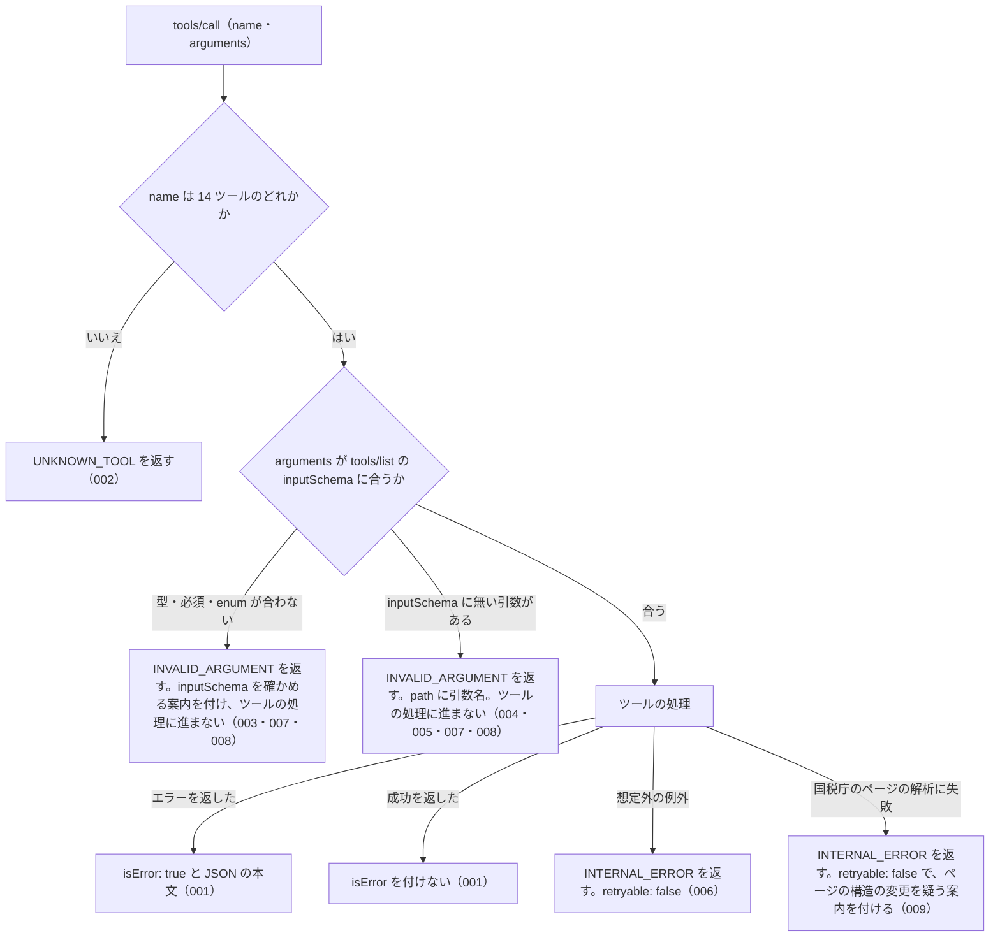

# 機能: common_errors（全ツールに共通するエラー応答の形と引数の検査）

- 版: current
- 起こした元: v0.21.0 の `src/server.ts`、`src/tools/tool-args.ts`、`src/errors.ts`、`src/tools/definitions.ts`、`src/tools/handlers.ts`（ツールの登録の表）、`src/server.test.ts`、`src/tools/handlers.test.ts`
- 関連する Issue: houki-nta-mcp #120（通信の失敗の code）、#138（案内のコマンドの形。0.25.0）、#144（開けない DB は INTERNAL_ERROR にしない。0.26.0）、#154（置き場所のフォルダーに入る権限が無いときも開けない DB に含める。0.27.0）

この文書は、複数のツールに共通する、tools/call のエラー応答の形と引数の検査を書きます。どう実装しているか（関数名・テーブル名）は書きません。

## アクター

- MCP クライアント（Claude などの LLM、または CLI から呼ぶ人）。tools/call でツール名と引数を渡し、エラーのときは `isError: true` と JSON の本文を受け取って、`code` で失敗の種類を見分け、`hint` と `next_actions` で次に何をするかを決める

## 対象

この規則は、tools/call で呼べる次の 14 ツールすべてに当てはまる。どのツールも、tools/list の inputSchema と同じものを使って引数を検査してから、ツールの処理に進む。

| ツール                       | 当てはまる場面                                           |
| ---------------------------- | -------------------------------------------------------- |
| `nta_search_tsutatsu`        | 引数の検査、エラー応答の形、処理中の想定外の例外         |
| `nta_get_tsutatsu`           | 同上                                                     |
| `nta_search_qa`              | 同上                                                     |
| `nta_get_qa`                 | 同上                                                     |
| `nta_search_tax_answer`      | 同上                                                     |
| `nta_get_tax_answer`         | 同上                                                     |
| `nta_search_kaisei_tsutatsu` | 同上                                                     |
| `nta_get_kaisei_tsutatsu`    | 同上                                                     |
| `nta_search_jimu_unei`       | 同上                                                     |
| `nta_get_jimu_unei`          | 同上                                                     |
| `nta_search_bunshokaitou`    | 同上                                                     |
| `nta_get_bunshokaitou`       | 同上                                                     |
| `nta_inspect_pdf_meta`       | 同上                                                     |
| `resolve_abbreviation`       | 同上                                                     |
| 上の 14 個以外の名前         | 存在しないツール名のエラー（SPEC-NTA-COMMON-ERRORS-002） |

### エラー応答のフィールド

エラーの本文は、次のフィールドを持つ JSON オブジェクトである。`error` と `code` は必ず付き、ほかは値があるときだけ付く。

| フィールド                                                                                              | 内容                                                                                                                                                                                                                             |
| ------------------------------------------------------------------------------------------------------- | -------------------------------------------------------------------------------------------------------------------------------------------------------------------------------------------------------------------------------- |
| `error`                                                                                                 | 1 文のエラーの説明（人も LLM も読む）                                                                                                                                                                                            |
| `code`                                                                                                  | 失敗の種類を表す文字列（下の表）                                                                                                                                                                                                 |
| `hint`                                                                                                  | 次に何を確かめるかの案内                                                                                                                                                                                                         |
| `next_actions`                                                                                          | 次に呼ぶツールや取る手段の候補の配列。要素は `action`（ツール名、または `list_tools` / `retry_later` / `cli_bulk_download` / `delegate_to_mcp` のような手段の名前）・`reason`（どんなときに有効か）・`example`（引数の例。任意） |
| `retryable`                                                                                             | `true` なら、時間をおいて同じ呼び出しをやり直すと結果が変わりうる                                                                                                                                                                |
| `detail`                                                                                                | 調べるための詳細。`status`（HTTP ステータス）・`url`・`cause`（元の例外の文）・`issues`（引数の検査の問題の一覧。要素は `path` と `message`） |
| `tool`                                                                                                  | エラーが起きたツールの名前                                                                                                                                                                                                       |
| `url` / `resolved` / `available_clauses` / `searched_urls` / `available_doc_ids` / `supported_for_live` | ツール固有の補足。どのツールがどの場面で付けるかは各ツールの spec.md                                                                                                                                                             |

### エラーの code

どの場面でどの code を返すかは、存在しないツール名・引数の検査・処理中の想定外の例外を除いて、各ツールの spec.md に書く。

| code                                     | 失敗の種類                                                                                                               |
| ---------------------------------------- | ------------------------------------------------------------------------------------------------------------------------ |
| `INVALID_ARGUMENT`                       | 引数が inputSchema に合わない、または値の形がツールの受け付ける形でない（呼び出し側の誤り）                              |
| `UNKNOWN_TOOL`                           | 存在しないツール名を呼んだ（呼び出し側の誤り）                                                                           |
| `OUT_OF_SCOPE`                           | このサーバーの管轄でない資料を求めた（別の MCP サーバーで取る）                                                          |
| `ABBREVIATION_NOT_FOUND`                 | 略称辞書に無い名前を指定した                                                                                             |
| `TSUTATSU_NOT_FOUND`                     | 求めた基本通達、または検索の対象になる基本通達が、ローカル DB に無く国税庁サイトから取る先も無い（`nta_get_tsutatsu` / `nta_search_tsutatsu`）。ローカル DB を開けないときも同じ（SPEC-NTA-DB-SCHEMA-029） |
| `ARTICLE_NOT_FOUND`                      | 通達はあるが、求めた条項が無い                                                                                           |
| `DOC_NOT_FOUND`                          | 求めた文書（または検索の対象になる文書）がローカル DB に無い（質疑応答事例・タックスアンサー・改正通達・事務運営指針・文書回答事例）。ローカル DB を開けないときも同じ（SPEC-NTA-DB-SCHEMA-029）。国税庁サイトから取るときに、そのページが無い（404・410・404 ページへの転送）ときも同じ。`nta_get_tax_answer` で国税庁の索引にその番号が無いときも同じ |
| `SOURCE_API_ERROR`                       | 国税庁サイトとの通信が失敗した（HTTP 5xx、404・410・429 以外の 4xx、`SOURCE_UNAVAILABLE` に当たらないネットワークの失敗）。ページが無い（404）ことは含まない（SPEC-NTA-COMMON-ERRORS-018） |
| `SOURCE_TIMEOUT`                         | 国税庁サイトが 30 秒以内に応答しなかった（018）                                                                          |
| `SOURCE_RATE_LIMITED`                    | 国税庁サイトが HTTP 429 を返した（018）                                                                                  |
| `SOURCE_UNAVAILABLE`                     | 国税庁サイトに接続できなかった（DNS の失敗・接続の拒否など。019）                                                        |
| `INTERNAL_ERROR`                         | サーバー内部の失敗（ページの解析の失敗や、処理中の想定外の例外）。再試行しても結果は変わらない（`retryable: false`）。ローカル DB を開けないことは含まない（SPEC-NTA-COMMON-ERRORS-006） |

## 処理の流れ

tools/call を受けてから応答を返すまでに、何をどの順で確かめるかを示します。図の中の番号は「できること」の仕様 ID の末尾 3 桁です。

## できること

### SPEC-NTA-COMMON-ERRORS-001 エラーは isError: true と JSON の本文で返し、成功には isError を付けない

ツールの処理がエラー（`error` と `code` を持つオブジェクト）を返したときは、tools/call の結果に `isError: true` を付け、`content` の先頭の `text` にそのエラーを JSON にした文字列を入れる。ツールの処理が付けた `code` や `hint` は、そのまま本文に入る。例: 処理が `code: "TSUTATSU_NOT_FOUND"`・`hint: "テスト用"` のエラーを返すと、結果は `isError: true` で、本文の `code` は `TSUTATSU_NOT_FOUND`、`hint` は `テスト用` である。

ツールの処理が成功を返したときは、`isError` を付けない（例: `resolve_abbreviation` に `abbr: "消基通"` を渡すと、`isError` の無い結果で、本文は JSON の応答）。

### SPEC-NTA-COMMON-ERRORS-002 存在しないツール名はエラー `UNKNOWN_TOOL`（`retryable: false`）で、`error` は日本語

tools/call の `name` が 14 ツールのどれでもないときは、エラー `UNKNOWN_TOOL` を返す（`isError: true`）。

- `error` は `存在しないツールです: <name>`（ほかのエラーと同じく日本語の 1 文）
- `retryable` は `false`（同じ名前で呼び直しても結果は変わらない）
- `hint` に、呼べるツール名の一覧（`nta_search_tsutatsu` など）を書く
- `next_actions` の先頭は `action: "list_tools"`（MCP の tools/list で呼べるツールを確かめる案内）

houki-egov-mcp の SPEC-EGOV-COMMON-ERRORS-002 と同じ文である。

例: `name: "no_such_tool"` を呼ぶと、`code: "UNKNOWN_TOOL"`、`error: "存在しないツールです: no_such_tool"`、`retryable: false` で、`hint` に `nta_search_tsutatsu` が含まれる（v0.22.0 では `error` が英語の `Unknown tool: no_such_tool` で、`retryable` が無かった）。

### SPEC-NTA-COMMON-ERRORS-003 inputSchema に合わない引数はエラー `INVALID_ARGUMENT`

引数の型が違う、必須の引数が無い、`enum` に無い値を渡した、数値が `minimum` / `maximum` の範囲の外にある、文字列が `minLength` に合わない、のどれかのときは、ツールの処理に進まずにエラー `INVALID_ARGUMENT` を返す（`isError: true`）。14 ツールすべてが、tools/list に出している inputSchema と同じものでこの検査を行う。

- `tool` に、呼んだツールの名前を入れる
- `detail.issues` に問題の一覧を入れる。要素は `path`（問題のある引数名。入れ子なら `a.b` の形。空文字にはならない）と `message`（日本語の 1 文。SPEC-NTA-COMMON-ERRORS-011）。違反 1 件ごとに要素を分ける（010）

例: `resolve_abbreviation` に `abbr: 123` を渡すと、`code: "INVALID_ARGUMENT"`・`tool: "resolve_abbreviation"` で、`detail.issues[0].path` は `abbr`。`nta_search_tsutatsu` に引数を 1 つも渡さない（必須の `keyword` が無い）とき、`keyword: "軽減税率", type: "bogus"` を渡したとき、`keyword: "軽減税率", limit: 100` を渡したとき（SPEC-NTA-SEARCH-TSUTATSU-011）も、`INVALID_ARGUMENT` を返す。

### SPEC-NTA-COMMON-ERRORS-004 inputSchema に無い引数はエラー `INVALID_ARGUMENT` で、`path` にその引数名を入れる

inputSchema の `properties` に無い引数を渡したときは、エラー `INVALID_ARGUMENT` を返す（`isError: true`）。`detail.issues` の `path` に、その引数の名前を入れる。`tool` には呼んだツールの名前を入れる。

例: `nta_search_tsutatsu` に `keyword: "軽減税率", domain: "tax"` を渡すと、`code: "INVALID_ARGUMENT"`・`tool: "nta_search_tsutatsu"` で、`detail.issues[0].path` は `domain`。

### SPEC-NTA-COMMON-ERRORS-005 すべてのツールの inputSchema は、そこに無い引数を受け付けない

tools/list が返す 14 ツールの inputSchema には、どれも `additionalProperties: false` が付く。呼び出し側は tools/list を見て、どのツールでも inputSchema に無い引数は SPEC-NTA-COMMON-ERRORS-004 のエラーになると分かる。

### SPEC-NTA-COMMON-ERRORS-006 処理中の想定外の例外はエラー `INTERNAL_ERROR`（`retryable: false`）で返し、再試行を案内しない

ツールの処理の途中で想定外の例外が起きたときは、プロトコルのエラーにせず、tools/call の結果としてエラー `INTERNAL_ERROR` を返す（`isError: true`）。

- `retryable` は `false`（不具合の可能性が高く、同じ呼び出しをやり直しても結果は変わらない。`hint` は `バグの可能性があります。再現手順を添えて GitHub issue でご報告ください`）
- `next_actions` は付けない（再試行を案内する `retry_later` は、`retryable: false` と `hint` の報告の依頼に合わないので入れない）
- `detail.cause` に、元の例外の文を入れる（例: 例外の文が `boom` なら `detail.cause` は `boom`）

houki-egov-mcp の SPEC-EGOV-COMMON-ERRORS-007・018 と同じ扱いである。

ローカル DB を開けない（SQLite でないファイル、フォルダー、パスの途中が普通のファイル、DB のファイルを読む権限が無い、置き場所のフォルダー（またはパスの途中のフォルダー）に入る権限が無い。SPEC-NTA-DB-SCHEMA-021 の開けない行）ことは、処理中の想定外の例外に当たらない。読むだけのツールは「DB に 1 件も無い」ときの code（SPEC-NTA-DB-SCHEMA-029）、書き戻すツールは DB を使わずに国税庁サイトから取った結果（SPEC-NTA-DB-SCHEMA-030）を返し、この ID の `INTERNAL_ERROR` にしない（v0.25.x では、14 ツールのうち DB を開く 13 ツールがこの ID の `INTERNAL_ERROR` を返していた）。

例: ツールの処理が `new Error("boom")` を投げると、`code: "INTERNAL_ERROR"`、`retryable: false`、`detail.cause: "boom"` で、`next_actions` は無い（v0.22.0 では `retryable: true`、`next_actions: [{ action: "retry_later", … }]` だった）。SQLite でない中身のファイルを `HOUKI_NTA_DB_PATH` で指して起動した MCP サーバーで `nta_search_qa { keyword: "社内会議" }` を呼ぶと、`code` は `DOC_NOT_FOUND` で、この ID の `INTERNAL_ERROR` ではない（v0.25.x では `INTERNAL_ERROR`、`error` は `内部エラーが発生しました: file is not a database`）。

### SPEC-NTA-COMMON-ERRORS-007 inputSchema の検査で返す `INVALID_ARGUMENT` には、inputSchema を確かめる案内を付ける

SPEC-NTA-COMMON-ERRORS-003・004 のエラーは、14 ツールとも次の形で返す。

- `error` は `引数が tools/list の inputSchema に合いません: ` で始まり、その後に `detail.issues` の各要素を `<path>: <message>` の形にして `; ` 区切りで続ける（`path` は空にならない。SPEC-NTA-COMMON-ERRORS-010）
- `hint` は `tools/list の <ツール名> の inputSchema を確認してください (型・必須・enum・範囲・形式・未知の引数)`
- `next_actions` は `{ action: "list_tools", reason: "inputSchema で引数の型と必須項目を確認できます" }` の 1 件

例: `nta_search_jimu_unei` に `{ keyword: "x", foo: 1 }` を渡すと、`error` は `引数が tools/list の inputSchema に合いません: foo: inputSchema に無い引数です`、`hint` は `tools/list の nta_search_jimu_unei の inputSchema を確認してください (型・必須・enum・範囲・形式・未知の引数)` になる。`nta_get_jimu_unei` に `{}` を渡すと、`detail.issues` は `[{ path: "docId", message: "必須の引数です" }]` で、`error` は `引数が tools/list の inputSchema に合いません: docId: 必須の引数です`。

### SPEC-NTA-COMMON-ERRORS-008 inputSchema に合わない引数では、ツールの処理に進まない

SPEC-NTA-COMMON-ERRORS-003・004 のエラーを返すときは、ツールの処理に進まない。ローカル DB を開かず、国税庁サイトに取りに行かず、略称辞書も引かない。例: `nta_get_qa` に `{ topic: "shohi", category: "01" }`（必須の `id` が無い）を渡しても、国税庁サイトへの取得は起きない。

### SPEC-NTA-COMMON-ERRORS-009 国税庁のページの解析に失敗したときは `INTERNAL_ERROR`（`retryable: false`）で、ページの構造の変更を疑う案内を付ける

国税庁サイトから取ったページを読み取れなかったときは、エラー `INTERNAL_ERROR` を返す（`isError: true`）。当てはまるのは次の 3 ツールである。

| ツール | 読み取れなかったページ | `error` |
|---|---|---|
| `nta_get_tsutatsu` | 条項のある節のページ、または目次のページ（SPEC-NTA-GET-TSUTATSU-006・014） | `通達ページのパースに失敗: <理由>` |
| `nta_get_qa` | 事例のページ（SPEC-NTA-GET-QA-005） | `質疑応答事例ページのパースに失敗: <理由>` |
| `nta_get_tax_answer` | 記事のページ（SPEC-NTA-GET-TAX-ANSWER-005） | `タックスアンサーページのパースに失敗: <理由>` |
| `nta_get_tax_answer` | タックスアンサーの索引のページ（SPEC-NTA-GET-TAX-ANSWER-016）から記事の URL が 1 件も読み取れない | `タックスアンサーの索引のパースに失敗: <理由>` |

- `retryable` は `false`（ページの構造が変わったか、パーサの不具合で、時間をおいても結果は変わらない。SPEC-NTA-COMMON-ERRORS-006 と同じ）
- `hint` は `パーサのバグまたは国税庁ページの構造変更の可能性。報告してください`
- `url` に、読み取れなかったページの URL を入れる
- `detail` は `{ url: <同じ URL>, cause: <理由> }`
- 読み取れなかったページの内容は DB に書き戻さない

ページの取得そのものに失敗したとき（SPEC-NTA-COMMON-ERRORS-018 の `SOURCE_*`）と、処理中の想定外の例外（SPEC-NTA-COMMON-ERRORS-006）は、この ID に当たらない。

例: `nta_get_qa` が取った事例のページから照会要旨を読み取れなかったとき、`code: "INTERNAL_ERROR"`、`retryable: false`、`hint` は上の文（v0.22.0 では `retryable` が無かった）。

### SPEC-NTA-COMMON-ERRORS-010 `detail.issues` は違反 1 件ごとに要素を分け、`path` には引数名を入れる

SPEC-NTA-COMMON-ERRORS-003・004 のエラーの `detail.issues` は、違反 1 件につき 1 要素である。`path` は、その違反のあった引数の名前で、空文字にならない。

- 必須の引数が無いときも、`path` はその引数の名前である。必須の引数が 2 つ無ければ、要素も 2 つ
- inputSchema に無い引数が 2 つ以上あるときも、1 つずつ別の要素にする（`a, b` のようにまとめない）
- 型の違反と inputSchema に無い引数が同時にあるときは、両方の要素を返す

例: `nta_search_tsutatsu` に `{ keyword: 1, limit: "x" }` を渡すと、`detail.issues` は `[{ path: "keyword", message: "文字列で指定してください" }, { path: "limit", message: "整数で指定してください" }]` の 2 要素（v0.21.3 では 1 要素にまとまっていた）。`nta_get_qa` に `{ topic: "shohi" }` を渡すと `[{ path: "category", message: "必須の引数です" }, { path: "id", message: "必須の引数です" }]`。`nta_search_tsutatsu` に `{ keyword: "a", limit: "x", zz: 1 }` を渡すと `path` が `limit` と `zz` の 2 要素。`{ keyword: "a", zz: 1, yy: 2 }` は `path` が `zz` と `yy` の 2 要素。

### SPEC-NTA-COMMON-ERRORS-011 `detail.issues[].message` は違反の種類ごとに決まった日本語の 1 文

SPEC-NTA-COMMON-ERRORS-003・004 のエラーの `message` は、次の表の文である。検査の部品が作る英文（`data/limit must be number` など）はそのまま返さない。houki-egov-mcp の SPEC-EGOV-COMMON-ERRORS-022 と同じ表である。

| 違反                                | `message`                                                                   |
| ----------------------------------- | --------------------------------------------------------------------------- |
| 型が `string` でない                | `文字列で指定してください`                                                  |
| 型が `integer` でない（小数を含む） | `整数で指定してください`                                                    |
| 型が `number` でない                | `数値で指定してください`                                                    |
| 型が `boolean` でない               | `true か false で指定してください`                                          |
| 型が `array` でない                 | `配列で指定してください`                                                    |
| 型が `object` でない                | `オブジェクトで指定してください`                                            |
| 必須の引数が無い                    | `必須の引数です`                                                            |
| `enum` に無い値                     | `<値1>・<値2>・… のどれかで指定してください`（`enum` の値を `・` でつなぐ） |
| `minimum` を下回る                  | `<minimum> 以上で指定してください`（例: `1 以上で指定してください`）        |
| `maximum` を上回る                  | `<maximum> 以下で指定してください`（例: `50 以下で指定してください`）       |
| `minLength: 1` に合わない（空文字） | `空文字は指定できません`                                                    |
| inputSchema に無い引数              | `inputSchema に無い引数です`                                                |

例: `nta_search_qa` に `{ keyword: "軽減税率", limit: 2.5 }` を渡すと `message` は `整数で指定してください`。`limit: 0` なら `1 以上で指定してください`、`limit: 51` なら `50 以下で指定してください`。`nta_get_qa` に `{ topic: "bogus", category: "01", id: "01" }` を渡すと `shotoku・gensen・joto・sozoku・hyoka・hojin・shohi・inshi・hotei のどれかで指定してください`。`nta_search_tax_answer` に `{ keyword: "" }` を渡すと `空文字は指定できません`。`{ keyword: "医療費控除", hasPdf: "yes" }` は `true か false で指定してください`。

### SPEC-NTA-COMMON-ERRORS-012 数値の引数は inputSchema に整数と範囲を書き、範囲の外は `INVALID_ARGUMENT` にして丸めない

数値の引数は、tools/list の inputSchema に `type: "integer"` と `minimum` / `maximum` を書く。0・負の数・小数・上限を超える値・数値でない値は、SPEC-NTA-COMMON-ERRORS-003 の検査で `INVALID_ARGUMENT` になり、ツールの処理に進まない。既定値に丸めたり、上限に切り詰めたり、切り捨てたりしない。

| ツール                                                                                                                                | 引数    | `minimum` | `maximum` | 省いたとき | 仕様 ID                                                                                                                                                                                                       |
| ------------------------------------------------------------------------------------------------------------------------------------- | ------- | --------- | --------- | ---------- | ------------------------------------------------------------------------------------------------------------------------------------------------------------------------------------------------------------- |
| `nta_search_tsutatsu` / `nta_search_qa` / `nta_search_tax_answer` / `nta_search_kaisei_tsutatsu` / `nta_search_jimu_unei` / `nta_search_bunshokaitou` | `limit` | 1         | 50        | 10         | SPEC-NTA-SEARCH-TSUTATSU-011 / SPEC-NTA-SEARCH-QA-008 / SPEC-NTA-SEARCH-TAX-ANSWER-004 / SPEC-NTA-SEARCH-KAISEI-TSUTATSU-005 / SPEC-NTA-SEARCH-JIMU-UNEI-007 / SPEC-NTA-SEARCH-BUNSHOKAITOU-007 |

数値の引数はこの 6 つだけである。

例: tools/list の `nta_search_qa` の inputSchema は `properties.limit` が `type: "integer"`、`minimum: 1`、`maximum: 50` を持つ。6 ツールとも同じ。

### SPEC-NTA-COMMON-ERRORS-013 必須の文字列の引数は inputSchema に `minLength: 1` を書き、空文字は `INVALID_ARGUMENT`

必須の文字列の引数（検索 6 ツールの `keyword`、`resolve_abbreviation` の `abbr`、`nta_get_tsutatsu` の `name`、`nta_get_kaisei_tsutatsu` / `nta_get_jimu_unei` / `nta_get_bunshokaitou` / `nta_inspect_pdf_meta` の `docId`、`nta_get_qa` の `category` / `id`、`nta_get_tax_answer` の `no`）は、inputSchema に `minLength: 1` を書く。空文字は SPEC-NTA-COMMON-ERRORS-003 の検査で `INVALID_ARGUMENT`（`message: "空文字は指定できません"`）になり、ツールの処理に進まない。`enum` を持つ必須の文字列（`nta_get_qa` の `topic`、`nta_inspect_pdf_meta` の `docType`）は `enum` で止まるので `minLength` は書かない。任意の文字列（`nta_get_tsutatsu` の `clause`、`taxonomy`）にも書かない。

例: `nta_search_qa` に `keyword: ""` を渡すと `code: "INVALID_ARGUMENT"`、`tool: "nta_search_qa"`、`detail.issues` は `[{ path: "keyword", message: "空文字は指定できません" }]` で、DB は引かない（v0.21.3 では `results: []` と「該当なし」の `hint` だった）。`resolve_abbreviation` に `abbr: ""` を渡しても `INVALID_ARGUMENT`（v0.21.3 の `resolved: null` ではない）。`nta_get_tax_answer` に `no: ""` を渡しても `INVALID_ARGUMENT`。

### SPEC-NTA-COMMON-ERRORS-014 空白だけの必須の文字列は、ツールの処理で同じ形の `INVALID_ARGUMENT` にする

必須の文字列の引数が空白（半角スペース・全角スペース・タブ・改行）だけのときは、inputSchema では止まらないので、各ツールの処理が、ローカル DB・国税庁サイト・略称辞書のどれにも問い合わせる前に `INVALID_ARGUMENT` を返す。本文は次の形で、inputSchema の検査のエラーと同じ `tool`・`detail.issues` を持つ。

- `tool`: 呼んだツールの名前
- `error`: `<引数名> が空です`
- `detail.issues`: `[{ path: "<引数名>", message: "空白だけは指定できません" }]`
- `hint`: 各ツールが決める（その引数に何を渡すかの案内）
- `next_actions`: 各ツールが決める（付けなくてもよい）

対象の引数は SPEC-NTA-COMMON-ERRORS-013 と同じ。各ツールの仕様 ID は、`nta_search_tsutatsu` 002、`nta_search_qa` 009、`nta_search_tax_answer` 005、`nta_search_kaisei_tsutatsu` 006、`nta_search_jimu_unei` 008、`nta_search_bunshokaitou` 008、`resolve_abbreviation` 007、`nta_get_tsutatsu` 017、`nta_get_kaisei_tsutatsu` 009、`nta_get_jimu_unei` 009、`nta_get_bunshokaitou` 009、`nta_inspect_pdf_meta` 019、`nta_get_qa` 002、`nta_get_tax_answer` 001。houki-egov-mcp の SPEC-EGOV-COMMON-ERRORS-026 と同じ形である。

例: `nta_search_qa` に `keyword: "   "` を渡すと `code: "INVALID_ARGUMENT"`、`tool: "nta_search_qa"`、`error: "keyword が空です"`、`detail.issues` は `[{ path: "keyword", message: "空白だけは指定できません" }]` で、DB は引かない。`nta_get_bunshokaitou` に `docId: "\t"` を渡しても同じ形（`path: "docId"`）。

### SPEC-NTA-COMMON-ERRORS-015 識別子の形は各ツールの処理で確かめ、合わなければ同じ形の `INVALID_ARGUMENT` と正しい形の `hint` を返す

文書を指す識別子（`nta_get_kaisei_tsutatsu` / `nta_get_jimu_unei` / `nta_get_bunshokaitou` の `docId`、`nta_get_qa` の `category` / `id`、`nta_get_tax_answer` の `no`）は、inputSchema の `pattern` ではなく、各ツールの処理が、前後の空白を除いた値（全角を半角に揃える処理があればその後）を、そのツールの spec.md に書いた形と突き合わせて確かめる。合わないときは、ローカル DB と国税庁サイトを引く前に `INVALID_ARGUMENT` を返す。本文は次の形である。

- `tool`: 呼んだツールの名前
- `error`: `<引数名> の形が受け付ける形ではありません: <渡した値>`
- `detail.issues`: `[{ path: "<引数名>", message: "<正しい形の説明。各ツールの ID に書く>" }]`
- `hint`: 正しい形の例（各ツールの ID に書く）

`DOC_NOT_FOUND` / `TSUTATSU_NOT_FOUND` は、形は正しいが DB にその文書が無いときだけになる。形の検査を inputSchema に置かないのは、全角の値を半角に揃えてから確かめられるようにするためである（揃えるかどうかは差分 `20261001-t3-normalize` で決める）。各ツールの仕様 ID は、`nta_get_kaisei_tsutatsu` 010、`nta_get_jimu_unei` 010、`nta_get_bunshokaitou` 010、`nta_get_qa` 013、`nta_get_tax_answer` 001・012。

例: `nta_get_bunshokaitou` に `docId: "250416"` を渡すと `code: "INVALID_ARGUMENT"`、`tool: "nta_get_bunshokaitou"`、`detail.issues[0].path: "docId"` で、DB は引かない。`nta_get_qa` に `topic: "shohi", category: "1a", id: "01"` を渡すと `detail.issues[0].path: "category"`。

### SPEC-NTA-COMMON-ERRORS-016 `SOURCE_*` は国税庁サイトとの通信が失敗したときだけ返し、`*_NOT_FOUND` は問い合わせが成功して求めたものが無かったときだけ返す

`SOURCE_API_ERROR` / `SOURCE_TIMEOUT` / `SOURCE_RATE_LIMITED` / `SOURCE_UNAVAILABLE` は、国税庁サイトへの要求が SPEC-NTA-COMMON-ERRORS-018 の表の「ページが無い」以外の行で終わったときだけ返す。`DOC_NOT_FOUND` / `TSUTATSU_NOT_FOUND` / `ARTICLE_NOT_FOUND` は、ローカル DB を引いて求めたものが無かったとき、国税庁の索引を引いて求めた番号が無かったとき（`nta_get_tax_answer`。SPEC-NTA-GET-TAX-ANSWER-013）、または国税庁サイトへの要求が「そのページは無い」という答え（HTTP 404・410、`https://www.nta.go.jp/error/404.htm` への転送）で終わったときに返す。ページが無いことは番号や docId の誤りなので `retryable: false` にし、`next_actions` には時間をおいて取り直す案内（`retry_later`）を入れず、正しい番号を探すツールを入れる。

「DB にその種別が 1 件も無い」と「DB にはあるがその docId が無い」は、どちらも DB を引いて 0 件なので同じ code（`DOC_NOT_FOUND`）で、見分けは `error` の文・`available_doc_ids`・`next_actions`（`cli_bulk_download` か検索ツールか）で付ける。

| 場面                                                            | `code`                                        | `retryable` | 仕様 ID                                                                                                   |
| --------------------------------------------------------------- | --------------------------------------------- | ----------- | --------------------------------------------------------------------------------------------------------- |
| 文書系 3 ツールで、DB にその種別が無い・その docId が無い       | `DOC_NOT_FOUND`                               | 付けない    | SPEC-NTA-GET-BUNSHOKAITOU-002・003、SPEC-NTA-GET-JIMU-UNEI-001・002、SPEC-NTA-GET-KAISEI-TSUTATSU-001・002 |
| `nta_get_qa` / `nta_get_tax_answer` で、国税庁サイトにページが無い | `DOC_NOT_FOUND`                               | `false`     | SPEC-NTA-GET-QA-014、SPEC-NTA-GET-TAX-ANSWER-013                                                          |
| `nta_get_tax_answer` で、国税庁の索引にその番号が無い             | `DOC_NOT_FOUND`                               | `false`     | SPEC-NTA-GET-TAX-ANSWER-013                                                                               |
| `nta_get_tsutatsu` で、候補ページが無い                          | `ARTICLE_NOT_FOUND`                           | 付けない    | SPEC-NTA-GET-TSUTATSU-009・010                                                                             |
| 国税庁サイトとの通信の失敗                                      | `SOURCE_*`（SPEC-NTA-COMMON-ERRORS-018 の表） | 018 の表    | SPEC-NTA-GET-QA-015、SPEC-NTA-GET-TAX-ANSWER-014・017、SPEC-NTA-GET-TSUTATSU-009                          |

houki-egov-mcp の SPEC-EGOV-COMMON-ERRORS-027 と同じ規則である。

例: `nta_get_tax_answer` に `{ no: "6999" }` を渡し、DB に無く、国税庁の索引にも無いときは `DOC_NOT_FOUND`・`retryable: false` で、記事のページは取りに行かない。索引にある番号で、国税庁サイトが記事のページを 503 で返し続けたときは `SOURCE_API_ERROR`・`retryable: true`。`nta_get_jimu_unei` に DB に無い docId を渡したときは `DOC_NOT_FOUND`（v0.21.3 では `TSUTATSU_NOT_FOUND` だった）。

### SPEC-NTA-COMMON-ERRORS-017 DB の取得時点を解釈できないときは `INTERNAL_ERROR`（`retryable: false`）にし、その種別の投入をやり直す案内を付ける

`freshness` を付けるツール（文書系の検索 5 ツールと `nta_search_tsutatsu`）が、`document.fetched_at` または `section.fetched_at` の値を日付（`YYYY-MM-DD`）または時差付きの時刻（`YYYY-MM-DDTHH:MM:SS.sssZ` / `+09:00`）として解釈できないとき（空文字、`2026/05/08` のような別の書き方、`2026-02-30` のような暦に無い日付）は、想定外の例外として止まらず、エラー `INTERNAL_ERROR` を返す。

- `retryable`: `false`（時間をおいても DB の値は変わらない）
- `error`: `取得時点を読めません: <fetched_at の値>`
- `hint`: ``ローカル DB の取得時点（fetched_at）が日付・時刻の形ではないため、鮮度を判定できません。`<コマンド>` で取り込みをやり直すと、取得時点が書き直されます``。`<コマンド>` は、その種別の投入フラグ（`--bulk-download-qa` など。基本通達は `--bulk-download-all`）を付けた案内のコマンド（SPEC-NTA-DB-SCHEMA-027）
- `next_actions`: `{ action: "cli_bulk_download", example: { command: "<コマンド>" } }` の 1 件
- `detail.cause`: 元の例外の文（houki-abbreviations の `computeDaysSince` が投げる `RangeError` の文）
- `tool`: 呼んだツールの名前

取得 6 ツール（`nta_get_*`）は `freshness` を付けず、取得時点から経過日数を計算しないので、このエラーを返さない。取得ツールの `fetchedAt` は DB の値をそのまま返す。

取り込みが書く `fetched_at` は `new Date().toISOString()` の形（`2026-10-01T00:30:00.000Z`）なので、取り込みを通した DB ではこのエラーは起きない。houki-egov-mcp の SPEC-EGOV-COMMON-ERRORS-031 と同じ形である。

例: `document.fetched_at` を `2026/05/08` に書き換えた質疑応答事例だけがある DB で、環境変数を付けずに起動した MCP サーバーの `nta_search_qa` に `{ keyword: "軽減税率" }` を渡すと、`code: "INTERNAL_ERROR"`、`retryable: false`、`error` に `2026/05/08` を含み、`hint` に `` `npx -y @shuji-bonji/houki-nta-mcp@latest --bulk-download-qa` `` を含み、`next_actions[0].example.command` は `npx -y @shuji-bonji/houki-nta-mcp@latest --bulk-download-qa`、`results` は返さない（v0.24.x のコマンドは `houki-nta-mcp --bulk-download-qa`。v0.22.0 の本文は対象に「取得 6 ツール」を含めていたが、0.22.0 の実装と受入テストは検索 6 ツールだけだった。houki-nta-mcp #71 の 2026-10-02 のコメント）。

### SPEC-NTA-COMMON-ERRORS-018 国税庁サイトへの要求の終わり方で、取り直すか・どの code にするか・`retryable` を決める

国税庁サイトから 1 ページを取るツール（`nta_get_qa`・`nta_get_tax_answer`・`nta_get_tsutatsu`）は、要求が次の表のどれで終わったかで、取り直すか、どのエラーを返すかを決める。取り直すときは、1 回目の失敗から 1 秒・2 秒・4 秒あけて、合わせて 4 回まで要求する。1 回の要求で応答を待つのは 30 秒までで、それを過ぎたら打ち切る。

| 国税庁サイトへの要求の終わり方 | 取り直し | `code` | `retryable` | `next_actions` | `detail` |
|---|---|---|---|---|---|
| HTTP 404・410、`https://www.nta.go.jp/error/404.htm` への転送（ページが無い） | しない | 各ツールの spec.md（`DOC_NOT_FOUND`。`nta_get_tsutatsu` は次の候補ページへ進む） | `false` | 各ツールの spec.md（正しい番号を探す検索ツール） | `status`（転送は 404）、`url` |
| HTTP 429 | しない | `SOURCE_RATE_LIMITED` | `true` | `retry_later` | `status: 429`、`url` |
| 応答を待ちきれなかった（30 秒で打ち切った） | する | `SOURCE_TIMEOUT` | `true` | `retry_later` | `url` |
| HTTP 5xx | する | `SOURCE_API_ERROR` | `true` | `retry_later` | `status`、`url` |
| HTTP 4xx（404・410・429 を除く。403・400 など） | しない | `SOURCE_API_ERROR` | `false` | 付けない | `status`、`url` |
| 接続できない（SPEC-NTA-COMMON-ERRORS-019） | する | `SOURCE_UNAVAILABLE` | `true` | `retry_later` | `cause`（`ENOTFOUND` などの code）、`url` |
| そのほかのネットワークの失敗（例外の `cause.code` が 019 の表に無いもの） | する | `SOURCE_API_ERROR` | `true` | `retry_later` | `cause`（例外の文）、`url` |

- 4 つの `SOURCE_*` のエラーの `error` は `国税庁サイトからの取得に失敗: <失敗の説明>`、`tool` は呼んだツールの名前
- `hint` は code ごとに次の内容を書く。`SOURCE_RATE_LIMITED`: 国税庁サイトが要求の回数を制限していること、間隔をあけて呼び直すこと。`SOURCE_TIMEOUT`: 国税庁サイトが 30 秒以内に応答しなかったこと、時間をおいて呼び直すこと。`SOURCE_UNAVAILABLE`: 国税庁サイトに接続できなかったこと、ネットワークか DNS を確かめること。`SOURCE_API_ERROR`（5xx・そのほかのネットワークの失敗）: 時間をおいて呼び直すこと。`SOURCE_API_ERROR`（4xx）: 国税庁サイトがこの要求を受け付けなかったこと（HTTP <status>）、時間をおいても変わらない見込みで、続くときは報告してほしいこと
- 429 を取り直さないのは、取り直すと国税庁サイトへの要求をさらに増やすためである。取り直すかどうかは呼び出し側（LLM）が `retryable` と `next_actions` で決める
- 403・400 など（404・410・429 を除く 4xx）を `retryable: false` にするのは、取り直しても結果が変わりにくいためである。URL はこのサーバーが組み立て、識別子の形は国税庁サイトを引く前に確かめる（SPEC-NTA-COMMON-ERRORS-015）ので、400 は引数の誤りではなく URL の組み立ての誤りか国税庁サイトの変更であり、403 はアクセスの拒否と考えられる

houki-egov-mcp の SPEC-EGOV-COMMON-ERRORS-027 と同じ code・`retryable` である。違いは 2 つで、houki-egov-mcp は 429 を取り直すが houki-nta-mcp は取り直さない（v0.21.x からの国税庁サイトへの取得の決まり）、houki-egov-mcp は e-Gov の応答本文の `code` で 4xx をさらに分ける（`404004` を `LAW_NOT_FOUND` など。SPEC-EGOV-COMMON-ERRORS-033）が、国税庁サイトの 4xx の応答本文には分けられる値が無い。

例: `nta_get_qa` に `{ topic: "shohi", category: "02", id: "19" }` を渡し、事例が DB に無いとき、国税庁サイトの応答が次のとおりなら、返す code は次のとおり（v0.23.0 では 404・410・転送以外はどれも `SOURCE_API_ERROR`・`retryable: true`・`next_actions: [retry_later]` だった）。

| 国税庁サイト | `code` | `retryable` |
|---|---|---|
| 429 | `SOURCE_RATE_LIMITED` | `true` |
| 30 秒を過ぎても応答しない（4 回とも） | `SOURCE_TIMEOUT` | `true` |
| 503（4 回とも） | `SOURCE_API_ERROR` | `true` |
| 403 | `SOURCE_API_ERROR` | `false` |
| `fetch failed`、`cause.code: "ENOTFOUND"`（4 回とも） | `SOURCE_UNAVAILABLE` | `true` |

### SPEC-NTA-COMMON-ERRORS-019 国税庁サイトに接続できないときは、例外の `cause.code` を見て `SOURCE_UNAVAILABLE` を返す

国税庁サイトへの要求で、HTTP の応答を受け取る前に接続の失敗で例外が起きたときは、例外の `message` だけでなく `cause.code`（Node の `fetch` が投げる `TypeError: fetch failed` の `cause` に入る、`ENOTFOUND` のような文字列）も見て、次の表の code のどれかなら `SOURCE_UNAVAILABLE`（`retryable: true`）を返す。`detail.cause` にその code を入れる。取り直しは SPEC-NTA-COMMON-ERRORS-018 のとおり（合わせて 4 回）で、取り直しても接続できなかったときにこのエラーになる。

| `cause.code`   | 意味                       |
| -------------- | -------------------------- |
| `ENOTFOUND`    | ホスト名を解決できない     |
| `EAI_AGAIN`    | DNS が一時的に答えない     |
| `ECONNREFUSED` | 接続を拒否された           |
| `ECONNRESET`   | 接続が途中で切れた         |
| `ETIMEDOUT`    | TCP の接続が時間切れになった |

表は houki-egov-mcp の SPEC-EGOV-COMMON-ERRORS-028 と同じである。`cause.code` がこの表に無いネットワークの失敗は、SPEC-NTA-COMMON-ERRORS-018 の表の最後の行（`SOURCE_API_ERROR`、`retryable: true`）のままである。このサーバーが 30 秒で打ち切った要求は、この ID ではなく `SOURCE_TIMEOUT` になる。

例: `fetch` が `TypeError("fetch failed")` を投げ、その `cause` が `{ code: "ENOTFOUND", hostname: "www.nta.go.jp" }` のとき、DB に無い記事を `nta_get_tax_answer` に `{ no: "6101" }` で求めると、`code: "SOURCE_UNAVAILABLE"`、`retryable: true`、`detail.cause: "ENOTFOUND"`（v0.23.0 では `SOURCE_API_ERROR`、`detail.status` 無し）。

## できないこと

- ツール固有のエラー（`ARTICLE_NOT_FOUND`・`DOC_NOT_FOUND` など）をどの場面で返すかを決めること（各ツールの spec.md に書く）
- inputSchema で表せない値の検査（識別子の形、税目の値など）。これは各ツールの処理で行い、各ツールの spec.md に書く
- エラーの本文を JSON 以外の形で返すこと（`format` に `markdown` を指定した呼び出しでも、エラーの本文は JSON）
- `retryable: true` のエラーを自動でやり直すこと（やり直すかは呼び出し側が決める）
- `legal_status`（応答に付ける資料の拘束力の注）。この文書の範囲に入れない

## 未決

初版起こしで見つけた、意図か不具合かを人が決める項目です。決まったら「できること」に ID を振るか、`specs/changes/` の差分にします。

意図か不具合かの判断が要る項目は houki-nta-mcp の Issue に移し、ここには題と Issue の番号だけを残します。今の振る舞いのままでよくテストが無いだけの項目は、受入テストを書いてから「できること」に ID を振ります。

3. **`arguments` を省いた呼び出し。** 空のオブジェクトを渡したものとして検査する（14 ツールとも必須の引数があるので `INVALID_ARGUMENT` になる）。テストが無い。ID を振るのは受入テストを書いてから。
4. **inputSchema に無い引数の `detail.issues` の `message` と、2 つ以上あるときの `path`。** → SPEC-NTA-COMMON-ERRORS-010・SPEC-NTA-COMMON-ERRORS-011
5. **`UNKNOWN_TOOL` の `error` の文面と `tool`。** → SPEC-NTA-COMMON-ERRORS-002
6. **処理中の想定外の例外で返す `INTERNAL_ERROR` の `hint`・`next_actions`・`tool`・`error`。** → SPEC-NTA-COMMON-ERRORS-006
7. **`INTERNAL_ERROR` の `retryable` がツールと場面で揃わない。** → SPEC-NTA-COMMON-ERRORS-006・SPEC-NTA-COMMON-ERRORS-009
8. **値の無いフィールドを付けない規則。** `hint` が空文字のとき、`next_actions` が空の配列のときは付けない。`retryable` は値を決めたエラーにだけ付き、付かないエラーを「再試行しても変わらない」と読んでよいかは決めていない。テストが無い。ID を振るのは受入テストを書いてから。
