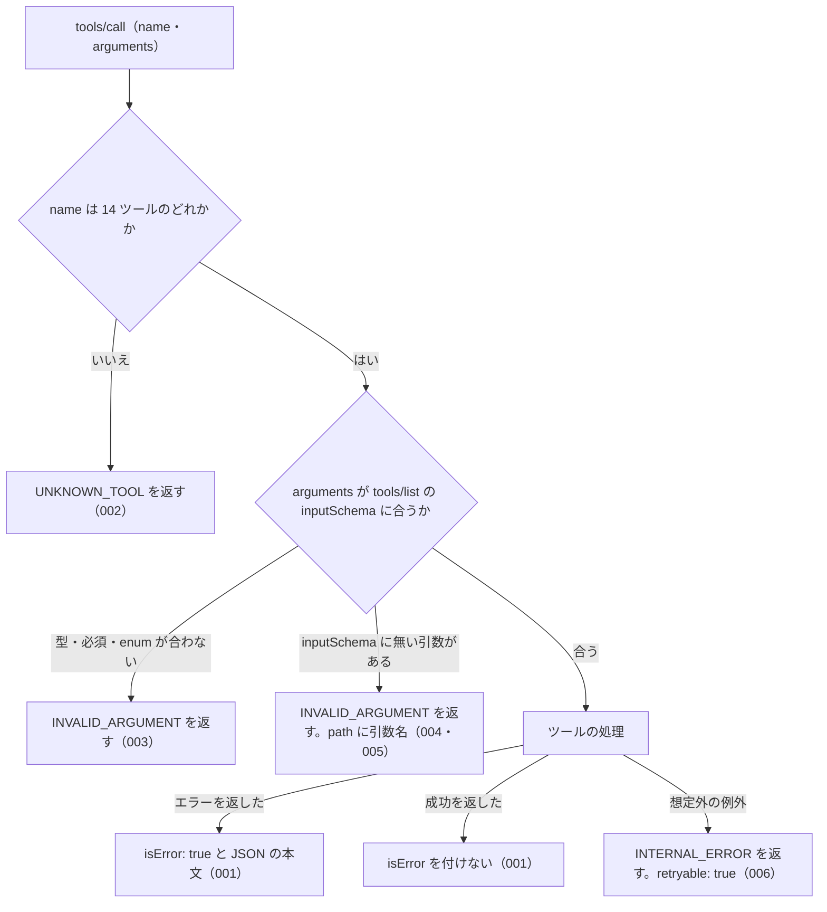

# 機能: common_errors（全ツールに共通するエラー応答の形と引数の検査）

- 機能 ID: NTA
- 種類: 共通
- 版: current
- 承認日: 2026-09-27 （PR #77）
- 起こした元: v0.21.0 の `src/server.ts`、`src/tools/tool-args.ts`、`src/errors.ts`、`src/tools/definitions.ts`、`src/tools/handlers.ts`（ツールの登録の表）、`src/server.test.ts`、`src/tools/handlers.test.ts`
- 関連する Issue:

この文書は、複数のツールに共通する、tools/call のエラー応答の形と引数の検査を書きます。どう実装しているか（関数名・テーブル名）は書きません。

## アクター

- MCP クライアント（Claude などの LLM、または CLI から呼ぶ人）。tools/call でツール名と引数を渡し、エラーのときは `isError: true` と JSON の本文を受け取って、`code` で失敗の種類を見分け、`hint` と `next_actions` で次に何をするかを決める

## 対象

この規則は、tools/call で呼べる次の 14 ツールすべてに当てはまる。どのツールも、tools/list の inputSchema と同じものを使って引数を検査してから、ツールの処理に進む。

| ツール                       | 当てはまる場面                                           |
| ---------------------------- | -------------------------------------------------------- |
| `nta_search_tsutatsu`        | 引数の検査、エラー応答の形、処理中の想定外の例外         |
| `nta_get_tsutatsu`           | 同上                                                     |
| `nta_search_qa`              | 同上                                                     |
| `nta_get_qa`                 | 同上                                                     |
| `nta_search_tax_answer`      | 同上                                                     |
| `nta_get_tax_answer`         | 同上                                                     |
| `nta_search_kaisei_tsutatsu` | 同上                                                     |
| `nta_get_kaisei_tsutatsu`    | 同上                                                     |
| `nta_search_jimu_unei`       | 同上                                                     |
| `nta_get_jimu_unei`          | 同上                                                     |
| `nta_search_bunshokaitou`    | 同上                                                     |
| `nta_get_bunshokaitou`       | 同上                                                     |
| `nta_inspect_pdf_meta`       | 同上                                                     |
| `resolve_abbreviation`       | 同上                                                     |
| 上の 14 個以外の名前         | 存在しないツール名のエラー（SPEC-NTA-COMMON-ERRORS-002） |

### エラー応答のフィールド

エラーの本文は、次のフィールドを持つ JSON オブジェクトである。`error` と `code` は必ず付き、ほかは値があるときだけ付く。

| フィールド                                                                                              | 内容                                                                                                                                                                                                                             |
| ------------------------------------------------------------------------------------------------------- | -------------------------------------------------------------------------------------------------------------------------------------------------------------------------------------------------------------------------------- |
| `error`                                                                                                 | 1 文のエラーの説明（人も LLM も読む）                                                                                                                                                                                            |
| `code`                                                                                                  | 失敗の種類を表す文字列（下の表）                                                                                                                                                                                                 |
| `hint`                                                                                                  | 次に何を確かめるかの案内                                                                                                                                                                                                         |
| `next_actions`                                                                                          | 次に呼ぶツールや取る手段の候補の配列。要素は `action`（ツール名、または `list_tools` / `retry_later` / `cli_bulk_download` / `delegate_to_mcp` のような手段の名前）・`reason`（どんなときに有効か）・`example`（引数の例。任意） |
| `retryable`                                                                                             | `true` なら、時間をおいて同じ呼び出しをやり直すと結果が変わりうる                                                                                                                                                                |
| `detail`                                                                                                | 調べるための詳細。`status`（HTTP ステータス）・`url`・`cause`（元の例外の文）・`issues`（引数の検査の問題の一覧）                                                                                                                |
| `tool`                                                                                                  | エラーが起きたツールの名前                                                                                                                                                                                                       |
| `url` / `resolved` / `available_clauses` / `searched_urls` / `available_doc_ids` / `supported_for_live` | ツール固有の補足。どのツールがどの場面で付けるかは各ツールの spec.md                                                                                                                                                             |

### エラーの code

どの場面でどの code を返すかは、存在しないツール名・引数の検査・処理中の想定外の例外を除いて、各ツールの spec.md に書く。

| code                                     | 失敗の種類                                                                                                               |
| ---------------------------------------- | ------------------------------------------------------------------------------------------------------------------------ |
| `INVALID_ARGUMENT`                       | 引数が inputSchema に合わない、または値の形がツールの受け付ける形でない（呼び出し側の誤り）                              |
| `UNKNOWN_TOOL`                           | 存在しないツール名を呼んだ（呼び出し側の誤り）                                                                           |
| `OUT_OF_SCOPE`                           | このサーバーの管轄でない資料を求めた（別の MCP サーバーで取る）                                                          |
| `ABBREVIATION_NOT_FOUND`                 | 略称辞書に無い名前を指定した                                                                                             |
| `TSUTATSU_NOT_FOUND`                     | 求めた通達（改正通達・事務運営指針を含む）、または検索の対象になる通達が、ローカル DB に無く国税庁サイトから取る先も無い |
| `ARTICLE_NOT_FOUND`                      | 通達はあるが、求めた条項が無い                                                                                           |
| `DOC_NOT_FOUND`                          | 求めた文書（または検索の対象になる文書）がローカル DB に無い                                                             |
| `SOURCE_API_ERROR`                       | 国税庁サイトからの取得に失敗した                                                                                         |
| `SOURCE_TIMEOUT` / `SOURCE_RATE_LIMITED` | 取得の時間切れ / 取得の回数制限。v0.21.0 ではどのツールも返さない                                                        |
| `INTERNAL_ERROR`                         | サーバー内部の失敗（ページの解析の失敗や、処理中の想定外の例外）                                                         |

## 処理の流れ

tools/call を受けてから応答を返すまでに、何をどの順で確かめるかを示します。図の中の番号は「できること」の仕様 ID の末尾 3 桁です。

## できること

### SPEC-NTA-COMMON-ERRORS-001 エラーは isError: true と JSON の本文で返し、成功には isError を付けない

ツールの処理がエラー（`error` と `code` を持つオブジェクト）を返したときは、tools/call の結果に `isError: true` を付け、`content` の先頭の `text` にそのエラーを JSON にした文字列を入れる。ツールの処理が付けた `code` や `hint` は、そのまま本文に入る。例: 処理が `code: "TSUTATSU_NOT_FOUND"`・`hint: "テスト用"` のエラーを返すと、結果は `isError: true` で、本文の `code` は `TSUTATSU_NOT_FOUND`、`hint` は `テスト用` である。

ツールの処理が成功を返したときは、`isError` を付けない（例: `resolve_abbreviation` に `abbr: "消基通"` を渡すと、`isError` の無い結果で、本文は JSON の応答）。

### SPEC-NTA-COMMON-ERRORS-002 存在しないツール名はエラー `UNKNOWN_TOOL`

tools/call の `name` が 14 ツールのどれでもないときは、エラー `UNKNOWN_TOOL` を返す（`isError: true`）。

- `hint` に、呼べるツール名の一覧（`nta_search_tsutatsu` など）を書く
- `next_actions` の先頭は `action: "list_tools"`（MCP の tools/list で呼べるツールを確かめる案内）

### SPEC-NTA-COMMON-ERRORS-003 inputSchema に合わない引数はエラー `INVALID_ARGUMENT`

引数の型が違う、必須の引数が無い、`enum` に無い値を渡した、のどれかのときは、ツールの処理に進まずにエラー `INVALID_ARGUMENT` を返す（`isError: true`）。14 ツールすべてが、tools/list に出している inputSchema と同じものでこの検査を行う。

- `tool` に、呼んだツールの名前を入れる
- `detail.issues` に問題の一覧を入れる。要素は `path`（問題のある引数名。入れ子なら `a.b` の形。特定できなければ空文字）と `message`

例: `resolve_abbreviation` に `abbr: 123` を渡すと、`code: "INVALID_ARGUMENT"`・`tool: "resolve_abbreviation"` で、`detail.issues[0].path` は `abbr`。`nta_search_tsutatsu` に引数を 1 つも渡さない（必須の `keyword` が無い）とき、`keyword: "軽減税率", type: "bogus"` を渡したときも、`INVALID_ARGUMENT` を返す。

### SPEC-NTA-COMMON-ERRORS-004 inputSchema に無い引数はエラー `INVALID_ARGUMENT` で、`path` にその引数名を入れる

inputSchema の `properties` に無い引数を渡したときは、エラー `INVALID_ARGUMENT` を返す（`isError: true`）。`detail.issues` の `path` に、その引数の名前を入れる。`tool` には呼んだツールの名前を入れる。

例: `nta_search_tsutatsu` に `keyword: "軽減税率", domain: "tax"` を渡すと、`code: "INVALID_ARGUMENT"`・`tool: "nta_search_tsutatsu"` で、`detail.issues[0].path` は `domain`。

### SPEC-NTA-COMMON-ERRORS-005 すべてのツールの inputSchema は、そこに無い引数を受け付けない

tools/list が返す 14 ツールの inputSchema には、どれも `additionalProperties: false` が付く。呼び出し側は tools/list を見て、どのツールでも inputSchema に無い引数は SPEC-NTA-COMMON-ERRORS-004 のエラーになると分かる。

### SPEC-NTA-COMMON-ERRORS-006 処理中の想定外の例外はエラー `INTERNAL_ERROR` で返す

ツールの処理の途中で想定外の例外が起きたときは、プロトコルのエラーにせず、tools/call の結果としてエラー `INTERNAL_ERROR` を返す（`isError: true`）。

- `retryable` は `true`
- `detail.cause` に、元の例外の文を入れる（例: 例外の文が `boom` なら `detail.cause` は `boom`）

## できないこと

- ツール固有のエラー（`ARTICLE_NOT_FOUND`・`DOC_NOT_FOUND` など）をどの場面で返すかを決めること（各ツールの spec.md に書く）
- inputSchema で表せない値の検査（識別子の形、税目の値など）。これは各ツールの処理で行い、各ツールの spec.md に書く
- エラーの本文を JSON 以外の形で返すこと（`format` に `markdown` を指定した呼び出しでも、エラーの本文は JSON）
- `retryable: true` のエラーを自動でやり直すこと（やり直すかは呼び出し側が決める）
- `legal_status`（応答に付ける資料の拘束力の注）。この文書の範囲に入れない

## 未決

初版起こしで見つけた、意図か不具合かを人が決める項目です。決まったら「できること」に ID を振るか、`specs/changes/` の差分にします。

意図か不具合かの判断が要る項目は houki-nta-mcp の Issue に移し、ここには題と Issue の番号だけを残します。今の振る舞いのままでよくテストが無いだけの項目は、受入テストを書いてから「できること」に ID を振ります。

1. **引数の検査のエラーの `hint`・`next_actions`・`error` の文面。** `hint` は「tools/list の <ツール名> の inputSchema を確認してください (型・必須・enum・未知の引数)」、`next_actions` は `action: "list_tools"`（inputSchema で引数の型と必須項目を確かめる案内）の 1 件、`error` は「引数が tools/list の inputSchema に合いません: <path>: <message>; …」。テストは `code`・`tool`・`detail.issues[0].path` しか確かめていない。ID を振るのは受入テストを書いてから。
2. **引数の検査に通らないときは、ツールの処理（DB・国税庁サイト・略称辞書）に進まない。** 今の振る舞いはそうなっているが、処理に進まなかったことを確かめるテストが無い。ID を振るのは受入テストを書いてから。
3. **`arguments` を省いた呼び出し。** 空のオブジェクトを渡したものとして検査する（14 ツールとも必須の引数があるので `INVALID_ARGUMENT` になる）。テストが無い。ID を振るのは受入テストを書いてから。
4. **inputSchema に無い引数の `detail.issues` の `message` と、2 つ以上あるときの `path`。** `message` は「inputSchema に無い引数です」。inputSchema に無い引数が 2 つ以上あるときは、`path` にそれらの名前がすべて「, 」区切りで入り、問題 1 件ごとにどの引数かを分けない。どちらもテストが無い。問題ごとに引数を分けるかは人が決める。
5. **`UNKNOWN_TOOL` の `error` の文面と `tool`。** `error` は英語の「Unknown tool: <name>」で、ほかのエラーと違い日本語でない。`tool` は付かない。どちらもテストが無い。文面を揃えるかは人が決める。
6. **処理中の想定外の例外で返す `INTERNAL_ERROR` の `hint`・`next_actions`・`tool`・`error`。** `hint` は「バグの可能性があります。再現手順を添えて GitHub issue でご報告ください」、`next_actions` は `action: "retry_later"` の 1 件、`tool` は呼んだツールの名前、`error` は「内部エラーが発生しました: <例外の文>」。テストは `code`・`retryable`・`detail.cause` しか確かめていない。ID を振るのは受入テストを書いてから。
7. **`INTERNAL_ERROR` の `retryable` がツールと場面で揃わない。** 処理中の想定外の例外では `retryable: true` と再試行の案内を付けるが、`hint` ではバグの可能性として報告を求めている。一方、`nta_get_tsutatsu`・`nta_get_qa`・`nta_get_tax_answer` がページの解析の失敗で返す `INTERNAL_ERROR` には `retryable` が付かない。同じ code で再試行してよいかの扱いが違う。どちらに揃えるかは人が決める。
8. **値の無いフィールドを付けない規則。** `hint` が空文字のとき、`next_actions` が空の配列のときは付けない。`retryable` は値を決めたエラーにだけ付き、付かないエラーを「再試行しても変わらない」と読んでよいかは決めていない。テストが無い。ID を振るのは受入テストを書いてから。
9. **`SOURCE_TIMEOUT` と `SOURCE_RATE_LIMITED`。** code の一覧にはあるが、v0.21.0 ではどのツールも返さない（取得の時間切れも `SOURCE_API_ERROR` になる）。一覧に残すか、取得の失敗を分けて返すかは人が決める。
