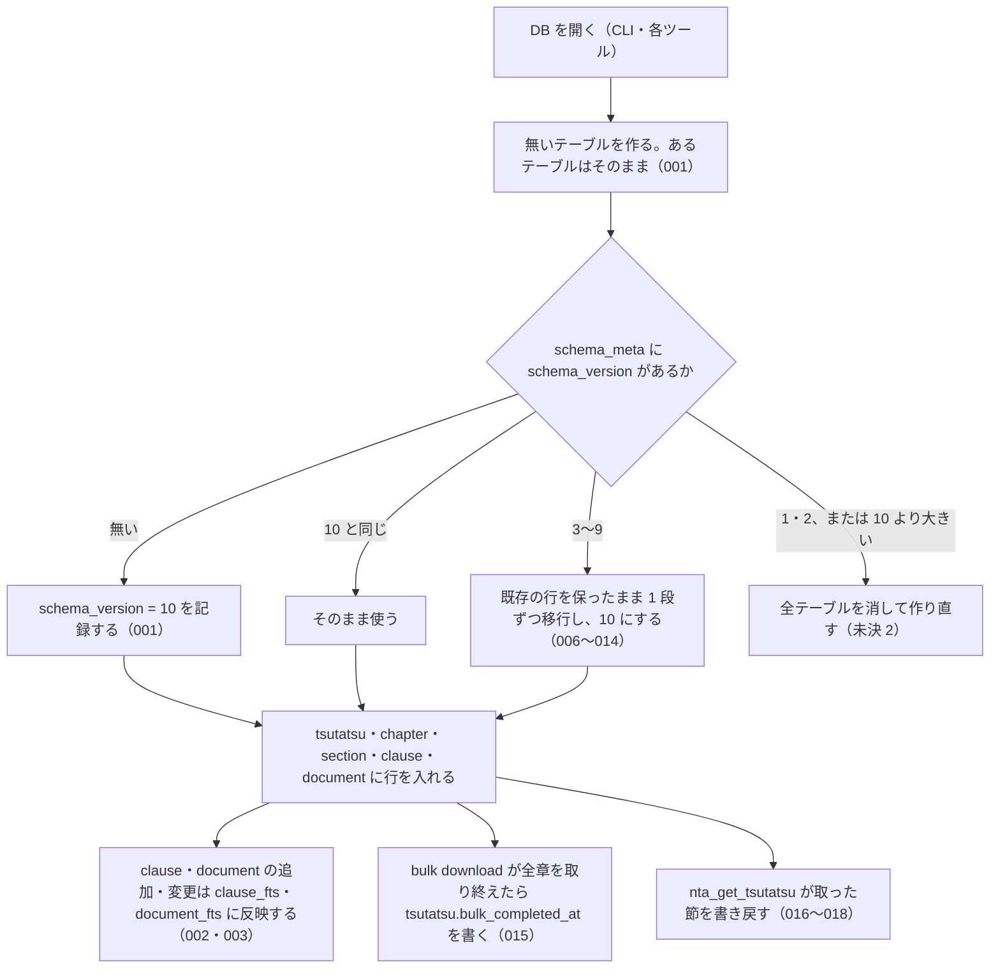

# 機能: db_schema（通達と文書を持つローカル SQLite DB の版・移行・書き戻し）

- 機能 ID: NTA
- 種類: DB
- 版: current
- 承認日:
- 起こした元: v0.21.2 の `src/db/index.ts`、`src/db/schema.ts`、`src/services/bulk-downloader.ts`（`bulk_completed_at` と書き戻し）、`src/db/schema.test.ts`、`src/services/db-writeback.test.ts`、`src/services/bulk-downloader.test.ts`
- 関連する Issue: houki-nta-mcp #27（全角英字の揃え方。版 4 → 5）、#29（`structured_json`。版 5 → 6）、#30（`orphaned_at`。版 6 → 7）、#45（案内文の行を除く。版 7 → 8・8 → 9）、#54（`bulk_completed_at` と `tsutatsu_toc`。版 9 → 10）

この文書は「利用者の手元にできる DB が何を持ち、版を上げたときにどうなるか」を書きます。どう実装しているか（関数名）は書きません。テーブル名・列名は、利用者が sqlite3 で開いて見られ、検索・取得ツールの応答の元になる外から見える約束なので書きます。

## アクター

- 利用者（CLI の `--bulk-download*` で DB を作り、`--refresh` / `--refresh-stale` で最新化し、sqlite3 で直接開くこともある人）。版の違う houki-nta-mcp で同じ DB ファイルを開いたときに、取り込んだ中身が残るかどうかを知りたい
- MCP クライアント（`nta_search_*` / `nta_get_*` / `nta_inspect_pdf_meta` を呼ぶと、サーバーが呼び出しごとにこの DB を開いて引き、閉じる）

## 入力

利用者がこの DB に触れる入口は次のとおり。

| 入口 | 必須 | 内容 |
|---|---|---|
| 環境変数 `HOUKI_NTA_DB_PATH` | 任意 | DB ファイルのパスをまるごと指定する。ほかの指定より優先する（未決 1） |
| 環境変数 `XDG_CACHE_HOME` | 任意 | `HOUKI_NTA_DB_PATH` が無いとき、`$XDG_CACHE_HOME/houki-nta-mcp/cache.db` に置く。これも無いときは `~/.cache/houki-nta-mcp/cache.db`（未決 1） |
| CLI `--db-path=<path>` | 任意 | CLI の処理でだけ、環境変数より優先して DB ファイルの場所を指定する（cli_entry の spec.md） |
| CLI `--bulk-download*` / `--quickstart` / `--refresh-stale=<日数> --apply` | 任意 | DB に書き込む（取り込みの中身は cli_bulk_download・cli_refresh の spec.md） |
| ツール `nta_get_tsutatsu` | 任意 | 国税庁サイトから取った節を DB に書き戻す（SPEC-NTA-GET-TSUTATSU-006。書き戻しで DB がどうなるかはこの文書） |
| ツール `nta_search_*` / `nta_get_*` / `nta_inspect_pdf_meta` | 任意 | 呼び出しごとに DB を開いて引き、閉じる（各ツールの spec.md） |

## 処理の流れ

DB を開いたときに何が起きるかを示します。図の中の番号は「できること」の仕様 ID の末尾 3 桁です。

## できること

### SPEC-NTA-DB-SCHEMA-001 DB を開くとテーブルを作り、スキーマの版 10 を記録する

新しい DB を開くと、次のテーブルを作り、`schema_meta` テーブルに `key = 'schema_version'`、`value = '10'` の行を記録する。v0.21.2 のスキーマの版は 10 である。既にテーブルのある DB を開いても、テーブルは残る。

| テーブル | 内容 |
|---|---|
| `schema_meta` | スキーマの版を `key` と `value` で持つ |
| `tsutatsu` | 基本通達 1 つにつき 1 行（`formal_name`・`abbr`・`source_root_url`・`bulk_completed_at`） |
| `tsutatsu_toc` | 目次ページの解析結果。目次の URL が主キー |
| `chapter` | 通達の章 |
| `section` | 通達の節。`fetched_at`・`content_hash`・`last_modified`・`etag` を持つ |
| `clause` | 通達の条項 1 つにつき 1 行（`clause_number`・`source_url`・`title`・`full_text`・`paragraphs_json`） |
| `clause_fts` | 条項の条番号・題名・本文の全文検索の索引 |
| `document` | 改正通達・事務運営指針・文書回答事例・タックスアンサー・質疑応答事例 1 件につき 1 行（`doc_type`・`doc_id`・`taxonomy`・`title`・`issued_at`・`source_url`・`fetched_at`・`full_text`・`attached_pdfs_json`・`content_hash`・`last_modified`・`etag`・`structured_json`・`orphaned_at`） |
| `document_fts` | 文書の題名・本文の全文検索の索引 |

### SPEC-NTA-DB-SCHEMA-002 clause に入れた条項は clause_fts で引ける

`clause` に行を入れると、その `clause_number`・`title`・`full_text` が `clause_fts` に入る。例: `title` が `納税義務が免除される` の条項 `1-4-1` を入れると、`clause_fts MATCH '納税義務'` でその条項が当たる。

### SPEC-NTA-DB-SCHEMA-003 clause を書き換えると clause_fts も新しい本文で引ける

`clause` の行の `full_text` を書き換えると、`clause_fts` で新しい本文の語で当たる。例: `full_text` を `更新後テキスト 軽減税率` に書き換えると、`clause_fts MATCH '軽減税率'` で 1 件当たる。

### SPEC-NTA-DB-SCHEMA-004 同じ通達の同じ条番号の条項は 1 行だけで、条番号から取得元 URL を引ける

`clause` は `(tsutatsu_id, clause_number)` で一意である。同じ通達に同じ条番号の行をもう一度入れると、一意制約の違反で入らない。`tsutatsu_id` と `clause_number` で引くと、その条項の `source_url`（取得元のページの URL）が取れる。例: 条項 `1-4-1` を `https://x/01/04.htm` から入れた後、同じ条番号を入れようとするとエラーになり、`1-4-1` で引くと `source_url` は `https://x/01/04.htm`。

### SPEC-NTA-DB-SCHEMA-005 section と document は条件付き取得のための last_modified と etag を持つ

`section` と `document` は `last_modified` と `etag` の列を持ち、`section` は `content_hash` の列も持つ。次の取り込みで、国税庁サイトへ `If-Modified-Since` / `If-None-Match` を送るために使う（cli_refresh の spec.md）。

### SPEC-NTA-DB-SCHEMA-006 版 3 の DB を開くと、既存の行を保ったまま最新の版まで順に移行する

`schema_meta` の `schema_version` が `3` の DB（`section` と `document` に `last_modified`・`etag` が無い）を開くと、列を足して版 4 にし、そこから版 10 まで 1 段ずつ移行する。`section` の行は残り、`last_modified`・`etag` は NULL のまま、`content_hash` は未計算（NULL）に戻る（SPEC-NTA-DB-SCHEMA-009）。移行が終わると `schema_version` は `10` になる。

例: 版 3 の DB に `section` の行（`title` が `第1章第1節`、`content_hash` が `pre-existing-hash`）を入れて開くと、`title` は `第1章第1節` のまま、`last_modified`・`etag`・`content_hash` は NULL、`schema_version` は `10`。

### SPEC-NTA-DB-SCHEMA-007 版 4 の DB を開くと、clause・section・document の文字列を共通の揃え方で入れ直す

`schema_version` が `4` の DB（全角英字を半角にしない揃え方で入れた行がある）を開くと、国税庁サイトを取りに行かずに、DB の中の文字列を SPEC-NTA-SEARCH-RULES-007 の揃え方で入れ直し、`schema_version` を `10` にする。もう一度開いても何も変わらない。

- `clause`: `clause_number`・`title`・`full_text`・`paragraphs_json` の各段落の `text`。例: `Ａ－１` → `A-1`、`ＮＩＳＡの取扱い` → `NISAの取扱い`、`ｅ－Ｔａｘで提出する` → `e-Taxで提出する`
- `section`: `title`。例: `ＮＩＳＡ関係` → `NISA関係`
- `document`: `title`・`full_text`。例: `ＮＩＳＡ制度` → `NISA制度`、`ＮＩＳＡの概要` → `NISAの概要`

### SPEC-NTA-DB-SCHEMA-008 入れ直した後は半角の語で全文検索が当たる

SPEC-NTA-DB-SCHEMA-007 で入れ直した後は、`clause_fts MATCH 'NISA'` で条項が、`document_fts MATCH 'NISA'` で文書が当たる。

### SPEC-NTA-DB-SCHEMA-009 入れ直しでは section の content_hash を未計算に戻し、document の content_hash は計算し直す

SPEC-NTA-DB-SCHEMA-007 の入れ直しで、`section.content_hash` は NULL（未計算）に戻す。次の取り込みでその節を入れ直したときに付き直る。`document.content_hash` は、入れ直した `title`・`full_text` で `doc_type`・`doc_id`・`title`・`full_text` を改行で連結した SHA-1 を計算し直す（次の取り込みで全件が「更新された」と数えられないため）。例: `document` の行の `content_hash` が `old-hash` なら、入れ直した後は `tax-answer`・`1535`・`NISA制度`・`NISAの概要` から計算した SHA-1 になる。

### SPEC-NTA-DB-SCHEMA-010 版 5 の DB を開くと document に structured_json 列を足し、既存の行は変えない

`schema_version` が `5` の DB（`document` に `structured_json` が無い）を開くと、`structured_json` 列を足して版 10 まで移行する。既存の行は消えず、`title`・`full_text`・`content_hash` は変えず、`structured_json` は NULL のまま残る。もう一度開いても行数と `schema_version` は変わらない。

### SPEC-NTA-DB-SCHEMA-011 版 6 の DB を開くと document に orphaned_at 列を足し、既存の行は変えない

`schema_version` が `6` の DB（`document` に `orphaned_at` が無い）を開くと、`orphaned_at` 列を足して版 10 まで移行する。既存の行は消えず、`content_hash` は変えず、`orphaned_at` は NULL（国税庁の索引にある）のまま残る。

### SPEC-NTA-DB-SCHEMA-012 版 7 の DB を開くと、文書回答事例の本文から国税庁サイトの案内文の行を除く

`schema_version` が `7` の DB を開くと、`doc_type = 'bunshokaitou'` の行の `full_text` から、国税庁サイトの案内文の行（`←上記照会の内容に対する回答はこちら` など）を除き、版 10 まで移行する。国税庁サイトは取りに行かない。もう一度開いても何も変わらない。

- 案内文を除いた行は、`content_hash` を除いた後の本文で計算し直す（SPEC-NTA-DB-SCHEMA-009 と同じ式）。`content_hash` が NULL だった行は本文だけ直り、NULL のまま
- 案内文の無い行は `full_text` も `content_hash` も変わらない
- ほかの種別（`tax-answer` など）の行は、同じ文言があっても変えない
- `document_fts` からも案内文が消える。例: `document_fts MATCH '"回答はこちら"'` は、`tax-answer` の行だけを返す

例: `full_text` が `回答内容: 貴見のとおり\n【別紙】\n照会の趣旨\n以上\n←上記照会の内容に対する回答はこちら` の行は、`以上` で終わる本文になる。

### SPEC-NTA-DB-SCHEMA-013 版 8 の DB を開くと、改正通達・事務運営指針の本文からも案内文の行を除く

`schema_version` が `8` の DB を開くと、`doc_type` が `kaisei`・`jimu-unei` の行の `full_text` から、案内文の行（`※PDFファイルが開けない、印刷できないなどの場合はこちらをご覧ください。`）を除き、版 10 まで移行する。`content_hash` の扱い、案内文の無い行、`document_fts` への反映は SPEC-NTA-DB-SCHEMA-012 と同じ。もう一度開いても何も変わらない。

例: 改正通達の行の `full_text` の末尾にこの案内文があれば、それを除いた本文になり、`content_hash` は `kaisei`・`0026003-067`・題名・除いた後の本文から計算した SHA-1 になる。`document_fts MATCH '"PDFファイルが開けない"'` は 0 件。

### SPEC-NTA-DB-SCHEMA-014 版 9 の DB を開くと tsutatsu に bulk_completed_at を足し、bulk download 済みの通達だけ埋める

`schema_version` が `9` の DB（`tsutatsu` に `bulk_completed_at` が無く、`tsutatsu_toc` が無い）を開くと、`bulk_completed_at` 列と `tsutatsu_toc` テーブルを足して版 10 にする。国税庁サイトは取りに行かない。

- `last_modified` か `etag` の入った `section` を持つ通達（bulk download が節を書いた通達）は、その節の `fetched_at` の最大値を `bulk_completed_at` に入れる。例: 消費税法基本通達の節の `fetched_at` が `2026-09-01T00:00:00.000Z`（`last_modified` あり）と `2026-09-02T00:00:00.000Z`（`etag` あり）なら `2026-09-02T00:00:00.000Z`
- `last_modified` も `etag` も無い `section` しか持たない通達（`nta_get_tsutatsu` が国税庁サイトから取って書き戻した節だけの通達）は NULL のまま
- もう一度開いても値は変わらない

### SPEC-NTA-DB-SCHEMA-015 bulk download は全章を取り終えたときだけ tsutatsu.bulk_completed_at に終了時刻を書く

通達 1 つの bulk download（`--bulk-download` / `--bulk-download-all` / `--quickstart` / `--bulk-download-everything` の通達本体）が全章を取り終えると、その通達の `bulk_completed_at` に終了時刻（`finishedAt`）を書く。章を絞った実行では書かない。`nta_get_tsutatsu` はこの値のある通達だけ、DB に無い条項を `ARTICLE_NOT_FOUND` で返して国税庁サイトに取りに行かない（SPEC-NTA-GET-TSUTATSU-005）。

### SPEC-NTA-DB-SCHEMA-016 国税庁サイトから取った節の書き戻しは、通達・章・節・条項を作り、DB から引けるようにする

`nta_get_tsutatsu` が国税庁サイトから取った節（SPEC-NTA-GET-TSUTATSU-006）を書き戻すと、`tsutatsu`（無ければ作る）・`chapter`・`section`・`clause` の行ができ、書き戻した条項の数を返す。次からはその通達と条番号で DB から引ける。`clause` の `source_url` は節のページの URL、`fetched_at` は取得した日時のまま。

例: 消費税法基本通達の第 1 章第 4 節（`https://www.nta.go.jp/law/tsutatsu/kihon/shohi/01/04.htm`）の条項 `1-4-1`・`1-4-2` を書き戻すと 2 を返し、`1-4-1` を引くと `title` は `個人事業者と給与所得者の区分`、`sourceUrl` はそのページの URL、`fetchedAt` は書き戻したときに渡した日時。

### SPEC-NTA-DB-SCHEMA-017 同じ条項をもう一度書き戻すと、新しい内容で置き換える

既に DB にある条番号を書き戻すと、一意制約の違反にならず、その行を新しい内容で置き換える。例: 条項 `1-1-1` を `title` が `v1` で書き戻した後、`v2` で書き戻すと、どちらも 1 を返し、DB の `title` は `v2`。

### SPEC-NTA-DB-SCHEMA-018 書き戻しに失敗しても例外にせず 0 を返す

書き戻しが失敗したとき（例: 閉じた DB に書こうとした）は、例外を投げずに 0 を返す。`nta_get_tsutatsu` の応答は変わらない。

## できないこと

- DB を消したり中身を空にしたりする CLI やツールは無い（空にするには利用者がファイルを消す。未決 4）
- 版 3 より前の DB と、10 より大きい版の DB を、中身を保ったまま使うこと（作り直す。未決 2）
- 文書系（`document`）の行を DB から消すこと（国税庁の索引から消えた文書も `orphaned_at` を付けて残す。SPEC-NTA-SEARCH-RULES-011）
- `nta_get_tsutatsu` 以外のツールが DB に書くこと（`nta_get_qa` / `nta_get_tax_answer` の書き戻しは各ツールの spec.md）

## 未決

初版起こしで見つけた、意図か不具合かを人が決める項目です。決まったら「できること」に ID を振るか、`specs/changes/` の差分にします。

意図か不具合かの判断が要る項目は houki-nta-mcp の Issue に移し、ここには題と Issue の番号だけを残します。今の振る舞いのままでよくテストが無いだけの項目は、受入テストを書いてから「できること」に ID を振ります。

1. **DB の置き場所と環境変数。** `HOUKI_NTA_DB_PATH` があればそのパス、無ければ `$XDG_CACHE_HOME/houki-nta-mcp/cache.db`、どちらも無ければ `~/.cache/houki-nta-mcp/cache.db`。置き場所のディレクトリが無ければ途中のディレクトリも含めて作る。`XDG_CACHE_HOME` が空文字のときは無いときと同じに扱う。どれもテストが無い（houki-egov-mcp の SPEC-EGOV-DB-SCHEMA-012〜015 に当たる）。ID を振るのは受入テストを書いてから。
2. **版 3 より前、または 10 より大きい版の DB を開くと、全テーブルを消して作り直す。** 版 1・2 の DB（v0.3.0 より前）と、新しい版の houki-nta-mcp で作った DB を古い版で開いたときは、取り込んだ中身がすべて消える。後者は、MCP クライアントが古い版のサーバーを起動しただけで起きる。テストが無い。消さずに止めるか、今のままかは人が決める（houki-egov-mcp #60 と同じ問題）。
3. **DB は WAL で開き、外部キーの制約を有効にする。** `PRAGMA journal_mode = WAL`・`PRAGMA foreign_keys = ON`。`tsutatsu` の行を消すと、その `chapter`・`section`・`clause` も消える（`ON DELETE CASCADE`）。テストが無い。ID を振るのは受入テストを書いてから。
4. **全データを消す機能がテストにだけある。** `clearAllData`（`document`・`clause`・`section`・`chapter`・`tsutatsu_toc`・`tsutatsu` を空にし、索引を作り直す）はテストからしか呼ばれず、CLI にもツールにも出口が無い。`src/db/index.ts` の説明には環境変数 `HOUKI_NTA_REFRESH=1` で起動時に DB を消すと書いてあるが、その環境変数を読む実装は無い。説明を直すか、出口を作るかは人が決める。
5. **MCP サーバーは呼び出しごとに DB を開いて閉じ、そのたびにスキーマの移行が走りうる。** 取り込み中に検索を呼んだときの読み取りの扱い（houki-egov-mcp の SPEC-EGOV-DB-SCHEMA-023 に当たる）と、古い版の DB を初めて開くのが MCP サーバーの呼び出しだったときの移行の時間は、テストも文書も無い。ID を振るのは受入テストを書いてから。
6. **`document` の `doc_type` と `taxonomy` の値の範囲。** `doc_type` は `kaisei` / `jimu-unei` / `bunshokaitou` / `tax-answer` / `qa-jirei` の 5 つを想定しているが、列に制約は無く、どの値でも入る。`(doc_type, doc_id)` の一意制約だけがある。値の範囲を仕様にするかは人が決める。
7. **書き戻しの `bulk_completed_at`。** 書き戻し（SPEC-NTA-DB-SCHEMA-016）は `bulk_completed_at` を書かないとコードから読めるが、テストは版 9 → 10 の移行（SPEC-NTA-DB-SCHEMA-014）でしか確かめていない。ID を振るのは受入テストを書いてから。
8. **`tsutatsu_toc` の使い方。** 目次の URL を鍵に、`nta_get_tsutatsu` が候補ページを決めるために使い回す。使い回す期間は無く、条項が見つからないときにだけ条件付き取得で取り直す（SPEC-NTA-GET-TSUTATSU-014）。表ができること以外（行の中身・取り直し）はこの文書ではテストと結び付けていない。ID を振るのは受入テストを書いてから。
