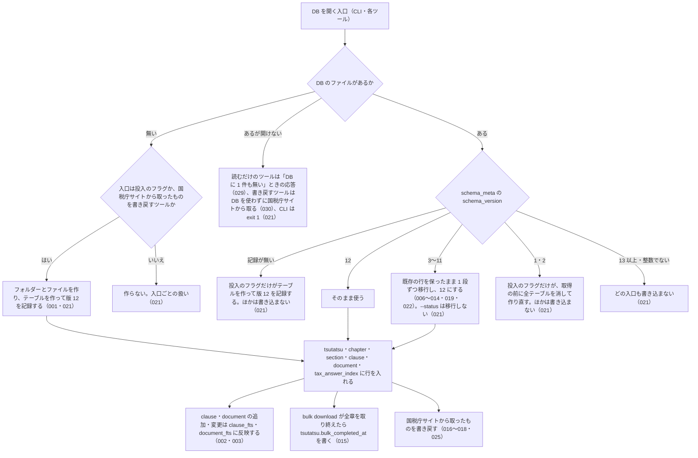

# 機能: db_schema（通達と文書を持つローカル SQLite DB の版・移行・書き戻し）

- 機能 ID: NTA
- 種類: DB
- 版: current
- 承認日: 2026-09-29（PR #103）。差分 `20261001-t3-normalize` は 2026-10-01（PR #119）。差分 `20261003-db-cli` は 2026-10-04（PR #135）。差分 `20261004-db-location` は 2026-10-05（PR #142）。差分 `20261006-db-failure-paths` は 2026-10-06（PR #152）
- 起こした元: v0.21.2 の `src/db/index.ts`、`src/db/schema.ts`、`src/services/bulk-downloader.ts`（`bulk_completed_at` と書き戻し）、`src/db/schema.test.ts`、`src/services/db-writeback.test.ts`、`src/services/bulk-downloader.test.ts`
- 関連する Issue: houki-nta-mcp #27（全角英字の揃え方。版 4 → 5）、#29（`structured_json`。版 5 → 6）、#30（`orphaned_at`。版 6 → 7）、#45（案内文の行を除く。版 7 → 8・8 → 9）、#54（`bulk_completed_at` と `tsutatsu_toc`。版 9 → 10）、#107・#112・#128（版 11 → 12。DB の状態と入口ごとの扱い、doc_type の CHECK、タックスアンサーの索引）、#138（DB の場所の見え方。0.25.0）、#137（保存したタックスアンサーの索引を読めないとき。0.25.0）、#144（開けない DB の読むだけのツールの応答と書き戻すツールの扱い。0.26.0）、#145（--bulk-download-tax-answer が索引を保存できないとき。0.26.0）

この文書は「利用者の手元にできる DB が何を持ち、版を上げたときにどうなるか」を書きます。どう実装しているか（関数名）は書きません。テーブル名・列名は、利用者が sqlite3 で開いて見られ、検索・取得ツールの応答の元になる外から見える約束なので書きます。

## アクター

- 利用者（CLI の `--bulk-download*` で DB を作り、`--refresh` / `--refresh-stale` で最新化し、sqlite3 で直接開くこともある人）。版の違う houki-nta-mcp で同じ DB ファイルを開いたときに、取り込んだ中身が残るかどうかを知りたい
- MCP クライアント（`nta_search_*` / `nta_get_*` / `nta_inspect_pdf_meta` を呼ぶと、サーバーが呼び出しごとにこの DB を開いて引き、閉じる）

## 入力

利用者がこの DB に触れる入口は次のとおり。

| 入口                                                                       | 必須 | 内容                                                                                                                                          |
| -------------------------------------------------------------------------- | ---- | --------------------------------------------------------------------------------------------------------------------------------------------- |
| 環境変数 `HOUKI_NTA_DB_PATH`                                               | 任意 | DB ファイルのパスをまるごと指定する。ほかの指定より優先する（未決 1）                                                                         |
| 環境変数 `XDG_CACHE_HOME`                                                  | 任意 | `HOUKI_NTA_DB_PATH` が無いとき、`$XDG_CACHE_HOME/houki-nta-mcp/cache.db` に置く。これも無いときは `~/.cache/houki-nta-mcp/cache.db`（未決 1） |
| CLI `--db-path=<path>`                                                     | 任意 | CLI の処理でだけ、環境変数より優先して DB ファイルの場所を指定する（cli_entry の spec.md）                                                    |
| CLI `--quickstart` / `--bulk-download*`                                    | 任意 | DB を作る・移行できない古い版の DB を作り直すことができる入口（SPEC-NTA-DB-SCHEMA-021）。取り込みの中身は cli_bulk_download |
| CLI `--refresh-stale=<日数>`（`--apply` の有無）                           | 任意 | DB を作らない。`--apply` のときだけ書き込む（SPEC-NTA-DB-SCHEMA-021。中身は cli_refresh） |
| CLI `--status` | 任意 | DB を作らず、移行もしない。読むだけ（SPEC-NTA-DB-SCHEMA-021、cli_status の spec.md） |
| ツール `nta_get_tsutatsu` / `nta_get_qa` / `nta_get_tax_answer`           | 任意 | 国税庁サイトから取ったもの（条項・事例・記事・目次・タックスアンサーの索引）を DB に書き戻す。DB のファイルが無ければ作る（SPEC-NTA-DB-SCHEMA-021） |
| ツール `nta_search_*`（6 つ）/ `nta_get_kaisei_tsutatsu` / `nta_get_jimu_unei` / `nta_get_bunshokaitou` / `nta_inspect_pdf_meta` | 任意 | 呼び出しごとに DB を開いて引き、閉じる。DB のファイルを作らない（SPEC-NTA-DB-SCHEMA-021） |

## 処理の流れ

DB を開いたときに何が起きるかを示します。図の中の番号は「できること」の仕様 ID の末尾 3 桁です。



## できること

### SPEC-NTA-DB-SCHEMA-001 DB を作るとテーブルを作り、スキーマの版 12 を記録する

DB を作ることができる入口（SPEC-NTA-DB-SCHEMA-021）が新しい DB を作ると、次のテーブルを作り、`schema_meta` テーブルに `key = 'schema_version'`、`value = '12'` の行を記録する。v0.24.0 のスキーマの版は 12 である（v0.22.0〜v0.23.x は 11）。既にテーブルのある版 12 の DB を開いても、テーブルは残る。

| テーブル                 | 内容                                                                                                                                                                                                                                                                                     |
| ------------------------ | ---------------------------------------------------------------------------------------------------------------------------------------------------------------------------------------------------------------------------------------------------------------------------------------- |
| `schema_meta`            | スキーマの版を `key` と `value` で持つ                                                                                                                                                                                                                                                   |
| `tsutatsu`               | 基本通達 1 つにつき 1 行（`formal_name`・`abbr`・`source_root_url`・`bulk_completed_at`）                                                                                                                                                                                                |
| `tsutatsu_toc`           | 目次ページの解析結果。目次の URL が主キー                                                                                                                                                                                                                                                |
| `chapter`                | 通達の章                                                                                                                                                                                                                                                                                 |
| `section`                | 通達の節。`fetched_at`・`content_hash`・`last_modified`・`etag` を持つ                                                                                                                                                                                                                   |
| `clause`                 | 通達の条項 1 つにつき 1 行（`clause_number`・`source_url`・`title`・`full_text`・`paragraphs_json`）                                                                                                                                                                                     |
| `clause_fts`             | 条項の条番号・題名・本文の全文検索の索引                                                                                                                                                                                                                                                 |
| `document`               | 改正通達・事務運営指針・文書回答事例・タックスアンサー・質疑応答事例 1 件につき 1 行（`doc_type`・`doc_id`・`taxonomy`・`title`・`issued_at`・`source_url`・`fetched_at`・`full_text`・`attached_pdfs_json`・`content_hash`・`last_modified`・`etag`・`structured_json`・`orphaned_at`） |
| `document_fts`           | 文書の題名・本文の全文検索の索引                                                                                                                                                                                                                                                         |
| `tax_answer_index`       | 国税庁のタックスアンサーの索引の 1 記事につき 1 行（`no`・`url`・`taxonomy`・`title`。SPEC-NTA-DB-SCHEMA-025）                                                                                                                                                                          |
| `tax_answer_index_page`  | タックスアンサーの索引のページを取った記録（`url`・`fetched_at`・`last_modified`・`etag`。SPEC-NTA-DB-SCHEMA-025）                                                                                                                                                                      |

### SPEC-NTA-DB-SCHEMA-002 clause に入れた条項は clause_fts で引ける

`clause` に行を入れると、その `clause_number`・`title`・`full_text` が `clause_fts` に入る。例: `title` が `納税義務が免除される` の条項 `1-4-1` を入れると、`clause_fts MATCH '納税義務'` でその条項が当たる。

### SPEC-NTA-DB-SCHEMA-003 clause を書き換えると clause_fts も新しい本文で引ける

`clause` の行の `full_text` を書き換えると、`clause_fts` で新しい本文の語で当たる。例: `full_text` を `更新後テキスト 軽減税率` に書き換えると、`clause_fts MATCH '軽減税率'` で 1 件当たる。

### SPEC-NTA-DB-SCHEMA-004 同じ通達の同じ条番号の条項は 1 行だけで、条番号から取得元 URL を引ける

`clause` は `(tsutatsu_id, clause_number)` で一意である。同じ通達に同じ条番号の行をもう一度入れると、一意制約の違反で入らない。`tsutatsu_id` と `clause_number` で引くと、その条項の `source_url`（取得元のページの URL）が取れる。例: 条項 `1-4-1` を `https://x/01/04.htm` から入れた後、同じ条番号を入れようとするとエラーになり、`1-4-1` で引くと `source_url` は `https://x/01/04.htm`。

### SPEC-NTA-DB-SCHEMA-005 section と document は条件付き取得のための last_modified と etag を持つ

`section` と `document` は `last_modified` と `etag` の列を持ち、`section` は `content_hash` の列も持つ。次の取り込みで、国税庁サイトへ `If-Modified-Since` / `If-None-Match` を送るために使う（cli_refresh の spec.md）。

### SPEC-NTA-DB-SCHEMA-006 版 3 の DB を開くと、既存の行を保ったまま最新の版まで順に移行する

`schema_meta` の `schema_version` が `3` の DB（`section` と `document` に `last_modified`・`etag` が無い）を開くと、列を足して版 4 にし、そこから最新の版（SPEC-NTA-DB-SCHEMA-001）まで 1 段ずつ移行する。`section` の行は残り、`last_modified`・`etag` は NULL のまま、`content_hash` は未計算（NULL）に戻る（SPEC-NTA-DB-SCHEMA-009）。移行が終わると `schema_version` は最新の版（v0.24.0 では `12`）になる。

例: 版 3 の DB に `section` の行（`title` が `第1章第1節`、`content_hash` が `pre-existing-hash`）を入れて開くと、`title` は `第1章第1節` のまま、`last_modified`・`etag`・`content_hash` は NULL、`schema_version` は `12`。

### SPEC-NTA-DB-SCHEMA-007 版 4 の DB を開くと、clause・section・document の文字列を共通の揃え方で入れ直す

`schema_version` が `4` の DB（全角英字を半角にしない揃え方で入れた行がある）を開くと、国税庁サイトを取りに行かずに、DB の中の文字列を SPEC-NTA-SEARCH-RULES-007 の揃え方で入れ直し、最新の版まで移行する（`schema_version` は v0.24.0 では `12`）。もう一度開いても何も変わらない。

- `clause`: `clause_number`・`title`・`full_text`・`paragraphs_json` の各段落の `text`。例: `Ａ－１` → `A-1`、`ＮＩＳＡの取扱い` → `NISAの取扱い`、`ｅ－Ｔａｘで提出する` → `e-Taxで提出する`
- `section`: `title`。例: `ＮＩＳＡ関係` → `NISA関係`
- `document`: `title`・`full_text`。例: `ＮＩＳＡ制度` → `NISA制度`、`ＮＩＳＡの概要` → `NISAの概要`

### SPEC-NTA-DB-SCHEMA-008 入れ直した後は半角の語で全文検索が当たる

SPEC-NTA-DB-SCHEMA-007 で入れ直した後は、`clause_fts MATCH 'NISA'` で条項が、`document_fts MATCH 'NISA'` で文書が当たる。

### SPEC-NTA-DB-SCHEMA-009 入れ直しでは section の content_hash を未計算に戻し、document の content_hash は計算し直す

SPEC-NTA-DB-SCHEMA-007 の入れ直しで、`section.content_hash` は NULL（未計算）に戻す。次の取り込みでその節を入れ直したときに付き直る。`document.content_hash` は、入れ直した `title`・`full_text` で `doc_type`・`doc_id`・`title`・`full_text` を改行で連結した SHA-1 を計算し直す（次の取り込みで全件が「更新された」と数えられないため）。例: `document` の行の `content_hash` が `old-hash` なら、入れ直した後は `tax-answer`・`1535`・`NISA制度`・`NISAの概要` から計算した SHA-1 になる。

### SPEC-NTA-DB-SCHEMA-010 版 5 の DB を開くと document に structured_json 列を足し、既存の行は変えない

`schema_version` が `5` の DB（`document` に `structured_json` が無い）を開くと、`structured_json` 列を足して最新の版まで移行する。既存の行は消えず、`title`・`full_text`・`content_hash` は変えず、`structured_json` は NULL のまま残る。もう一度開いても行数と `schema_version` は変わらない。

### SPEC-NTA-DB-SCHEMA-011 版 6 の DB を開くと document に orphaned_at 列を足し、既存の行は変えない

`schema_version` が `6` の DB（`document` に `orphaned_at` が無い）を開くと、`orphaned_at` 列を足して最新の版まで移行する。既存の行は消えず、`content_hash` は変えず、`orphaned_at` は NULL（国税庁の索引にある）のまま残る。

### SPEC-NTA-DB-SCHEMA-012 版 7 の DB を開くと、文書回答事例の本文から国税庁サイトの案内文の行を除く

`schema_version` が `7` の DB を開くと、`doc_type = 'bunshokaitou'` の行の `full_text` から、国税庁サイトの案内文の行（`←上記照会の内容に対する回答はこちら` など）を除き、最新の版まで移行する。国税庁サイトは取りに行かない。もう一度開いても何も変わらない。

- 案内文を除いた行は、`content_hash` を除いた後の本文で計算し直す（SPEC-NTA-DB-SCHEMA-009 と同じ式）。`content_hash` が NULL だった行は本文だけ直り、NULL のまま
- 案内文の無い行は `full_text` も `content_hash` も変わらない
- ほかの種別（`tax-answer` など）の行は、同じ文言があっても変えない
- `document_fts` からも案内文が消える。例: `document_fts MATCH '"回答はこちら"'` は、`tax-answer` の行だけを返す

例: `full_text` が `回答内容: 貴見のとおり\n【別紙】\n照会の趣旨\n以上\n←上記照会の内容に対する回答はこちら` の行は、`以上` で終わる本文になる。

### SPEC-NTA-DB-SCHEMA-013 版 8 の DB を開くと、改正通達・事務運営指針の本文からも案内文の行を除く

`schema_version` が `8` の DB を開くと、`doc_type` が `kaisei`・`jimu-unei` の行の `full_text` から、案内文の行（`※PDFファイルが開けない、印刷できないなどの場合はこちらをご覧ください。`）を除き、最新の版まで移行する。`content_hash` の扱い、案内文の無い行、`document_fts` への反映は SPEC-NTA-DB-SCHEMA-012 と同じ。もう一度開いても何も変わらない。

例: 改正通達の行の `full_text` の末尾にこの案内文があれば、それを除いた本文になり、`content_hash` は `kaisei`・`0026003-067`・題名・除いた後の本文から計算した SHA-1 になる。`document_fts MATCH '"PDFファイルが開けない"'` は 0 件。

### SPEC-NTA-DB-SCHEMA-014 版 9 の DB を開くと tsutatsu に bulk_completed_at を足し、bulk download 済みの通達だけ埋める

`schema_version` が `9` の DB（`tsutatsu` に `bulk_completed_at` が無く、`tsutatsu_toc` が無い）を開くと、`bulk_completed_at` 列と `tsutatsu_toc` テーブルを足して最新の版まで移行する。国税庁サイトは取りに行かない。

- `last_modified` か `etag` の入った `section` を持つ通達（bulk download が節を書いた通達）は、その節の `fetched_at` の最大値を `bulk_completed_at` に入れる。例: 消費税法基本通達の節の `fetched_at` が `2026-09-01T00:00:00.000Z`（`last_modified` あり）と `2026-09-02T00:00:00.000Z`（`etag` あり）なら `2026-09-02T00:00:00.000Z`
- `last_modified` も `etag` も無い `section` しか持たない通達（`nta_get_tsutatsu` が国税庁サイトから取って書き戻した節だけの通達）は NULL のまま
- もう一度開いても値は変わらない

### SPEC-NTA-DB-SCHEMA-015 bulk download は全章を取り終えたときだけ tsutatsu.bulk_completed_at に終了時刻を書く

通達 1 つの bulk download（`--bulk-download` / `--bulk-download-all` / `--quickstart` / `--bulk-download-everything` の通達本体）が全章を取り終えると、その通達の `bulk_completed_at` に終了時刻（`finishedAt`）を書く。章を絞った実行では書かない。`nta_get_tsutatsu` はこの値のある通達だけ、DB に無い条項を `ARTICLE_NOT_FOUND` で返して国税庁サイトに取りに行かない（SPEC-NTA-GET-TSUTATSU-005）。

### SPEC-NTA-DB-SCHEMA-016 国税庁サイトから取った節の書き戻しは、通達・章・節・条項を作り、DB から引けるようにする

`nta_get_tsutatsu` が国税庁サイトから取った節（SPEC-NTA-GET-TSUTATSU-006）を書き戻すと、`tsutatsu`（無ければ作る）・`chapter`・`section`・`clause` の行ができ、書き戻した条項の数を返す。次からはその通達と条番号で DB から引ける。`clause` の `source_url` は節のページの URL、`fetched_at` は取得した日時のまま。

例: 消費税法基本通達の第 1 章第 4 節（`https://www.nta.go.jp/law/tsutatsu/kihon/shohi/01/04.htm`）の条項 `1-4-1`・`1-4-2` を書き戻すと 2 を返し、`1-4-1` を引くと `title` は `個人事業者と給与所得者の区分`、`sourceUrl` はそのページの URL、`fetchedAt` は書き戻したときに渡した日時。

### SPEC-NTA-DB-SCHEMA-017 同じ条項をもう一度書き戻すと、新しい内容で置き換える

既に DB にある条番号を書き戻すと、一意制約の違反にならず、その行を新しい内容で置き換える。例: 条項 `1-1-1` を `title` が `v1` で書き戻した後、`v2` で書き戻すと、どちらも 1 を返し、DB の `title` は `v2`。

### SPEC-NTA-DB-SCHEMA-018 書き戻しに失敗しても例外にせず 0 を返す

書き戻しが失敗したとき（例: 閉じた DB に書こうとした）は、例外を投げずに 0 を返す。`nta_get_tsutatsu` の応答は変わらない。

### SPEC-NTA-DB-SCHEMA-019 版 10 の DB を開くと、ダッシュ類も揃えた形で clause・section・document の文字列を入れ直し、最新の版まで移行する

`schema_version` が `10` の DB（ダッシュ類 `‐` `‑` `–` `—` `―` `−` を `-` にしない揃え方で入れた行がある）を開くと、国税庁サイトを取りに行かずに、DB の中の文字列を SPEC-NTA-SEARCH-RULES-007（houki-abbreviations 0.7.0 の `normalizeJpText`）の揃え方で入れ直し、最新の版まで移行する（`schema_version` は v0.24.0 では `12`）。もう一度開いても何も変わらない。入れ直す列は版 4 → 5 のとき（SPEC-NTA-DB-SCHEMA-007）と同じである。

- `clause`: `clause_number`・`title`・`full_text`・`paragraphs_json` の各段落の `text`。例: `1―4―13の2` → `1-4-13の2`
- `section`: `title`
- `document`: `title`・`full_text`。例: `課消２―11` → `課消2-11`

版 4 以前の DB は、007 の入れ直しの後にこの入れ直しも通る（順に移行する。SPEC-NTA-DB-SCHEMA-006）。

例: `document.full_text` に `課消２―11` を含む版 10 の DB を開くと、`schema_version` は `12` になり、その行の `full_text` は `課消2-11` を含み、`document_fts MATCH '課消2-11'` で当たる。

### SPEC-NTA-DB-SCHEMA-020 版 10 から 11 の入れ直しでも、section の content_hash を未計算に戻し、document の content_hash は計算し直す

SPEC-NTA-DB-SCHEMA-019 の入れ直しで、`section.content_hash` は NULL（未計算）に戻し、`document.content_hash` は入れ直した `title`・`full_text` で SPEC-NTA-DB-SCHEMA-009 と同じ式で計算し直す。次の取り込みで、変わっていない文書が「更新された」と数えられないようにするためである。

例: 入れ直した `document` の行の `content_hash` は、`doc_type`・`doc_id`・入れ直した `title`・入れ直した `full_text` を改行で連結した SHA-1 になる。

### SPEC-NTA-DB-SCHEMA-021 DB の状態と入口ごとの扱い

DB を開く入口は、DB の状態によって次のように扱う。「版」は `schema_meta` の `schema_version` の値で、v0.26.0 の版は 12。入口は次の 6 つに分ける。

- 投入: CLI の `--quickstart`・`--bulk-download`・`--bulk-download-all`・`--bulk-download-kaisei`・`--bulk-download-jimu-unei`・`--bulk-download-bunshokaitou`・`--bulk-download-tax-answer`・`--bulk-download-qa`・`--bulk-download-everything`
- 取り直し: CLI の `--refresh-stale=<日数> --apply`
- 一覧: CLI の `--refresh-stale=<日数>`（`--apply` なし）
- 確かめる: CLI の `--status`（cli_status の spec.md）
- 読むだけのツール: `nta_search_tsutatsu`・`nta_search_kaisei_tsutatsu`・`nta_search_jimu_unei`・`nta_search_bunshokaitou`・`nta_search_tax_answer`・`nta_search_qa`・`nta_get_kaisei_tsutatsu`・`nta_get_jimu_unei`・`nta_get_bunshokaitou`・`nta_inspect_pdf_meta`
- 書き戻すツール: `nta_get_tsutatsu`・`nta_get_qa`・`nta_get_tax_answer`（国税庁サイトから取った条項・事例・記事と、目次・タックスアンサーの索引を DB に書く）

`--health-check`・`--check-baseline-drift`・`--help`・`--version` と `resolve_abbreviation` は DB を開かない。

| DB の状態 | 投入 | 取り直し | 一覧 | 確かめる | 読むだけのツール | 書き戻すツール |
| --- | --- | --- | --- | --- | --- | --- |
| ファイルが無い（置き場所のフォルダーも無いときを含む） | フォルダーとファイルを作り、テーブルを作って版 12 を記録し、取り込む（001） | 作らない。DB が無いエラーで終了コード 1 | 作らない。DB が無いことを標準エラー出力に出し、標準出力に `[]` を出して終了コード 0 | 作らない。DB が無いことを出して終了コード 0（SPEC-NTA-CLI-STATUS-004） | 作らない。各ツールの「DB に 1 件も無い」ときの応答（注 1）を返し、`hint` は SPEC-NTA-DB-SCHEMA-029 のファイルが無いときの文 | 国税庁サイトから取る。取れたら、フォルダーとファイルを作り、テーブルを作って版 12 を記録し、書き戻す |
| ファイルはあるが版の記録が無い（0 バイトのファイル、`schema_meta` の無い SQLite のファイル） | テーブルを作り、版 12 を記録して取り込む | 書き込まない。ファイルが無いときと同じ | 書き込まない。ファイルが無いときと同じ | 書き込まない。ファイルが無いときと同じ | 書き込まない。注 1 の応答で、`hint` は SPEC-NTA-DB-SCHEMA-029 の版の記録が無いときの文 | 国税庁サイトから取って返す。DB には書かない |
| 版が同じ（12） | 取り込む | 取り直す | 列挙する | 件数を出す（SPEC-NTA-CLI-STATUS-003） | 引く | 引き、無ければ取って書き戻す |
| 版が古く、移行できる（3〜11） | 行を保ったまま 12 に移行してから取り込む（006〜014・019・022） | 移行してから取り直す | 移行してから列挙する | 移行しない。書き込まない。版と、次に開く入口が移行することを出して終了コード 0（SPEC-NTA-CLI-STATUS-005） | 移行してから引く | 移行してから引き、書き戻す |
| 版が古く、移行できない（1・2） | 国税庁サイトを取りに行く前に、標準エラー出力に `  DB の版 (<DB の版>) は移行できないため、作り直します（取り込んだ中身は消えます）` を出し、全テーブルを消して版 12 で作り直してから取り込む | 書き込まない。古い版のエラーで終了コード 1 | 書き込まない。古い版のエラーで終了コード 1 | 書き込まない。古い版のエラーで終了コード 1（SPEC-NTA-CLI-STATUS-006） | 書き込まない。注 1 の応答の `hint` を注 2 の古い版の文にする | 国税庁サイトから取って返す。DB には書かない |
| 版が新しい（13 以上の整数） | 国税庁サイトを取りに行く前に止める。新しい版のエラーで終了コード 1 | 書き込まない。新しい版のエラーで終了コード 1 | 書き込まない。新しい版のエラーで終了コード 1 | 書き込まない。新しい版のエラーで終了コード 1（SPEC-NTA-CLI-STATUS-006） | 書き込まない。注 1 の応答の `hint` を注 2 の新しい版の文にし、`next_actions` に投入の案内を入れない | 国税庁サイトから取って返す。DB には書かない |
| 版を読めない（10 進の整数の文字列でない値。`abc`・空文字・`12abc` など） | 国税庁サイトを取りに行く前に止める。読めない版のエラーで終了コード 1 | 書き込まない。読めない版のエラーで終了コード 1 | 書き込まない。読めない版のエラーで終了コード 1 | 書き込まない。読めない版のエラーで終了コード 1（SPEC-NTA-CLI-STATUS-006） | 書き込まない。注 1 の応答の `hint` を注 2 の読めない版の文にし、`next_actions` に投入の案内を入れない | 国税庁サイトから取って返す。DB には書かない |
| 開けない（SQLite でないファイル、フォルダー、パスの途中が普通のファイル、DB のファイルを読む権限が無い） | 国税庁サイトを取りに行く前に止める。`[ERROR] DB を開けません: <エラーの文>` で終了コード 1 | 同じ文で終了コード 1 | 同じ文で終了コード 1 | 同じ文で終了コード 1（SPEC-NTA-CLI-STATUS-007） | 書き込まない。注 1 の応答で、`hint` は SPEC-NTA-DB-SCHEMA-029 の開けないときの文にし、`retryable: false` と `detail.cause` を付け、`next_actions` に投入の案内を入れない | DB を使わずに国税庁サイトから取って返す。DB には書かず、MCP サーバーのログに `warn` を出す（SPEC-NTA-DB-SCHEMA-030） |

「開けない」は、DB のパスに何かがあるか、パスの途中が普通のファイルであることを確かめられ、DB として開こうとして失敗したときである。置き場所のフォルダーに入る権限が無く、ファイルがあるかを確かめられないときの扱いは、この差分では変えない。

「DB には書かない」「書き込まない」は、ファイル・フォルダー・テーブル・`schema_meta` を作らず、行も書かないことをいう（SQLite が `-wal` / `-shm` のファイルを置くことはある）。国税庁サイトから取った応答の中身は、DB に書いたときと同じである。

「確かめる」入口だけは、版 3〜11 の DB も移行しない。`--status` は DB の場所と中身を確かめるための入口で、確かめただけで DB を書き換えないためである。移行は、次にほかの入口（投入・取り直し・一覧・読むだけのツール・書き戻すツール）が開いたときに行う（houki-hub DECISIONS.md 2026-10-04 の houki-nta-mcp 0.24.0 の (2) は、この入口を除いて当てはまる）。

注 1（読むだけのツールの「DB に 1 件も無い」ときの応答）: `nta_search_tsutatsu` は SPEC-NTA-SEARCH-TSUTATSU-003 の `TSUTATSU_NOT_FOUND`、ほかの検索ツールはその種別の文書が 1 件も無いときの `DOC_NOT_FOUND`、`nta_get_kaisei_tsutatsu`・`nta_get_jimu_unei`・`nta_get_bunshokaitou` は SPEC-NTA-GET-KAISEI-TSUTATSU-001・SPEC-NTA-GET-JIMU-UNEI-001・SPEC-NTA-GET-BUNSHOKAITOU-002、`nta_inspect_pdf_meta` は SPEC-NTA-INSPECT-PDF-META-001。`code` は変えない。

注 2（読むだけのツールの `hint` の文。`<パス>` は MCP サーバーが開いた DB のパス（SPEC-NTA-DB-SCHEMA-028 の形）、`<--quickstart のコマンド>` は `--quickstart` を付けた案内のコマンド（SPEC-NTA-DB-SCHEMA-027））:

| 場面 | `hint` |
| --- | --- |
| 古い版（1・2） | ``ローカル DB（<パス>）の版 (<DB の版>) は古く移行できないため、使っていません。`<--quickstart のコマンド>` などの投入のフラグを実行すると作り直します（取り込んだ中身は消えます）`` |
| 新しい版 | `ローカル DB（<パス>）の版 (<DB の版>) がこの houki-nta-mcp の版 (12) より新しいため、使っていません（DB は変更しません）。houki-nta-mcp を新しい版に更新してください` |
| 読めない版 | ``ローカル DB（<パス>）の版を読めないため (schema_version: <値>)、使っていません（DB は変更しません）。DB ファイルを消してから `<--quickstart のコマンド>` などの投入のフラグを実行してください`` |

CLI のエラーの文は、標準エラー出力に次のとおり出す（`<DB の場所>` は各フラグが出す `DB: ` の行と同じ。`<--quickstart のコマンド>` は SPEC-NTA-DB-SCHEMA-027 の形で、`--db-path` を付けて実行したときは後ろに `--db-path=…` が付く）。

| 場面 | 文 |
| --- | --- |
| DB が無い（取り直し） | `[ERROR] DB がまだありません (<DB の場所>)。<--quickstart のコマンド> か --bulk-download-all で作ってください` |
| DB が無い（一覧） | `[refresh-stale] DB がまだありません (<DB の場所>)。<--quickstart のコマンド> か --bulk-download-all で作ってください` |
| 古い版（1・2） | `[ERROR] DB の版 (<DB の版>) は古く移行できないため使えません。<--quickstart のコマンド> などの投入のフラグを実行すると作り直します（取り込んだ中身は消えます）` |
| 新しい版 | `[ERROR] DB の版 (<DB の版>) がこの houki-nta-mcp の版 (12) より新しいため、DB を変更しません。houki-nta-mcp を新しい版に更新するか、--db-path（MCP サーバーでは HOUKI_NTA_DB_PATH）で別のファイルを指定してください` |
| 読めない版 | `[ERROR] DB の版を読めないため (schema_version: <値>)、DB を変更しません。DB ファイル (<DB の場所>) を消してから <--quickstart のコマンド> などの投入のフラグを実行してください` |

例:

- `schema_version` を `13` に書き換えた DB で `--bulk-download-jimu-unei` を実行すると、国税庁サイトを取りに行かずに新しい版の文を出して終了コード 1 で終わり、`schema_version` は `13` のまま、`document` の行も残る（v0.23.x では全テーブルを消して作り直していた）
- 同じ DB を開いた MCP サーバー（環境変数なし、ホームディレクトリが `/Users/bonji`）で `nta_search_jimu_unei { keyword: "書面添付" }` を呼ぶと、`code: "DOC_NOT_FOUND"` で `hint` は `ローカル DB（~/.cache/houki-nta-mcp/cache.db）の版 (13) がこの houki-nta-mcp の版 (12) より新しいため、…`、DB は変わらない（v0.24.x では `MCP サーバーが開いている DB（/Users/bonji/.cache/houki-nta-mcp/cache.db）の版 (13) が…`）
- DB ファイルの無い場所で `nta_search_qa { keyword: "社内会議" }` を呼んでも、`--refresh-stale=30` を実行しても、`--status` を実行しても、ファイルとフォルダーはできない（v0.23.x までは空の DB ができた）
- DB ファイルの無い場所で `nta_get_tax_answer { no: "6101" }` を呼ぶと、国税庁サイトから記事を返し、DB のファイルができて `document` に `tax-answer`・`6101` の行が入る
- `schema_version` を `abc` に書き換えた DB で `--refresh-stale=30` を実行すると、`[refresh-stale] DB: …` の行の後に読めない版の文を出して終了コード 1（v0.23.x では `UNIQUE constraint failed: schema_meta.key` の例外）
- 環境変数を付けずに、`schema_version` が `2` の DB で `--refresh-stale=30 --apply` を実行すると、`[ERROR] DB の版 (2) は古く移行できないため使えません。npx -y @shuji-bonji/houki-nta-mcp@latest --quickstart などの投入のフラグを実行すると作り直します（取り込んだ中身は消えます）` を出して終了コード 1（v0.24.x では `houki-nta-mcp --quickstart`）。`--db-path=/tmp/old.db` を付けて実行したときのコマンドは `npx -y @shuji-bonji/houki-nta-mcp@latest --quickstart --db-path='/tmp/old.db'`
- `schema_version` が `11` の DB で `--status` を実行すると、`schema_version` は `11` のまま、行も変わらない。その後に `nta_search_qa` を呼ぶと、今までどおり 12 に移行してから引く
- `HOUKI_NTA_DB_PATH` で SQLite でない中身のファイルを指して起動した MCP サーバーで `nta_search_qa { keyword: "社内会議" }` を呼ぶと、`code: "DOC_NOT_FOUND"`・`retryable: false` で、`hint` は SPEC-NTA-DB-SCHEMA-029 の開けないときの文（v0.25.x では `code: "INTERNAL_ERROR"`、`error` は `内部エラーが発生しました: file is not a database`）。同じサーバーで `nta_get_qa { topic: "shohi", category: "02", id: "19" }` を呼ぶと、国税庁サイトから取った事例を返し（`source: "live"`）、ファイルの中身は変わらない（v0.25.x では国税庁サイトに取りに行かずに `INTERNAL_ERROR`）

### SPEC-NTA-DB-SCHEMA-022 版 11 の DB を開くと、行を保ったままタックスアンサーの索引のテーブルを足し、document に doc_type の制約を付けて版 12 にする

`schema_version` が `11` の DB を開くと、国税庁サイトを取りに行かずに次を行い、`schema_version` を `12` にする。版 3〜10 の DB も、順に移行した後でこれを通る（SPEC-NTA-DB-SCHEMA-006）。もう一度開いても何も変わらない。

- `tax_answer_index` と `tax_answer_index_page`（SPEC-NTA-DB-SCHEMA-025）を空で作る。最初に索引を使う呼び出し（SPEC-NTA-GET-TAX-ANSWER-016）か `--bulk-download-tax-answer`（SPEC-NTA-CLI-BULK-DOWNLOAD-013）が埋める
- `document` に SPEC-NTA-DB-SCHEMA-023 の制約を付ける。`doc_type` が 5 つの値の行は、`id` を含むすべての列をそのまま残す。`document_fts` で引ける行も変わらない
- `doc_type` が 5 つの値でない行は残さない（どの版の houki-nta-mcp もこの 5 つ以外を書かないので、通常は 0 行）
- ほかのテーブル（`tsutatsu`・`tsutatsu_toc`・`chapter`・`section`・`clause`・`clause_fts`）の行は変えない。`content_hash` も変えない

例: 版 11 の DB に `document` の行（`doc_type` が `tax-answer`、`doc_id` が `6101`、`full_text` に `適格請求書`）と `clause` の行を入れて開くと、`schema_version` は `12`、`document` と `clause` の行数は変わらず、`document_fts MATCH '適格請求書'` でその行が当たり、`tax_answer_index` は 0 行。

### SPEC-NTA-DB-SCHEMA-023 document.doc_type は 5 つの値だけを受け付ける

`document.doc_type` は `kaisei`・`jimu-unei`・`bunshokaitou`・`tax-answer`・`qa-jirei` のどれかで、ほかの値の行は入らない（書き込みがエラーになる）。

例: sqlite3 で `INSERT INTO document(doc_type, doc_id, title, source_url, fetched_at, full_text, attached_pdfs_json) VALUES ('kaisei-x', '1', 't', 'u', 'f', 'b', '[]')` を実行すると `CHECK constraint failed` のエラーになり、行は増えない（v0.23.x では入った）。`doc_type` を `qa-jirei` にした同じ `INSERT` は入る。

### SPEC-NTA-DB-SCHEMA-024 document.taxonomy は値を制限せず、取得元の URL の税目フォルダを入れる

`document.taxonomy` には値の制約を付けない。投入と書き戻しは、取得元のページの URL から取った税目フォルダの文字列を入れ、取れなければ NULL を入れる。国税庁サイトの税目フォルダには、国税局のページの別表記（`souzoku` など）や、階層のあるフォルダ（`sisan/sozoku`）や、houki-nta-mcp が一覧に持っていない値（事務運営指針の `tyousyu` など）があるので、一覧で制限すると、国税庁がフォルダを足したときにその文書を入れられなくなる。

例（2026-10-03 JST に作者の DB で `nta_search_*` に一覧に無い `taxonomy` を渡し、`available_taxonomies` で確かめた値）: 文書回答事例は `gensen`・`gensenshotoku`・`hojin`・`hyoka`・`inshi`・`joto-sanrin`・`joto_sanrin`・`shohi`・`shotoku`・`shozei`・`sonota`・`souzoku`・`sozoku`・`zoyo`、改正通達は `hojin`・`shohi`・`shotoku`・`sisan/sozoku`、事務運営指針は `hojin`・`shotoku`・`shozei`・`sonota`・`sozoku`・`tyousyu`。sqlite3 で `taxonomy` を `zzz` にした `document` の行も入る。

### SPEC-NTA-DB-SCHEMA-025 タックスアンサーの索引は tax_answer_index に 1 記事 1 行で保存し、取り直したら置き換える

国税庁のタックスアンサーの索引（`https://www.nta.go.jp/taxes/shiraberu/taxanswer/code/`）を取って読み取れたときは、次の 2 つのテーブルに保存する。

| テーブル | 列 | 内容 |
| --- | --- | --- |
| `tax_answer_index` | `no`（主キー）・`url`・`taxonomy`・`title`（どれも NULL にしない） | 索引の 1 記事につき 1 行。`no` は 4 桁の番号、`url` は記事の URL、`taxonomy` は URL の `taxanswer/` の次の要素（例: `saigai`）、`title` は索引の題名 |
| `tax_answer_index_page` | `url`（主キー）・`fetched_at`（NULL にしない）・`last_modified`・`etag` | 索引のページを取った記録。`last_modified`・`etag` は応答のヘッダーの値（無ければ NULL） |

- 索引を 200 で取って読み取れたときは、`tax_answer_index` の行をすべて、取った索引の行で置き換え、`tax_answer_index_page` の行を書き換える。1 つのトランザクションで行い、途中で失敗したら前の行を残す
- 条件付きの取り直しで 304 が返ったときは、`tax_answer_index_page.fetched_at` だけを書き換え、`tax_answer_index` は変えない
- 索引を読み取れなかったとき（SPEC-NTA-COMMON-ERRORS-009 の索引の解析の失敗）は、どちらのテーブルも変えない
- 書き込むのは `nta_get_tax_answer`（SPEC-NTA-GET-TAX-ANSWER-016）と `--bulk-download-tax-answer`（SPEC-NTA-CLI-BULK-DOWNLOAD-013）
- 保存した索引を「まだ保存していない」とみなすのは、`tax_answer_index_page` に索引の URL の行が無いときだけである。表の列が足りないなど、2 つのテーブルを読む SQL が失敗したときと、`nta_get_tax_answer` の書き込み（置き換え・`fetched_at` の書き換え）が失敗したときは、`nta_get_tax_answer` は応答を失敗にせず、MCP サーバーのログに残す（SPEC-NTA-GET-TAX-ANSWER-018）。`--bulk-download-tax-answer` は、書き込み（置き換え・書き換え）が失敗しても記事の取り込みを続け、標準エラー出力に `[WARN]` の行を出す（SPEC-NTA-CLI-BULK-DOWNLOAD-014）

例: 索引の記事が 755 件のときに保存すると、`tax_answer_index` は 755 行で、`8` で始まる番号の行の `taxonomy` は `saigai`。その後に 756 件の索引を保存すると 756 行になり、索引から消えた番号の行は残らない。`tax_answer_index` を `url` の列の無い表に作り替えた DB では、置き換えは始まる前に失敗し、`tax_answer_index_page` の行は前の値のまま残る（SPEC-NTA-GET-TAX-ANSWER-018 の例）。同じ DB で `--bulk-download-tax-answer` を実行しても `tax_answer_index_page` の行は前の値のまま残り、記事は `document` に入る（SPEC-NTA-CLI-BULK-DOWNLOAD-014 の例。v0.25.x では記事を 1 件も取らずに止まっていた）。

### SPEC-NTA-DB-SCHEMA-026 DB の場所を決めた設定を 4 つの名前で表し、表示と案内には DB の絶対パスを使う

DB の場所を決めた設定を、次の 4 つの名前で表す。CLI の `--status`（SPEC-NTA-CLI-STATUS-001）、MCP サーバーの起動時のログ（SPEC-NTA-CLI-ENTRY-009）、ツールの `hint`（SPEC-NTA-DB-SCHEMA-029、021 の注 2）、`freshness.db_path`（SPEC-NTA-SEARCH-RULES-022）、案内のコマンド（SPEC-NTA-DB-SCHEMA-027）は、同じ名前と同じ判定を使う。

| 設定の名前 | 当てはまるとき |
| --- | --- |
| `--db-path` | CLI の処理に `--db-path=<path>` を付けた（SPEC-NTA-CLI-ENTRY-004）。MCP サーバーは `--db-path` を受け取らないので、MCP サーバーでは当てはまらない |
| `HOUKI_NTA_DB_PATH` | `--db-path` が無く、環境変数 `HOUKI_NTA_DB_PATH` に空でない値がある |
| `XDG_CACHE_HOME` | 上の 2 つが無く（`HOUKI_NTA_DB_PATH` が空文字のときを含む）、`XDG_CACHE_HOME` に空でない値がある。DB の場所は `$XDG_CACHE_HOME/houki-nta-mcp/cache.db` |
| `既定` | どれも無いか空文字。DB の場所は `~/.cache/houki-nta-mcp/cache.db` |

「DB の絶対パス」は、DB の場所を絶対パスにしたもの。`--db-path`・`HOUKI_NTA_DB_PATH`・`XDG_CACHE_HOME` が相対パスのときは、その処理（CLI の実行、または MCP サーバー）を始めたときの作業フォルダーから絶対パスにする（SQLite がそのファイルを開くのと同じ場所）。`:memory:`（SPEC-NTA-CLI-ENTRY-004）は絶対パスにせず `:memory:` のままにする。

MCP サーバーの起動時のログ、`freshness.db_path` と `hint` の中のパス（ホームディレクトリの部分は `~`。SPEC-NTA-DB-SCHEMA-028）、案内のコマンドに付けるパスは、この絶対パスを元にする。CLI の `DB: ` の行（`[bulk-download-qa] DB: …`・`[refresh-stale] DB: …`・`--status` の 2 行目など）と、CLI のエラーの文の `<DB の場所>`（SPEC-NTA-DB-SCHEMA-021）は今までどおり、`--db-path` や `HOUKI_NTA_DB_PATH` の値をそのまま出す。

例: `HOUKI_NTA_DB_PATH=dev/cache.db` を付けて `/Users/bonji/work` で MCP サーバーを起動すると、設定の名前は `HOUKI_NTA_DB_PATH`、DB の絶対パスは `/Users/bonji/work/dev/cache.db`。同じ値で `--status` を実行すると 2 行目は `  DB: dev/cache.db`、3 行目は `  DB の場所の設定: HOUKI_NTA_DB_PATH（…）`。`--db-path=/tmp/x.db` と `HOUKI_NTA_DB_PATH=/tmp/y.db` を両方付けて `--bulk-download-qa` を実行すると、設定の名前は `--db-path`、DB の絶対パスは `/tmp/x.db`（`--db-path` が先。SPEC-NTA-CLI-ENTRY-004）。`HOUKI_NTA_DB_PATH` が空文字で `XDG_CACHE_HOME=/data/cache` なら、設定の名前は `XDG_CACHE_HOME`、DB の絶対パスは `/data/cache/houki-nta-mcp/cache.db`。

### SPEC-NTA-DB-SCHEMA-027 案内のコマンドは `npx -y @shuji-bonji/houki-nta-mcp@latest <フラグ>` で、DB の場所を決めた設定を同じ形で付ける

MCP の応答と CLI の出力で利用者に実行を勧めるコマンドは、次の形にする。

```
[<前に付ける変数>=<シェルに書くパス> ]npx -y @shuji-bonji/houki-nta-mcp@latest <フラグ>[ --db-path=<シェルに書くパス>]
```

前と後ろに付けるものは、DB の場所の設定（SPEC-NTA-DB-SCHEMA-026）で決める。

| DB の場所の設定 | 前に付けるもの | 後ろに付けるもの |
| --- | --- | --- |
| `既定` | 何も付けない | 何も付けない |
| `--db-path` | 何も付けない | ` --db-path=<DB の絶対パスをシェルに書くパス>` |
| `HOUKI_NTA_DB_PATH` | `HOUKI_NTA_DB_PATH=<DB の絶対パスをシェルに書くパス>` | 何も付けない |
| `XDG_CACHE_HOME` | `XDG_CACHE_HOME=<XDG_CACHE_HOME の値を絶対パスにしたものをシェルに書くパス>` | 何も付けない |

`<フラグ>` には、そのフラグに続ける値も含む（例: `--bulk-download --tsutatsu="消費税法基本通達"`、`--bulk-download-qa --qa-topic=shohi`）。`--db-path` は MCP サーバーでは当てはまらないので、MCP の応答のコマンドの後ろに付くことはない。

シェルに書くパスは、bash・zsh・sh でそのまま動き、MCP の応答に利用者名を出さない形にする。

1. ホームディレクトリの下（SPEC-NTA-DB-SCHEMA-028 の 2〜5 と同じ判定）なら `"$HOME/<残り>"`。`<残り>` に `"`・`$`・`` ` ``・`\`・`!` のどれかを含むときは `"$HOME"'/<残り>'` にし、`<残り>` の `'` は `'\''` にする
2. ホームディレクトリの下でないなら `'<絶対パス>'`。`'` は `'\''` にする

当てはまる箇所:

| 出る場所 | 箇所 | 仕様 ID |
| --- | --- | --- |
| MCP の応答 | `next_actions[]` のうち `action: "cli_bulk_download"` の `example.command` | SPEC-NTA-DB-SCHEMA-029、SPEC-NTA-COMMON-ERRORS-017、SPEC-NTA-GET-TSUTATSU-007・010 |
| MCP の応答 | 「DB に 1 件も無い」ときの `hint` と、版の合わない DB の `hint` の中のコマンド | SPEC-NTA-DB-SCHEMA-029、021 の注 2 |
| MCP の応答 | DB を開けないときの `hint` の中の `--status` のコマンド | SPEC-NTA-DB-SCHEMA-029 |
| MCP の応答 | 税目を絞って追加する案内のコマンド | SPEC-NTA-SEARCH-QA-005、SPEC-NTA-SEARCH-BUNSHOKAITOU-002 |
| MCP の応答 | 「DB を投入した後に公開された文書は、`<コマンド>` をもう一度実行すると取り込めます」 | SPEC-NTA-GET-KAISEI-TSUTATSU-002、SPEC-NTA-GET-JIMU-UNEI-002、SPEC-NTA-GET-BUNSHOKAITOU-003 |
| MCP の応答 | 取得時点を読めないときの `hint` | SPEC-NTA-COMMON-ERRORS-017 |
| MCP の応答 | `nta_get_tsutatsu` の `hint` の `houki-nta-mcp --bulk-download --tsutatsu="<正式名>"`（DB にもライブ取得にも無い通達、候補ページに条項が無いとき） | SPEC-NTA-GET-TSUTATSU-007・010 |
| MCP の応答 | `freshness.warning` の中のコマンド | SPEC-NTA-SEARCH-RULES-017 |
| CLI の出力 | SPEC-NTA-DB-SCHEMA-021 の CLI のエラーの文の中のコマンド、`--status` の `(DB がまだありません — …)` の行 | SPEC-NTA-DB-SCHEMA-021、SPEC-NTA-CLI-STATUS-004 |

CLI の出力でも同じ形にする（CLI を `HOUKI_NTA_DB_PATH=… npx …` のように 1 回だけ変数を付けて実行した人や、`--db-path` を付けて実行した人が、案内のコマンドをそのまま実行して同じ DB を開けるようにするため）。

次の箇所はこの形にしない: `--help` の使い方（SPEC-NTA-CLI-ENTRY-002）、SPEC-NTA-DB-SCHEMA-029 の「その種別が 1 件も無い」ときの文の「投入したシェルで `npx -y @shuji-bonji/houki-nta-mcp@latest --status` を実行し」（MCP サーバーの設定ではなく、投入したシェルの設定で開く DB を確かめるためのコマンドなので、変数も `--db-path` も付けない。029 の DB を開けないときの文の `--status` は、MCP サーバーが開こうとした DB を確かめるためのものなので、この形にする）、`--quickstart` が終わった後の「次に試すこと」の行（SPEC-NTA-CLI-BULK-DOWNLOAD-007）、tools/list のツールの説明（フラグだけを書いている）、フラグだけを書いた文（`nta_get_tsutatsu` の `ARTICLE_NOT_FOUND` の `` `--bulk-download` で再取得してください``、SPEC-NTA-INSPECT-PDF-META-001 の DB はあるがその文書が無いときの `hint`、SPEC-NTA-DB-SCHEMA-021 の CLI のエラーの文の `か --bulk-download-all で作ってください` の `--bulk-download-all`）。

例（ホームディレクトリが `/Users/bonji`）:

| 起動・実行したときの設定 | `--bulk-download-qa` の案内のコマンド |
| --- | --- |
| 環境変数なし | `npx -y @shuji-bonji/houki-nta-mcp@latest --bulk-download-qa` |
| `HOUKI_NTA_DB_PATH=/Users/bonji/.cache/houki-nta-mcp/cache.dev.db` | `HOUKI_NTA_DB_PATH="$HOME/.cache/houki-nta-mcp/cache.dev.db" npx -y @shuji-bonji/houki-nta-mcp@latest --bulk-download-qa` |
| `HOUKI_NTA_DB_PATH=/tmp/x/cache.db` | `HOUKI_NTA_DB_PATH='/tmp/x/cache.db' npx -y @shuji-bonji/houki-nta-mcp@latest --bulk-download-qa` |
| `XDG_CACHE_HOME=/Users/bonji/Library/Caches` | `XDG_CACHE_HOME="$HOME/Library/Caches" npx -y @shuji-bonji/houki-nta-mcp@latest --bulk-download-qa` |
| CLI に `--db-path=/Users/bonji/dev$1/cache.db`（`'…'` で囲んで渡す） | `npx -y @shuji-bonji/houki-nta-mcp@latest --bulk-download-qa --db-path="$HOME"'/dev$1/cache.db'` |

v0.24.x のコマンドは、どの場合も `houki-nta-mcp --bulk-download-qa`（グローバルにインストールしていないと `command not found`、`npx houki-nta-mcp` は npm に無い名前で 404。houki-egov-mcp #108 の 2 と同じ）。

### SPEC-NTA-DB-SCHEMA-028 MCP の応答に出す DB のパスは、ホームディレクトリの部分を `~` に置き換える

MCP の応答に入れるローカル DB のパス（`freshness.db_path`（SPEC-NTA-SEARCH-RULES-022）と、`hint` の中の `<パス>`（SPEC-NTA-DB-SCHEMA-029、021 の注 2））は、次の規則で書く。案内のコマンドの中のパスはこの規則ではなく SPEC-NTA-DB-SCHEMA-027 に従う。

1. 元にするのは DB の絶対パス（SPEC-NTA-DB-SCHEMA-026）
2. MCP サーバーのホームディレクトリ（Node.js の `os.homedir()` の値。macOS と Linux では環境変数 `HOME`）と同じ文字列なら `~` にする。ホームディレクトリの後ろに `/` が続くときは、その前の部分を `~` に置き換える
3. 区切りの位置で比べる。ホームディレクトリが `/Users/bonji` のとき、`/Users/bonji2/cache.db` は置き換えない
4. ホームディレクトリが空文字か `/` のときは置き換えない
5. 文字列のまま比べる。大文字と小文字は区別し、シンボリックリンクはたどらない

CLI の出力（`DB: ` の行と CLI のエラーの文）と MCP サーバーの起動時のログ（SPEC-NTA-CLI-ENTRY-009）は、この規則を使わない（利用者の端末にしか出ないため）。

例: ホームディレクトリが `/Users/bonji` のとき、`/Users/bonji/.cache/houki-nta-mcp/cache.db` は `~/.cache/houki-nta-mcp/cache.db`、`/tmp/x/cache.db` と `/Users/bonji2/cache.db` はそのまま。

### SPEC-NTA-DB-SCHEMA-029 読むだけのツールの「DB に 1 件も無い」ときの `hint` は、DB の状態ごとに先頭の文を決め、開こうとしたパスを入れる

読むだけのツール（SPEC-NTA-DB-SCHEMA-021 の入口の分け方）が「DB に 1 件も無い」ときの応答（021 の注 1）を返すとき、`hint` は DB の状態ごとに次の表の文にする。`code`・`error` は変えない。`next_actions` から `cli_bulk_download` を外す場面は、表の後に書く。`<パス>` は開こうとした DB のパス（SPEC-NTA-DB-SCHEMA-028 の形）、`<コマンド>` は下の表のフラグを付けた案内のコマンド（SPEC-NTA-DB-SCHEMA-027。`HOUKI_NTA_DB_PATH` などで DB の場所を決めて起動したときは、その変数を前に付けた形）、`<種別>` は下の表の名前、`<--status のコマンド>` は `--status` を付けた案内のコマンド（027。MCP サーバーと同じ DB の場所の設定を付けた形）。

| DB の状態 | `hint` |
| --- | --- |
| ファイルが無い（DB の場所の設定が `既定` か `XDG_CACHE_HOME`） | ``ローカル DB（<パス>）がありません。`<コマンド>` で<種別>を投入してください`` |
| ファイルが無い（DB の場所の設定が `HOUKI_NTA_DB_PATH`） | ``HOUKI_NTA_DB_PATH が指すファイル（<パス>）がありません。HOUKI_NTA_DB_PATH を投入した DB のファイルに直すか、`<コマンド>` でこのパスに<種別>を投入してください`` |
| ファイルはあるが版の記録が無い（0 バイトのファイル、`schema_meta` の無い SQLite のファイル） | ``ローカル DB（<パス>）にはまだ何も投入されていません。`<コマンド>` で<種別>を投入してください`` |
| 版が古い・新しい・読めない | SPEC-NTA-DB-SCHEMA-021 の注 2 の文 |
| 開けない（SQLite でないファイル、フォルダー、パスの途中が普通のファイル、DB のファイルを読む権限が無い） | ``ローカル DB（<パス>）を開けません。パスがフォルダーを指していないか、途中に普通のファイルが無いか、読む権限があるか、SQLite の DB のファイルかを確かめてください（HOUKI_NTA_DB_PATH を設定しているときはその値を直します）。`<--status のコマンド>` を実行すると、開けない理由が出ます`` |
| DB は使えるが、その種別が 1 件も無い（他の種別だけがある DB を含む） | 文書系の 8 ツール（`nta_search_tsutatsu`・`nta_inspect_pdf_meta` を除く）は ``ローカル DB（<パス>）に<種別>（doc_type="<doc_type>"）が入っていません。`<コマンド>` で投入してください。投入したはずの場合は、投入したシェルで `npx -y @shuji-bonji/houki-nta-mcp@latest --status` を実行し、表示される DB がこの DB と同じか確かめてください（MCP クライアントから起動したサーバーは、シェルの環境変数 HOUKI_NTA_DB_PATH・XDG_CACHE_HOME を受け継がないことがあります）``。`nta_search_tsutatsu` は SPEC-NTA-SEARCH-TSUTATSU-003、`nta_inspect_pdf_meta` は SPEC-NTA-INSPECT-PDF-META-001 の文 |

| ツール | `<種別>` | フラグ | 「DB に 1 件も無い」ときの応答 |
| --- | --- | --- | --- |
| `nta_search_tsutatsu` | 基本通達 | `--bulk-download-all` | SPEC-NTA-SEARCH-TSUTATSU-003 |
| `nta_search_qa` | 質疑応答事例 | `--bulk-download-qa` | SPEC-NTA-SEARCH-QA-001 |
| `nta_search_tax_answer` | タックスアンサー | `--bulk-download-tax-answer` | SPEC-NTA-SEARCH-TAX-ANSWER-001 |
| `nta_search_kaisei_tsutatsu`・`nta_get_kaisei_tsutatsu` | 改正通達 | `--bulk-download-kaisei` | SPEC-NTA-SEARCH-KAISEI-TSUTATSU-001、SPEC-NTA-GET-KAISEI-TSUTATSU-001 |
| `nta_search_jimu_unei`・`nta_get_jimu_unei` | 事務運営指針 | `--bulk-download-jimu-unei` | SPEC-NTA-SEARCH-JIMU-UNEI-001、SPEC-NTA-GET-JIMU-UNEI-001 |
| `nta_search_bunshokaitou`・`nta_get_bunshokaitou` | 文書回答事例 | `--bulk-download-bunshokaitou` | SPEC-NTA-SEARCH-BUNSHOKAITOU-001、SPEC-NTA-GET-BUNSHOKAITOU-002 |
| `nta_inspect_pdf_meta` | `docType` の種別（`kaisei` は改正通達、`jimu-unei` は事務運営指針、`bunshokaitou` は文書回答事例、`tax-answer` はタックスアンサー） | `docType` の投入のフラグ（`--bulk-download-<docType>`） | SPEC-NTA-INSPECT-PDF-META-001 |

`next_actions` の `cli_bulk_download` の `example.command` は、どの状態でも上の `<コマンド>`。版が新しい・読めない DB では、今までどおり `cli_bulk_download` を入れない（021）。

DB を開けないときは、`hint` のほかに次のようにする（v0.25.x では SPEC-NTA-COMMON-ERRORS-006 の `INTERNAL_ERROR` で、`hint` は `バグの可能性があります。再現手順を添えて GitHub issue でご報告ください` だった）。

- `code` は表の「DB に 1 件も無い」ときの応答のもの（`DOC_NOT_FOUND`、`nta_search_tsutatsu` は `TSUTATSU_NOT_FOUND`）。`error` も変えない
- `retryable: false` を付ける（DB のファイルを直すまで、同じ呼び出しの結果は変わらない）。ほかの状態の応答には、今までどおり `retryable` を付けない
- `next_actions` に `cli_bulk_download` を入れない（投入のフラグも、同じ DB では国税庁サイトを取りに行く前に `[ERROR] DB を開けません` で止まる。021）。ほかの action はそのまま残し、残りが無ければ `next_actions` を付けない
- `detail.cause` に、開けない理由の文を入れる。`--status` が `[ERROR] DB を開けません: ` の後に出す文（SPEC-NTA-CLI-STATUS-007）と同じ文で、文の中に MCP サーバーのホームディレクトリに `/` が続く部分があれば、そのホームディレクトリを `~` にする（028 の 3〜5 と同じ判定）。SQLite でないファイルは `file is not a database`、パスの途中が普通のファイルは `ENOTDIR: パスの途中が普通のファイルです (<その普通のファイルのパス>)`。フォルダーと、読む権限が無いファイルの文は SQLite と OS が決めるので、この仕様では固定しない
- `hint` には開けない理由の文を入れない。理由は `detail.cause` と、`hint` が案内する `--status` で確かめる

置き場所のフォルダーに入る権限が無く、ファイルがあるかを確かめられないときの扱いは、この差分では変えない（021）。

例（ホームディレクトリが `/Users/bonji`）:

- 環境変数を付けずに起動し、`~/.cache/houki-nta-mcp/cache.db` が無いときに `nta_search_qa { keyword: "社内会議" }` を呼ぶと、`code: "DOC_NOT_FOUND"`、`hint` は ``ローカル DB（~/.cache/houki-nta-mcp/cache.db）がありません。`npx -y @shuji-bonji/houki-nta-mcp@latest --bulk-download-qa` で質疑応答事例を投入してください``、`next_actions[0].example.command` は `npx -y @shuji-bonji/houki-nta-mcp@latest --bulk-download-qa`（v0.24.x では `hint` が `MCP サーバーが開いている DB（/Users/bonji/.cache/houki-nta-mcp/cache.db）に質疑応答事例（doc_type="qa-jirei"）が入っていません。…` で、ファイルがあるかどうかを区別せず、コマンドは `houki-nta-mcp --bulk-download-qa`）
- `HOUKI_NTA_DB_PATH=/Users/bonji/.cache/houki-nta-mcp/cache.v12.db` で起動し、そのファイルが無いときに `nta_get_jimu_unei { docId: "shotoku/000101" }` を呼ぶと、`hint` は ``HOUKI_NTA_DB_PATH が指すファイル（~/.cache/houki-nta-mcp/cache.v12.db）がありません。HOUKI_NTA_DB_PATH を投入した DB のファイルに直すか、`HOUKI_NTA_DB_PATH="$HOME/.cache/houki-nta-mcp/cache.v12.db" npx -y @shuji-bonji/houki-nta-mcp@latest --bulk-download-jimu-unei` でこのパスに事務運営指針を投入してください``
- 0 バイトの `cache.db` で `nta_search_tsutatsu { keyword: "役員" }` を呼ぶと、`code: "TSUTATSU_NOT_FOUND"`、`hint` は ``ローカル DB（~/.cache/houki-nta-mcp/cache.db）にはまだ何も投入されていません。`npx -y @shuji-bonji/houki-nta-mcp@latest --bulk-download-all` で基本通達を投入してください``
- 環境変数を付けずに起動し、タックスアンサーだけを入れた版 12 の DB で `nta_search_qa { keyword: "社内会議" }` を呼ぶと、`hint` は ``ローカル DB（~/.cache/houki-nta-mcp/cache.db）に質疑応答事例（doc_type="qa-jirei"）が入っていません。`npx -y @shuji-bonji/houki-nta-mcp@latest --bulk-download-qa` で投入してください。投入したはずの場合は、投入したシェルで `npx -y @shuji-bonji/houki-nta-mcp@latest --status` を実行し、…`` で始まる（v0.24.x では ``MCP サーバーが開いている DB（/Users/bonji/.cache/houki-nta-mcp/cache.db）に質疑応答事例（doc_type="qa-jirei"）が入っていません。`houki-nta-mcp --bulk-download-qa` で投入してください。…``）
- `HOUKI_NTA_DB_PATH=/Users/bonji/.cache/houki-nta-mcp/cache.db` で起動し、そのファイルが SQLite でない中身のときに `nta_search_qa { keyword: "社内会議" }` を呼ぶと、`code: "DOC_NOT_FOUND"`、`retryable: false`、`hint` は ``ローカル DB（~/.cache/houki-nta-mcp/cache.db）を開けません。パスがフォルダーを指していないか、途中に普通のファイルが無いか、読む権限があるか、SQLite の DB のファイルかを確かめてください（HOUKI_NTA_DB_PATH を設定しているときはその値を直します）。`HOUKI_NTA_DB_PATH="$HOME/.cache/houki-nta-mcp/cache.db" npx -y @shuji-bonji/houki-nta-mcp@latest --status` を実行すると、開けない理由が出ます``、`detail.cause` は `file is not a database`、`next_actions` は無い。DB のファイルは変わらない（v0.25.x では `code: "INTERNAL_ERROR"`、`error` は `内部エラーが発生しました: file is not a database`、`next_actions` は無かった）
- 環境変数を付けずに起動し、`~/.cache/houki-nta-mcp/cache.db` がフォルダーのときに `nta_search_tsutatsu { keyword: "役員" }` を呼ぶと、`code: "TSUTATSU_NOT_FOUND"`、`retryable: false`、`hint` は ``ローカル DB（~/.cache/houki-nta-mcp/cache.db）を開けません。…`npx -y @shuji-bonji/houki-nta-mcp@latest --status` を実行すると、開けない理由が出ます``、`next_actions` は無い
- `HOUKI_NTA_DB_PATH=/Users/bonji/plain/cache.db`（`/Users/bonji/plain` は普通のファイル）で起動し、`nta_get_jimu_unei { docId: "shotoku/000101" }` を呼ぶと、`code: "DOC_NOT_FOUND"`、`retryable: false`、`detail.cause` は `ENOTDIR: パスの途中が普通のファイルです (~/plain)`。フォルダーの `plain` は作られない
- タックスアンサーが 1 件も無い DB（版 12）で `nta_inspect_pdf_meta { docType: "tax-answer", docId: "6101" }` を呼ぶと、DB はあるので SPEC-NTA-INSPECT-PDF-META-001 の文。ファイルが無いときは ``ローカル DB（~/.cache/houki-nta-mcp/cache.db）がありません。`npx -y @shuji-bonji/houki-nta-mcp@latest --bulk-download-tax-answer` でタックスアンサーを投入してください``

### SPEC-NTA-DB-SCHEMA-030 書き戻すツールは、DB を開けないときも DB を使わずに国税庁サイトから取って返し、DB に書かないことを MCP サーバーのログに `warn` で残す

書き戻すツール（`nta_get_tsutatsu`・`nta_get_qa`・`nta_get_tax_answer`。SPEC-NTA-DB-SCHEMA-021 の入口の分け方）は、DB を開けない（021 の開けない行）とき、例外にせず次のとおりにする。

- DB に何も入っていないものとして扱う。DB の行を引かず、DB に書かない（ファイル・フォルダー・テーブルも作らない）
- 国税庁サイトから取る（SPEC-NTA-GET-TSUTATSU-006・014、SPEC-NTA-GET-QA-005、SPEC-NTA-GET-TAX-ANSWER-005・016）。取れたら、DB を使えるときに国税庁サイトから取ったときと同じ応答を返す（`source: "live"`）。目次（`tsutatsu_toc`）とタックスアンサーの索引も保存しないので、呼び出しのたびに国税庁サイトから取り直す
- 国税庁サイトとの通信の失敗（`SOURCE_*`）、ページが無い（`DOC_NOT_FOUND`）、ページの解析の失敗（`INTERNAL_ERROR`）、候補ページに条項が無い（`ARTICLE_NOT_FOUND`）は、DB を使えるときと同じ応答を返す。ただし `next_actions` に `cli_bulk_download` を入れない（SPEC-NTA-GET-TSUTATSU-010）
- 国税庁サイトに取りに行く先の無い通達（SPEC-NTA-GET-TSUTATSU-007）は、SPEC-NTA-DB-SCHEMA-029 の開けないときの応答にする（`TSUTATSU_NOT_FOUND`、029 の開けないときの `hint`、`retryable: false`、`detail.cause`、`next_actions` は無い）
- 引数の検査と略称辞書で返す応答（`INVALID_ARGUMENT`・`ABBREVIATION_NOT_FOUND`・`OUT_OF_SCOPE` など）は、DB を開く前に返すので変わらない
- DB を開こうとした呼び出しごとに、MCP サーバーの標準エラー出力に `warn` の JSON の行を 1 行出す。国税庁サイトから取れたかどうかによらない。保存したタックスアンサーの索引は読みに行かないので、SPEC-NTA-GET-TAX-ANSWER-018 の `warn` は出さない

ログの行は、`level` が `warn`、`scope` が呼んだツールの名前、`msg` が `ローカル DB を開けないため、DB を使わずに国税庁サイトから取ります。取った内容は DB に書きません（DB: <DB の絶対パス>）`、`meta` が `{ db_path: "<DB の絶対パス>", cause: "<開けない理由の文>" }`。`<DB の絶対パス>` は SPEC-NTA-DB-SCHEMA-026 の絶対パスで、ホームディレクトリを `~` に置き換えない（SPEC-NTA-GET-TAX-ANSWER-018 のログと同じ）。`<開けない理由の文>` は 029 の `detail.cause` と同じ文で、ホームディレクトリを `~` に置き換えない。

例: `HOUKI_NTA_DB_PATH` で SQLite でない中身のファイルを指して起動した MCP サーバーで `nta_get_tax_answer { no: "6101", format: "json" }` を呼ぶと、索引と記事を国税庁サイトから取り、記事を返す（`source: "live"`、`taxAnswer.no: "6101"`、`isError` は無い）。標準エラー出力の `warn` は `scope` が `nta_get_tax_answer` の 1 行で、`meta.cause` は `file is not a database`。ファイルの大きさと中身は変わらない。同じ番号でもう一度呼ぶと、DB から返さずに、索引と記事をもう一度取り、同じ `warn` を出す（v0.25.x では国税庁サイトに取りに行かずに `INTERNAL_ERROR`、`error` は `内部エラーが発生しました: file is not a database`）。同じサーバーで `nta_get_tsutatsu { name: "電帳法取通", clause: "4-1" }` を呼ぶと、`code: "TSUTATSU_NOT_FOUND"`、`retryable: false`、`hint` は ``ローカル DB（<パス>）を開けません。…`` で始まり、`next_actions` は無い。

## できないこと

- DB を消したり中身を空にしたりする入口（CLI のフラグ・環境変数・ツール）は無い。中身を消したいときは利用者が DB のファイルを消す（場所は投入のフラグが出す `DB: ` の行）。環境変数 `HOUKI_NTA_REFRESH` は読まない（#107）
- 版 1・2 の DB を中身を保ったまま使うこと（投入のフラグが作り直す）と、この版より新しい版・版を読めない DB を使うこと（どの入口も書き換えない）。SPEC-NTA-DB-SCHEMA-021
- 文書系（`document`）の行を DB から消すこと（国税庁の索引から消えた文書も `orphaned_at` を付けて残す。SPEC-NTA-SEARCH-RULES-011）
- `nta_get_tsutatsu`・`nta_get_qa`・`nta_get_tax_answer` 以外のツールが DB に書くこと（`nta_get_qa` / `nta_get_tax_answer` の書き戻しは各ツールの spec.md。スキーマの移行は除く。SPEC-NTA-DB-SCHEMA-021）
- `document.taxonomy` の値を一覧で制限すること（国税庁サイトの税目フォルダをそのまま入れる。SPEC-NTA-DB-SCHEMA-024）
- 既定のファイル名（cache.db）に DB の版を入れること（houki-hub DECISIONS.md 2026-10-04 の T6 の (f)。版 3〜11 は行を保って移行するので、ファイル名を変えると利用者がファイルをコピーすることになる。開発で版を上げるときは HOUKI_NTA_DB_PATH か --db-path で別のファイルを使う）

## 未決

初版起こしで見つけた、意図か不具合かを人が決める項目です。決まったら「できること」に ID を振るか、`specs/changes/` の差分にします。

意図か不具合かの判断が要る項目は houki-nta-mcp の Issue に移し、ここには題と Issue の番号だけを残します。今の振る舞いのままでよくテストが無いだけの項目は、受入テストを書いてから「できること」に ID を振ります。

1. **DB の置き場所と環境変数。** `HOUKI_NTA_DB_PATH` があればそのパス、無ければ `$XDG_CACHE_HOME/houki-nta-mcp/cache.db`、どちらも無ければ `~/.cache/houki-nta-mcp/cache.db`。置き場所のディレクトリが無ければ途中のディレクトリも含めて作る。`XDG_CACHE_HOME` が空文字のときは無いときと同じに扱う。どれもテストが無い（houki-egov-mcp の SPEC-EGOV-DB-SCHEMA-012〜015 に当たる）。ID を振るのは受入テストを書いてから。場所を決めた設定の名前と絶対パスは SPEC-NTA-DB-SCHEMA-026 で決めた。置き場所のフォルダーを作ることと、空文字の扱いのテストは、引き続き無い。
3. **DB は WAL で開き、外部キーの制約を有効にする。** `PRAGMA journal_mode = WAL`・`PRAGMA foreign_keys = ON`。`tsutatsu` の行を消すと、その `chapter`・`section`・`clause` も消える（`ON DELETE CASCADE`）。テストが無い。ID を振るのは受入テストを書いてから。
5. **MCP サーバーは呼び出しごとに DB を開いて閉じ、そのたびにスキーマの移行が走りうる。** 取り込み中に検索を呼んだときの読み取りの扱い（houki-egov-mcp の SPEC-EGOV-DB-SCHEMA-023 に当たる）と、古い版の DB を初めて開くのが MCP サーバーの呼び出しだったときの移行の時間は、テストも文書も無い。ID を振るのは受入テストを書いてから。
7. **書き戻しの `bulk_completed_at`。** 書き戻し（SPEC-NTA-DB-SCHEMA-016）は `bulk_completed_at` を書かないとコードから読めるが、テストは版 9 → 10 の移行（SPEC-NTA-DB-SCHEMA-014）でしか確かめていない。ID を振るのは受入テストを書いてから。
8. **`tsutatsu_toc` の使い方。** 目次の URL を鍵に、`nta_get_tsutatsu` が候補ページを決めるために使い回す。使い回す期間は無く、条項が見つからないときにだけ条件付き取得で取り直す（SPEC-NTA-GET-TSUTATSU-014）。表ができること以外（行の中身・取り直し）はこの文書ではテストと結び付けていない。ID を振るのは受入テストを書いてから。
