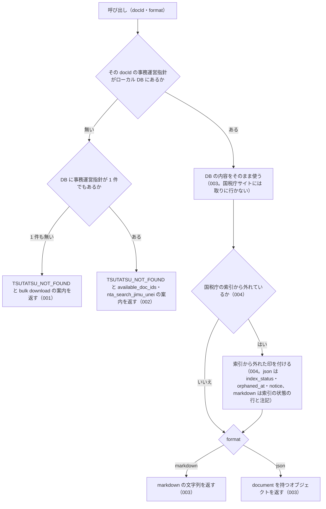

# 機能: nta_get_jimu_unei（事務運営指針を 1 件取得する）

- 機能 ID: NTA
- 版: current
- 承認日: 2026-06-26（PR #63）
- 起こした元: v0.21.0 の `src/tools/handlers.ts`（`handleNtaGetJimuUnei`）、`src/tools/definitions.ts`、`src/services/index-status.ts`、`src/services/pdf-meta.ts`、`src/services/db-search.ts`、`src/tools/get-doc-not-found.test.ts`、`src/tools/index-status-response.test.ts`
- 関連する Issue: houki-nta-mcp #30（索引から消えた文書の印）

この文書は「このツールは何をするか」を書きます。どう実装しているか（関数名・テーブル名）は書きません。

## アクター

- MCP クライアント（Claude などの LLM、または CLI から呼ぶ人）。`docId` を渡して、ローカル DB に取り込んである国税庁の事務運営指針 1 件の本文と添付 PDF の一覧を受け取る

## 入力

| 引数     | 必須 | 内容                                                                                                                                                       |
| -------- | ---- | ---------------------------------------------------------------------------------------------------------------------------------------------------------- |
| `docId`  | 必須 | 文書 ID。例: `"shotoku/shinkoku/170331"` / `"sozoku/170111_1"`。`nta_search_jimu_unei` の結果や、見つからなかったときの応答の `available_doc_ids` から取る |
| `format` | 任意 | `markdown`（既定）または `json`                                                                                                                            |

このツールはローカル DB だけを引く。事務運営指針は `--bulk-download-jimu-unei` で DB に入れておく。

## 処理の流れ

呼び出しを受けてから応答を返すまでに、何をどの順で確かめるかを示します。図の中の番号は「できること」の仕様 ID の末尾 3 桁です。

## できること

### SPEC-NTA-GET-JIMU-UNEI-001 事務運営指針が DB に 1 件も無いときは投入を案内する

ローカル DB に事務運営指針が 1 件も無い（別の種別の文書しか無い DB を含む）ときは、エラー `TSUTATSU_NOT_FOUND` を返す。国税庁サイトには取りに行かない。

- `error` は `ローカル DB に事務運営指針が 1 件も無いため、docId="<docId>" を取得できません`
- `hint` に、MCP サーバーが開いている DB のパスと、`houki-nta-mcp --bulk-download-jimu-unei` で投入する案内、環境変数 `HOUKI_NTA_DB_PATH` / `XDG_CACHE_HOME` が bulk download の環境と同じか確かめる案内を書く
- `next_actions` は `cli_bulk_download` の 1 件で、`example.command` は `houki-nta-mcp --bulk-download-jimu-unei`
- `tool` は `nta_get_jimu_unei`。`available_doc_ids` は付けない

### SPEC-NTA-GET-JIMU-UNEI-002 事務運営指針はあるが docId が無いときは「見つかりません」と候補を返す

ローカル DB に事務運営指針はあるが、その `docId` の文書が無いときは、エラー `TSUTATSU_NOT_FOUND` を返す。投入を勧める文言（「未投入」）は使わない。

- `error` は `事務運営指針 docId="<docId>" は見つかりません`
- `hint` に、DB にある事務運営指針の件数（例: `DB の事務運営指針 32 件に、この docId はありません`）、`available_doc_ids` から選ぶか `nta_search_jimu_unei` で探す案内、DB を投入した後に公開された文書は `houki-nta-mcp --bulk-download-jimu-unei` をもう一度実行すると取り込める旨を書く
- `available_doc_ids` に、DB にある事務運営指針を新しい順に最大 30 件入れる。要素は `docId`・`title`・`issuedAt`。他の種別（改正通達・文書回答事例など）の docId は入れない
- `next_actions` は `{ action: "nta_search_jimu_unei", reason: "キーワード検索で正しい docId を探せます" }` の 1 件
- `tool` は `nta_get_jimu_unei`

### SPEC-NTA-GET-JIMU-UNEI-003 ローカル DB にある事務運営指針を返す

その `docId` の事務運営指針がローカル DB にあるときは、エラーを返さずその内容を返す。`format` を省けば markdown の文字列、`json` なら `document` を持つオブジェクトである。国税庁サイトには取りに行かず、DB の内容をそのまま返す（`fetchedAt` は DB に入れたときの日時のまま）。

### SPEC-NTA-GET-JIMU-UNEI-004 国税庁の索引から消えた文書に印を付ける

DB から返す文書が国税庁の索引から外れている（bulk download で外れたことを確認した日時が付いている）ときは、応答に印を付ける。索引にある文書には何も付けない。

- `format` が `json` のとき: `index_status: "removed_from_index"`、`orphaned_at`（確認した日時。例: `"2026-10-01T00:30:00Z"`）、`notice`（索引から外れている旨と、過去の課税期間では意味を持つ場合があること、現在の取扱いは最新の通達で確かめること、出典 URL が 404 になることがあることの注記）を付ける。索引にある文書では `index_status` / `orphaned_at` / `notice` を付けない
- `format` を省くか `markdown` のとき: 文書の先頭の情報に `- **索引の状態**: removed_from_index（<確認した日時> に確認）` の行と、`>` で始まる注記の行を入れる。索引にある文書ではこの行を入れない

## できないこと

- 国税庁サイトから事務運営指針を取ること（DB に無い文書はエラーになる。DB に入れるのは `--bulk-download-jimu-unei`）
- 取得した文書を DB に書き戻すこと（ローカル DB だけを引くので書き戻しは起きない）
- 題名やキーワードから docId を探すこと（探すのは `nta_search_jimu_unei`）
- 添付 PDF の本文を読むこと（URL と種別・読み方の案内を返すだけ。読むのは pdf-reader-mcp などの PDF 読み取りツール、表のメタ情報は `nta_inspect_pdf_meta`）
- 事務運営指針が今も有効かどうか、改正されているかを判定すること

## 未決

初版起こしで見つけた、意図か不具合かを人が決める項目です。決まったら「できること」に ID を振るか、`specs/changes/` の差分にします。

1. **エラー `code` が `TSUTATSU_NOT_FOUND` である。** 事務運営指針は基本通達ではなく、同じ取得系の `nta_get_bunshokaitou` は `DOC_NOT_FOUND` を返す。README の「DB を先に引く」の表もこのツールを `DOC_NOT_FOUND` と書いており、実装と食い違う。`code` を `DOC_NOT_FOUND` に揃えるか、README を実装に合わせるか。SPEC-NTA-GET-JIMU-UNEI-001 / 002 は今の実装どおり `TSUTATSU_NOT_FOUND` と書いた。
2. **json の応答の形**（`document`（`docId` / `taxonomy` / `title` / `issuedAt` / `issuer` / `sourceUrl` / `fetchedAt` / `fullText` / `attachedPdfs`）、`legal_status`（`binds_citizens: false` / `binds_courts: false` / `binds_tax_office: true` と注）、`source: "db"`）は、SPEC-NTA-GET-JIMU-UNEI-004 のテストが `document.docId` を見るほかは、このツールの応答としてのテストが無い。ID を振るのは受入テストを書いてから。
3. **markdown の応答の形**（見出し `# <題名>`、`- **種別**: 事務運営指針`、発出日・税目・`docId`・出典・取得の行、`## 宛先・発出者`（`>` の引用）、`## 本文`、末尾の「通達・事務運営指針は行政内部文書であり、納税者・裁判所への直接的拘束力なし（最高裁 昭和43.12.24）」の注）は、このツールの応答としてのテストが無い。ID を振るのは受入テストを書いてから。
4. **添付 PDF の一覧。** 添付 PDF がある文書では、markdown に `## 添付 PDF (N 件)` の節（種別 / タイトル / サイズ / 読み方 / URL の表と、`### 読み方` の種別ごとの 1 行。新旧対照表・別紙・Q&A・参考資料・通知・その他の順）が付き、json では `document.attachedPdfs` に `title` / `url` / `sizeKb` / `kind` が入る。この節の描画側のテストは `src/services/` にあるが、このツールの応答としてのテストが無い。ID を振るのは受入テストを書いてから。
5. **`docId` を省いたときの `INVALID_ARGUMENT`。** 引数は inputSchema で検証され、`docId` が無いときや `inputSchema` に無い引数があるときはエラー `INVALID_ARGUMENT` になる。このツールでのテストが無い。ID を振るのは受入テストを書いてから。
6. **`legal_status.note` の文言が「通達は行政内部文書。…」で、事務運営指針を名指ししない。** markdown の末尾の注は「通達・事務運営指針は…」と書いている。json の注も事務運営指針に合わせるか。
7. **markdown に「取得元」の行が無い。** `nta_get_qa` の markdown は `取得元: ローカル DB（…）` の行を持つが、このツールは json の `source: "db"` だけで、markdown には取得元を書かない。DB だけを引くツールなので不要とみなすか、揃えるか。
