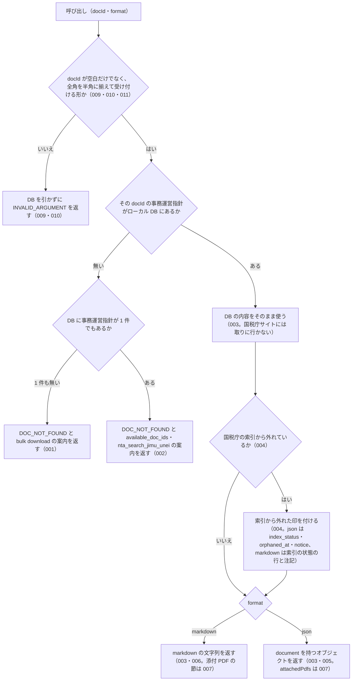

# 機能: nta_get_jimu_unei（事務運営指針を 1 件取得する）

- 機能 ID: NTA
- 版: current
- 承認日: 2026-09-26（初版と差分 `20260926-processing-flow`。PR #63）。差分 `20260926-undecided-to-issues` は 2026-09-26（PR #74）。差分 `20260927-argument-and-parse-errors` は 2026-09-27（PR #84）。差分 `20260927-get-responses` は 2026-09-27（PR #89）。差分 `20260930-nta-73-db-values` は 2026-09-30（PR #104）。差分 `20261001-t1-argument-guards` は 2026-10-01（PR #117）。差分 `20261002-t1-docid-forms` は 2026-10-02（PR #121）。差分 `20261001-t2-error-codes` は 2026-10-01（PR #118）。差分 `20261001-t3-normalize` は 2026-10-01（PR #119）。差分 `20261003-t4-response-shape` は 2026-10-03（PR #125）。差分 `20261003-t5-docs-mismatch` は 2026-10-03（PR #126）
- 起こした元: v0.21.0 の `src/tools/handlers.ts`（`handleNtaGetJimuUnei`）、`src/tools/definitions.ts`、`src/services/index-status.ts`、`src/services/pdf-meta.ts`、`src/services/db-search.ts`、`src/tools/get-doc-not-found.test.ts`、`src/tools/index-status-response.test.ts`
- 関連する Issue: houki-nta-mcp #30（索引から消えた文書の印）

この文書は「このツールは何をするか」を書きます。どう実装しているか（関数名・テーブル名）は書きません。

## アクター

- MCP クライアント（Claude などの LLM、または CLI から呼ぶ人）。`docId` を渡して、ローカル DB に取り込んである国税庁の事務運営指針 1 件の本文と添付 PDF の一覧を受け取る

## 入力

| 引数     | 必須 | 内容                                                                                                                                                       |
| -------- | ---- | ---------------------------------------------------------------------------------------------------------------------------------------------------------- |
| `docId`  | 必須 | 文書 ID。例: `"shotoku/shinkoku/170331"` / `"sozoku/170111_1"`。`nta_search_jimu_unei` の結果や、見つからなかったときの応答の `available_doc_ids` から取る。空文字・空白だけは不可（009）。形は 010。全角の数字・ダッシュ類は半角に揃えてから読む（011） |
| `format` | 任意 | `markdown`（既定）または `json`                                                                                                                            |

このツールはローカル DB だけを引く。事務運営指針は `--bulk-download-jimu-unei` で DB に入れておく。

## 処理の流れ

呼び出しを受けてから応答を返すまでに、何をどの順で確かめるかを示します。図の中の番号は「できること」の仕様 ID の末尾 3 桁です。

```mermaid
flowchart TD
  A["呼び出し（docId・format）"] --> W{"docId が空白だけでなく、全角を半角に揃えて受け付ける形か（009・010・011）"}
  W -- いいえ --> E0["DB を引かずに INVALID_ARGUMENT を返す（009・010）"]
  W -- はい --> B{"その docId の事務運営指針がローカル DB にあるか"}
  B -- 無い --> D{"DB に事務運営指針が 1 件でもあるか"}
  D -- 1 件も無い --> E1["DOC_NOT_FOUND と bulk download の案内を返す（001）"]
  D -- ある --> E2["DOC_NOT_FOUND と available_doc_ids・nta_search_jimu_unei の案内を返す（002）"]
  B -- ある --> C["DB の内容をそのまま使う（003。国税庁サイトには取りに行かない）"]
  C --> F{"国税庁の索引から外れているか（004）"}
  F -- はい --> G["索引から外れた印を付ける（004。json は index_status・orphaned_at・notice、markdown は索引の状態の行と注記）"]
  F -- いいえ --> H{"format"}
  G --> H
  H -- markdown --> I["markdown の文字列を返す（003・006。添付 PDF の節は 007）"]
  H -- json --> J["document を持つオブジェクトを返す（003・005。attachedPdfs は 007）"]
```

## できること

### SPEC-NTA-GET-JIMU-UNEI-001 事務運営指針が DB に 1 件も無いときは投入を案内する

ローカル DB に事務運営指針が 1 件も無い（別の種別の文書しか無い DB を含む）ときは、エラー `DOC_NOT_FOUND` を返す。国税庁サイトには取りに行かない。

- `error` は `ローカル DB に事務運営指針が 1 件も無いため、docId="<docId>" を取得できません`
- `hint` に、MCP サーバーが開いている DB のパスと、`houki-nta-mcp --bulk-download-jimu-unei` で投入する案内、環境変数 `HOUKI_NTA_DB_PATH` / `XDG_CACHE_HOME` が bulk download の環境と同じか確かめる案内を書く
- `next_actions` は `cli_bulk_download` の 1 件で、`example.command` は `houki-nta-mcp --bulk-download-jimu-unei`
- `tool` は `nta_get_jimu_unei`。`available_doc_ids` は付けない

v0.21.3 では code が `TSUTATSU_NOT_FOUND` だった。文書系 3 ツールで `DOC_NOT_FOUND` に揃える（houki-nta-mcp #64、SPEC-NTA-COMMON-ERRORS-016）。本文・`hint`・`next_actions`・`available_doc_ids`は変えない。

### SPEC-NTA-GET-JIMU-UNEI-002 事務運営指針はあるが docId が無いときは「見つかりません」と候補を返す

ローカル DB に事務運営指針はあるが、その `docId` の文書が無いときは、エラー `DOC_NOT_FOUND` を返す。投入を勧める文言（「未投入」）は使わない。

- `error` は `事務運営指針 docId="<docId>" は見つかりません`
- `hint` に、DB にある事務運営指針の件数（例: `DB の事務運営指針 32 件に、この docId はありません`）、`available_doc_ids` から選ぶか `nta_search_jimu_unei` で探す案内、DB を投入した後に公開された文書は `houki-nta-mcp --bulk-download-jimu-unei` をもう一度実行すると取り込める旨を書く
- `available_doc_ids` に、DB にある事務運営指針を新しい順に最大 30 件入れる。要素は `docId`・`title`・`issuedAt`。他の種別（改正通達・文書回答事例など）の docId は入れない
- `next_actions` は `{ action: "nta_search_jimu_unei", reason: "キーワード検索で正しい docId を探せます" }` の 1 件
- `tool` は `nta_get_jimu_unei`

v0.21.3 では code が `TSUTATSU_NOT_FOUND` だった。文書系 3 ツールで `DOC_NOT_FOUND` に揃える（houki-nta-mcp #64、SPEC-NTA-COMMON-ERRORS-016）。本文・`hint`・`next_actions`・`available_doc_ids`は変えない。

### SPEC-NTA-GET-JIMU-UNEI-003 ローカル DB にある事務運営指針を返す

その `docId` の事務運営指針がローカル DB にあるときは、エラーを返さずその内容を返す。`format` を省けば markdown の文字列、`json` なら `document` を持つオブジェクトである。国税庁サイトには取りに行かず、DB の内容をそのまま返す（`fetchedAt` は DB に入れたときの日時のまま）。

### SPEC-NTA-GET-JIMU-UNEI-004 国税庁の索引から消えた文書に印を付け、索引にある文書では印のキーを null にする

DB から返す文書が国税庁の索引から外れている（bulk download で外れたことを確認した日時が付いている）ときは、応答に印を付ける。

- `format` が `json` のとき: `index_status: "removed_from_index"`、`orphaned_at`（確認した日時。例: `"2026-10-01T00:30:00Z"`）、`notice`（索引から外れている旨と、過去の課税期間では意味を持つ場合があること、現在の取扱いは最新の通達で確かめること、出典 URL が 404 になることがあることの注記）を付ける。`document.orphanedAt` にも同じ日時が入る。索引にある文書では、`index_status`・`orphaned_at`・`notice`・`document.orphanedAt` をどれも `null` にする（キーは無くならない）
- `format` を省くか `markdown` のとき: 文書の先頭の情報に `- **索引の状態**: removed_from_index（<確認した日時> に確認）` の行と、`>` で始まる注記の行を入れる。索引にある文書ではこの行を入れない

例: 索引にある事務運営指針を `format: "json"` で取ると、`index_status: null`・`orphaned_at: null`・`notice: null`・`document.orphanedAt: null` を持つ（v0.22.0 ではどのキーも無かった）。

### SPEC-NTA-GET-JIMU-UNEI-005 json の応答

`format` を `json` にしたとき、応答は次のフィールドを持つ。値の無いフィールドは `null` にし、キーは無くさない。

| フィールド | 内容 |
|---|---|
| `document.docType` | `jimu-unei` |
| `document.docId` / `document.taxonomy` / `document.title` | 文書 ID・税目・題名 |
| `document.issuedAt` / `document.issuer` | 発出日（`YYYY-MM-DD`）と宛先・発出者。DB に無ければ `null` |
| `document.sourceUrl` / `document.fetchedAt` | 出典 URL と DB に入れた日時 |
| `document.orphanedAt` | 索引から消えたことを確認した日時。索引にある文書では `null`（SPEC-NTA-GET-JIMU-UNEI-004） |
| `document.fullText` | 本文 |
| `document.attachedPdfs` | 添付 PDF の配列（SPEC-NTA-GET-JIMU-UNEI-007） |
| `index_status` / `orphaned_at` / `notice` | SPEC-NTA-GET-JIMU-UNEI-004。索引にある文書では `null` |
| `legal_status` | `binds_citizens: false` / `binds_courts: false` / `binds_tax_office: true` と注 |
| `source` | `db` |

例: 発出日と宛先が DB に無い事務運営指針では、`document.issuedAt: null`・`document.issuer: null`（v0.22.0 ではどちらのキーも無かった）。

### SPEC-NTA-GET-JIMU-UNEI-006 markdown（既定）の応答

`format` を省くか `markdown` にしたとき、応答は次の順に並ぶ文字列である。

- 見出し `# <題名>`
- `- **種別**: 事務運営指針`、`- **発出日**: <発出日>`（DB にあるときだけ）、`- **税目**: <税目>`（DB にあるときだけ）、`` - **docId**: `<docId>` ``、`- **出典**: <国税庁ページの URL>`、`- **取得**: <DB に入れた日時>`、`- **取得元**: ローカル DB（bulk download で取り込んだもの）` の行
- 国税庁の索引から消えた文書では、索引の状態の行と注記（SPEC-NTA-GET-JIMU-UNEI-004）
- 宛先・発出者が DB にある文書では `## 宛先・発出者` の節。各行を `> ` で引用する
- `## 本文` の節と本文
- 添付 PDF がある文書では `## 添付 PDF (<件数> 件)` の節（SPEC-NTA-GET-JIMU-UNEI-007）
- 最後に `---` と、`*通達・事務運営指針は行政内部文書であり、納税者・裁判所への直接的拘束力なし（最高裁 昭和43.12.24）*` の注

「取得元」の行は、`nta_get_qa` / `nta_get_tax_answer` の markdown の `取得元:` の行（ローカル DB か国税庁サイトか）に合わせて置く。このツールは DB だけを引くので、値は常に `ローカル DB（bulk download で取り込んだもの）` である（v0.22.0 ではこの行が無かった）。

### SPEC-NTA-GET-JIMU-UNEI-007 添付 PDF の一覧を返す

json では `document.attachedPdfs` に、DB にある添付 PDF を入れる。要素は `title`・`url`・`sizeKb`・`kind`。`kind` は全要素に付く（DB に無ければ SPEC-NTA-GET-JIMU-UNEI-008 で題名から決める）。添付が無ければ空の配列。

markdown では、添付 PDF がある文書に限り、`## 本文` の後に `## 添付 PDF (<件数> 件)` の節を置く。節の中身は次のとおり。

- PDF の本文はこのサーバーが読まないことと、pdf-reader-mcp の `read_url` か、`nta_inspect_pdf_meta` を `save: true` で呼んで `extract_tables` に渡す読み方の案内（`>` の引用）
- 種別・タイトル・サイズ・読み方・URL の表（種別は SPEC-NTA-GET-JIMU-UNEI-008 で補った後のもの）。行は種別の順（新旧対照表・別紙・Q&A・参考資料・通知・その他）で、同じ種別の中は DB に入っている順
- `### 読み方` の節。表に現れた種別ごとに 1 行ずつ、その種別の PDF の読み方（`nta_inspect_pdf_meta` の `layout_note` と同じ文。SPEC-NTA-INSPECT-PDF-META-005）

### SPEC-NTA-GET-JIMU-UNEI-008 kind の無い添付 PDF は題名から kind を決めて返す

DB に入っている添付 PDF に `kind` が無い（v0.6.0 期に投入した文書）ときは、題名から `kind` を決めて応答に入れる。判定は `nta_inspect_pdf_meta` の SPEC-NTA-INSPECT-PDF-META-003 と同じ（「新旧対照表」「新旧対応表」「対比表」は `comparison`、「Q&A」「質疑応答」「FAQ」は `qa-pdf`、「別紙」「別表」「様式」「付録」「添付資料」は `attachment`、「通知」「お知らせ」「連絡」は `notice`、「参考」「参考資料」「関連資料」は `related`、どれにも当たらなければ `unknown`）。改正通達の「別紙 N」を `comparison` に付け替える扱い（SPEC-NTA-GET-KAISEI-TSUTATSU-007）は nta_get_jimu_unei では行わない（`docType` が `kaisei` でないため）。json の `document.attachedPdfs` の全要素に `kind` が付き、markdown の表と `### 読み方` では決めた種別の行になる（「その他」になるのは `unknown` のときだけ）。DB の内容は書き換えない。

例: `kind` の無い「参考資料」「別紙1」「Q&A」を持つ事務運営指針を `json` で取ると、`document.attachedPdfs` の `kind` は順に `related`・`attachment`・`qa-pdf`。markdown の表には「別紙」「Q&A」「参考資料」の行があり、「その他」の行は無い。同じ文書を `nta_inspect_pdf_meta` で見たときと `kind` が一致する。

### SPEC-NTA-GET-JIMU-UNEI-009 docId が空文字・空白だけのときはDBを引かずに `INVALID_ARGUMENT` を返す

空文字は inputSchema の `minLength: 1` の検査（SPEC-NTA-COMMON-ERRORS-013）で止まり、`INVALID_ARGUMENT`（`tool: "nta_get_jimu_unei"`、`detail.issues: [{ path: "docId", message: "空文字は指定できません" }]`）を返す。空白（半角スペース・全角スペース・タブ・改行）だけのときは、ツールの処理がDBを引く前に、SPEC-NTA-COMMON-ERRORS-014 の形の `INVALID_ARGUMENT`（`tool: "nta_get_jimu_unei"`、`error: "docId が空です"`、`detail.issues: [{ path: "docId", message: "空白だけは指定できません" }]`、`hint` に`nta_search_jimu_unei` の結果か `available_doc_ids` の `docId`を渡すよう書く）を返す。

例: `docId: ""` は `code: "INVALID_ARGUMENT"`・`detail.issues[0].message: "空文字は指定できません"`。`docId: "　"`（全角スペース）と `docId: " \n"` は `code: "INVALID_ARGUMENT"`・`error: "docId が空です"`。どれもDBは引かない。

### SPEC-NTA-GET-JIMU-UNEI-010 `docId` が受け付ける形でないときは DB を引かずに `INVALID_ARGUMENT` を返す

`docId` は、国税庁サイトの事務運営指針のページの URL（`…/law/jimu-unei/<フォルダー>/…/index.htm`）のフォルダーの並びで、`/` で区切った 2 つ以上の要素からなる。先頭の要素（税目フォルダー）は英小文字・半角の数字・`-`、2 つ目以降の要素は英小文字・半角の数字・`-`・`_` だけからなる（SPEC-NTA-COMMON-ERRORS-015）。フォルダー名の付け方は税目や年代によって違う（`shotoku/shinkoku/170331`・`sozoku/170111_1`・`hojin/000703-3`・`sonota/1912` など）ので、数字の桁数は確かめない。前後の空白を除き、半角に揃えた（SPEC-NTA-GET-JIMU-UNEI-011）値がこの形でないときは、DB を引く前に `INVALID_ARGUMENT`（`tool: "nta_get_jimu_unei"`、`error: "docId の形が受け付ける形ではありません: <渡した値>"`、`detail.issues: [{ path: "docId", message: "税目/…/フォルダー名 の形で、英小文字・数字・-・_ だけで指定してください（例: shotoku/shinkoku/170331）" }]`、`hint` に `nta_search_jimu_unei` の結果か `available_doc_ids` の `docId` をそのまま渡すよう書く）を返す。`DOC_NOT_FOUND` は、形に合うが DB にその文書が無いときだけになる。

例: `docId: "shotoku/shinkoku/170331"`・`"sozoku/170111_1"`・`"hojin/000703-3"`・`"sonota/1912"` は検査を通り、DB を引く。`docId: "170331"`（要素が 1 つ）・`"/shotoku/170331"`（先頭が `/`）・`"shotoku/"`（末尾が `/`）・`"shotoku/shinkoku/170331/index.htm"`（`.` を含む）・`"shotoku/申告/170331"`（漢字）は `code: "INVALID_ARGUMENT"`・`detail.issues[0].path: "docId"` で、DB は引かない（v0.21.3 では DB を引いてから「見つかりません」の応答になっていた）。

### SPEC-NTA-GET-JIMU-UNEI-011 `docId` は半角に揃えてから形を確かめる

`docId` は、前後の空白を除いた値を houki-abbreviations の `normalizeJpText` の規則（全角英数字を半角に、ダッシュ類 `－` `‐` `‑` `–` `—` `―` `−` を `-` に、全角チルダ `～` `〜` を `~` に、全角空白を半角空白にし、前後の空白を除く。罫線 `─` と長音 `ー` は変えない。大文字と小文字は区別する）で揃えてから、SPEC-NTA-GET-JIMU-UNEI-010 の形の検査に進む（SPEC-NTA-SEARCH-RULES-019）。揃えた後の値で DB を引き、国税庁サイトの URL を組み立てる。

例: `{ docId: "shotoku/shinkoku/１７０３３１" }` は `{ docId: "shotoku/shinkoku/170331" }` と同じ応答（v0.21.3 では全角のまま DB を引いて「見つかりません」だった）。

## できないこと

- 国税庁サイトから事務運営指針を取ること（DB に無い文書はエラーになる。DB に入れるのは `--bulk-download-jimu-unei`）
- 取得した文書を DB に書き戻すこと（ローカル DB だけを引くので書き戻しは起きない）
- 題名やキーワードから docId を探すこと（探すのは `nta_search_jimu_unei`）
- 添付 PDF の本文を読むこと（URL と種別・読み方の案内を返すだけ。読むのは pdf-reader-mcp などの PDF 読み取りツール、表のメタ情報は `nta_inspect_pdf_meta`）
- 事務運営指針が今も有効かどうか、改正されているかを判定すること

## 未決

初版起こしで見つけた、意図か不具合かを人が決める項目です。決まったら「できること」に ID を振るか、`specs/changes/` の差分にします。

意図か不具合かの判断が要る項目は houki-nta-mcp の Issue に移し、ここには題と Issue の番号だけを残します。今の振る舞いのままでよくテストが無いだけの項目は、受入テストを書いてから「できること」に ID を振ります。

