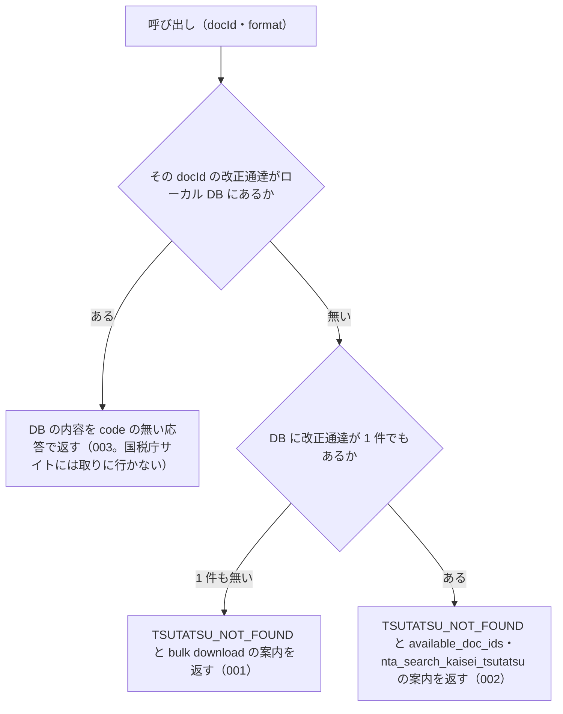

# 機能: nta_get_kaisei_tsutatsu（改正通達を docId で 1 件取得する）

- 機能 ID: NTA
- 版: current
- 承認日: 2026-09-26（PR #63）
- 起こした元: v0.21.0 の `src/tools/handlers.ts`（`handleNtaGetKaiseiTsutatsu`、`explainDocIdNotFound`）、`src/tools/definitions.ts`、`src/tools/tool-args.ts`、`src/services/db-search.ts`、`src/services/index-status.ts`、`src/services/pdf-meta.ts`、`src/tools/get-doc-not-found.test.ts`、`src/tools/handlers.test.ts`
- 関連する Issue: houki-nta-mcp #30（索引から消えた文書の印）、#44（「別紙 N」だけの PDF を新旧対照表として返す）

この文書は「このツールは何をするか」を書きます。どう実装しているか（関数名・テーブル名）は書きません。

## アクター

- MCP クライアント（Claude などの LLM、または CLI から呼ぶ人）。`docId` を渡して、ローカル DB に入れてある改正通達（法令解釈通達の一部改正）1 件の本文と添付 PDF の一覧を受け取る。`docId` は `nta_search_kaisei_tsutatsu` の結果か、このツールのエラーの `available_doc_ids` から得る

## 入力

| 引数     | 必須 | 内容                                                                                                                                                            |
| -------- | ---- | --------------------------------------------------------------------------------------------------------------------------------------------------------------- |
| `docId`  | 必須 | 文書 ID。新形式 `"0026003-067"` または旧形式 `"240401"` など。国税庁の改正通達ページの URL から取った値で、`nta_search_kaisei_tsutatsu` の結果の `docId` と同じ |
| `format` | 任意 | `markdown`（既定）または `json`                                                                                                                                 |

## 処理の流れ

呼び出しを受けてから応答を返すまでに、何をどの順で確かめるかを示します。図の中の番号は「できること」の仕様 ID の末尾 3 桁です。

## できること

### SPEC-NTA-GET-KAISEI-TSUTATSU-001 ローカル DB に改正通達が 1 件も無いときは投入を案内する

ローカル DB に改正通達が 1 件も無い（他の種別の文書だけが入っている場合を含む）ときは、エラー `TSUTATSU_NOT_FOUND` を返す。国税庁サイトには取りに行かない。応答は次を含む。

- `error`: `ローカル DB に改正通達が 1 件も無いため、docId="<docId>" を取得できません`
- `hint`: MCP サーバーが開いている DB ファイルのパスと、`houki-nta-mcp --bulk-download-kaisei` で投入する案内、投入したはずなら環境変数 `HOUKI_NTA_DB_PATH` / `XDG_CACHE_HOME` が bulk download を実行した環境と同じか確かめる案内
- `next_actions`: `action` が `cli_bulk_download` の 1 件。`example.command` は `houki-nta-mcp --bulk-download-kaisei`
- `tool`: `nta_get_kaisei_tsutatsu`
- `available_doc_ids` は付けない

### SPEC-NTA-GET-KAISEI-TSUTATSU-002 改正通達はあるが docId が無いときは「見つかりません」と候補を返す

ローカル DB に改正通達はあるが、指定した `docId` の文書が無いときは、エラー `TSUTATSU_NOT_FOUND` を返す。投入の案内（「未投入」）はしない。応答は次を含む。

- `error`: `改正通達 docId="<docId>" は見つかりません`
- `hint`: DB にある改正通達の件数（例: `DB の改正通達 118 件に、この docId はありません`）と、`available_doc_ids` から選ぶか `nta_search_kaisei_tsutatsu` で検索して docId を確かめる案内、DB を投入した後に公開された文書は `houki-nta-mcp --bulk-download-kaisei` をもう一度実行すると取り込める旨
- `available_doc_ids`: DB にある改正通達の `docId` / `title` / `issuedAt` を、発出日の新しい順に最大 30 件。改正通達以外の種別の文書は入れない
- `next_actions`: `{ action: "nta_search_kaisei_tsutatsu", reason: "キーワード検索で正しい docId を探せます" }` の 1 件
- `tool`: `nta_get_kaisei_tsutatsu`

### SPEC-NTA-GET-KAISEI-TSUTATSU-003 ローカル DB にある改正通達は DB から返す

指定した `docId` の改正通達がローカル DB にある（`--bulk-download-kaisei` で入れた）ときは、エラーではない応答（`code` を持たない応答）を返す。国税庁サイトには取りに行かない。

## できないこと

- DB に無い改正通達を国税庁サイトから取ること（改正通達は docId から個別ページの URL を組み立てるのに税目フォルダの世代差を解く必要があるため。DB に入れるのは `houki-nta-mcp --bulk-download-kaisei`）
- 添付 PDF の本文を読むこと（応答には PDF の URL・種別・読み方の案内までを載せる。本文は pdf-reader-mcp などの PDF 読み取りツールに渡す。表を取るときの保存は `nta_inspect_pdf_meta`）
- 改正通達を題名やキーワードから探すこと（探すのは `nta_search_kaisei_tsutatsu`）
- 改正後の基本通達の条項本文を返すこと（条項は `nta_get_tsutatsu`）
- 改正通達が今も有効か、改正後の取扱いが現行かを判定すること

## 未決

初版起こしで見つけた、意図か不具合かを人が決める項目です。決まったら「できること」に ID を振るか、`specs/changes/` の差分にします。

意図か不具合かの判断が要る項目は houki-nta-mcp の Issue に移し、ここには題と Issue の番号だけを残します。今の振る舞いのままでよくテストが無いだけの項目は、受入テストを書いてから「できること」に ID を振ります。

1. **markdown（既定）の応答の形。** `# <題名>`、`- **発出日**` / `- **税目**` / `- **docId**` / `- **出典**` / `- **取得**` の行、`## 宛先・発出者`（宛先がある文書だけ。各行を `> ` で引用）、`## 本文`、添付 PDF があれば `## 添付 PDF (N 件)` の表（種別 / タイトル / サイズ / 読み方 / URL。新旧対照表を先頭に種別の優先順で並べる）と `### 読み方` の節、末尾に通達の法的位置付けの注（行政内部文書で納税者・裁判所への直接的拘束力は無い旨）。このツールの応答としてのテストが無い。ID を振るのは受入テストを書いてから。
2. **json の応答の形。** `document`（`docType: "kaisei"` / `docId` / `taxonomy` / `title` / `issuedAt` / `issuer` / `sourceUrl` / `fetchedAt` / `fullText` / `attachedPdfs[]`（`title` / `url` / `sizeKb` / `kind`））、`legal_status`（`binds_citizens: false` / `binds_courts: false` / `binds_tax_office: true` と注）、`source: "db"`。このツールの応答としてのテストが無い。ID を振るのは受入テストを書いてから。
3. **国税庁の索引から消えた改正通達の印（#30）。** 索引から外れた文書では、json に `index_status: "removed_from_index"` / `orphaned_at` / `notice`（過去の課税期間では意味を持つ場合があるが現在の取扱いは最新の通達で確かめる旨。出典 URL は 404 になることがある旨）が付き、markdown には `- **索引の状態**: removed_from_index（<日時> に確認）` の行と同じ注記の引用が入る。索引にある文書には何も付かない。`nta_get_jimu_unei` にはこの応答のテストがあるが、このツールの応答としてのテストが無い。ID を振るのは受入テストを書いてから。
4. **「別紙 N」とだけ題した PDF を新旧対照表として返す（#44）。** 添付 PDF のうち、題名が「別紙」と番号（とサイズの「（PDF/221KB）」）だけのものは、応答の `kind` を `attachment` から `comparison` に付け替える（例: 0025004-026 の別紙 1・別紙 2）。「別紙1 計算明細書」のように他の語を含む別紙は変えない。DB の内容は変えない。付け替えの判定のテストは `src/services/pdf-meta.test.ts` にあるが、このツールの応答としてのテストが無い。ID を振るのは受入テストを書いてから。
5. **`kind` の無い古い行の添付 PDF。** → houki-nta-mcp #73
6. **`docId` の形を確かめない。** → houki-nta-mcp #66
7. **`docId` が無いときの `INVALID_ARGUMENT`。** 引数の検証で `docId` が無い、または文字列でないときはエラー `INVALID_ARGUMENT`（`tool` 付き）を返す。このツールの応答としてのテストが無い。ID を振るのは受入テストを書いてから。
8. **エラー `code` の名前。** → houki-nta-mcp #64
