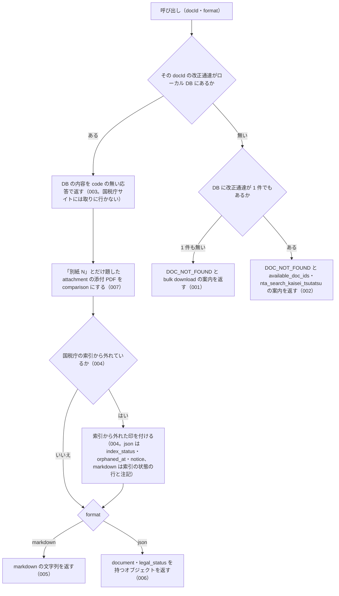

# 機能: nta_get_kaisei_tsutatsu（改正通達を docId で 1 件取得する）

- 機能 ID: NTA
- 版: current
- 承認日: 2026-09-26（初版と差分 `20260926-processing-flow`。PR #63）。差分 `20260926-undecided-to-issues` は 2026-09-26（PR #74）。差分 `20260927-argument-and-parse-errors` は 2026-09-27（PR #84）。差分 `20260927-get-responses` は 2026-09-27（PR #89）。差分 `20260927-index-status-marks` は 2026-09-27（PR #91）。差分 `20260930-nta-73-db-values` は 2026-09-30（PR #104）。差分 `20261001-t1-argument-guards` は 2026-10-01（PR #117）。差分 `20261002-t1-docid-forms` は 2026-10-02（PR #121）。差分 `20261001-t2-error-codes` は 2026-10-01（PR #118）。差分 `20261001-t3-normalize` は 2026-10-01（PR #119）
- 起こした元: v0.21.0 の `src/tools/handlers.ts`（`handleNtaGetKaiseiTsutatsu`、`explainDocIdNotFound`）、`src/tools/definitions.ts`、`src/tools/tool-args.ts`、`src/services/db-search.ts`、`src/services/index-status.ts`、`src/services/pdf-meta.ts`、`src/tools/get-doc-not-found.test.ts`、`src/tools/handlers.test.ts`
- 関連する Issue: houki-nta-mcp #30（索引から消えた文書の印）、#44（「別紙 N」だけの PDF を新旧対照表として返す）

この文書は「このツールは何をするか」を書きます。どう実装しているか（関数名・テーブル名）は書きません。

## アクター

- MCP クライアント（Claude などの LLM、または CLI から呼ぶ人）。`docId` を渡して、ローカル DB に入れてある改正通達（法令解釈通達の一部改正）1 件の本文と添付 PDF の一覧を受け取る。`docId` は `nta_search_kaisei_tsutatsu` の結果か、このツールのエラーの `available_doc_ids` から得る

## 入力

| 引数     | 必須 | 内容                                                                                                                                                            |
| -------- | ---- | --------------------------------------------------------------------------------------------------------------------------------------------------------------- |
| `docId`  | 必須 | 文書 ID。新形式 `"0026003-067"` または旧形式 `"240401"` など。国税庁の改正通達ページの URL から取った値で、`nta_search_kaisei_tsutatsu` の結果の `docId` と同じ。空文字・空白だけは不可（009）。形は 010。全角の数字・ダッシュ類は半角に揃えてから読む（011） |
| `format` | 任意 | `markdown`（既定）または `json`                                                                                                                                 |

## 処理の流れ

呼び出しを受けてから応答を返すまでに、何をどの順で確かめるかを示します。図の中の番号は「できること」の仕様 ID の末尾 3 桁です。

```mermaid
flowchart TD
  A["呼び出し（docId・format）"] --> B{"その docId の改正通達がローカル DB にあるか"}
  B -- ある --> C["DB の内容を code の無い応答で返す（003。国税庁サイトには取りに行かない）"]
  C --> K["「別紙 N」とだけ題した attachment の添付 PDF を comparison にする（007）"]
  K --> F{"国税庁の索引から外れているか（004）"}
  F -- はい --> G["索引から外れた印を付ける（004。json は index_status・orphaned_at・notice、markdown は索引の状態の行と注記）"]
  F -- いいえ --> H{"format"}
  G --> H
  H -- markdown --> I["markdown の文字列を返す（005）"]
  H -- json --> J["document・legal_status を持つオブジェクトを返す（006）"]
  B -- 無い --> D{"DB に改正通達が 1 件でもあるか"}
  D -- 1 件も無い --> E1["DOC_NOT_FOUND と bulk download の案内を返す（001）"]
  D -- ある --> E2["DOC_NOT_FOUND と available_doc_ids・nta_search_kaisei_tsutatsu の案内を返す（002）"]
```

## できること

### SPEC-NTA-GET-KAISEI-TSUTATSU-001 ローカル DB に改正通達が 1 件も無いときは投入を案内する

ローカル DB に改正通達が 1 件も無い（他の種別の文書だけが入っている場合を含む）ときは、エラー `DOC_NOT_FOUND` を返す。国税庁サイトには取りに行かない。応答は次を含む。

- `error`: `ローカル DB に改正通達が 1 件も無いため、docId="<docId>" を取得できません`
- `hint`: MCP サーバーが開いている DB ファイルのパスと、`houki-nta-mcp --bulk-download-kaisei` で投入する案内、投入したはずなら環境変数 `HOUKI_NTA_DB_PATH` / `XDG_CACHE_HOME` が bulk download を実行した環境と同じか確かめる案内
- `next_actions`: `action` が `cli_bulk_download` の 1 件。`example.command` は `houki-nta-mcp --bulk-download-kaisei`
- `tool`: `nta_get_kaisei_tsutatsu`
- `available_doc_ids` は付けない

v0.21.3 では code が `TSUTATSU_NOT_FOUND` だった。文書系 3 ツールで `DOC_NOT_FOUND` に揃える（houki-nta-mcp #64、SPEC-NTA-COMMON-ERRORS-016）。本文・`hint`・`next_actions`・`available_doc_ids`は変えない。

### SPEC-NTA-GET-KAISEI-TSUTATSU-002 改正通達はあるが docId が無いときは「見つかりません」と候補を返す

ローカル DB に改正通達はあるが、指定した `docId` の文書が無いときは、エラー `DOC_NOT_FOUND` を返す。投入の案内（「未投入」）はしない。応答は次を含む。

- `error`: `改正通達 docId="<docId>" は見つかりません`
- `hint`: DB にある改正通達の件数（例: `DB の改正通達 118 件に、この docId はありません`）と、`available_doc_ids` から選ぶか `nta_search_kaisei_tsutatsu` で検索して docId を確かめる案内、DB を投入した後に公開された文書は `houki-nta-mcp --bulk-download-kaisei` をもう一度実行すると取り込める旨
- `available_doc_ids`: DB にある改正通達の `docId` / `title` / `issuedAt` を、発出日の新しい順に最大 30 件。改正通達以外の種別の文書は入れない
- `next_actions`: `{ action: "nta_search_kaisei_tsutatsu", reason: "キーワード検索で正しい docId を探せます" }` の 1 件
- `tool`: `nta_get_kaisei_tsutatsu`

v0.21.3 では code が `TSUTATSU_NOT_FOUND` だった。文書系 3 ツールで `DOC_NOT_FOUND` に揃える（houki-nta-mcp #64、SPEC-NTA-COMMON-ERRORS-016）。本文・`hint`・`next_actions`・`available_doc_ids`は変えない。

### SPEC-NTA-GET-KAISEI-TSUTATSU-003 ローカル DB にある改正通達は DB から返す

指定した `docId` の改正通達がローカル DB にある（`--bulk-download-kaisei` で入れた）ときは、エラーではない応答（`code` を持たない応答）を返す。国税庁サイトには取りに行かない。

### SPEC-NTA-GET-KAISEI-TSUTATSU-004 国税庁の索引から消えた文書に印を付ける

DB から返す改正通達が国税庁の索引から外れている（bulk download で外れたことを確認した日時が付いている）ときは、応答に印を付ける。索引にある文書には何も付けない。

- `format` が `json` のとき: `index_status: "removed_from_index"`、`orphaned_at`（確認した日時。例: `"2026-10-01T00:30:00Z"`）、`notice`（索引から外れている旨と、過去の課税期間では意味を持つ場合があること、現在の取扱いは最新の通達で確かめること、出典 URL が 404 になることがあることの注記）を付ける。`document.orphanedAt` にも同じ日時が入る
- `format` を省くか `markdown` のとき: `- **取得**` の行の次に `- **索引の状態**: removed_from_index（<確認した日時> に確認）` の行を入れ、空行を挟んで `> ` で始まる注記の行を入れる
- 索引にある文書では、json に `index_status` / `orphaned_at` / `notice` を付けず、markdown に「索引の状態」の行と注記を入れない

注記の文は `nta_get_jimu_unei`（SPEC-NTA-GET-JIMU-UNEI-004）と同じである。

### SPEC-NTA-GET-KAISEI-TSUTATSU-005 markdown（既定）の応答

`format` を省くか `markdown` にしたとき、応答は次の順に並ぶ文字列である。種別の行（`- **種別**`）は無い。

- 見出し `# <題名>`
- `- **発出日**: <発出日>`（DB にあるときだけ）、`- **税目**: <税目>`（DB にあるときだけ）、`` - **docId**: `<docId>` ``、`- **出典**: <国税庁ページの URL>`、`- **取得**: <DB に入れた日時>` の行
- 国税庁の索引から消えた文書では、索引の状態の行と注記（SPEC-NTA-GET-KAISEI-TSUTATSU-004）
- 宛先・発出者が DB にある文書では `## 宛先・発出者` の節。各行を `> ` で引用する
- `## 本文` の節と本文
- 添付 PDF がある文書では `## 添付 PDF (<件数> 件)` の節（下のとおり。種別は SPEC-NTA-GET-KAISEI-TSUTATSU-008 で補い、SPEC-NTA-GET-KAISEI-TSUTATSU-007 で付け替えた後のもの）
- 最後に `---` と、`*通達は行政内部文書であり、納税者・裁判所への直接的拘束力なし（最高裁 昭和43.12.24）*` の注

添付 PDF がある文書では、`## 本文` の後に `## 添付 PDF (<件数> 件)` の節を置く。節の中身は次のとおり。

- PDF の本文はこのサーバーが読まないことと、pdf-reader-mcp の `read_url` か、`nta_inspect_pdf_meta` を `save: true` で呼んで `extract_tables` に渡す読み方の案内（`>` の引用）
- 種別・タイトル・サイズ・読み方・URL の表。行は種別の順（新旧対照表・別紙・Q&A・参考資料・通知・その他）で、同じ種別の中は DB に入っている順
- `### 読み方` の節。表に現れた種別ごとに 1 行ずつ、その種別の PDF の読み方（`nta_inspect_pdf_meta` の `layout_note` と同じ文。SPEC-NTA-INSPECT-PDF-META-005）
### SPEC-NTA-GET-KAISEI-TSUTATSU-006 json の応答

`format` を `json` にしたとき、応答は次のフィールドを持つ。

| フィールド | 内容 |
|---|---|
| `document.docType` | `kaisei` |
| `document.docId` / `document.taxonomy` / `document.title` | 文書 ID・税目・題名 |
| `document.issuedAt` / `document.issuer` | 発出日と宛先・発出者。DB にあるときだけ付く |
| `document.sourceUrl` / `document.fetchedAt` | 出典 URL と DB に入れた日時 |
| `document.fullText` | 本文 |
| `document.attachedPdfs` | 添付 PDF の配列。要素は `title`・`url`・`sizeKb`・`kind`。`kind` は全要素に付く（SPEC-NTA-GET-KAISEI-TSUTATSU-008 で補い、SPEC-NTA-GET-KAISEI-TSUTATSU-007 で付け替えた後のもの）。添付が無ければ空の配列 |
| `legal_status` | `binds_citizens: false` / `binds_courts: false` / `binds_tax_office: true` と注 |
| `source` | `db` |
### SPEC-NTA-GET-KAISEI-TSUTATSU-007 「別紙 N」とだけ題した添付 PDF は新旧対照表として返す

添付 PDF のうち、`kind` が `attachment` で題名が「別紙」と番号だけのもの（判定は SPEC-NTA-INSPECT-PDF-META-004 と同じ。「別紙1」「別紙1（PDF/221KB）」「（別紙2）」「別紙1-2」など）は、応答では `kind` を `comparison` にして返す。json の `document.attachedPdfs` と markdown の表・`### 読み方` の両方に当てはまる。「別紙1 計算明細書」のように別の語を含む題名は `attachment` のまま。DB の内容は書き換えない。

例: 「新旧対照表（PDF/100KB）」（`comparison`）と「別紙1（PDF/221KB）」（`attachment`）を持つ改正通達を `json` で取ると、`document.attachedPdfs` の 2 件目の `kind` は `comparison` になる。

### SPEC-NTA-GET-KAISEI-TSUTATSU-008 kind の無い添付 PDF は題名から kind を決めて返す

DB に入っている添付 PDF に `kind` が無い（v0.6.0 期に投入した文書）ときは、題名から `kind` を決めて応答に入れる。判定は `nta_inspect_pdf_meta` の SPEC-NTA-INSPECT-PDF-META-003 と同じ（「新旧対照表」「新旧対応表」「対比表」は `comparison`、「Q&A」「質疑応答」「FAQ」は `qa-pdf`、「別紙」「別表」「様式」「付録」「添付資料」は `attachment`、「通知」「お知らせ」「連絡」は `notice`、「参考」「参考資料」「関連資料」は `related`、どれにも当たらなければ `unknown`）。「別紙 N」の付け替え（SPEC-NTA-GET-KAISEI-TSUTATSU-007）は、決めた `kind` に対して行う。json の `document.attachedPdfs` の全要素に `kind` が付き、markdown の表と `### 読み方` では決めた種別の行になる（「その他」になるのは `unknown` のときだけ）。DB の内容は書き換えない。

例: `kind` の無い「新旧対応表」「参考資料」「別紙1」を持つ改正通達を `json` で取ると、`document.attachedPdfs` の `kind` は順に `comparison`・`related`・`comparison`（「別紙1」は `attachment` と決めた後に 007 で付け替える）。markdown の表には「新旧対照表」と「参考資料」の行があり、「その他」の行は無い。同じ文書を `nta_inspect_pdf_meta` で見たときと `kind` が一致する。

### SPEC-NTA-GET-KAISEI-TSUTATSU-009 docId が空文字・空白だけのときはDBを引かずに `INVALID_ARGUMENT` を返す

空文字は inputSchema の `minLength: 1` の検査（SPEC-NTA-COMMON-ERRORS-013）で止まり、`INVALID_ARGUMENT`（`tool: "nta_get_kaisei_tsutatsu"`、`detail.issues: [{ path: "docId", message: "空文字は指定できません" }]`）を返す。空白（半角スペース・全角スペース・タブ・改行）だけのときは、ツールの処理がDBを引く前に、SPEC-NTA-COMMON-ERRORS-014 の形の `INVALID_ARGUMENT`（`tool: "nta_get_kaisei_tsutatsu"`、`error: "docId が空です"`、`detail.issues: [{ path: "docId", message: "空白だけは指定できません" }]`、`hint` に`nta_search_kaisei_tsutatsu` の結果の `docId`を渡すよう書く）を返す。

例: `docId: ""` は `code: "INVALID_ARGUMENT"`・`detail.issues[0].message: "空文字は指定できません"`。`docId: "　"`（全角スペース）と `docId: " \n"` は `code: "INVALID_ARGUMENT"`・`error: "docId が空です"`。どれもDBは引かない。

### SPEC-NTA-GET-KAISEI-TSUTATSU-010 `docId` が受け付ける形でないときは DB を引かずに `INVALID_ARGUMENT` を返す

`docId` は、国税庁サイトの改正通達のページの URL（`…/kaisei/<フォルダー名>/index.htm`）のフォルダー名で、英小文字・半角の数字・`-` だけからなる、`/` を含まない 1 つの要素である（SPEC-NTA-COMMON-ERRORS-015）。フォルダー名の付け方は年代によって違う（`0026003-067`・`0014720-84`・`240401`・`2606`・`tougou` など）ので、数字の桁数と `-` の位置は確かめない。前後の空白を除き、半角に揃えた（SPEC-NTA-GET-KAISEI-TSUTATSU-011）値がこの形でないときは、DB を引く前に `INVALID_ARGUMENT`（`tool: "nta_get_kaisei_tsutatsu"`、`error: "docId の形が受け付ける形ではありません: <渡した値>"`、`detail.issues: [{ path: "docId", message: "英小文字・数字・- だけで指定してください（例: 0026003-067、240401）" }]`、`hint` に `nta_search_kaisei_tsutatsu` の結果の `docId` をそのまま渡すよう書く）を返す。`DOC_NOT_FOUND` は、形に合うが DB にその文書が無いときだけになる。

例: `docId: "0026003-067"`・`"240401"`・`"0014720-84"`・`"tougou"` は検査を通り、DB を引く。`docId: "0026003/067"`（`/` を含む）・`"0026003_067"`（`_` を含む）・`"ABC-1"`（英大文字）・`"課消2-11"`（漢字）・`"0026003-067/index.htm"`（`/` と `.` を含む）は `code: "INVALID_ARGUMENT"`・`detail.issues[0].path: "docId"` で、DB は引かない（v0.21.3 では DB を引いてから「見つかりません」の応答になっていた）。

### SPEC-NTA-GET-KAISEI-TSUTATSU-011 `docId` は半角に揃えてから形を確かめる

`docId` は、前後の空白を除いた値を houki-abbreviations の `normalizeJpText` の規則（全角英数字を半角に、ダッシュ類 `－` `‐` `‑` `–` `—` `―` `−` を `-` に、全角チルダ `～` `〜` を `~` に、全角空白を半角空白にし、前後の空白を除く。罫線 `─` と長音 `ー` は変えない。大文字と小文字は区別する）で揃えてから、SPEC-NTA-GET-KAISEI-TSUTATSU-010 の形の検査に進む（SPEC-NTA-SEARCH-RULES-019）。揃えた後の値で DB を引き、国税庁サイトの URL を組み立てる。

例: `{ docId: "００２６００３―０６７" }` は `{ docId: "0026003-067" }` と同じ応答（v0.21.3 では全角のまま DB を引いて「見つかりません」だった）。

## できないこと

- DB に無い改正通達を国税庁サイトから取ること（改正通達は docId から個別ページの URL を組み立てるのに税目フォルダの世代差を解く必要があるため。DB に入れるのは `houki-nta-mcp --bulk-download-kaisei`）
- 添付 PDF の本文を読むこと（応答には PDF の URL・種別・読み方の案内までを載せる。本文は pdf-reader-mcp などの PDF 読み取りツールに渡す。表を取るときの保存は `nta_inspect_pdf_meta`）
- 改正通達を題名やキーワードから探すこと（探すのは `nta_search_kaisei_tsutatsu`）
- 改正後の基本通達の条項本文を返すこと（条項は `nta_get_tsutatsu`）
- 改正通達が今も有効か、改正後の取扱いが現行かを判定すること

## 未決

初版起こしで見つけた、意図か不具合かを人が決める項目です。決まったら「できること」に ID を振るか、`specs/changes/` の差分にします。

意図か不具合かの判断が要る項目は houki-nta-mcp の Issue に移し、ここには題と Issue の番号だけを残します。今の振る舞いのままでよくテストが無いだけの項目は、受入テストを書いてから「できること」に ID を振ります。

