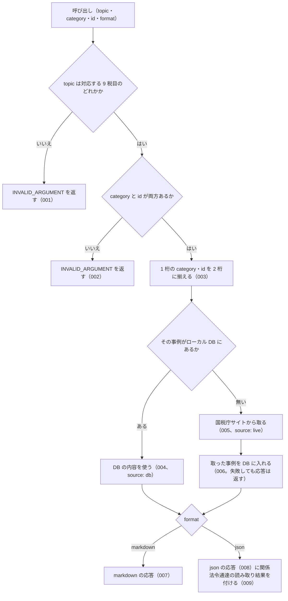

# 機能: nta_get_qa（質疑応答事例を 1 件取得する）

- 機能 ID: NTA
- 版: current
- 承認日: 2026-09-24（初版。PR #52 のマージ）。差分 `20260926-processing-flow` は 2026-09-26（PR #63）
- 起こした元: v0.20.2 の `src/tools/handlers.ts`（`getQa`）、`src/tools/definitions.ts`、`src/services/tax-answer-render.ts`、`src/tools/handlers.test.ts`、`src/tools/get-db-first.test.ts`
- 関連する Issue: houki-nta-mcp #22（関係法令通達の構造化）、#29（DB を先に引く）、#30（索引から消えた文書の印）

この文書は「このツールは何をするか」を書きます。どう実装しているか（関数名・テーブル名）は書きません。

## アクター

- MCP クライアント（Claude などの LLM、または CLI から呼ぶ人）。`topic`・`category`・`id` を渡して、国税庁の質疑応答事例 1 件の照会要旨・回答要旨・関係法令通達を受け取る

## 入力

| 引数 | 必須 | 内容 |
|---|---|---|
| `topic` | 必須 | 税目フォルダ。`shotoku` / `gensen` / `joto` / `sozoku` / `hyoka` / `hojin` / `shohi` / `inshi` / `hotei` のどれか |
| `category` | 必須 | カテゴリ番号（章に当たる）。例: `"02"`。1 桁でもよい |
| `id` | 必須 | 事例番号。例: `"19"`。1 桁でもよい |
| `format` | 任意 | `markdown`（既定）または `json` |

## 処理の流れ

呼び出しを受けてから応答を返すまでに、何をどの順で確かめるかを示します。図の中の番号は「できること」の仕様 ID の末尾 3 桁です。

## できること

### SPEC-NTA-GET-QA-001 対応していない税目は取りに行かない

`topic` が上の 9 税目のどれでもないときは、エラー `INVALID_ARGUMENT` を返す。`hint` に対応している税目の一覧を書く。DB も国税庁サイトも引かない。

### SPEC-NTA-GET-QA-002 category と id の両方が無ければ取りに行かない

`category` か `id` が空のときは、エラー `INVALID_ARGUMENT` を返す。`hint` に、税目の目次ページ（`/law/shitsugi/{topic}/01.htm`）でカテゴリ番号と事例番号を確かめるよう書く。

### SPEC-NTA-GET-QA-003 1 桁の category と id は 2 桁に揃えてから引く

`category` と `id` は、1 桁なら先頭に `0` を付けて 2 桁に揃える（`"2"` → `"02"`）。揃えた値で DB を引き、国税庁サイトに取りに行くときは `https://www.nta.go.jp/law/shitsugi/{topic}/{category}/{id}.htm` を取得する。

### SPEC-NTA-GET-QA-004 ローカル DB にある事例は DB から返す

その事例がローカル DB にある（`--bulk-download-qa` または以前の取得で入った）ときは、国税庁サイトに取りに行かずに DB の内容を返す。json の応答の `source` は `db`。`qa.fetchedAt` は DB に入れたときの日時のまま（呼び出した時刻にしない）。

### SPEC-NTA-GET-QA-005 DB に無い事例は国税庁サイトから取る

その事例が DB に無いときは、国税庁サイトの該当ページを取得して返す。json の応答の `source` は `live`。

### SPEC-NTA-GET-QA-006 国税庁サイトから取った事例は DB に入り、次からは DB から返す

SPEC-NTA-GET-QA-005 で取得した事例は DB に入る。同じ事例をもう一度求められたときは国税庁サイトに取りに行かず、`source` が `db` の応答を返す。このときの応答は、国税庁サイトから取ったときと同じ構造である（`qa.question` / `qa.answer` の段落の配列と、そこから作る `related_laws` が残っている）。DB への書き込みに失敗しても、その呼び出しの応答は返す。

### SPEC-NTA-GET-QA-007 markdown（既定）の応答

`format` を省くか `markdown` にしたとき、応答は次を含む文字列である。DB から返したときも国税庁サイトから取ったときも同じ形。

- 見出し `# <題名>` と、`> 税目: <topic> / カテゴリ: <category> / 事例番号: <id>` の行
- `## 【照会要旨】`・`## 【回答要旨】`・`## 【関係法令通達】` の節（中身が無い節は出さない）
- ページ下部の注記（作成時点と、一般的な回答である旨の断り書き）がある事例では、`## 【関係法令通達】` の後ろに独立した `## 注記（国税庁）` の節。注記は `## 【関係法令通達】` の節には入れない
- `出典: <国税庁ページの URL>`・`取得: <取得日時>`・`取得元: <ローカル DB（bulk download で取り込んだもの）| 国税庁サイト（この呼び出しで取得）>`
- 質疑応答事例の位置付けの注（国税庁の参考解説資料で法的拘束力はなく、実務判断は通達・法令本文に基づく必要があること）

### SPEC-NTA-GET-QA-008 json の応答

`format` を `json` にしたとき、応答は次のフィールドを持つ。

| フィールド | 内容 |
|---|---|
| `qa.topic` / `qa.category` / `qa.id` | 税目・カテゴリ番号・事例番号（2 桁に揃えたもの） |
| `qa.title` | 題名 |
| `qa.question` / `qa.answer` | 照会要旨・回答要旨の段落の配列 |
| `qa.relatedLaws` | 【関係法令通達】の段落の配列（ページの表記のまま） |
| `qa.notice` / `qa.basisDate` | ページ下部の注記と、その注記から読んだ作成時点の日付（`YYYY-MM-DD`）。注記が無い事例では付かない |
| `qa.sourceUrl` / `qa.fetchedAt` | 出典 URL と取得日時 |
| `source` | `db` または `live` |
| `legal_status` | `binds_citizens: false` / `binds_courts: false` / `binds_tax_office: false` と注 |

### SPEC-NTA-GET-QA-009 関係法令通達を法令と通達に分け、本文を読む案内を付ける

json の応答では、【関係法令通達】を読み取って次を付ける。読み取れたものが無ければそのフィールドは付けない。

- `related_laws`: 法令の参照。要素は `law_name`・`article`・`paragraph`・`item`・`raw`（元の表記）
- `related_tsutatsu`: 通達の参照。要素は `name`・`clause`・`raw`
- `next_actions`: 法令は houki-egov-mcp の `get_law` を、通達は `nta_get_tsutatsu` を、読み取った引数付きで案内する。同じ案内は 1 回だけ入れる

例: shohi/02/19 の「消費税法第2条第1項第8号、消費税法基本通達5-1-1」からは、`related_laws` に `{ law_name: "消費税法", article: "2", paragraph: 1, item: 8 }`、`related_tsutatsu` に `{ name: "消費税法基本通達", clause: "5-1-1" }` が入り、`next_actions` はこの 2 つを読む案内の 2 件になる。

## できないこと

- markdown の応答で `related_laws` / `related_tsutatsu` / `next_actions` を返すこと（json のときだけ。markdown は【関係法令通達】の節をページの表記のまま載せる）
- 事例番号を題名やキーワードから探すこと（探すのは `nta_search_qa`）
- 関係法令通達に挙がった法令・通達の本文を返すこと（`next_actions` で案内するだけ）
- 回答要旨が今の法令でも成り立つかを判定すること（`qa.basisDate` は国税庁が書いた作成時点をそのまま返す）

## 未決

初版起こしで見つけた、意図か不具合かを人が決める項目です。決まったら「できること」に ID を振るか、`specs/changes/` の差分にします。

意図か不具合かの判断が要る項目は houki-nta-mcp の Issue に移し、ここには題と Issue の番号だけを残します。今の振る舞いのままでよくテストが無いだけの項目は、受入テストを書いてから「できること」に ID を振ります。

1. **存在しない事例を指定したときのエラー。** → houki-nta-mcp #65
2. **`category` と `id` の形を確かめない。** → houki-nta-mcp #66
3. **ページの解析に失敗したときの `INTERNAL_ERROR`**（国税庁ページの構造変更を疑う `hint` 付き）はテストが無い。ID を振るのは受入テストを書いてから。
4. **国税庁の索引から消えた事例の印。** DB から返した事例が索引から外れているとき、json では `index_status: "removed_from_index"`・`orphaned_at`・`notice` が付き、markdown では「索引の状態」の行が付く。このツールの応答としてのテストが無い。ID を振るのは受入テストを書いてから。
5. **v0.16.0 より前に DB に入れた事例**（段落の構造を持たない行）は、DB にあっても国税庁サイトから取り直す。このツールの応答としてのテストが無い。ID を振るのは受入テストを書いてから。
6. **`next_actions` に入れない参照。** 条まで読めない法令、法令名が「法・令・規則・法律」で終わらないもの（条約の通称など）、「旧」「改正前」の付く法令、基本通達 4 種以外の通達、番号の無い通達は `next_actions` に入れない（`related_laws` / `related_tsutatsu` には残る）。通達の番号の末尾の `(4)` のような細目は `clause` から外して案内する。この絞り込みはこのツールの応答としてのテストが無い（読み取り側のテストは `src/services/related-law-parser.test.ts` にある）。ID を振るのは受入テストを書いてから。
