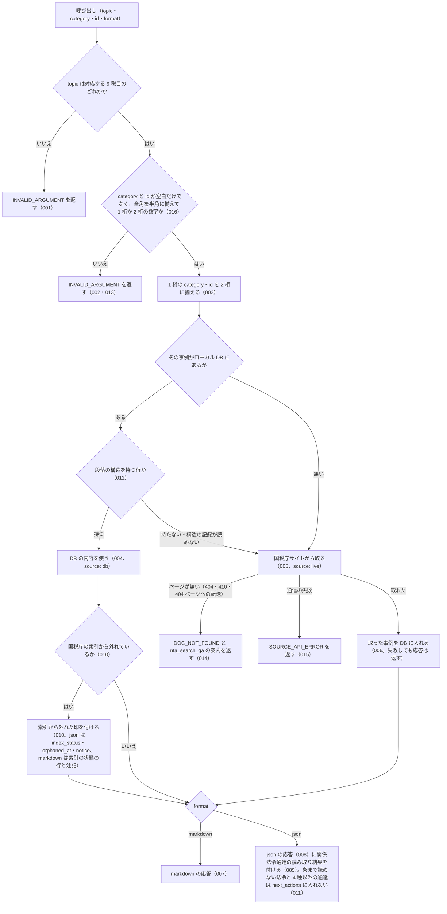

# 機能: nta_get_qa（質疑応答事例を 1 件取得する）

- 機能 ID: NTA
- 版: current
- 承認日: 2026-09-24（初版。PR #52 のマージ）。差分 `20260926-processing-flow` は 2026-09-26（PR #63）。差分 `20260926-undecided-to-issues` は 2026-09-26（PR #74）。差分 `20260927-argument-and-parse-errors` は 2026-09-27（PR #84）。差分 `20260927-fetch-paths` は 2026-09-27（PR #88）。差分 `20260927-get-responses` は 2026-09-27（PR #89）。差分 `20260927-index-status-marks` は 2026-09-27（PR #91）。差分 `20261001-t1-argument-guards` は 2026-10-01（PR #117）。差分 `20261001-t2-error-codes` は 2026-10-01（PR #118）。差分 `20261001-t3-normalize` は 2026-10-01（PR #119）。差分 `20261003-t4-response-shape` は 2026-10-03（PR #125）。差分 `20261003-source-paths` は 2026-10-03（PR #134）
- 起こした元: v0.20.2 の `src/tools/handlers.ts`（`getQa`）、`src/tools/definitions.ts`、`src/services/tax-answer-render.ts`、`src/tools/handlers.test.ts`、`src/tools/get-db-first.test.ts`
- 関連する Issue: houki-nta-mcp #22（関係法令通達の構造化）、#29（DB を先に引く）、#30（索引から消えた文書の印）

この文書は「このツールは何をするか」を書きます。どう実装しているか（関数名・テーブル名）は書きません。

## アクター

- MCP クライアント（Claude などの LLM、または CLI から呼ぶ人）。`topic`・`category`・`id` を渡して、国税庁の質疑応答事例 1 件の照会要旨・回答要旨・関係法令通達を受け取る

## 入力

| 引数 | 必須 | 内容 |
|---|---|---|
| `topic` | 必須 | 税目フォルダ。`shotoku` / `gensen` / `joto` / `sozoku` / `hyoka` / `hojin` / `shohi` / `inshi` / `hotei` のどれか |
| `category` | 必須 | カテゴリ番号（章に当たる）。例: `"02"`。1 桁でもよい。1 桁か 2 桁の半角の数字（SPEC-NTA-GET-QA-013）。空文字・空白だけは不可（002）。全角の数字は半角に揃えてから読む（016） |
| `id` | 必須 | 事例番号。例: `"19"`。1 桁でもよい。1 桁か 2 桁の半角の数字（SPEC-NTA-GET-QA-013）。空文字・空白だけは不可（002）。全角の数字は半角に揃えてから読む（016） |
| `format` | 任意 | `markdown`（既定）または `json` |

## 処理の流れ

呼び出しを受けてから応答を返すまでに、何をどの順で確かめるかを示します。図の中の番号は「できること」の仕様 ID の末尾 3 桁です。

```mermaid
flowchart TD
  A["呼び出し（topic・category・id・format）"] --> B{"topic は対応する 9 税目のどれかか"}
  B -- いいえ --> E1["INVALID_ARGUMENT を返す（001）"]
  B -- はい --> C{"category と id が空白だけでなく、全角を半角に揃えて 1 桁か 2 桁の数字か（016）"}
  C -- いいえ --> E2["INVALID_ARGUMENT を返す（002・013）"]
  C -- はい --> D["1 桁の category・id を 2 桁に揃える（003）"]
  D --> F{"その事例がローカル DB にあるか"}
  F -- ある --> F2{"段落の構造を持つ行か（012）"}
  F2 -- 持つ --> G["DB の内容を使う（004、source: db）"]
  F2 -- "持たない・構造の記録が読めない" --> H
  F -- 無い --> H["国税庁サイトから取る（005、source: live）"]
  H -- "ページが無い（404・410・404 ページへの転送）" --> E3["DOC_NOT_FOUND と nta_search_qa の案内を返す（014）"]
  H -- 通信の失敗 --> E4["SOURCE_API_ERROR を返す（015）"]
  H -- 取れた --> I["取った事例を DB に入れる（006。失敗しても応答は返す）"]
  G --> X{"国税庁の索引から外れているか（010）"}
  X -- はい --> Y["索引から外れた印を付ける（010。json は index_status・orphaned_at・notice、markdown は索引の状態の行と注記）"]
  X -- いいえ --> J{"format"}
  Y --> J
  I --> J
  J -- markdown --> K["markdown の応答（007）"]
  J -- json --> L["json の応答（008）に関係法令通達の読み取り結果を付ける（009）。条まで読めない法令と 4 種以外の通達は next_actions に入れない（011）"]
```

## できること

### SPEC-NTA-GET-QA-001 対応していない税目は取りに行かない

`topic` が上の 9 税目のどれでもないときは、エラー `INVALID_ARGUMENT` を返す。`hint` に対応している税目の一覧を書く。DB も国税庁サイトも引かない。

### SPEC-NTA-GET-QA-002 category と id が空文字・空白だけのときは取りに行かない

`category` / `id` が空文字のときは、inputSchema の `minLength: 1` の検査（SPEC-NTA-COMMON-ERRORS-013）で止まり、`INVALID_ARGUMENT`（`tool: "nta_get_qa"`、`detail.issues[].path` はその引数名、`message: "空文字は指定できません"`）を返す。空白（半角スペース・全角スペース・タブ・改行）だけのときは、ツールの処理が DB と国税庁サイトを引く前に、SPEC-NTA-COMMON-ERRORS-014 の形の `INVALID_ARGUMENT`（`error: "<引数名> が空です"`、`detail.issues: [{ path: "<引数名>", message: "空白だけは指定できません" }]`、`hint` に税目の目次ページ（`/law/shitsugi/{topic}/01.htm`）でカテゴリ番号と事例番号を確かめるよう書く）を返す。

例: `{ topic: "shohi", category: "", id: "19" }` は `detail.issues` が `[{ path: "category", message: "空文字は指定できません" }]`。`{ topic: "shohi", category: "02", id: "  " }` は `error: "id が空です"`・`detail.issues[0].path: "id"`。どちらも `code: "INVALID_ARGUMENT"` で、DB も国税庁サイトも引かない。

### SPEC-NTA-GET-QA-003 1 桁の category と id は 2 桁に揃えてから引く

`category` と `id` は、1 桁なら先頭に `0` を付けて 2 桁に揃える（`"2"` → `"02"`）。揃えた値で DB を引き、国税庁サイトに取りに行くときは `https://www.nta.go.jp/law/shitsugi/{topic}/{category}/{id}.htm` を取得する。

### SPEC-NTA-GET-QA-004 ローカル DB にある事例は DB から返す

その事例がローカル DB にある（`--bulk-download-qa` または以前の取得で入った）ときは、国税庁サイトに取りに行かずに DB の内容を返す。json の応答の `source` は `db`。`qa.fetchedAt` は DB に入れたときの日時のまま（呼び出した時刻にしない）。

### SPEC-NTA-GET-QA-005 DB に無い事例は国税庁サイトから取る

その事例が DB に無いときは、国税庁サイトの該当ページを取得して返す。json の応答の `source` は `live`。

### SPEC-NTA-GET-QA-006 国税庁サイトから取った事例は DB に入り、次からは DB から返す

SPEC-NTA-GET-QA-005 で取得した事例は DB に入る。同じ事例をもう一度求められたときは国税庁サイトに取りに行かず、`source` が `db` の応答を返す。このときの応答は、国税庁サイトから取ったときと同じ構造である（`qa.question` / `qa.answer` の段落の配列と、そこから作る `related_laws` が残っている）。DB への書き込みに失敗しても、その呼び出しの応答は返す。

### SPEC-NTA-GET-QA-007 markdown（既定）の応答

`format` を省くか `markdown` にしたとき、応答は次を含む文字列である。DB から返したときも国税庁サイトから取ったときも同じ形。

- 見出し `# <題名>` と、`> 税目: <topic> / カテゴリ: <category> / 事例番号: <id>` の行
- `## 【照会要旨】`・`## 【回答要旨】`・`## 【関係法令通達】` の節（中身が無い節は出さない）
- ページ下部の注記（作成時点と、一般的な回答である旨の断り書き）がある事例では、`## 【関係法令通達】` の後ろに独立した `## 注記（国税庁）` の節。注記は `## 【関係法令通達】` の節には入れない
- `出典: <国税庁ページの URL>`・`取得: <取得日時>`・`取得元: <ローカル DB（bulk download で取り込んだもの）| 国税庁サイト（この呼び出しで取得）>`
- 質疑応答事例の位置付けの注（国税庁の参考解説資料で法的拘束力はなく、実務判断は通達・法令本文に基づく必要があること）

### SPEC-NTA-GET-QA-008 json の応答

`format` を `json` にしたとき、応答は次のフィールドを持つ。値の無いフィールドは `null` にし、キーは無くさない。

| フィールド | 内容 |
|---|---|
| `qa.topic` / `qa.category` / `qa.id` | 税目・カテゴリ番号・事例番号（2 桁に揃えたもの） |
| `qa.title` | 題名 |
| `qa.question` / `qa.answer` | 照会要旨・回答要旨の段落の配列 |
| `qa.relatedLaws` | 【関係法令通達】の段落の配列（ページの表記のまま） |
| `qa.notice` / `qa.basisDate` | ページ下部の注記と、その注記から読んだ作成時点の日付（`YYYY-MM-DD`）。注記が無い事例ではどちらも `null`。注記はあるが日付を読めないときは `qa.basisDate` だけ `null` |
| `qa.sourceUrl` / `qa.fetchedAt` | 出典 URL と取得日時 |
| `index_status` / `orphaned_at` / `notice` | SPEC-NTA-GET-QA-010。索引にある事例と、この呼び出しで国税庁サイトから取った事例では `null` |
| `source` | `db` または `live` |
| `legal_status` | `binds_citizens: false` / `binds_courts: false` / `binds_tax_office: false` と注 |

例: 注記の無い事例を `format: "json"` で取ると、`qa.notice: null`・`qa.basisDate: null`（v0.22.0 ではどちらのキーも無かった）。

### SPEC-NTA-GET-QA-009 関係法令通達を法令と通達に分け、本文を読む案内を付ける

json の応答では、【関係法令通達】を読み取って次を付ける。読み取れたものが無ければそのフィールドは付けない。

- `related_laws`: 法令の参照。要素は `law_name`・`article`・`paragraph`・`item`・`raw`（元の表記）
- `related_tsutatsu`: 通達の参照。要素は `name`・`clause`・`raw`
- `next_actions`: 法令は houki-egov-mcp の `get_law` を、通達は `nta_get_tsutatsu` を、読み取った引数付きで案内する。同じ案内は 1 回だけ入れる

例: shohi/02/19 の「消費税法第2条第1項第8号、消費税法基本通達5-1-1」からは、`related_laws` に `{ law_name: "消費税法", article: "2", paragraph: 1, item: 8 }`、`related_tsutatsu` に `{ name: "消費税法基本通達", clause: "5-1-1" }` が入り、`next_actions` はこの 2 つを読む案内の 2 件になる。

### SPEC-NTA-GET-QA-010 国税庁の索引から消えた事例に印を付け、それ以外では印のキーを null にする

DB から返す事例（SPEC-NTA-GET-QA-004）が国税庁の索引から外れている（bulk download で外れたことを確認した日時が付いている）ときは、応答に印を付ける。

- `format` が `json` のとき: `index_status: "removed_from_index"`、`orphaned_at`（確認した日時。例: `"2026-10-01T00:30:00Z"`）、`notice`（索引から外れている旨と、過去の課税期間では意味を持つ場合があること、現在の取扱いは最新の通達で確かめること、出典 URL が 404 になることがあることの注記）を付ける
- `format` を省くか `markdown` のとき: `> 税目: … / カテゴリ: … / 事例番号: …` の行の後に、`> **索引の状態**: removed_from_index（<確認した日時> に確認）` の行と、`> ` で始まる注記の行を入れる
- 索引にある事例と、この呼び出しで国税庁サイトから取った事例では、json の `index_status`・`orphaned_at`・`notice` をどれも `null` にし（キーは無くならない）、markdown に「索引の状態」の行と注記を入れない

注記の文は `nta_get_jimu_unei`（SPEC-NTA-GET-JIMU-UNEI-004）と同じである。

例: 索引にある事例を DB から `format: "json"` で取ると、`index_status: null`・`orphaned_at: null`・`notice: null`（v0.22.0 ではどのキーも無かった）。

### SPEC-NTA-GET-QA-011 条まで読めない法令や、基本通達 4 種以外の通達は `next_actions` に入れない

SPEC-NTA-GET-QA-009 の `next_actions` には、読み取った参照のうち次のものを入れない。入れないものも `related_laws` / `related_tsutatsu` には残す。

- 法令: 条（`article`）まで読めなかったもの。法令名が「法」「令」「規則」「法律」のどれでも終わらないもの（例: `日米租税条約`）。法令名が「旧」で始まるか「改正前」を含むもの（例: `旧所得税法`）
- 通達: 番号（`clause`）まで読めなかったもの。消費税法基本通達・所得税基本通達・法人税基本通達・相続税法基本通達の 4 種以外の通達

通達の番号の末尾に `(4)` のような細目があるときは、`next_actions` の `example.clause` からは細目を外す（`related_tsutatsu` の `clause` は元のまま）。

例: 【関係法令通達】が「消費税法第2条第1項第8号、消費税法基本通達5-1-1(4)」「日米租税条約第3条」「旧所得税法第9条」の事例では、`related_laws` は 3 件だが、`next_actions` の法令の案内は `消費税法` の 1 件だけになる。通達の案内の `example` は `{ name: "消費税法基本通達", clause: "5-1-1" }` で、`related_tsutatsu` の `clause` は `5-1-1(4)` のまま。

### SPEC-NTA-GET-QA-012 段落の構造を持たない DB の行は、国税庁サイトから取り直す

DB にその事例の行があっても、段落の構造（照会要旨・回答要旨・関係法令通達を分けたもの）を持たない行（v0.16.0 より前に DB に入れた行）や、構造の記録が読めない行は、DB から返さず、DB に無いとき（SPEC-NTA-GET-QA-005）と同じく国税庁サイトから取る。応答の `source` は `live` になり、取った事例は SPEC-NTA-GET-QA-006 のとおり DB に書き戻す。次の呼び出しからは DB から返す（`source: "db"`）。

### SPEC-NTA-GET-QA-013 category と id は 1 桁か 2 桁の半角の数字で、それ以外は取りに行かずに `INVALID_ARGUMENT` を返す

`category` と `id` の形は、前後の空白を除いて、半角の数字 1 桁か 2 桁である（SPEC-NTA-COMMON-ERRORS-015）。それ以外（英字を含む、3 桁以上、記号を含む）のときは、DB と国税庁サイトを引く前に `INVALID_ARGUMENT`（`tool: "nta_get_qa"`、`error: "<引数名> の形が受け付ける形ではありません: <渡した値>"`、`detail.issues: [{ path: "<引数名>", message: "1 桁か 2 桁の数字で指定してください" }]`、`hint` に `"02"`・`"19"` のような例）を返す。形が正しければ SPEC-NTA-GET-QA-003 のとおり 2 桁に揃えて引く。

例: `{ topic: "shohi", category: "02", id: "19" }` と `{ topic: "shohi", category: "2", id: "9" }` は検査を通る。`{ topic: "shohi", category: "1a", id: "19" }` は `detail.issues[0].path: "category"`、`{ topic: "shohi", category: "02", id: "190" }` は `detail.issues[0].path: "id"` で、どちらも `code: "INVALID_ARGUMENT"`、DB も国税庁サイトも引かない（v0.21.3 では引いてから `DOC_NOT_FOUND` か `SOURCE_API_ERROR` になっていた）。

### SPEC-NTA-GET-QA-014 国税庁サイトにページが無い（404・410・404 ページへの転送）ときは `DOC_NOT_FOUND` を返し、検索ツールを案内する

`topic` / `category` / `id` の事例が DB に無く国税庁サイトから取るとき、国税庁サイトが HTTP 404 か 410 を返した、または `https://www.nta.go.jp/error/404.htm` に転送したときは、エラー `DOC_NOT_FOUND`（`retryable: false`）を返す（SPEC-NTA-COMMON-ERRORS-016）。`SOURCE_API_ERROR` にはしない。

- `error`: 渡した引数の値と、そのページが国税庁サイトに無いこと
- `hint`: 番号を確かめる案内（nta_search_qa で探す）
- `next_actions`: `{ action: "nta_search_qa", reason: "キーワード検索で正しい番号を探せます", example: { topic: <渡した topic>, keyword: "<探したい語>" } }` の 1 件。`retry_later` は入れない
- `detail.status`: 国税庁サイトが返した HTTP ステータス（転送のときは 404）、`detail.url`: 取りに行った URL
- `tool`: `nta_get_qa`

例: 国税庁サイトが 404 を返す状態で `{ topic: "shohi", category: "99", id: "99" }` を渡すと、`code: "DOC_NOT_FOUND"`、`retryable: false`、`next_actions[0].action: "nta_search_qa"`（v0.21.3 では `SOURCE_API_ERROR`・`retryable: true`・`retry_later` だった）。`/error/404.htm` への転送でも、410 でも同じ。

### SPEC-NTA-GET-QA-015 国税庁サイトとの通信が失敗したときは、失敗の種類ごとの `SOURCE_*` を返す

国税庁サイトから取るとき（SPEC-NTA-GET-QA-005）に、要求がページが無い（SPEC-NTA-GET-QA-014）以外の形で失敗したときは、SPEC-NTA-COMMON-ERRORS-018 の表の code・`retryable`・`next_actions`・`detail` のエラーを返す。`tool` は `nta_get_qa`。

| 国税庁サイト | `code` | `retryable` | `next_actions` |
|---|---|---|---|
| HTTP 429 | `SOURCE_RATE_LIMITED` | `true` | `retry_later` |
| 30 秒以内に応答しない（取り直しても） | `SOURCE_TIMEOUT` | `true` | `retry_later` |
| HTTP 5xx（取り直しても） | `SOURCE_API_ERROR` | `true` | `retry_later` |
| HTTP 403・400 など（404・410・429 を除く 4xx） | `SOURCE_API_ERROR` | `false` | 付けない |
| 接続できない（取り直しても。SPEC-NTA-COMMON-ERRORS-019） | `SOURCE_UNAVAILABLE` | `true` | `retry_later` |

例: 国税庁サイトが 503 を返す状態で `{ topic: "shohi", category: "02", id: "19" }` を渡すと、`code: "SOURCE_API_ERROR"`、`retryable: true`、`detail.status: 503`。403 を返すときは `code: "SOURCE_API_ERROR"`、`retryable: false`、`next_actions` 無し（v0.23.0 では `retryable: true`・`retry_later`）。429 なら `SOURCE_RATE_LIMITED`、接続できない（`cause.code: "ENOTFOUND"`）なら `SOURCE_UNAVAILABLE`・`detail.cause: "ENOTFOUND"`（v0.23.0 ではどちらも `SOURCE_API_ERROR`）。

### SPEC-NTA-GET-QA-016 `category` と `id` は半角に揃えてから形を確かめる

`category` と `id` は、前後の空白を除いた値を houki-abbreviations の `normalizeJpText` の規則（全角英数字を半角に、ダッシュ類 `－` `‐` `‑` `–` `—` `―` `−` を `-` に、全角チルダ `～` `〜` を `~` に、全角空白を半角空白にし、前後の空白を除く。罫線 `─` と長音 `ー` は変えない。大文字と小文字は区別する）で揃えてから、SPEC-NTA-GET-QA-013 の形の検査に進む（SPEC-NTA-SEARCH-RULES-019）。揃えた後の値で DB を引き、国税庁サイトの URL を組み立てる。

例: `{ topic: "shohi", category: "０２", id: "１９" }` は `{ topic: "shohi", category: "02", id: "19" }` と同じ応答（v0.21.3 では全角のまま DB を引き、国税庁サイトの `/law/shitsugi/shohi/０２/１９.htm` を取りに行っていた）。

## できないこと

- markdown の応答で `related_laws` / `related_tsutatsu` / `next_actions` を返すこと（json のときだけ。markdown は【関係法令通達】の節をページの表記のまま載せる）
- 事例番号を題名やキーワードから探すこと（探すのは `nta_search_qa`）
- 関係法令通達に挙がった法令・通達の本文を返すこと（`next_actions` で案内するだけ）
- 回答要旨が今の法令でも成り立つかを判定すること（`qa.basisDate` は国税庁が書いた作成時点をそのまま返す）

## 未決

初版起こしで見つけた、意図か不具合かを人が決める項目です。決まったら「できること」に ID を振るか、`specs/changes/` の差分にします。

意図か不具合かの判断が要る項目は houki-nta-mcp の Issue に移し、ここには題と Issue の番号だけを残します。今の振る舞いのままでよくテストが無いだけの項目は、受入テストを書いてから「できること」に ID を振ります。

