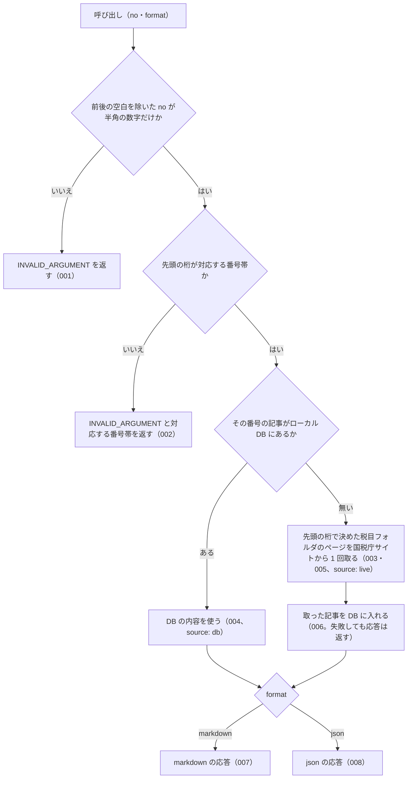

# 機能: nta_get_tax_answer（タックスアンサーを番号で 1 件取得する）

- 機能 ID: NTA
- 版: current
- 承認日: 2026-06-26（PR #63）
- 起こした元: v0.21.0 の `src/tools/handlers.ts`（`getTaxAnswer`）、`src/tools/definitions.ts`、`src/services/tax-answer-render.ts`、`src/services/tax-answer-parser.ts`、`src/services/index-status.ts`、`src/tools/handlers.test.ts`、`src/tools/get-db-first.test.ts`
- 関連する Issue: houki-nta-mcp #29（DB を先に引く）、#30（索引から消えた文書の印）

この文書は「このツールは何をするか」を書きます。どう実装しているか（関数名・テーブル名）は書きません。

## アクター

- MCP クライアント（Claude などの LLM、または CLI から呼ぶ人）。タックスアンサー番号 `no` を渡して、国税庁の「タックスアンサー（よくある税の質問）」1 件の本文（見出しごとの節）を受け取る

## 入力

| 引数     | 必須 | 内容                                                                                                                                   |
| -------- | ---- | -------------------------------------------------------------------------------------------------------------------------------------- |
| `no`     | 必須 | タックスアンサー番号。半角の数字だけ。例: `"6101"`（消費税の基本的なしくみ）、`"1120"`（医療費控除）。先頭の桁で税目が決まる（下の表） |
| `format` | 任意 | `markdown`（既定）または `json`                                                                                                        |

| 先頭の桁 | 税目                 | 税目フォルダ |
| -------- | -------------------- | ------------ |
| `1`      | 所得税               | `shotoku`    |
| `2`      | 源泉徴収             | `gensen`     |
| `3`      | 譲渡所得             | `joto`       |
| `4`      | 相続税・贈与税       | `sozoku`     |
| `5`      | 法人税               | `hojin`      |
| `6`      | 消費税               | `shohi`      |
| `7`      | 印紙税               | `inshi`      |
| `9`      | お知らせ（税目横断） | `osirase`    |

## 処理の流れ

呼び出しを受けてから応答を返すまでに、何をどの順で確かめるかを示します。図の中の番号は「できること」の仕様 ID の末尾 3 桁です。

## できること

### SPEC-NTA-GET-TAX-ANSWER-001 番号が数字でなければ取りに行かない

`no` が空、または半角の数字以外の文字を含む（`"abc"` など）ときは、エラー `INVALID_ARGUMENT` を返す。`error` に「数字で指定してください」の旨と渡された値を書き、`hint` に `"6101"`・`"1120"` のような書き方の例を入れる。DB も国税庁サイトも引かない。前後の空白は取り除いてから見る。

### SPEC-NTA-GET-TAX-ANSWER-002 対応していない先頭の桁は取りに行かない

`no` の先頭の桁が上の表に無い（`8xxx`・`0xxx`）ときは、エラー `INVALID_ARGUMENT` を返す。`error` に「未対応」の旨、`hint` に対応している番号帯の一覧（`1xxx=所得税, 2xxx=源泉, …`）と `8xxx` 帯が未対応である旨を書く。DB も国税庁サイトも引かない。

### SPEC-NTA-GET-TAX-ANSWER-003 番号の先頭の桁で税目フォルダを決め、そのページを取りに行く

`no` の先頭の桁から税目フォルダを決め、国税庁サイトに取りに行くときは `https://www.nta.go.jp/taxes/shiraberu/taxanswer/{税目フォルダ}/{no}.htm` を 1 回だけ取得する。例: `"6101"` → `/shohi/6101.htm`、`"1120"` → `/shotoku/1120.htm`、`"5759"` → `/hojin/5759.htm`。

### SPEC-NTA-GET-TAX-ANSWER-004 ローカル DB にある記事は DB から返す

その番号の記事がローカル DB にある（`--bulk-download-tax-answer` または以前の取得で入った）ときは、国税庁サイトに取りに行かずに DB の内容を返す。json の応答の `source` は `db`。`taxAnswer.fetchedAt` は DB に入れたときの日時のまま（呼び出した時刻にしない）。

### SPEC-NTA-GET-TAX-ANSWER-005 DB に無い記事は国税庁サイトから取る

その番号の記事が DB に無いときは、SPEC-NTA-GET-TAX-ANSWER-003 のページを取得して返す。json の応答の `source` は `live`。

### SPEC-NTA-GET-TAX-ANSWER-006 国税庁サイトから取った記事は DB に入り、次からは DB から返す

SPEC-NTA-GET-TAX-ANSWER-005 で取得した記事は DB に入る。同じ番号をもう一度求められたときは国税庁サイトに取りに行かず、`source` が `db` の応答を返す。このときの応答は、国税庁サイトから取ったときと同じ構造である（`taxAnswer.sections` の節の数が同じで、`taxAnswer.fetchedAt` は最初に取得した日時のまま）。DB への書き込みに失敗しても、その呼び出しの応答は返す。

### SPEC-NTA-GET-TAX-ANSWER-007 markdown（既定）の応答

`format` を省くか `markdown` にしたとき、応答は次を含む文字列である。DB から返したときも国税庁サイトから取ったときも同じ形。

- 見出し `# No.<番号> <題名>`（例: `# No.6101 消費税の基本的なしくみ`）
- `> 法令時点: <ページに書かれた時点>`（例: `> 法令時点: 令和7年4月1日現在法令等`）と `> 対象税目: <税目>`（例: `> 対象税目: 消費税`）の行。ページに無いものは出さない
- ページの見出し（h2）ごとの節 `## <見出し>` と、その段落。例: `## 概要`・`## 課税のしくみ`・`## 申告・納付`・`## 根拠法令等`。「対象税目」の見出しは節にせず、上の `> 対象税目:` の行にする
- `出典: <国税庁ページの URL>`・`取得: <取得日時>`・`取得元: <ローカル DB（bulk download で取り込んだもの）| 国税庁サイト（この呼び出しで取得）>`
- タックスアンサーの位置付けの注（国税庁の参考解説資料で法的拘束力はなく、実務判断は通達・法令本文に基づく必要があること）

### SPEC-NTA-GET-TAX-ANSWER-008 json の応答

`format` を `json` にしたとき、応答は次のフィールドを持つ。

| フィールド                                    | 内容                                                                                                |
| --------------------------------------------- | --------------------------------------------------------------------------------------------------- |
| `taxAnswer.no`                                | 記事番号（ページの見出しから読んだもの）。例: `"1120"`                                              |
| `taxAnswer.title`                             | 題名。例: `"医療費を支払ったとき（医療費控除）"`                                                    |
| `taxAnswer.effectiveDate`                     | ページに書かれた法令時点。例: `"令和7年4月1日現在法令等"`。無いときは付かない                       |
| `taxAnswer.taxCategory`                       | 対象税目。例: `"消費税"`。無いときは付かない                                                        |
| `taxAnswer.sections`                          | 見出しごとの節の配列。要素は `heading`（見出し）と `paragraphs`（段落の文字列の配列）。1 件以上ある |
| `taxAnswer.sourceUrl` / `taxAnswer.fetchedAt` | 出典 URL と取得日時                                                                                 |
| `source`                                      | `db` または `live`                                                                                  |
| `legal_status`                                | `binds_citizens: false` / `binds_courts: false` / `binds_tax_office: false` と注                    |

## できないこと

- 記事を題名やキーワードから探すこと（探すのは `nta_search_tax_answer`）
- `8xxx` 帯（酒税など）の記事を取ること（先頭の桁の表に無い）
- 「根拠法令等」の節に挙がった法令・通達を読み取って `related_laws` / `related_tsutatsu` / `next_actions` を付けること（`nta_get_qa` の【関係法令通達】と違い、節の文字列のまま返す）
- 本文の中の画像・表・添付 PDF の内容を返すこと（段落の文字列だけ）
- 記事が今の法令でも成り立つかを判定すること（`taxAnswer.effectiveDate` は国税庁が書いた法令時点をそのまま返す）
- 1 回の呼び出しで複数の番号を取ること

## 未決

初版起こしで見つけた、意図か不具合かを人が決める項目です。決まったら「できること」に ID を振るか、`specs/changes/` の差分にします。

意図か不具合かの判断が要る項目は houki-nta-mcp の Issue に移し、ここには題と Issue の番号だけを残します。今の振る舞いのままでよくテストが無いだけの項目は、受入テストを書いてから「できること」に ID を振ります。

1. **存在しない番号を指定したときのエラー。** → houki-nta-mcp #65
2. **全角の数字を受け付けない。** → houki-nta-mcp #66
3. **番号の桁数と先頭の `0` を確かめない。** → houki-nta-mcp #66
4. **未対応の番号帯のエラー文に古い版が書かれている。** → houki-nta-mcp #70
5. **ページの解析に失敗したときの `INTERNAL_ERROR`**（国税庁ページの構造変更を疑う `hint` 付き、`url` と `detail.cause`）はテストが無い。ID を振るのは受入テストを書いてから。
6. **国税庁の索引から消えた記事の印。** DB から返した記事が索引から外れているとき、json では `index_status: "removed_from_index"`・`orphaned_at`・`notice` が付き、markdown では `> **索引の状態**: removed_from_index（<日時> に確認）` の行と注記が付く。このツールの応答としてのテストが無い。ID を振るのは受入テストを書いてから。
7. **v0.16.0 より前に DB に入れた記事**（節の構造を持たない行）は、DB にあっても国税庁サイトから取り直す。このツールの応答としてのテストが無い。ID を振るのは受入テストを書いてから。
8. **`--bulk-download-tax-answer` で入れた記事を DB から返す経路**は、SPEC-NTA-GET-TAX-ANSWER-004 の文に含めたが、テストが確かめているのは以前の取得で書き戻した記事を返す経路だけである。bulk download で入れた行を用意して確かめる受入テストを足すか。
9. **`taxAnswer.no` は引数ではなくページの見出しから読む。** → houki-nta-mcp #73
