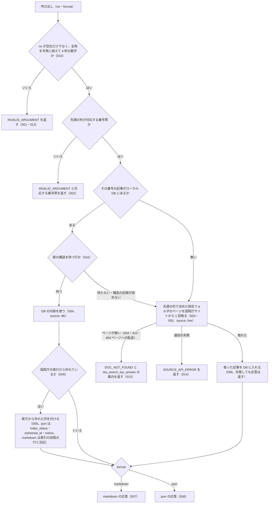

# 機能: nta_get_tax_answer（タックスアンサーを番号で 1 件取得する）

- 機能 ID: NTA
- 版: current
- 承認日: 2026-09-26（初版と差分 `20260926-processing-flow`。PR #63）。差分 `20260926-undecided-to-issues` は 2026-09-26（PR #74）。差分 `20260927-argument-and-parse-errors` は 2026-09-27（PR #84）。差分 `20260927-fetch-paths` は 2026-09-27（PR #88）。差分 `20260927-index-status-marks` は 2026-09-27（PR #91）。差分 `20260930-nta-73-db-values` は 2026-09-30（PR #104）。差分 `20261001-t1-argument-guards` は 2026-10-01（PR #117）。差分 `20261001-t2-error-codes` は 2026-10-01（PR #118）。差分 `20261001-t3-normalize` は 2026-10-01（PR #119）。差分 `20261003-t4-response-shape` は 2026-10-02（PR #124）
- 起こした元: v0.21.0 の `src/tools/handlers.ts`（`getTaxAnswer`）、`src/tools/definitions.ts`、`src/services/tax-answer-render.ts`、`src/services/tax-answer-parser.ts`、`src/services/index-status.ts`、`src/tools/handlers.test.ts`、`src/tools/get-db-first.test.ts`
- 関連する Issue: houki-nta-mcp #29（DB を先に引く）、#30（索引から消えた文書の印）

この文書は「このツールは何をするか」を書きます。どう実装しているか（関数名・テーブル名）は書きません。

## アクター

- MCP クライアント（Claude などの LLM、または CLI から呼ぶ人）。タックスアンサー番号 `no` を渡して、国税庁の「タックスアンサー（よくある税の質問）」1 件の本文（見出しごとの節）を受け取る

## 入力

| 引数     | 必須 | 内容                                                                                                                                   |
| -------- | ---- | -------------------------------------------------------------------------------------------------------------------------------------- |
| `no`     | 必須 | タックスアンサー番号。数字 4 桁（全角は半角に揃えてから読む。001・012・015）。例: `"6101"`（消費税の基本的なしくみ）、`"1120"`（医療費控除）。先頭の桁で税目が決まる（下の表） |
| `format` | 任意 | `markdown`（既定）または `json`                                                                                                        |

| 先頭の桁 | 税目                 | 税目フォルダ |
| -------- | -------------------- | ------------ |
| `1`      | 所得税               | `shotoku`    |
| `2`      | 源泉徴収             | `gensen`     |
| `3`      | 譲渡所得             | `joto`       |
| `4`      | 相続税・贈与税       | `sozoku`     |
| `5`      | 法人税               | `hojin`      |
| `6`      | 消費税               | `shohi`      |
| `7`      | 印紙税               | `inshi`      |
| `9`      | お知らせ（税目横断） | `osirase`    |

## 処理の流れ

呼び出しを受けてから応答を返すまでに、何をどの順で確かめるかを示します。図の中の番号は「できること」の仕様 ID の末尾 3 桁です。

```mermaid
flowchart TD
  A["呼び出し（no・format）"] --> B{"no が空白だけでなく、全角を半角に揃えて 4 桁の数字か（015）"}
  B -- いいえ --> E1["INVALID_ARGUMENT を返す（001・012）"]
  B -- はい --> C{"先頭の桁が対応する番号帯か"}
  C -- いいえ --> E2["INVALID_ARGUMENT と対応する番号帯を返す（002）"]
  C -- はい --> D{"その番号の記事がローカル DB にあるか"}
  D -- ある --> D2{"節の構造を持つ行か（010）"}
  D2 -- 持つ --> G["DB の内容を使う（004、source: db）"]
  D2 -- "持たない・構造の記録が読めない" --> H
  D -- 無い --> H["先頭の桁で決めた税目フォルダのページを国税庁サイトから 1 回取る（003・005、source: live）"]
  H -- "ページが無い（404・410・404 ページへの転送）" --> E3["DOC_NOT_FOUND と nta_search_tax_answer の案内を返す（013）"]
  H -- 通信の失敗 --> E4["SOURCE_API_ERROR を返す（014）"]
  H -- 取れた --> I["取った記事を DB に入れる（006。失敗しても応答は返す）"]
  G --> X{"国税庁の索引から外れているか（009）"}
  X -- はい --> Y["索引から外れた印を付ける（009。json は index_status・orphaned_at・notice、markdown は索引の状態の行と注記）"]
  X -- いいえ --> J{"format"}
  Y --> J
  I --> J
  J -- markdown --> K["markdown の応答（007）"]
  J -- json --> L["json の応答（008）"]
```

## できること

### SPEC-NTA-GET-TAX-ANSWER-001 番号が空か数字でなければ取りに行かない

`no` が空文字のときは、inputSchema の `minLength: 1` の検査（SPEC-NTA-COMMON-ERRORS-013）で止まり、`INVALID_ARGUMENT`（`tool: "nta_get_tax_answer"`、`detail.issues: [{ path: "no", message: "空文字は指定できません" }]`）を返す。空白だけのときは、SPEC-NTA-COMMON-ERRORS-014 の形の `INVALID_ARGUMENT`（`error: "no が空です"`、`detail.issues: [{ path: "no", message: "空白だけは指定できません" }]`）を返す。前後の空白を除いた値が半角の数字以外の文字を含む（`"abc"`、`"61-01"` など）ときは、SPEC-NTA-COMMON-ERRORS-015 の形の `INVALID_ARGUMENT`（`error: "no の形が受け付ける形ではありません: <渡した値>"`、`detail.issues: [{ path: "no", message: "半角の数字 4 桁で指定してください" }]`、`hint` に `"6101"`・`"1120"` のような例）を返す。どれも DB も国税庁サイトも引かない。全角の数字は半角に揃えてから見る（SPEC-NTA-GET-TAX-ANSWER-015）。

例: `no: ""` は `detail.issues[0].message: "空文字は指定できません"`。`no: " "` は `error: "no が空です"`。`no: "abc"` は `detail.issues[0].message: "半角の数字 4 桁で指定してください"`。どれも `code: "INVALID_ARGUMENT"`・`tool: "nta_get_tax_answer"`。

### SPEC-NTA-GET-TAX-ANSWER-002 対応していない先頭の桁は取りに行かない

`no` の先頭の桁が上の表に無い（`8xxx`・`0xxx`）ときは、エラー `INVALID_ARGUMENT` を返す。`error` に「未対応」の旨、`hint` に対応している番号帯の一覧（`1xxx=所得税, 2xxx=源泉, …`）と `8xxx` 帯が未対応である旨を書く。DB も国税庁サイトも引かない。

### SPEC-NTA-GET-TAX-ANSWER-003 番号の先頭の桁で税目フォルダを決め、そのページを取りに行く

`no` の先頭の桁から税目フォルダを決め、国税庁サイトに取りに行くときは `https://www.nta.go.jp/taxes/shiraberu/taxanswer/{税目フォルダ}/{no}.htm` を 1 回だけ取得する。例: `"6101"` → `/shohi/6101.htm`、`"1120"` → `/shotoku/1120.htm`、`"5759"` → `/hojin/5759.htm`。

### SPEC-NTA-GET-TAX-ANSWER-004 ローカル DB にある記事は DB から返す

その番号の記事がローカル DB にある（`--bulk-download-tax-answer` または以前の取得で入った）ときは、国税庁サイトに取りに行かずに DB の内容を返す。json の応答の `source` は `db`。`taxAnswer.fetchedAt` は DB に入れたときの日時のまま（呼び出した時刻にしない）。

### SPEC-NTA-GET-TAX-ANSWER-005 DB に無い記事は国税庁サイトから取る

その番号の記事が DB に無いときは、SPEC-NTA-GET-TAX-ANSWER-003 のページを取得して返す。json の応答の `source` は `live`。

### SPEC-NTA-GET-TAX-ANSWER-006 国税庁サイトから取った記事は DB に入り、次からは DB から返す

SPEC-NTA-GET-TAX-ANSWER-005 で取得した記事は DB に入る。同じ番号をもう一度求められたときは国税庁サイトに取りに行かず、`source` が `db` の応答を返す。このときの応答は、国税庁サイトから取ったときと同じ構造である（`taxAnswer.sections` の節の数が同じで、`taxAnswer.fetchedAt` は最初に取得した日時のまま）。DB への書き込みに失敗しても、その呼び出しの応答は返す。

### SPEC-NTA-GET-TAX-ANSWER-007 markdown（既定）の応答

`format` を省くか `markdown` にしたとき、応答は次を含む文字列である。DB から返したときも国税庁サイトから取ったときも同じ形。

- 見出し `# No.<番号> <題名>`（例: `# No.6101 消費税の基本的なしくみ`）
- `> 法令時点: <ページに書かれた時点>`（例: `> 法令時点: 令和7年4月1日現在法令等`）と `> 対象税目: <税目>`（例: `> 対象税目: 消費税`）の行。ページに無いものは出さない
- ページの見出し（h2）ごとの節 `## <見出し>` と、その段落。例: `## 概要`・`## 課税のしくみ`・`## 申告・納付`・`## 根拠法令等`。「対象税目」の見出しは節にせず、上の `> 対象税目:` の行にする
- `出典: <国税庁ページの URL>`・`取得: <取得日時>`・`取得元: <ローカル DB（bulk download で取り込んだもの）| 国税庁サイト（この呼び出しで取得）>`
- タックスアンサーの位置付けの注（国税庁の参考解説資料で法的拘束力はなく、実務判断は通達・法令本文に基づく必要があること）

### SPEC-NTA-GET-TAX-ANSWER-008 json の応答

`format` を `json` にしたとき、応答は次のフィールドを持つ。値の無いフィールドは `null` にし、キーは無くさない。

| フィールド                                    | 内容                                                                                                |
| --------------------------------------------- | --------------------------------------------------------------------------------------------------- |
| `taxAnswer.no`                                | 記事番号。引数の `no`（前後の空白を除いたもの。SPEC-NTA-GET-TAX-ANSWER-011）。例: `"1120"`          |
| `taxAnswer.title`                             | 題名。例: `"医療費を支払ったとき（医療費控除）"`                                                    |
| `taxAnswer.effectiveDate`                     | ページに書かれた法令時点の文字列。例: `"令和7年4月1日現在法令等"`。無いときは `null`                |
| `taxAnswer.basisDate`                         | `effectiveDate` から読んだ日付（`YYYY-MM-DD`）。例: `"2025-04-01"`。`effectiveDate` が `null` か、日付を読めないときは `null`。検索の `results[].basisDate`（SPEC-NTA-SEARCH-RULES-015）と同じ値 |
| `taxAnswer.taxCategory`                       | 対象税目。例: `"消費税"`。無いときは `null`                                                         |
| `taxAnswer.sections`                          | 見出しごとの節の配列。要素は `heading`（見出し）と `paragraphs`（段落の文字列の配列）。1 件以上ある |
| `taxAnswer.sourceUrl` / `taxAnswer.fetchedAt` | 出典 URL と取得日時                                                                                 |
| `index_status` / `orphaned_at` / `notice`     | SPEC-NTA-GET-TAX-ANSWER-009。索引にある記事と、この呼び出しで国税庁サイトから取った記事では `null`  |
| `source`                                      | `db` または `live`                                                                                  |
| `legal_status`                                | `binds_citizens: false` / `binds_courts: false` / `binds_tax_office: false` と注                    |

日付の読み方は、和暦の「<元号><年>年<月>月<日>日」を西暦の `YYYY-MM-DD` にする（元年は 1 年）。DB の経路でも国税庁サイトの経路でも同じ読み方で、bulk download が DB の発出日の列に入れる値と同じになる。

例: 法令時点が `令和7年4月1日現在法令等` の記事は `taxAnswer.effectiveDate: "令和7年4月1日現在法令等"`・`taxAnswer.basisDate: "2025-04-01"`。法令時点の書かれていない記事は `taxAnswer.effectiveDate: null`・`taxAnswer.basisDate: null`（v0.22.0 では `effectiveDate` のキーが無く、`basisDate` は無かった）。

### SPEC-NTA-GET-TAX-ANSWER-009 国税庁の索引から消えた記事に印を付け、それ以外では印のキーを null にする

DB から返す記事（SPEC-NTA-GET-TAX-ANSWER-004）が国税庁の索引から外れている（bulk download で外れたことを確認した日時が付いている）ときは、応答に印を付ける。

- `format` が `json` のとき: `index_status: "removed_from_index"`、`orphaned_at`（確認した日時。例: `"2026-10-01T00:30:00Z"`）、`notice`（索引から外れている旨と、過去の課税期間では意味を持つ場合があること、現在の取扱いは最新の通達で確かめること、出典 URL が 404 になることがあることの注記）を付ける
- `format` を省くか `markdown` のとき: `# No.<番号> <題名>` の見出しと `> 法令時点:` / `> 対象税目:` の行（あるとき）の後、最初の `## ` の節の前に、`> **索引の状態**: removed_from_index（<確認した日時> に確認）` の行と、`> ` で始まる注記の行を入れる
- 索引にある記事と、この呼び出しで国税庁サイトから取った記事では、json の `index_status`・`orphaned_at`・`notice` をどれも `null` にし（キーは無くならない）、markdown に「索引の状態」の行と注記を入れない

注記の文は `nta_get_jimu_unei`（SPEC-NTA-GET-JIMU-UNEI-004）と同じである。

例: 索引にある記事を DB から `format: "json"` で取ると、`index_status: null`・`orphaned_at: null`・`notice: null`（v0.22.0 ではどのキーも無かった）。

### SPEC-NTA-GET-TAX-ANSWER-010 節の構造を持たない DB の行は、国税庁サイトから取り直す

DB にその記事の行があっても、節の構造（見出しと段落を分けたもの）を持たない行（v0.16.0 より前に DB に入れた行）や、構造の記録が読めない行は、DB から返さず、DB に無いとき（SPEC-NTA-GET-TAX-ANSWER-005）と同じく国税庁サイトから取る。応答の `source` は `live` になり、取った記事は SPEC-NTA-GET-TAX-ANSWER-006 のとおり DB に書き戻す。次の呼び出しからは DB から返す（`source: "db"`）。

### SPEC-NTA-GET-TAX-ANSWER-011 記事番号は引数の no で決め、応答と DB の行に空の番号を入れない

記事番号は、ページの見出しではなく引数の `no`（前後の空白を除いたもの）で決める。ページの見出しが `No.<番号> <題名>` の形でなくても、次のとおりになる。

- json の `taxAnswer.no` と markdown の見出し `# No.<番号> <題名>` の番号は `no`。題名は見出しの文字列のまま
- 国税庁サイトから取った記事を DB に書き戻す行（SPEC-NTA-GET-TAX-ANSWER-006）の文書 ID は `no`、税目は `no` の先頭の桁で決めた税目フォルダ。文書 ID が空の行は作らない。次の呼び出しは DB から返す（`source: "db"`）
- DB から返すとき（SPEC-NTA-GET-TAX-ANSWER-004）、行に記録された番号が空でも `taxAnswer.no` は `no`

例: 見出しが `消費税の基本的なしくみ`（`No.` が無い）のページを `no: "6101"` で取ると、`taxAnswer.no` は `"6101"`、`taxAnswer.title` は `"消費税の基本的なしくみ"`、DB の行の文書 ID は `6101`、税目は `shohi`。同じ番号をもう一度求めると `source` は `db` で `taxAnswer.no` は `"6101"`。

### SPEC-NTA-GET-TAX-ANSWER-012 番号は 4 桁で、桁数が違えば取りに行かずに `INVALID_ARGUMENT` を返す

`no` は、前後の空白を除いて半角の数字 4 桁である（SPEC-NTA-COMMON-ERRORS-015）。数字だけだが 4 桁でない（`"61"`、`"61011"`）ときは、先頭の桁で税目を決める（SPEC-NTA-GET-TAX-ANSWER-002・003）前に、`INVALID_ARGUMENT`（`tool: "nta_get_tax_answer"`、`error: "no の形が受け付ける形ではありません: <渡した値>"`、`detail.issues: [{ path: "no", message: "半角の数字 4 桁で指定してください" }]`、`hint` に `"6101"`・`"1120"` のような例）を返す。DB も国税庁サイトも引かない。

例: `no: "6101"` は検査を通る。`no: "61"` と `no: "61011"` は `code: "INVALID_ARGUMENT"`・`detail.issues[0].path: "no"` で、DB も国税庁サイトも引かない（v0.21.3 では先頭の桁で税目を決めて取りに行っていた）。`no: "8101"` は 4 桁なので検査を通り、SPEC-NTA-GET-TAX-ANSWER-002 の未対応の桁のエラーになる。

### SPEC-NTA-GET-TAX-ANSWER-013 国税庁サイトにページが無い（404・410・404 ページへの転送）ときは `DOC_NOT_FOUND` を返し、検索ツールを案内する

`no` の記事が DB に無く国税庁サイトから取るとき、国税庁サイトが HTTP 404 か 410 を返した、または `https://www.nta.go.jp/error/404.htm` に転送したときは、エラー `DOC_NOT_FOUND`（`retryable: false`）を返す（SPEC-NTA-COMMON-ERRORS-016）。`SOURCE_API_ERROR` にはしない。

- `error`: 渡した引数の値と、そのページが国税庁サイトに無いこと
- `hint`: 番号を確かめる案内（nta_search_tax_answer で探す）
- `next_actions`: `{ action: "nta_search_tax_answer", reason: "キーワード検索で正しい番号を探せます", example: { keyword: "<探したい語>" } }` の 1 件。`retry_later` は入れない
- `detail.status`: 国税庁サイトが返した HTTP ステータス（転送のときは 404）、`detail.url`: 取りに行った URL
- `tool`: `nta_get_tax_answer`

例: 国税庁サイトが 404 を返す状態で `{ no: "6999" }` を渡すと、`code: "DOC_NOT_FOUND"`、`retryable: false`、`next_actions[0].action: "nta_search_tax_answer"`（v0.21.3 では `SOURCE_API_ERROR`・`retryable: true`・`retry_later` だった）。`/error/404.htm` への転送でも、410 でも同じ。

### SPEC-NTA-GET-TAX-ANSWER-014 国税庁サイトとの通信が失敗したときは `SOURCE_API_ERROR`（`retryable: true`）を返す

国税庁サイトから取るときに、接続できない・応答を待ちきれなかった・HTTP 5xx・HTTP 429 のどれかで終わったとき（取り直しても失敗したとき）は、エラー `SOURCE_API_ERROR`（`retryable: true`、`next_actions` に `retry_later`、`detail.status` に HTTP ステータス（あれば）、`detail.url` に取りに行った URL、`tool` に `nta_get_tax_answer`）を返す。ページが無いこと（SPEC-NTA-GET-TAX-ANSWER-013）はこのエラーにしない。

例: 国税庁サイトが 503 を返す状態で `{ no: "6101" }` を渡すと、`code: "SOURCE_API_ERROR"`、`retryable: true`、`detail.status: 503`。接続できないときは `detail.status` が無く `retryable: true`。

### SPEC-NTA-GET-TAX-ANSWER-015 `no` は半角に揃えてから形を確かめる

`no` は、前後の空白を除いた値を houki-abbreviations の `normalizeJpText` の規則（全角英数字を半角に、ダッシュ類 `－` `‐` `‑` `–` `—` `―` `−` を `-` に、全角チルダ `～` `〜` を `~` に、全角空白を半角空白にし、前後の空白を除く。罫線 `─` と長音 `ー` は変えない。大文字と小文字は区別する）で揃えてから、SPEC-NTA-GET-TAX-ANSWER-001・012 の形の検査に進む（SPEC-NTA-SEARCH-RULES-019）。揃えた後の値で DB を引き、国税庁サイトの URL を組み立てる。

例: `{ no: "６１０１" }` は `{ no: "6101" }` と同じ応答（v0.21.3 では数字以外として `INVALID_ARGUMENT` だった）。

## できないこと

- 記事を題名やキーワードから探すこと（探すのは `nta_search_tax_answer`）
- `8xxx` 帯（酒税など）の記事を取ること（先頭の桁の表に無い）
- 「根拠法令等」の節に挙がった法令・通達を読み取って `related_laws` / `related_tsutatsu` / `next_actions` を付けること（`nta_get_qa` の【関係法令通達】と違い、節の文字列のまま返す）
- 本文の中の画像・表・添付 PDF の内容を返すこと（段落の文字列だけ）
- 記事が今の法令でも成り立つかを判定すること（`taxAnswer.effectiveDate` は国税庁が書いた法令時点をそのまま返す）
- 1 回の呼び出しで複数の番号を取ること

## 未決

初版起こしで見つけた、意図か不具合かを人が決める項目です。決まったら「できること」に ID を振るか、`specs/changes/` の差分にします。

意図か不具合かの判断が要る項目は houki-nta-mcp の Issue に移し、ここには題と Issue の番号だけを残します。今の振る舞いのままでよくテストが無いだけの項目は、受入テストを書いてから「できること」に ID を振ります。

4. **未対応の番号帯のエラー文に古い版が書かれている。** → houki-nta-mcp #70
