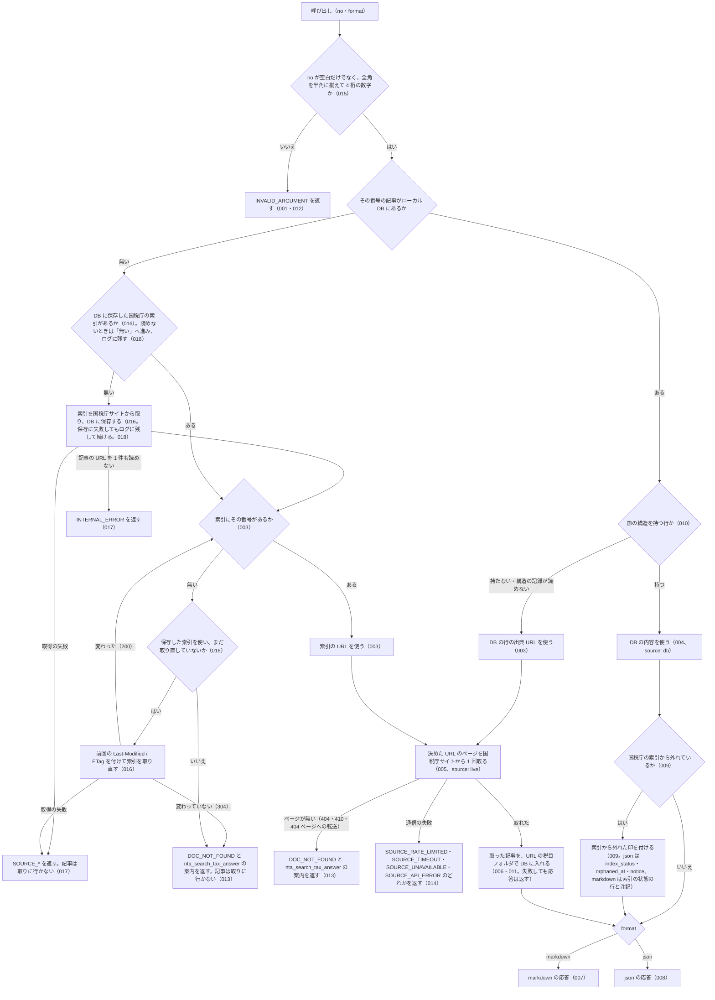

# 機能: nta_get_tax_answer（タックスアンサーを番号で 1 件取得する）

- 機能 ID: NTA
- 版: current
- 承認日: 2026-09-26（初版と差分 `20260926-processing-flow`。PR #63）。差分 `20260926-undecided-to-issues` は 2026-09-26（PR #74）。差分 `20260927-argument-and-parse-errors` は 2026-09-27（PR #84）。差分 `20260927-fetch-paths` は 2026-09-27（PR #88）。差分 `20260927-index-status-marks` は 2026-09-27（PR #91）。差分 `20260930-nta-73-db-values` は 2026-09-30（PR #104）。差分 `20261001-t1-argument-guards` は 2026-10-01（PR #117）。差分 `20261001-t2-error-codes` は 2026-10-01（PR #118）。差分 `20261001-t3-normalize` は 2026-10-01（PR #119）。差分 `20261003-t4-response-shape` は 2026-10-03（PR #125）。差分 `20261003-source-paths` は 2026-10-03（PR #134）。差分 `20261004-db-location` は 2026-10-05（PR #142）
- 起こした元: v0.21.0 の `src/tools/handlers.ts`（`getTaxAnswer`）、`src/tools/definitions.ts`、`src/services/tax-answer-render.ts`、`src/services/tax-answer-parser.ts`、`src/services/index-status.ts`、`src/tools/handlers.test.ts`、`src/tools/get-db-first.test.ts`
- 関連する Issue: houki-nta-mcp #29（DB を先に引く）、#30（索引から消えた文書の印）、#128（8xxx 帯と税目フォルダ）、#120（通信の失敗の code）、#137（保存した索引を読めないとき。0.25.0）

この文書は「このツールは何をするか」を書きます。どう実装しているか（関数名・テーブル名）は書きません。

## アクター

- MCP クライアント（Claude などの LLM、または CLI から呼ぶ人）。タックスアンサー番号 `no` を渡して、国税庁の「タックスアンサー（よくある税の質問）」1 件の本文（見出しごとの節）を受け取る

## 入力

| 引数     | 必須 | 内容                                                                                                                                   |
| -------- | ---- | -------------------------------------------------------------------------------------------------------------------------------------- |
| `no`     | 必須 | タックスアンサー番号。数字 4 桁（全角は半角に揃えてから読む。001・012・015）。例: `"6101"`（消費税の基本的なしくみ）、`"1120"`（医療費控除）。税目フォルダは国税庁の索引で決める（003・016） |
| `format` | 任意 | `markdown`（既定）または `json`                                                                                                        |

記事は国税庁の索引（`/taxes/shiraberu/taxanswer/code/`）で番号から URL を決める。番号の先頭の桁はおおむね税目を表すが、`2xxx` の一部は所得税（`shotoku`）、`4xxx` は相続税（`sozoku`）・贈与税（`zoyo`）・財産の評価（`hyoka`）、`7xxx` は印紙税（`inshi`）・法定調書（`hotei`）・不服申立て（`fufuku`）、`8xxx` は災害（`saigai`）のように分かれる

## 処理の流れ

呼び出しを受けてから応答を返すまでに、何をどの順で確かめるかを示します。図の中の番号は「できること」の仕様 ID の末尾 3 桁です。

```mermaid
flowchart TD
  A["呼び出し（no・format）"] --> B{"no が空白だけでなく、全角を半角に揃えて 4 桁の数字か（015）"}
  B -- いいえ --> E1["INVALID_ARGUMENT を返す（001・012）"]
  B -- はい --> D{"その番号の記事がローカル DB にあるか"}
  D -- ある --> D2{"節の構造を持つ行か（010）"}
  D2 -- 持つ --> G["DB の内容を使う（004、source: db）"]
  D2 -- "持たない・構造の記録が読めない" --> U1["DB の行の出典 URL を使う（003）"]
  D -- 無い --> X0{"DB に保存した国税庁の索引があるか（016）。読めないときは「無い」へ進み、ログに残す（018）"}
  X0 -- 無い --> X1["索引を国税庁サイトから取り、DB に保存する（016。保存に失敗してもログに残して続ける。018）"]
  X1 -- 取得の失敗 --> E5["SOURCE_* を返す。記事は取りに行かない（017）"]
  X1 -- 記事の URL を 1 件も読めない --> E6["INTERNAL_ERROR を返す（017）"]
  X1 --> X2{"索引にその番号があるか（003）"}
  X0 -- ある --> X2
  X2 -- 無い --> X3{"保存した索引を使い、まだ取り直していないか（016）"}
  X3 -- はい --> X4["前回の Last-Modified / ETag を付けて索引を取り直す（016）"]
  X4 -- "変わった（200）" --> X2
  X4 -- 取得の失敗 --> E5
  X4 -- "変わっていない（304）" --> E7["DOC_NOT_FOUND と nta_search_tax_answer の案内を返す。記事は取りに行かない（013）"]
  X3 -- いいえ --> E7
  X2 -- ある --> U2["索引の URL を使う（003）"]
  U1 --> H["決めた URL のページを国税庁サイトから 1 回取る（005、source: live）"]
  U2 --> H
  H -- "ページが無い（404・410・404 ページへの転送）" --> E3["DOC_NOT_FOUND と nta_search_tax_answer の案内を返す（013）"]
  H -- 通信の失敗 --> E4["SOURCE_RATE_LIMITED・SOURCE_TIMEOUT・SOURCE_UNAVAILABLE・SOURCE_API_ERROR のどれかを返す（014）"]
  H -- 取れた --> I["取った記事を、URL の税目フォルダで DB に入れる（006・011。失敗しても応答は返す）"]
  G --> Y{"国税庁の索引から外れているか（009）"}
  Y -- はい --> Z["索引から外れた印を付ける（009。json は index_status・orphaned_at・notice、markdown は索引の状態の行と注記）"]
  Y -- いいえ --> J{"format"}
  Z --> J
  I --> J
  J -- markdown --> K["markdown の応答（007）"]
  J -- json --> L["json の応答（008）"]
```

## できること

### SPEC-NTA-GET-TAX-ANSWER-001 番号が空か数字でなければ取りに行かない

`no` が空文字のときは、inputSchema の `minLength: 1` の検査（SPEC-NTA-COMMON-ERRORS-013）で止まり、`INVALID_ARGUMENT`（`tool: "nta_get_tax_answer"`、`detail.issues: [{ path: "no", message: "空文字は指定できません" }]`）を返す。空白だけのときは、SPEC-NTA-COMMON-ERRORS-014 の形の `INVALID_ARGUMENT`（`error: "no が空です"`、`detail.issues: [{ path: "no", message: "空白だけは指定できません" }]`）を返す。前後の空白を除いた値が半角の数字以外の文字を含む（`"abc"`、`"61-01"` など）ときは、SPEC-NTA-COMMON-ERRORS-015 の形の `INVALID_ARGUMENT`（`error: "no の形が受け付ける形ではありません: <渡した値>"`、`detail.issues: [{ path: "no", message: "半角の数字 4 桁で指定してください" }]`、`hint` に `"6101"`・`"1120"` のような例）を返す。どれも DB も国税庁サイトも引かない。全角の数字は半角に揃えてから見る（SPEC-NTA-GET-TAX-ANSWER-015）。

例: `no: ""` は `detail.issues[0].message: "空文字は指定できません"`。`no: " "` は `error: "no が空です"`。`no: "abc"` は `detail.issues[0].message: "半角の数字 4 桁で指定してください"`。どれも `code: "INVALID_ARGUMENT"`・`tool: "nta_get_tax_answer"`。

### SPEC-NTA-GET-TAX-ANSWER-003 記事の URL は国税庁の索引で決め、DB にある行はその行の URL を使う

国税庁サイトから記事を取りに行くときの URL は、番号の先頭の桁ではなく、次の順に決める。

1. DB にその番号の行があり、節の構造を持たない（SPEC-NTA-GET-TAX-ANSWER-010）ときは、その行の出典 URL
2. DB にその番号の行が無いときは、国税庁の索引（SPEC-NTA-GET-TAX-ANSWER-016）でその番号の URL を探す。索引に無ければ取りに行かずに SPEC-NTA-GET-TAX-ANSWER-013 の `DOC_NOT_FOUND`

決めた URL を 1 回だけ取得する。税目フォルダは、取得した URL の `taxanswer/` の次の要素である。

例（2026-10-03 JST の索引）:

| `no` | 取りに行く URL | 税目フォルダ | v0.23.0 で取りに行った URL |
|---|---|---|---|
| `6101` | `/taxes/shiraberu/taxanswer/shohi/6101.htm` | `shohi` | 同じ |
| `2010` | `/taxes/shiraberu/taxanswer/shotoku/2010.htm` | `shotoku` | `/gensen/2010.htm`（404 ページへの転送） |
| `4402` | `/taxes/shiraberu/taxanswer/zoyo/4402.htm` | `zoyo` | `/sozoku/4402.htm`（転送） |
| `7400` | `/taxes/shiraberu/taxanswer/hotei/7400.htm` | `hotei` | `/inshi/7400.htm`（転送） |
| `3429` | `/taxes/shiraberu/taxanswer/hojin/3429.htm` | `hojin` | `/joto/3429.htm`（転送） |
| `8001` | `/taxes/shiraberu/taxanswer/saigai/8001.htm` | `saigai` | 取りに行かず `INVALID_ARGUMENT` |

索引の 755 件のうち、番号の先頭の桁から決めていた税目フォルダと違うものは 129 件（先頭 `2` の `shotoku` 37 件、`3` の `shotoku`・`hojin` 各 1 件、`4` の `hyoka`・`zoyo` 各 29 件、`7` の `hotei` 14 件・`fufuku` 2 件、`8` の `saigai` 16 件）。

### SPEC-NTA-GET-TAX-ANSWER-004 ローカル DB にある記事は DB から返す

その番号の記事がローカル DB にある（`--bulk-download-tax-answer` または以前の取得で入った）ときは、国税庁サイトに取りに行かずに DB の内容を返す。json の応答の `source` は `db`。`taxAnswer.fetchedAt` は DB に入れたときの日時のまま（呼び出した時刻にしない）。

### SPEC-NTA-GET-TAX-ANSWER-005 DB に無い記事は国税庁サイトから取る

その番号の記事が DB に無いときは、SPEC-NTA-GET-TAX-ANSWER-003 で決めた URL のページを取得して返す。json の応答の `source` は `live`。`8xxx` 帯（災害を受けたら、`saigai` フォルダ）の記事も同じく取る。

例: DB に無い `{ no: "8001" }` は、索引で `/saigai/8001.htm` を決めて取り、`taxAnswer.title` に「災害等による期限の延長」を含む応答を `source: "live"` で返す（v0.23.0 では `INVALID_ARGUMENT`）。

### SPEC-NTA-GET-TAX-ANSWER-006 国税庁サイトから取った記事は DB に入り、次からは DB から返す

SPEC-NTA-GET-TAX-ANSWER-005 で取得した記事は DB に入る。行の税目は、取得した URL の税目フォルダ（SPEC-NTA-GET-TAX-ANSWER-003）で、`--bulk-download-tax-answer` が同じ記事に入れる値と同じになる。同じ番号をもう一度求められたときは国税庁サイトに取りに行かず、`source` が `db` の応答を返す。このときの応答は、国税庁サイトから取ったときと同じ構造である（`taxAnswer.sections` の節の数が同じで、`taxAnswer.fetchedAt` は最初に取得した日時のまま）。DB への書き込みに失敗しても、その呼び出しの応答は返す。

例: `{ no: "2010" }` を国税庁サイトから取ると、DB の行の税目は `shotoku`（v0.23.0 の先頭の桁の表なら `gensen` だったが、v0.23.0 ではその URL が 404 ページへの転送で、行は作られなかった）。

### SPEC-NTA-GET-TAX-ANSWER-007 markdown（既定）の応答

`format` を省くか `markdown` にしたとき、応答は次を含む文字列である。DB から返したときも国税庁サイトから取ったときも同じ形。

- 見出し `# No.<番号> <題名>`（例: `# No.6101 消費税の基本的なしくみ`）
- `> 法令時点: <ページに書かれた時点>`（例: `> 法令時点: 令和7年4月1日現在法令等`）と `> 対象税目: <税目>`（例: `> 対象税目: 消費税`）の行。ページに無いものは出さない
- ページの見出し（h2）ごとの節 `## <見出し>` と、その段落。例: `## 概要`・`## 課税のしくみ`・`## 申告・納付`・`## 根拠法令等`。「対象税目」の見出しは節にせず、上の `> 対象税目:` の行にする
- `出典: <国税庁ページの URL>`・`取得: <取得日時>`・`取得元: <ローカル DB（bulk download で取り込んだもの）| 国税庁サイト（この呼び出しで取得）>`
- タックスアンサーの位置付けの注（国税庁の参考解説資料で法的拘束力はなく、実務判断は通達・法令本文に基づく必要があること）

### SPEC-NTA-GET-TAX-ANSWER-008 json の応答

`format` を `json` にしたとき、応答は次のフィールドを持つ。値の無いフィールドは `null` にし、キーは無くさない。

| フィールド                                    | 内容                                                                                                |
| --------------------------------------------- | --------------------------------------------------------------------------------------------------- |
| `taxAnswer.no`                                | 記事番号。引数の `no`（前後の空白を除いたもの。SPEC-NTA-GET-TAX-ANSWER-011）。例: `"1120"`          |
| `taxAnswer.title`                             | 題名。例: `"医療費を支払ったとき（医療費控除）"`                                                    |
| `taxAnswer.effectiveDate`                     | ページに書かれた法令時点の文字列。例: `"令和7年4月1日現在法令等"`。無いときは `null`                |
| `taxAnswer.basisDate`                         | `effectiveDate` から読んだ日付（`YYYY-MM-DD`）。例: `"2025-04-01"`。`effectiveDate` が `null` か、日付を読めないときは `null`。検索の `results[].basisDate`（SPEC-NTA-SEARCH-RULES-015）と同じ値 |
| `taxAnswer.taxCategory`                       | 対象税目。例: `"消費税"`。無いときは `null`                                                         |
| `taxAnswer.sections`                          | 見出しごとの節の配列。要素は `heading`（見出し）と `paragraphs`（段落の文字列の配列）。1 件以上ある |
| `taxAnswer.sourceUrl` / `taxAnswer.fetchedAt` | 出典 URL と取得日時                                                                                 |
| `index_status` / `orphaned_at` / `notice`     | SPEC-NTA-GET-TAX-ANSWER-009。索引にある記事と、この呼び出しで国税庁サイトから取った記事では `null`  |
| `source`                                      | `db` または `live`                                                                                  |
| `legal_status`                                | `binds_citizens: false` / `binds_courts: false` / `binds_tax_office: false` と注                    |

日付の読み方は、和暦の「<元号><年>年<月>月<日>日」を西暦の `YYYY-MM-DD` にする（元年は 1 年）。DB の経路でも国税庁サイトの経路でも同じ読み方で、bulk download が DB の発出日の列に入れる値と同じになる。

例: 法令時点が `令和7年4月1日現在法令等` の記事は `taxAnswer.effectiveDate: "令和7年4月1日現在法令等"`・`taxAnswer.basisDate: "2025-04-01"`。法令時点の書かれていない記事は `taxAnswer.effectiveDate: null`・`taxAnswer.basisDate: null`（v0.22.0 では `effectiveDate` のキーが無く、`basisDate` は無かった）。

### SPEC-NTA-GET-TAX-ANSWER-009 国税庁の索引から消えた記事に印を付け、それ以外では印のキーを null にする

DB から返す記事（SPEC-NTA-GET-TAX-ANSWER-004）が国税庁の索引から外れている（bulk download で外れたことを確認した日時が付いている）ときは、応答に印を付ける。

- `format` が `json` のとき: `index_status: "removed_from_index"`、`orphaned_at`（確認した日時。例: `"2026-10-01T00:30:00Z"`）、`notice`（索引から外れている旨と、過去の課税期間では意味を持つ場合があること、現在の取扱いは最新の通達で確かめること、出典 URL が 404 になることがあることの注記）を付ける
- `format` を省くか `markdown` のとき: `# No.<番号> <題名>` の見出しと `> 法令時点:` / `> 対象税目:` の行（あるとき）の後、最初の `## ` の節の前に、`> **索引の状態**: removed_from_index（<確認した日時> に確認）` の行と、`> ` で始まる注記の行を入れる
- 索引にある記事と、この呼び出しで国税庁サイトから取った記事では、json の `index_status`・`orphaned_at`・`notice` をどれも `null` にし（キーは無くならない）、markdown に「索引の状態」の行と注記を入れない

注記の文は `nta_get_jimu_unei`（SPEC-NTA-GET-JIMU-UNEI-004）と同じである。

例: 索引にある記事を DB から `format: "json"` で取ると、`index_status: null`・`orphaned_at: null`・`notice: null`（v0.22.0 ではどのキーも無かった）。

### SPEC-NTA-GET-TAX-ANSWER-010 節の構造を持たない DB の行は、国税庁サイトから取り直す

DB にその記事の行があっても、節の構造（見出しと段落を分けたもの）を持たない行（v0.16.0 より前に DB に入れた行）や、構造の記録が読めない行は、DB から返さず、DB に無いとき（SPEC-NTA-GET-TAX-ANSWER-005）と同じく国税庁サイトから取る。応答の `source` は `live` になり、取った記事は SPEC-NTA-GET-TAX-ANSWER-006 のとおり DB に書き戻す。次の呼び出しからは DB から返す（`source: "db"`）。

### SPEC-NTA-GET-TAX-ANSWER-011 記事番号は引数の no で決め、応答と DB の行に空の番号を入れない

記事番号は、ページの見出しではなく引数の `no`（前後の空白を除いたもの）で決める。ページの見出しが `No.<番号> <題名>` の形でなくても、次のとおりになる。

- json の `taxAnswer.no` と markdown の見出し `# No.<番号> <題名>` の番号は `no`。題名は見出しの文字列のまま
- 国税庁サイトから取った記事を DB に書き戻す行（SPEC-NTA-GET-TAX-ANSWER-006）の文書 ID は `no`、税目は取得した URL の税目フォルダ。文書 ID が空の行は作らない。次の呼び出しは DB から返す（`source: "db"`）
- DB から返すとき（SPEC-NTA-GET-TAX-ANSWER-004）、行に記録された番号が空でも `taxAnswer.no` は `no`

例: 見出しが `消費税の基本的なしくみ`（`No.` が無い）のページを `no: "6101"` で取ると、`taxAnswer.no` は `"6101"`、`taxAnswer.title` は `"消費税の基本的なしくみ"`、DB の行の文書 ID は `6101`、税目は `shohi`。同じ番号をもう一度求めると `source` は `db` で `taxAnswer.no` は `"6101"`。

### SPEC-NTA-GET-TAX-ANSWER-012 番号は 4 桁で、桁数が違えば取りに行かずに `INVALID_ARGUMENT` を返す

`no` は、前後の空白を除いて半角の数字 4 桁である（SPEC-NTA-COMMON-ERRORS-015）。数字だけだが 4 桁でない（`"61"`、`"61011"`）ときは、DB と索引を引く前に、`INVALID_ARGUMENT`（`tool: "nta_get_tax_answer"`、`error: "no の形が受け付ける形ではありません: <渡した値>"`、`detail.issues: [{ path: "no", message: "半角の数字 4 桁で指定してください" }]`、`hint` に `"6101"`・`"1120"` のような例）を返す。DB も国税庁サイトも引かない。先頭の桁では断らない（4 桁の数字ならどの番号帯も DB と索引で探す）。

例: `no: "6101"`・`"8001"`・`"0101"` は検査を通る。`no: "61"` と `no: "61011"` は `code: "INVALID_ARGUMENT"`・`detail.issues[0].path: "no"` で、DB も国税庁サイトも引かない。`no: "0101"` は、DB にも索引にも無ければ SPEC-NTA-GET-TAX-ANSWER-013 の `DOC_NOT_FOUND`（v0.23.0 では先頭の桁が未対応の `INVALID_ARGUMENT`）。

### SPEC-NTA-GET-TAX-ANSWER-013 索引に番号が無いとき、または国税庁サイトにページが無い（404・410・404 ページへの転送）ときは `DOC_NOT_FOUND` を返し、検索ツールを案内する

次のどちらかのときは、エラー `DOC_NOT_FOUND`（`retryable: false`）を返す（SPEC-NTA-COMMON-ERRORS-016）。`SOURCE_*` にはしない。

- `no` の記事が DB に無く、国税庁の索引（SPEC-NTA-GET-TAX-ANSWER-016。取り直しの後も）にもその番号が無い。記事のページは取りに行かない
- 記事のページを取りに行き、国税庁サイトが HTTP 404 か 410 を返した、または `https://www.nta.go.jp/error/404.htm` に転送した

本文は次のとおり。

- `error`: 渡した引数の値と、そのタックスアンサーが国税庁の索引に無いこと（前者）／そのページが国税庁サイトに無いこと（後者）
- `hint`: 番号を確かめる案内（nta_search_tax_answer で探す）
- `next_actions`: `{ action: "nta_search_tax_answer", reason: "キーワード検索で正しい番号を探せます", example: { keyword: "<探したい語>" } }` の 1 件。`retry_later` は入れない
- `detail`: 前者は `url` に索引の URL（`status` は付けない）。後者は `status` に国税庁サイトが返した HTTP ステータス（転送のときは 404）、`url` に取りに行った URL
- `tool`: `nta_get_tax_answer`

例: 索引に無い `{ no: "6999" }` は、記事のページを取りに行かずに `code: "DOC_NOT_FOUND"`、`retryable: false`、`next_actions[0].action: "nta_search_tax_answer"`。索引にあるが国税庁サイトが記事のページを `/error/404.htm` に転送したときも、410 を返したときも同じ code（`detail.status` は 404 か 410）。

### SPEC-NTA-GET-TAX-ANSWER-014 国税庁サイトとの通信が失敗したときは、失敗の種類ごとの `SOURCE_*` を返す

記事のページを国税庁サイトから取るときに、要求がページが無い（SPEC-NTA-GET-TAX-ANSWER-013）以外の形で失敗したときは、SPEC-NTA-COMMON-ERRORS-018 の表の code・`retryable`・`next_actions`・`detail` のエラーを返す。`tool` は `nta_get_tax_answer`。索引の取得の失敗は SPEC-NTA-GET-TAX-ANSWER-017。

| 国税庁サイト | `code` | `retryable` | `next_actions` |
|---|---|---|---|
| HTTP 429 | `SOURCE_RATE_LIMITED` | `true` | `retry_later` |
| 30 秒以内に応答しない（取り直しても） | `SOURCE_TIMEOUT` | `true` | `retry_later` |
| HTTP 5xx（取り直しても） | `SOURCE_API_ERROR` | `true` | `retry_later` |
| HTTP 403・400 など（404・410・429 を除く 4xx） | `SOURCE_API_ERROR` | `false` | 付けない |
| 接続できない（取り直しても。SPEC-NTA-COMMON-ERRORS-019） | `SOURCE_UNAVAILABLE` | `true` | `retry_later` |

例: 国税庁サイトが記事のページに 503 を返す状態で `{ no: "6101" }` を渡すと、`code: "SOURCE_API_ERROR"`、`retryable: true`、`detail.status: 503`。403 なら `retryable: false`・`next_actions` 無し、接続できない（`cause.code: "ENOTFOUND"`）なら `SOURCE_UNAVAILABLE`（v0.23.0 ではどれも `SOURCE_API_ERROR`・`retryable: true`）。

### SPEC-NTA-GET-TAX-ANSWER-015 `no` は半角に揃えてから形を確かめる

`no` は、前後の空白を除いた値を houki-abbreviations の `normalizeJpText` の規則（全角英数字を半角に、ダッシュ類 `－` `‐` `‑` `–` `—` `―` `−` を `-` に、全角チルダ `～` `〜` を `~` に、全角空白を半角空白にし、前後の空白を除く。罫線 `─` と長音 `ー` は変えない。大文字と小文字は区別する）で揃えてから、SPEC-NTA-GET-TAX-ANSWER-001・012 の形の検査に進む（SPEC-NTA-SEARCH-RULES-019）。揃えた後の値で DB と国税庁の索引を引く。

例: `{ no: "６１０１" }` は `{ no: "6101" }` と同じ応答（v0.21.3 では数字以外として `INVALID_ARGUMENT` だった）。

### SPEC-NTA-GET-TAX-ANSWER-016 国税庁の索引を DB に保存して使い回し、番号が見つからないときにだけ取り直す

記事の URL を決める（SPEC-NTA-GET-TAX-ANSWER-003）ために、国税庁のタックスアンサーの索引 `https://www.nta.go.jp/taxes/shiraberu/taxanswer/code/` を使う。索引は、記事ごとに番号・記事の URL・税目フォルダ（URL の `taxanswer/` の次の要素）を持つ一覧である。

- 索引を国税庁サイトから取ったときは、その一覧と、応答の `Last-Modified` / `ETag` を DB に保存する。次の呼び出しでは国税庁サイトから取り直さずに保存した一覧を使う。使い回す期間は設けない
- 保存した一覧にその番号が無いときは、1 回の呼び出しにつき 1 回だけ、前回の `Last-Modified` / `ETag` を付けて索引を取り直す。変わっていれば（200）一覧を保存し直して探し直す。変わっていない（304）か、取り直しても無ければ、SPEC-NTA-GET-TAX-ANSWER-013 の `DOC_NOT_FOUND` を返す
- その呼び出しで索引を取った（保存が無かった）ときは取り直さない
- 1 回の呼び出しで国税庁サイトから取るページは、索引（取り直しを含めて最大 2 回）と記事の 1 ページまで。ページとページのあいだは 0.3 秒あける（SPEC-NTA-GET-TSUTATSU-015 と同じ）
- `--bulk-download-tax-answer` も同じ索引から記事を集める。bulk download が索引を DB に保存するかは cli_bulk_download で決める

国税庁サイトに新しい記事が足されたときは、保存した一覧に無い番号として取り直しが起き、そこで見つかる。記事が消えたときは、保存した一覧の URL を取りに行き、ページが無い（404 ページへの転送）ので SPEC-NTA-GET-TAX-ANSWER-013 の `DOC_NOT_FOUND` になる。

例（2026-10-03 13:37 JST に確かめた値）: 索引は 200 で `last-modified: Tue, 15 Sep 2026 08:58:03 GMT`、`etag: "25b0a-65b81bf96ae40"` を返し、`If-None-Match` か `If-Modified-Since` を付けると 304 を返した。索引の記事の URL は 755 件で、番号の重複は無く、`0` で始まる番号は無かった。

### SPEC-NTA-GET-TAX-ANSWER-017 索引の取得に失敗したときは、記事を取りに行かずに `SOURCE_*` を返す

索引（SPEC-NTA-GET-TAX-ANSWER-016）の取得が失敗したときは、記事のページを取りに行かず、SPEC-NTA-COMMON-ERRORS-018 の表の code・`retryable`・`next_actions` のエラーを返す。`url` と `detail.url` は索引の URL、`tool` は `nta_get_tax_answer`。

- 索引のページが 404・410・404 ページへの転送で終わったときは、索引の URL はこのサーバーが決めた値なので、`DOC_NOT_FOUND` ではなく `SOURCE_API_ERROR`（`retryable: false`、`detail.status`）にする。国税庁サイトの構成が変わったと考えられるので、`hint` に報告を求める文を入れる
- 取り直し（016 の条件付きの取り直し）が失敗したときも同じ

索引を読み取れた（200）が記事の URL が 1 件も無いときは、SPEC-NTA-COMMON-ERRORS-009 の `INTERNAL_ERROR`（`error: "タックスアンサーの索引のパースに失敗: <理由>"`）にし、保存してあった一覧は書き換えない。

例: DB に無い番号を `{ no: "6101" }` で求め、保存した索引も無く、国税庁サイトが索引に 503 を返し続けると、`code: "SOURCE_API_ERROR"`、`retryable: true`、`url` は索引の URL で、記事のページ `/shohi/6101.htm` は取りに行かない。

### SPEC-NTA-GET-TAX-ANSWER-018 保存した索引を読めない・保存できないときも記事を返し、MCP サーバーのログに `warn` で残す

記事の URL を国税庁の索引で決めるとき（SPEC-NTA-GET-TAX-ANSWER-016）の、DB に保存した索引（SPEC-NTA-DB-SCHEMA-025）の読み書きは次のとおりにする。

| 場面 | 動き | ログ |
| --- | --- | --- |
| `tax_answer_index_page` に索引の URL の行が無い（まだ保存していない） | 索引を取って保存し、そこで探す（016 のとおり） | 出さない |
| `tax_answer_index_page` か `tax_answer_index` を読む SQL が失敗した（表の列が足りないなど） | まだ保存していないときと同じに、条件を付けずに索引を取り、そこで探す | `warn` を 1 行 |
| 取った索引の保存（`tax_answer_index` の置き換えと `tax_answer_index_page` の書き換え）が失敗した | 取った索引で URL を決めて続ける。保存は前の行のまま（025 の「途中で失敗したら前の行を残す」） | `warn` を 1 行 |
| 304 のときの `tax_answer_index_page.fetched_at` の書き換えが失敗した | 「索引に無い」として SPEC-NTA-GET-TAX-ANSWER-013 の `DOC_NOT_FOUND` を返す（016 のとおり） | `warn` を 1 行 |

どの場面でも、記事を取れれば記事を返す。応答は、読み書きが成功したときと同じで、`INTERNAL_ERROR` にせず、応答にフィールドを足さない（記事は正しく返せるため）。

ログは MCP サーバーの標準エラー出力の JSON の 1 行で、`level` は `warn`、`scope` は `nta_get_tax_answer`。`msg` と `meta` は次のとおり。`<表の名前>` は失敗した SQL の表（`tax_answer_index` か `tax_answer_index_page`）、`<DB の絶対パス>` は開いた DB のファイルの絶対パス（SPEC-NTA-DB-SCHEMA-026。ホームディレクトリを `~` に置き換えない）。

| 場面 | `msg` |
| --- | --- |
| 読めない | `保存したタックスアンサーの索引を読めないため、国税庁サイトから取り直します（表: <表の名前>、DB: <DB の絶対パス>）` |
| 保存できない | `タックスアンサーの索引を DB に保存できませんでした（表: <表の名前>、DB: <DB の絶対パス>）` |
| 取得日時を書き換えられない | `タックスアンサーの索引の取得日時を DB に書き換えられませんでした（表: tax_answer_index_page、DB: <DB の絶対パス>）` |

`meta` は `{ table: "<表の名前>", db_path: "<DB の絶対パス>", error: { name: "<例外の名前>", message: "<例外の文>" } }`。

例（壊れた表の DB）: 版 12 の DB で、`tax_answer_index` を `url` の列の無い表に作り替え（`DROP TABLE tax_answer_index; CREATE TABLE tax_answer_index (no TEXT PRIMARY KEY, taxonomy TEXT NOT NULL, title TEXT NOT NULL);`）、`tax_answer_index_page` に `('https://www.nta.go.jp/taxes/shiraberu/taxanswer/code/', '2026-10-01T00:00:00.000Z', NULL, '"25b0a-65b81bf96ae40"')` の行を入れておく。この DB で `{ no: "6101", format: "json" }` を呼ぶと次のようになる。

- 索引の要求には `If-None-Match` も `If-Modified-Since` も付かない（保存した索引を読めないため、保存していないときと同じに取る）
- 記事を返す（`source: "live"`、`taxAnswer.no: "6101"`）。`isError` は無い
- 標準エラー出力に `warn` が 2 行出る。1 行目は `msg` が `保存したタックスアンサーの索引を読めないため、…（表: tax_answer_index、DB: <DB の絶対パス>）`、`meta.error.message` が `no such column: url`。2 行目は `msg` が `タックスアンサーの索引を DB に保存できませんでした（表: tax_answer_index、DB: <DB の絶対パス>）`、`meta.error.message` が `table tax_answer_index has no column named url`
- `tax_answer_index_page` の行は `fetched_at` が `2026-10-01T00:00:00.000Z` のまま
- 同じ DB でもう一度呼ぶと、同じく索引を条件なしで取り、同じ 2 行の `warn` を出す

v0.24.0 では、同じ DB で記事は返ったが、読めない・保存できないことはログにも応答にも出なかった（houki-nta-mcp #137）。表がまだ無い DB は、DB を開いたときにテーブルを作る（SPEC-NTA-DB-SCHEMA-001・022）ので、この表の 2 行目には当たらない。

## できないこと

- 記事を題名やキーワードから探すこと（探すのは `nta_search_tax_answer`）
- 国税庁の索引に無い番号の記事を取ること（`DOC_NOT_FOUND`。`0xxx` 帯は索引に無い）
- 「根拠法令等」の節に挙がった法令・通達を読み取って `related_laws` / `related_tsutatsu` / `next_actions` を付けること（`nta_get_qa` の【関係法令通達】と違い、節の文字列のまま返す）
- 本文の中の画像・表・添付 PDF の内容を返すこと（段落の文字列だけ）
- 記事が今の法令でも成り立つかを判定すること（`taxAnswer.effectiveDate` は国税庁が書いた法令時点をそのまま返す）
- 1 回の呼び出しで複数の番号を取ること

## 未決

初版起こしで見つけた、意図か不具合かを人が決める項目です。決まったら「できること」に ID を振るか、`specs/changes/` の差分にします。

意図か不具合かの判断が要る項目は houki-nta-mcp の Issue に移し、ここには題と Issue の番号だけを残します。今の振る舞いのままでよくテストが無いだけの項目は、受入テストを書いてから「できること」に ID を振ります。
