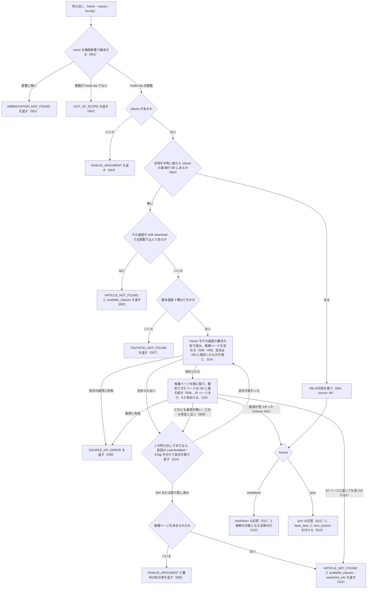

# 機能: nta_get_tsutatsu（基本通達の条項を 1 つ取得する）

- 機能 ID: NTA
- 版: current
- 承認日: 2026-09-22（初版。PR #49 のマージ）。差分 `20260924-tsutatsu-clause-forms` は 2026-09-24（PR #53 のマージ）。差分 `20260925-tsutatsu-live-toc` は 2026-09-25（PR #59）
- 起こした元: v0.20.2 の `src/tools/handlers.ts`（`getTsutatsu`）、`src/tools/definitions.ts`、`src/tools/handlers.test.ts`
- 関連する判断: houki-hub `docs/DECISIONS.md`（2026-09-21 の行）
- 取り込んだ差分: `specs/releases/v0.20.3/20260924-tsutatsu-clause-forms/`（入力の `clause`。2026-09-24 JST）
- 取り込んだ差分: `specs/releases/v0.21.0/20260925-tsutatsu-live-toc/`（005・006・008〜010 の置き換え、014・015 の追加、入力・できないこと・未決の置き換え。2026-09-26 JST）

この文書は「このツールは何をするか」を書きます。どう実装しているか（関数名・テーブル名）は書きません。

## アクター

- MCP クライアント（Claude などの LLM、または CLI から呼ぶ人）。`name` と `clause` を渡して、基本通達の条項 1 つの本文を受け取る

## 入力

| 引数 | 必須 | 内容 |
|---|---|---|
| `name` | 必須 | 通達名。略称（`消基通` / `所基通` / `法基通` / `相基通`）でも正式名（`消費税法基本通達` など）でもよい |
| `clause` | 実質必須（スキーマ上は任意） | 通達番号。形は通達ごとに違う（下の表）。全角の数字・ハイフンは半角に揃えてから読む（DB から返すときも、国税庁サイトから取るときも） |
| `format` | 任意 | `markdown`（既定）または `json` |

| 通達 | `clause` の形 | 例 |
|---|---|---|
| 消費税法基本通達 | 章-節-条 | `5-1-9` / `1-4-13の2` |
| 法人税基本通達 | 章-節-条（章・節に枝番号が付くことがある） | `1-1-1` / `1-3の2-1` |
| 所得税基本通達 | 条-項。複数の条に共通する通達は `条~条共-項` | `34-1` / `2-4の2` / `23~35共-6` |
| 相続税法基本通達 | 条-項。複数の条に共通する通達は `条・条共-項` | `3-1` / `1の3・1の4共-1` |

## 処理の流れ

呼び出しを受けてから応答を返すまでに、何をどの順で確かめるかを示します。図の中の番号は「できること」の仕様 ID の末尾 3 桁です。

## できること

### SPEC-NTA-GET-TSUTATSU-001 通達名を略称辞書で解決する

`name` を houki-abbreviations の辞書で正式名に解決する。略称でも正式名でも同じ通達に解決される。辞書に無い名前のときは、エラー `ABBREVIATION_NOT_FOUND` を返し、`next_actions` に `nta_search_tsutatsu` で探す案内を入れる。

### SPEC-NTA-GET-TSUTATSU-002 houki-nta の管轄でない名前は取りに行かない

辞書にはあるが管轄が houki-nta でない名前（例: `消法` は houki-egov の管轄）のときは、エラー `OUT_OF_SCOPE` を返す。`hint` に管轄先の MCP 名を書き、`next_actions` にその MCP への案内を入れる。

### SPEC-NTA-GET-TSUTATSU-003 clause が無ければ何も取りに行かない

`clause` が無いときは、エラー `INVALID_ARGUMENT` を返す。`hint` に `5-1-9` のような書き方の例を入れる。

### SPEC-NTA-GET-TSUTATSU-004 ローカル DB にある条項は DB から返す

その通達と条項がローカル DB にあるときは、国税庁サイトに取りに行かずに DB の内容を返す。応答の `source` は `db`、`fetchedAt` は DB に入れたときの日時のまま（呼び出した時刻にしない）。`clause` の全角ハイフン・全角数字は半角に揃えてから DB を引く。

### SPEC-NTA-GET-TSUTATSU-005 DB に通達はあるが条項が無いときは、bulk download 済みなら番号の候補を返す

その通達の条項が DB に無く、その通達を bulk download で全節取り込んである（章を絞った実行や、国税庁サイトから取った分の書き戻しではない）ときは、エラー `ARTICLE_NOT_FOUND` を返し、`available_clauses` にその通達の条項番号（最大 50 件）を入れる。この場合は国税庁サイトには取りに行かない。

bulk download 済みでない通達（書き戻した節しか無い通達を含む）は、DB に無い条項を国税庁サイトから取る経路（SPEC-NTA-GET-TSUTATSU-006）へ進む。

### SPEC-NTA-GET-TSUTATSU-006 DB に無い基本通達 4 種の条項は国税庁サイトから取る

条項が DB に無く、SPEC-NTA-GET-TSUTATSU-005 で止まらず、通達が次の 4 通達のどれかであれば、国税庁サイトから条項の載っているページを取得して返す。応答の `source` は `live`。

| 通達 | 取得するページの決め方 |
|---|---|
| 消費税法基本通達 | 番号の章・節から `{章}/{節}.htm` を組み立てる。そのページに条項が無ければ、目次から候補ページを選び直す |
| 法人税基本通達 | 目次から、番号の章・節（節の枝番号を含む）に当たる節のページを選ぶ。節が款に分かれていれば款のページを全部候補にする |
| 所得税基本通達 | 目次の項目の題（「法第N条…関係」「法第N条から第M条まで…共通関係」、見出しに属する「〔…〕」の項目）から、番号の条に当たるページを選ぶ |
| 相続税法基本通達 | 目次の項目の題（「第N条《…》関係」「…及び…共通関係」）から、番号の条に当たるページを全部候補にする |

候補ページが複数あるときは順に取得し、条項が見つかったところで止める。取得して解析できたページは、条項が見つかったかどうかにかかわらず DB に書き戻す。次からは SPEC-NTA-GET-TSUTATSU-004 で返る。

### SPEC-NTA-GET-TSUTATSU-007 DB に無く、ライブ取得にも対応していない通達は投入を案内する

通達が DB に無く、上の 4 通達でもないとき（例: `電帳法取通`）は、エラー `TSUTATSU_NOT_FOUND` を返す。`hint` に `--bulk-download` の実行を案内し、`supported_for_live` にライブ取得できる通達名の一覧、`next_actions` に bulk download の案内を入れる。

### SPEC-NTA-GET-TSUTATSU-008 国税庁サイトから取るときは、clause をその通達の番号の形で読む

国税庁サイトから取る経路に進んだとき、`clause` を入力の表にあるその通達の番号の形で読む。どの形にも当たらず候補ページを決められないときは、エラー `INVALID_ARGUMENT` を返す。`hint` にその通達の番号の形と例を書く。

### SPEC-NTA-GET-TSUTATSU-009 国税庁サイトから取れなかったときは再試行できるエラーにする

目次または候補ページの取得が通信の失敗やサイトのエラーで失敗したときは、エラー `SOURCE_API_ERROR` を返す。`retryable` は `true`、`detail.status` に HTTP ステータス（あれば）、`next_actions` に時間をおいて再試行する案内を入れる。

候補ページが存在しない（404、または国税庁サイトの 404 ページへの転送）ことは、再試行できるエラーにしない。目次を取り直しても候補ページがどれも存在しなければ、SPEC-NTA-GET-TSUTATSU-010 の `ARTICLE_NOT_FOUND` を返す。

### SPEC-NTA-GET-TSUTATSU-010 候補ページのどれにも条項が無いときは、見たページの番号と URL を返す

候補ページを取得したがどれにも条項が無いとき（SPEC-NTA-GET-TSUTATSU-014 の目次の取り直しの後も同じとき）は、エラー `ARTICLE_NOT_FOUND` を返す。`available_clauses` に取得したページにある条項番号を、`searched_urls` に取得したページの URL を入れる。`hint` に、番号の形の確認と `nta_search_tsutatsu` での検索、`--bulk-download` で全節を DB に入れる方法を書く。

### SPEC-NTA-GET-TSUTATSU-011 markdown（既定）の応答

`format` を省くか `markdown` にしたとき、応答は次を含む文字列である。

- 見出し `## <条項番号>（<表題>）`
- 本文（段落のインデントは引用記号 `>` の深さで表す）
- `出典: <国税庁ページの URL>` と `取得: <取得日時>`
- 解釈の対象になる法律の行（SPEC-NTA-GET-TSUTATSU-013）
- 通達の法的位置付けの注（通達は行政内部文書で納税者・裁判所に直接の拘束力がないこと）

### SPEC-NTA-GET-TSUTATSU-012 json の応答

`format` を `json` にしたとき、応答は次のフィールドを持つ。

| フィールド | 内容 |
|---|---|
| `tsutatsu` | 正式名 |
| `clause.clauseNumber` / `clause.title` / `clause.paragraphs` / `clause.fullText` | 条項番号・表題・段落・本文 |
| `sourceUrl` / `fetchedAt` | 出典 URL と取得日時 |
| `source` | `db` または `live` |
| `legal_status` | `binds_citizens: false` / `binds_courts: false` / `binds_tax_office: true` と注 |

### SPEC-NTA-GET-TSUTATSU-013 解釈の対象になる法律と、その本文を読む案内を付ける

基本通達 4 種の応答には `base_laws`（法律 → 施行令 → 施行規則の順の正式名）を付け、`next_actions` に houki-egov-mcp の `get_law` で先頭の法律を読む案内を 1 件入れる。markdown では「解釈の対象になる法律: …」の行で示す。対応表に無い通達では付けない。

### SPEC-NTA-GET-TSUTATSU-014 目次を DB に保存して使い回し、条項が見つからないときにだけ取り直す

候補ページを決めるために目次ページを取得したときは、その解析結果を DB に保存し、次の呼び出しでは国税庁サイトから取り直さずに使う。使い回す期間は設けない。保存した目次は目次ページの URL ごとに持つ。

次のどれかが起きたときは、1 回の呼び出しにつき 1 回だけ、前回の `Last-Modified` / `ETag` を付けて目次を取り直し、候補ページを作り直す。

- 候補ページを決められない
- 候補ページのどれにも条項が無い
- 候補ページがどれも存在しない

国税庁サイトが目次は変わっていない（304）と返したときは、取り直さずに SPEC-NTA-GET-TSUTATSU-010 または SPEC-NTA-GET-TSUTATSU-008 のエラーを返す。

### SPEC-NTA-GET-TSUTATSU-015 1 回の呼び出しで国税庁サイトから取るページは 10 まで

1 回の呼び出しで取得する候補ページは 10 までにする（目次ページは数えない）。ページとページのあいだは 0.3 秒あける。上限に達しても条項が見つからないときは、SPEC-NTA-GET-TSUTATSU-010 の `ARTICLE_NOT_FOUND` を返し、`hint` に上限に達したことを書く。

## できないこと

- 通達の条項と法律の条番号の対応を示すこと（`base_laws` は法令名まで。条は付けない）
- 条項本文の中の画像（算式の GIF）の内容を返すこと（alt テキストを `[画像: …]` として残す）
- 基本通達 4 種以外の通達（電帳法取通など）を国税庁サイトから取ること
- 1 回の呼び出しで 10 を超えるページを国税庁サイトから取ること（全節が要るときは `--bulk-download`）
- 通達が今も有効かどうかを判定すること（改正の追跡は `nta_search_kaisei_tsutatsu` / `nta_get_kaisei_tsutatsu`）

## 未決

初版起こしで見つけた、意図か不具合かを人が決める項目です。決まったら「できること」に ID を振るか、`specs/changes/` の差分にします。

1. **ライブ取得した節の条項を DB に書き戻す動き**（次回から SPEC-NTA-GET-TSUTATSU-004 で返る）は、このツールの応答として「2 回目は取りに行かない」ことのテストが無い。SPEC-NTA-GET-TSUTATSU-006 に書き戻しを書いたので、この差分の受入テストで確かめる。
2. **ページの解析に失敗したときの `INTERNAL_ERROR`**（国税庁ページの構造変更を疑う `hint` 付き）はテストが無い。ID を振るのは受入テストを書いてから。
3. **本文に画像があるときの `content_notes`**（json）と `> 注意:` の行（markdown）は、解析側のテストはあるがこのツールの応答としてのテストが無い。ID を振るのは受入テストを書いてから。
4. **`available_clauses` の件数**が DB 経路（SPEC-NTA-GET-TSUTATSU-005）は最大 50 件、国税庁サイトの経路（SPEC-NTA-GET-TSUTATSU-010）は取得したページ内の全件で違う。意図として認めるか、揃えるか。

（旧未決 1「ライブ取得経路では clause の全角を半角に揃えない」は、入力の表の変更で解消する。）
