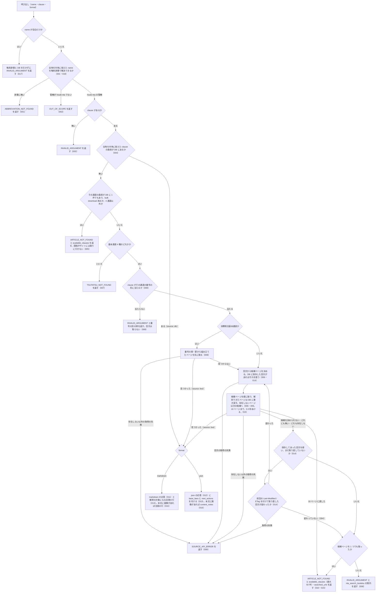

# 機能: nta_get_tsutatsu（基本通達の条項を 1 つ取得する）

- 版: current
- 起こした元: v0.20.2 の `src/tools/handlers.ts`（`getTsutatsu`）、`src/tools/definitions.ts`、`src/tools/handlers.test.ts`
- 関連する Issue: houki-nta-mcp #144（DB を開けないとき。0.26.0）、#155（ライブ取得に対応していない通達に、実行できない投入のコマンドを案内しない。0.27.0）
- 関連する判断: houki-hub `docs/DECISIONS.md`（2026-09-21 の行）
- 取り込んだ差分: `specs/releases/v0.20.3/20260924-tsutatsu-clause-forms/`（入力の `clause`。2026-09-24 JST）
- 取り込んだ差分: `specs/releases/v0.21.0/20260925-tsutatsu-live-toc/`（005・006・008〜010 の置き換え、014・015 の追加、入力・できないこと・未決の置き換え。2026-09-26 JST）

この文書は「このツールは何をするか」を書きます。どう実装しているか（関数名・テーブル名）は書きません。

## アクター

- MCP クライアント（Claude などの LLM、または CLI から呼ぶ人）。`name` と `clause` を渡して、基本通達の条項 1 つの本文を受け取る

## 入力

| 引数 | 必須 | 内容 |
|---|---|---|
| `name` | 必須 | 通達名。略称（`消基通` / `所基通` / `法基通` / `相基通`）でも正式名（`消費税法基本通達` など）でもよい。全角英数字・ダッシュ類・全角空白は半角に揃えてから辞書で引く（018） |
| `clause` | 実質必須（スキーマ上は任意） | 通達番号。形は通達ごとに違う（下の表）。全角の数字・ハイフンは半角に揃えてから読む（DB から返すときも、国税庁サイトから取るときも） |
| `format` | 任意 | `markdown`（既定）または `json` |

| 通達 | `clause` の形 | 例 |
|---|---|---|
| 消費税法基本通達 | 章-節-条 | `5-1-9` / `1-4-13の2` |
| 法人税基本通達 | 章-節-条（章・節に枝番号が付くことがある） | `1-1-1` / `1-3の2-1` |
| 所得税基本通達 | 条-項。複数の条に共通する通達は `条~条共-項` | `34-1` / `2-4の2` / `23~35共-6` |
| 相続税法基本通達 | 条-項。複数の条に共通する通達は `条・条共-項` | `3-1` / `1の3・1の4共-1` |

## 処理の流れ

呼び出しを受けてから応答を返すまでに、何をどの順で確かめるかを示します。図の中の番号は「できること」の仕様 ID の末尾 3 桁です。

```mermaid
flowchart TD
  A["呼び出し（name・clause・format）"] --> W{"name が空白だけか"}
  W -- はい --> E0["略称辞書と DB を引かずに INVALID_ARGUMENT を返す（017）"]
  W -- いいえ --> B{"全角を半角に揃えた name を略称辞書で解決できるか（001・018）"}
  B -- 辞書に無い --> E1["ABBREVIATION_NOT_FOUND を返す（001）"]
  B -- 管轄が houki-nta でない --> E2["OUT_OF_SCOPE を返す（002）"]
  B -- houki-nta の管轄 --> C{"clause があるか"}
  C -- 無い --> E3["INVALID_ARGUMENT を返す（003）"]
  C -- ある --> D{"全角を半角に揃えた clause の条項が DB にあるか（004）"}
  D -- "ある（source: db）" --> O{"format"}
  D -- 無い --> F{"その通達の条項が DB に 1 件でもあり、bulk download 済みか、4 通達以外か"}
  F -- はい --> E4["ARTICLE_NOT_FOUND と available_clauses を返す。国税庁サイトには取りに行かない（005）"]
  F -- いいえ --> H{"基本通達 4 種のどれかか"}
  H -- いいえ --> E5["TSUTATSU_NOT_FOUND を返す（007）"]
  H -- はい --> P{"clause がその通達の番号の形に当たるか（008）"}
  P -- 当たらない --> E6["INVALID_ARGUMENT と番号の形の例を返す。目次は取らない（008）"]
  P -- 当たる --> S{"消費税法基本通達か"}
  S -- はい --> S1["番号の章・節から組み立てたページを先に取る（006）"]
  S1 -- 見つからない --> T
  S -- いいえ --> T["目次から候補ページを決める。DB に保存した目次があればそれを使う（006・014）"]
  T --> K["候補ページを順に取り、解析できたページは DB に書き戻す。存在しないページは次の候補へ（006・009。10 ページまで、0.3 秒あける、015）"]
  S1 -- "見つかった（source: live）" --> O
  K -- "見つかった（source: live）" --> O
  S1 -- 存在しない以外の取得の失敗 --> E7["SOURCE_API_ERROR を返す（009）"]
  T -- 目次の取得の失敗 --> E7
  K -- 存在しない以外の取得の失敗 --> E7
  K -- 10 ページに達した --> E9["ARTICLE_NOT_FOUND と available_clauses（最大 50 件）・searched_urls を返す（010・015）"]
  K -- "候補を決められない・どれにも無い・どれも存在しない" --> R{"保存してあった目次を使い、まだ取り直していないか（014）"}
  R -- はい --> R1{"前回の Last-Modified / ETag を付けて取り直した目次が変わったか（014）"}
  R1 -- 変わった --> T
  R1 -- 取得の失敗 --> E7
  R1 -- 変わっていない（304） --> Z{"候補ページを 1 つでも取ったか"}
  R -- いいえ --> Z
  Z -- いいえ --> E8["INVALID_ARGUMENT と nta_search_tsutatsu の案内を返す（008）"]
  Z -- はい --> E9
  O -- markdown --> P1["markdown の応答（011）と解釈の対象になる法律の行（013）。本文に画像があれば注意の行（016）"]
  O -- json --> Q1["json の応答（012）に base_laws と next_actions を付ける（013）。本文に画像があれば content_notes（016）"]
```

## できること

### SPEC-NTA-GET-TSUTATSU-001 通達名を略称辞書で解決する

`name` を houki-abbreviations の辞書で正式名に解決する。略称でも正式名でも同じ通達に解決される。辞書に無い名前のときは、エラー `ABBREVIATION_NOT_FOUND` を返し、`next_actions` に `nta_search_tsutatsu` で探す案内を入れる。

### SPEC-NTA-GET-TSUTATSU-002 houki-nta の管轄でない名前は取りに行かない

辞書にはあるが管轄が houki-nta でない名前（例: `消法` は houki-egov の管轄）のときは、エラー `OUT_OF_SCOPE` を返す。`hint` に管轄先の MCP 名を書き、`next_actions` にその MCP への案内を入れる。

### SPEC-NTA-GET-TSUTATSU-003 clause が無ければ何も取りに行かない

`clause` が無いときは、エラー `INVALID_ARGUMENT` を返す。`hint` に `5-1-9` のような書き方の例を入れる。

### SPEC-NTA-GET-TSUTATSU-004 ローカル DB にある条項は DB から返す

その通達と条項がローカル DB にあるときは、国税庁サイトに取りに行かずに DB の内容を返す。応答の `source` は `db`、`fetchedAt` は DB に入れたときの日時のまま（呼び出した時刻にしない）。`clause` の全角ハイフン・全角数字は半角に揃えてから DB を引く。

### SPEC-NTA-GET-TSUTATSU-005 DB に通達はあるが条項が無いときは、国税庁サイトから取らない通達なら番号の候補を返す

求められた条項が DB に無く、その通達の条項が DB に 1 件でもあり、次のどちらかに当たるときは、エラー `ARTICLE_NOT_FOUND` を返し、`available_clauses` にその通達の条項番号（最大 50 件）を入れる。この場合は国税庁サイトには取りに行かない。

- その通達を bulk download で全節取り込んである（章を絞った実行や、国税庁サイトから取った分の書き戻しではない）
- 国税庁サイトから取れる通達（SPEC-NTA-GET-TSUTATSU-006 の 4 通達）ではない

4 通達のうち bulk download 済みでない通達（書き戻した節しか無い通達を含む）は、DB に無い条項を国税庁サイトから取る経路（SPEC-NTA-GET-TSUTATSU-006）へ進む。

### SPEC-NTA-GET-TSUTATSU-006 DB に無い基本通達 4 種の条項は国税庁サイトから取る

条項が DB に無く、SPEC-NTA-GET-TSUTATSU-005 で止まらず、通達が次の 4 通達のどれかであれば、国税庁サイトから条項の載っているページを取得して返す。応答の `source` は `live`。

| 通達 | 取得するページの決め方 |
|---|---|
| 消費税法基本通達 | 番号の章・節から `{章}/{節}.htm` を組み立てる。そのページに条項が無ければ、目次から候補ページを選び直す |
| 法人税基本通達 | 目次から、番号の章・節（節の枝番号を含む）に当たる節のページを選ぶ。節が款に分かれていれば款のページを全部候補にする |
| 所得税基本通達 | 目次の項目の題（「法第N条…関係」「法第N条から第M条まで…共通関係」、見出しに属する「〔…〕」の項目）から、番号の条に当たるページを選ぶ |
| 相続税法基本通達 | 目次の項目の題（「第N条《…》関係」「…及び…共通関係」）から、番号の条に当たるページを全部候補にする |

候補ページが複数あるときは順に取得し、条項が見つかったところで止める。取得して解析できたページは、条項が見つかったかどうかにかかわらず DB に書き戻す。次からは SPEC-NTA-GET-TSUTATSU-004 で返る。

### SPEC-NTA-GET-TSUTATSU-007 DB に無く、ライブ取得にも対応していない通達は、今は取り込めないことを返す

その通達の条項が DB に 1 件も無く、上の 4 通達でもないとき（例: `電帳法取通`）は、エラー `TSUTATSU_NOT_FOUND` を返す。

- `error` は今までどおり `"<正式名>" は DB にも未投入で、ライブ取得用 URL も未登録です`
- `hint` は `この通達（<正式名>）は、今は取り込めません。国税庁サイトから取れるのも、投入のフラグ（--bulk-download の --tsutatsu）で DB に入れられるのも、基本通達 4 種（消費税法基本通達・所得税基本通達・法人税基本通達・相続税法基本通達）だけです`。投入のコマンドを書かない（投入のフラグ `--tsutatsu` は基本通達 4 種の正式名しか受け付けず、ほかの値は SPEC-NTA-CLI-BULK-DOWNLOAD-011 のエラーで終了コード 2 になる）
- `next_actions` を付けない（v0.26.x の `cli_bulk_download` の 1 件を外すと、残りが無い）
- `supported_for_live` にライブ取得できる通達名の一覧、`resolved` に略称辞書で解決したエントリを入れる（今までどおり）
- ローカル DB の状態によらず同じ応答にする。DB を開けないとき（SPEC-NTA-DB-SCHEMA-021 の開けない行）も、SPEC-NTA-DB-SCHEMA-029 の開けないときの `hint`・`retryable`・`detail.cause` にしない。DB を開けないことは、SPEC-NTA-DB-SCHEMA-030 の `warn` の行で残る

基本通達 4 種で、候補ページに条項が無いときの `--bulk-download --tsutatsu="<正式名>"` の案内（SPEC-NTA-GET-TSUTATSU-010）は変えない。

例: `{ name: "電帳法取通", clause: "4-1" }` は `code: "TSUTATSU_NOT_FOUND"`、`hint` は `この通達（電子計算機を使用して作成する国税関係帳簿書類の保存方法等の特例に関する法律の取扱通達）は、今は取り込めません。…基本通達 4 種（消費税法基本通達・所得税基本通達・法人税基本通達・相続税法基本通達）だけです`、`next_actions` は無い（v0.26.x では、`hint` が ``先に `npx -y @shuji-bonji/houki-nta-mcp@latest --bulk-download --tsutatsu="電子計算機を使用して作成する国税関係帳簿書類の保存方法等の特例に関する法律の取扱通達"` を実行して DB に投入してください。``、`next_actions[0].action` が `cli_bulk_download` で、このコマンドを実行すると SPEC-NTA-CLI-BULK-DOWNLOAD-011 のエラーで終了コード 2 になった。#155）。`HOUKI_NTA_DB_PATH` で SQLite でない中身のファイルを指して起動したときも同じ応答で、`retryable` と `detail` は付かない（v0.26.x では、`hint` が ``ローカル DB（<パス>）を開けません。`` で始まり、`retryable: false`、`detail.cause` は `file is not a database`）。

### SPEC-NTA-GET-TSUTATSU-008 国税庁サイトから取るときは、clause をその通達の番号の形で読む

国税庁サイトから取る経路に進んだとき、`clause` を入力の表にあるその通達の番号の形で読む。次の 2 つのときは、エラー `INVALID_ARGUMENT` を返す。

- 番号の形のどれにも当たらない。このときは目次も候補ページも取らない。`hint` にその通達の番号の形と例を書く
- 番号の形には当たるが、目次から候補ページを 1 つも決められず（SPEC-NTA-GET-TSUTATSU-014 の取り直しの後も同じ）、候補ページを 1 つも取らなかった。`hint` にその通達の番号の形と `nta_search_tsutatsu` での検索を書き、`next_actions` に `nta_search_tsutatsu` を入れる

消費税法基本通達で番号から組み立てたページ（SPEC-NTA-GET-TSUTATSU-006）を取ったあとに目次から候補ページを決められないときは、候補ページを取っているので SPEC-NTA-GET-TSUTATSU-010 の `ARTICLE_NOT_FOUND` を返す。

### SPEC-NTA-GET-TSUTATSU-009 国税庁サイトから取れなかったときは、失敗の種類ごとの `SOURCE_*` を返す

目次または候補ページの取得が、ページが無い（404・410、国税庁サイトの 404 ページへの転送）以外の形で失敗したときは、SPEC-NTA-COMMON-ERRORS-018 の表の code・`retryable`・`next_actions`・`detail` のエラーを返す（`SOURCE_RATE_LIMITED`・`SOURCE_TIMEOUT`・`SOURCE_UNAVAILABLE`・`SOURCE_API_ERROR`）。`url` と `detail.url` に、取れなかった目次か候補ページの URL を入れ、`tool` に `nta_get_tsutatsu` を入れる（v0.23.0 では `tool` が無かった）。

候補ページが存在しない（404・410、または国税庁サイトの 404 ページへの転送）ことは、エラーにせず次の候補ページへ進む。目次を取り直しても候補ページがどれも存在しなければ、SPEC-NTA-GET-TSUTATSU-010 の `ARTICLE_NOT_FOUND` を返す。目次のページそのものが 404・410・転送で終わったときは、目次の URL はこのサーバーが決めた値なので番号の誤りではなく、`SOURCE_API_ERROR`（`retryable: false`、`detail.status`）にする。

例: 国税庁サイトが候補ページに 503 を返し続けると `code: "SOURCE_API_ERROR"`、`retryable: true`、`detail.status: 503`、`tool: "nta_get_tsutatsu"`。403 なら `SOURCE_API_ERROR`・`retryable: false`・`next_actions` 無し（v0.23.0 では `retryable: true`・`retry_later`）。接続できない（`cause.code: "ENOTFOUND"`）なら `SOURCE_UNAVAILABLE`。

### SPEC-NTA-GET-TSUTATSU-010 候補ページのどれにも条項が無いときは、見たページの番号（最大 50 件）と URL を返す

候補ページを取得したがどれにも条項が無いとき（SPEC-NTA-GET-TSUTATSU-014 の目次の取り直しの後も同じとき）は、エラー `ARTICLE_NOT_FOUND` を返す。`available_clauses` に取得したページにある条項番号を、取得したページの順・ページの中の順に最大 50 件入れ、`searched_urls` に取得したページの URL を入れる。件数の上限は、DB の経路（SPEC-NTA-GET-TSUTATSU-005）の 50 件と同じにする。`hint` に、番号の形の確認と `nta_search_tsutatsu` での検索、`--bulk-download` で全節を DB に入れる方法を書く。`next_actions` は `nta_search_tsutatsu` と bulk download の案内（`cli_bulk_download`）の 2 件。

ローカル DB を開けないとき（SPEC-NTA-DB-SCHEMA-030）は、`hint` の `--bulk-download` で全節を DB に入れる方法の文を書かず、`next_actions` に `cli_bulk_download` を入れない（`nta_search_tsutatsu` の 1 件）。`code`・`available_clauses`・`searched_urls` は同じ。

例: 取得した 3 ページに条項が合わせて 80 件あり、どれも求めた条項でないとき、`available_clauses` は 1 ページ目の先頭から数えて 50 件（v0.22.0 では 80 件すべて）、`searched_urls` は 3 件。同じ場面で DB を開けないときは、`hint` に `--bulk-download` を含まず、`next_actions` は `nta_search_tsutatsu` の 1 件（v0.25.x では DB を開くところで `INTERNAL_ERROR` になり、国税庁サイトには取りに行かなかった）。

### SPEC-NTA-GET-TSUTATSU-011 markdown（既定）の応答

`format` を省くか `markdown` にしたとき、応答は次を含む文字列である。

- 見出し `## <条項番号>（<表題>）`
- 本文（段落のインデントは引用記号 `>` の深さで表す）
- `出典: <国税庁ページの URL>` と `取得: <取得日時>`
- 解釈の対象になる法律の行（SPEC-NTA-GET-TSUTATSU-013）
- 通達の法的位置付けの注（通達は行政内部文書で納税者・裁判所に直接の拘束力がないこと）

### SPEC-NTA-GET-TSUTATSU-012 json の応答

`format` を `json` にしたとき、応答は次のフィールドを持つ。

| フィールド | 内容 |
|---|---|
| `tsutatsu` | 正式名 |
| `clause.clauseNumber` / `clause.title` / `clause.paragraphs` / `clause.fullText` | 条項番号・表題・段落・本文 |
| `sourceUrl` / `fetchedAt` | 出典 URL と取得日時 |
| `source` | `db` または `live` |
| `legal_status` | `binds_citizens: false` / `binds_courts: false` / `binds_tax_office: true` と注 |

### SPEC-NTA-GET-TSUTATSU-013 解釈の対象になる法律と、その本文を読む案内を付ける

基本通達 4 種の応答には `base_laws`（法律 → 施行令 → 施行規則の順の正式名）を付け、`next_actions` に houki-egov-mcp の `get_law` で先頭の法律を読む案内を 1 件入れる。markdown では「解釈の対象になる法律: …」の行で示す。対応表に無い通達では付けない。

### SPEC-NTA-GET-TSUTATSU-014 目次を DB に保存して使い回し、条項が見つからないときにだけ取り直す

候補ページを決めるために目次ページを取得したときは、その解析結果を DB に保存し、次の呼び出しでは国税庁サイトから取り直さずに使う。使い回す期間は設けない。保存した目次は目次ページの URL ごとに持つ。

DB に保存してあった目次を使った呼び出しで次のどれかが起きたときは、1 回の呼び出しにつき 1 回だけ、前回の `Last-Modified` / `ETag` を付けて目次を取り直し、候補ページを作り直す。その呼び出しで目次を取得した（保存が無かった）ときと、SPEC-NTA-GET-TSUTATSU-015 の上限に達したときは取り直さない。

- 候補ページを決められない
- 候補ページのどれにも条項が無い
- 候補ページがどれも存在しない

国税庁サイトが目次は変わっていない（304）と返したときは、取り直さずに SPEC-NTA-GET-TSUTATSU-010 または SPEC-NTA-GET-TSUTATSU-008 のエラーを返す。

### SPEC-NTA-GET-TSUTATSU-015 1 回の呼び出しで国税庁サイトから取るページは 10 まで

1 回の呼び出しで取得する候補ページは 10 までにする（目次ページは数えない）。ページとページのあいだは 0.3 秒あける。上限に達しても条項が見つからないときは、SPEC-NTA-GET-TSUTATSU-010 の `ARTICLE_NOT_FOUND` を返し、`hint` に上限に達したことを書く。

### SPEC-NTA-GET-TSUTATSU-016 本文に画像がある条項には、画像を読めない旨の注記を付ける

条項の本文に画像（算式などを GIF で載せた箇所）があるときは、DB から返したとき（SPEC-NTA-GET-TSUTATSU-004）も国税庁サイトから取ったとき（SPEC-NTA-GET-TSUTATSU-006）も、次の注記を付ける。画像が無い条項には付けない。

- 注記の文: `本文に画像が <箇所数> 箇所含まれています（算式などが GIF 画像で掲載されている箇所）。画像の内容は取得できないため、本文には alt テキストを [画像: …] として同じ位置に残しています（"<alt1>" / "<alt2>"）。算式の正確な内容は出典 URL の原ページで確認してください`。alt テキストが 1 つも無いときは `（"…"）` の部分を書かない
- `format` が `json` のとき: `content_notes` に、この注記 1 件の配列を入れる
- `format` を省くか `markdown` のとき: 本文の後、`出典:` の行の前に `> 注意: <注記>` の行を入れる

### SPEC-NTA-GET-TSUTATSU-017 name が空文字・空白だけのときは略称辞書と DBを引かずに `INVALID_ARGUMENT` を返す

空文字は inputSchema の `minLength: 1` の検査（SPEC-NTA-COMMON-ERRORS-013）で止まり、`INVALID_ARGUMENT`（`tool: "nta_get_tsutatsu"`、`detail.issues: [{ path: "name", message: "空文字は指定できません" }]`）を返す。空白（半角スペース・全角スペース・タブ・改行）だけのときは、ツールの処理が略称辞書と DBを引く前に、SPEC-NTA-COMMON-ERRORS-014 の形の `INVALID_ARGUMENT`（`tool: "nta_get_tsutatsu"`、`error: "name が空です"`、`detail.issues: [{ path: "name", message: "空白だけは指定できません" }]`、`hint` に通達名（略称か正式名）を渡すよう書く）を返す。

例: `name: ""` は `code: "INVALID_ARGUMENT"`・`detail.issues[0].message: "空文字は指定できません"`。`name: "　"`（全角スペース）と `name: " \n"` は `code: "INVALID_ARGUMENT"`・`error: "name が空です"`。どれも略称辞書と DBは引かない。

`clause` は任意なので、空文字・空白だけの `clause` は今までどおり SPEC-NTA-GET-TSUTATSU-003（無いときと同じ）に従う。

### SPEC-NTA-GET-TSUTATSU-018 `name` の全角英数字・ダッシュ類・全角空白は半角に揃えてから略称辞書で引く

`name` を略称辞書で解決するとき（SPEC-NTA-GET-TSUTATSU-001）は、houki-abbreviations の `resolveAbbreviation(name, { normalize: true })` の規則（全角英数字を半角に、ダッシュ類 `－` `‐` `‑` `–` `—` `―` `−` を `-` に、全角チルダ `～` `〜` を `~` に、全角空白を半角空白にし、前後の空白を除く。罫線 `─` と長音 `ー` は変えない。大文字と小文字は区別する）で揃えてから引く（SPEC-NTA-SEARCH-RULES-019）。管轄の判定（002）も同じ規則で引く。`clause` は今までどおり SPEC-NTA-GET-TSUTATSU-004・008 の規則で揃える。

例: `{ name: "消基通　", clause: "５－１－９" }` は `{ name: "消基通", clause: "5-1-9" }` と同じ応答（v0.21.3 では `name` が辞書に無い扱いで `ABBREVIATION_NOT_FOUND` だった）。

## できないこと

- 通達の条項と法律の条番号の対応を示すこと（`base_laws` は法令名まで。条は付けない）
- 条項本文の中の画像（算式の GIF）の内容を返すこと（alt テキストを `[画像: …]` として残す）
- 基本通達 4 種以外の通達（電帳法取通など）を国税庁サイトから取ること・ローカル DB に投入すること（投入のフラグ `--tsutatsu` は基本通達 4 種の正式名しか受け付けない。SPEC-NTA-CLI-BULK-DOWNLOAD-011）
- 1 回の呼び出しで 10 を超えるページを国税庁サイトから取ること（全節が要るときは `--bulk-download`）
- 通達が今も有効かどうかを判定すること（改正の追跡は `nta_search_kaisei_tsutatsu` / `nta_get_kaisei_tsutatsu`）

## 未決

初版起こしで見つけた、意図か不具合かを人が決める項目です。決まったら「できること」に ID を振るか、`specs/changes/` の差分にします。

意図か不具合かの判断が要る項目は houki-nta-mcp の Issue に移し、ここには題と Issue の番号だけを残します。今の振る舞いのままでよくテストが無いだけの項目は、受入テストを書いてから「できること」に ID を振ります。

（旧未決 1「ライブ取得経路では clause の全角を半角に揃えない」は、入力の表の変更で解消する。）
