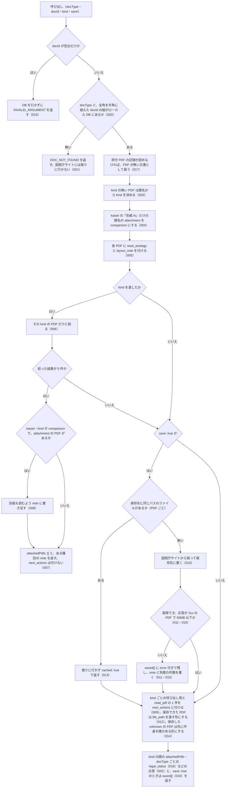

# 機能: nta_inspect_pdf_meta（文書の添付 PDF の一覧と読み方を返す）

- 機能 ID: NTA
- 版: current
- 承認日: 2026-09-26（初版と差分 `20260926-processing-flow`。PR #63）。差分 `20260926-undecided-to-issues` は 2026-09-26（PR #74）。差分 `20260927-argument-and-parse-errors` は 2026-09-27（PR #84）。差分 `20260927-get-responses` は 2026-09-27（PR #89）。差分 `20260930-nta-73-db-values` は 2026-09-30（PR #104）。差分 `20261001-t1-argument-guards` は 2026-10-01（PR #117）。差分 `20261001-t3-normalize` は 2026-10-01（PR #119）。差分 `20261003-t4-response-shape` は 2026-10-03（PR #125）
- 起こした元: v0.21.0 の `src/tools/handlers.ts`（`handleNtaInspectPdfMeta`）、`src/tools/definitions.ts`、`src/tools/tool-args.ts`、`src/services/pdf-meta.ts`、`src/services/pdf-files.ts`、`src/constants.ts`、`src/tools/handlers.test.ts`
- 関連する Issue: houki-nta-mcp #36（読み方の事実と `save: true`）、#44（改正通達の「別紙 N」を新旧対照表として扱う）、#1（docType 別の `legal_status`）

この文書は「このツールは何をするか」を書きます。どう実装しているか（関数名・テーブル名）は書きません。

## アクター

- MCP クライアント（Claude などの LLM、または CLI から呼ぶ人）。`docType` と `docId` を渡して、ローカル DB にあるその文書の添付 PDF の一覧（種別・読み方・URL）を受け取る。PDF の本文は受け取らない。`save: true` にすると PDF をサーバー側に保存した絶対パスも受け取り、pdf-reader-mcp などの PDF 読み取りツールにそのパスを渡す

## 入力

| 引数      | 必須 | 内容                                                                                                                                                                                                |
| --------- | ---- | --------------------------------------------------------------------------------------------------------------------------------------------------------------------------------------------------- |
| `docType` | 必須 | 文書種別。`kaisei`（改正通達）/ `jimu-unei`（事務運営指針）/ `bunshokaitou`（文書回答事例）/ `tax-answer`（タックスアンサー）のどれか。質疑応答事例（qa-jirei）は PDF を持たないので選べない        |
| `docId`   | 必須 | 文書 ID。`nta_search_*` の結果や `nta_get_*` の応答から得る。全角の数字・ダッシュ類は半角に揃えてから読む（020） |
| `kind`    | 任意 | 返す PDF の種別を 1 つに絞る。`comparison`（新旧対照表）/ `attachment`（別紙・別表）/ `qa-pdf`（Q&A）/ `related`（参考資料）/ `notice`（通知・連絡）/ `unknown`（判定できなかったもの）。省くと全件 |
| `save`    | 任意 | `true` のとき、返す PDF をサーバー側の保存先に取得し、`saved[]` に絶対パスを返す。既定は `false`                                                                                                    |

保存先は、環境変数 `HOUKI_NTA_FILES_DIR` があればその下、無ければ `XDG_CACHE_HOME`（無ければ `~/.cache`）の下の `houki-nta-mcp/files/`。その中に `<docType>/<docId>/<ファイル名>` の形で置く。ファイル名は URL の最後のパス要素で、同じ文書の中で重なるときは前のパス要素を付けて区別する（SPEC-NTA-INSPECT-PDF-META-010・018）。

## 処理の流れ

呼び出しを受けてから応答を返すまでに、何をどの順で確かめるかを示します。図の中の番号は「できること」の仕様 ID の末尾 3 桁です。

```mermaid
flowchart TD
  A["呼び出し（docType・docId・kind・save）"] --> W{"docId が空白だけか"}
  W -- はい --> E0["DB を引かずに INVALID_ARGUMENT を返す（019）"]
  W -- いいえ --> B{"docType と、全角を半角に揃えた docId の組がローカル DB にあるか（020）"}
  B -- 無い --> E1["DOC_NOT_FOUND を返す。国税庁サイトには取りに行かない（001）"]
  B -- ある --> B2["添付 PDF の記録が読めなければ、PDF が無い文書として扱う（017）"]
  B2 --> C["kind の無い PDF は題名から kind を決める（003）"]
  C --> D["kaisei の「別紙 N」だけの題名の attachment を comparison にする（004）"]
  D --> F["各 PDF に read_strategy と layout_note を付ける（005）"]
  F --> G{"kind を渡したか"}
  G -- はい --> H["その kind の PDF だけに絞る（006）"]
  H --> I{"絞った結果が 0 件か"}
  I -- はい --> K{"kaisei・kind が comparison で、attachment の PDF があるか"}
  K -- はい --> L["別紙も読むよう note に書き足す（008）"]
  K -- いいえ --> J["attachedPdfs: [] と、ある種別の note を返す。next_actions は付けない（007）"]
  L --> J
  I -- いいえ --> M{"save: true か"}
  G -- いいえ --> M
  M -- はい --> N{"保存先に同じパスのファイルがあるか（PDF ごと）"}
  N -- ある --> O["取りに行かず cached: true で返す（013）"]
  N -- 無い --> P["国税庁サイトから取って保存先に置く（010）"]
  P --> Q{"取得でき、応答が 2xx の PDF で 50MB 以下か（011・015）"}
  Q -- いいえ --> R["saved[] に error 付きで残し、note に失敗の件数を書く（011・015）"]
  Q -- はい --> T
  O --> T
  R --> T
  M -- いいえ --> T["kind ごとの呼び出し例と read_pdf の 1 件を next_actions に付ける（009）。保存できた PDF は file_path を渡す形にする（012）。保存した unknown の PDF は先に中身を確かめる形にする（014）"]
  T --> U["kind の順の attachedPdfs・docType ごとの legal_status（016）などの応答（002）と、save: true のときは saved[]（010）を返す"]
```

## できること

### SPEC-NTA-INSPECT-PDF-META-001 ローカル DB に無い文書は取りに行かない

`docType` と `docId` の組がローカル DB に無いときは、エラー `DOC_NOT_FOUND` を返す。`error` に「DB に未登録」である旨、`hint` に `--bulk-download-<docType>`（例: `--bulk-download-kaisei`）で投入済みかを確かめることと、`docId` が正しいかを `nta_search_*` で確かめられることを書く。国税庁サイトには取りに行かない。

### SPEC-NTA-INSPECT-PDF-META-002 文書の添付 PDF の一覧を種別の順に返し、索引から消えた文書には印を付ける

文書がローカル DB にあるとき、応答は次のフィールドを持つ。

| フィールド            | 内容                                                                                                       |
| --------------------- | ---------------------------------------------------------------------------------------------------------- |
| `docType` / `docId`   | 引数のとおり                                                                                               |
| `title` / `sourceUrl` | 文書の題名と、文書ページの URL                                                                             |
| `attachedPdfs`        | 添付 PDF の配列。要素は `title`・`url`・`sizeKb`（分かるときだけ）・`kind`・`read_strategy`・`layout_note` |
| `index_status` / `orphaned_at` / `notice` | 国税庁の索引から外れた文書（bulk download で外れたことを確認した日時が付いている文書）では、`index_status: "removed_from_index"`、`orphaned_at`（確認した日時）、`notice`（`nta_get_jimu_unei` の SPEC-NTA-GET-JIMU-UNEI-004 と同じ注記の文）。索引にある文書では、3 つとも `null` |
| `legal_status`        | 文書種別に応じた法的位置付け（`binds_citizens` / `binds_courts` / `binds_tax_office` と注）                |

`attachedPdfs` は `kind` の順に並べる。順は `comparison` → `attachment` → `qa-pdf` → `related` → `notice` → `unknown`。同じ `kind` の中では DB に入っている順のまま。

索引の印の形は、取得ツール（`nta_get_*` の json。SPEC-NTA-GET-JIMU-UNEI-004 など）と同じにする。PDF の URL は文書ページから外れていても残っていることがあるので、PDF を読む前に、文書そのものが索引から外れていることを知らせるためである。

例: 「別紙1 計算明細書」（`attachment`）と「新旧対照表」（`comparison`）がこの順で入っている改正通達では、応答の `attachedPdfs` は `comparison` の「新旧対照表」が先、`attachment` の「別紙1 計算明細書」が後になる。この改正通達が索引にあれば `index_status: null`・`orphaned_at: null`・`notice: null`、`2026-10-01T00:30:00Z` に索引から外れたことを確認していれば `index_status: "removed_from_index"`・`orphaned_at: "2026-10-01T00:30:00Z"` と注記の `notice`（v0.22.0 ではどちらの場合もこの 3 つのキーが無かった）。

### SPEC-NTA-INSPECT-PDF-META-003 種別の無い PDF は題名から種別を決める

DB に入っている PDF に `kind` が無い（v0.6.0 期に投入した文書）ときは、題名から `kind` を決めて応答に入れる。題名の語で決める。「新旧対照表」「新旧対応表」「対比表」は `comparison`、「Q&A」「質疑応答」「FAQ」は `qa-pdf`、「別紙」「別表」「様式」「付録」「添付資料」は `attachment`、「通知」「お知らせ」「連絡」は `notice`、「参考」「参考資料」「関連資料」は `related`。どれにも当たらなければ `unknown`。全角の英字・`＆`・空白の違いは吸収する。DB の内容は書き換えない。

例: `kind` の無い「新旧対応表」は `comparison` として返る。

### SPEC-NTA-INSPECT-PDF-META-004 改正通達の「別紙 N」だけの題名は comparison として返す

`docType` が `kaisei` で、題名が「別紙」と番号だけ（「別紙1」「別紙２」「別紙1（PDF/221KB）」「（別紙2）」「別紙1-2」）の `attachment` は、応答では `kind` を `comparison` にして返す。改正通達の本文が「別紙のとおり改める」と書く別紙は新旧対照表本体のことが多いためである。「別紙1 計算明細書」「別紙3 様式」のように別の語を含む題名は `attachment` のまま。`kaisei` 以外の `docType` では変えない。DB の `kind` は書き換えない。

例: 改正通達 0025004-026 の「【参考】…新旧対応表」「別紙1（PDF/221KB）」「別紙2（PDF/449KB）」「別紙3 様式」に `kind: "comparison"` で絞ると、前の 3 件が `comparison` として返り、「別紙3 様式」は `attachment` のまま返らない。

### SPEC-NTA-INSPECT-PDF-META-005 各 PDF に読み方（read_strategy と layout_note）を付ける

`attachedPdfs` の各要素に、`kind` に応じた `read_strategy` と `layout_note` を付ける。どちらも PDF 読み取りツールの名前を含まない。

| `kind`       | `read_strategy` | `layout_note` の要点                                                                                                                                                                                                                                  |
| ------------ | --------------- | ----------------------------------------------------------------------------------------------------------------------------------------------------------------------------------------------------------------------------------------------------- |
| `comparison` | `tables`        | 改正後と改正前を左右 2 列に並べた表。左が改正後・右が改正前のことが多いが見出し行で確かめる。「（同左）」「（省略）」「（新設）」「（削除）」と「【新設】」「【削除】」「【一部改正】」の 2 通りの印がある。表として取れないなら左右 2 列に分けて読む |
| `attachment` | `tables`        | 別紙・別表・様式。表として取れるなら表で、取れなければ本文として読む。改正通達（kaisei）の別紙は新旧対照表本体のことが多い                                                                                                                            |
| `qa-pdf`     | `text`          | 問と答が交互に並ぶ散文。本文として通して読む                                                                                                                                                                                                          |
| `related`    | `text`          | 参考資料。本文として読む                                                                                                                                                                                                                              |
| `notice`     | `text`          | 通知・連絡。本文として読む。調査の結論には通常含めない                                                                                                                                                                                                |
| `unknown`    | `sample`        | 先頭ページを読んで中身を確かめてから決める                                                                                                                                                                                                            |

### SPEC-NTA-INSPECT-PDF-META-006 kind で絞る

`kind` を渡したときは、その `kind` の PDF だけを `attachedPdfs` に入れる。SPEC-NTA-INSPECT-PDF-META-003 と 004 で決めた後の `kind` で絞る。`next_actions` と `saved[]` も絞った後の PDF だけを対象にする。

例: 「新旧対照表」と「別紙1 計算明細書」のある改正通達に `kind: "comparison"` を渡すと、`attachedPdfs` は「新旧対照表」の 1 件、`next_actions` は `pdf-reader-mcp:read_url` と `read_pdf` の 2 件になる。

### SPEC-NTA-INSPECT-PDF-META-007 絞った結果が 0 件のときは空の一覧と、ある種別の注記を返す

`kind` で絞って該当が無いときは、エラーにせず `attachedPdfs` を空の配列で返す。`next_actions` は付けない。`note` に `kind="<kind>" の PDF はありません。この文書にある種別: <この文書の PDF の kind の一覧>` と書く（種別は SPEC-NTA-INSPECT-PDF-META-002 の順、`, ` 区切り）。

例: `comparison` と `attachment` のある文書に `kind: "qa-pdf"` を渡すと、`note` は `kind="qa-pdf" の PDF はありません。この文書にある種別: comparison, attachment` になる。

### SPEC-NTA-INSPECT-PDF-META-008 改正通達で comparison が無く attachment があるときは別紙を読むよう注記する

`docType` が `kaisei`、`kind` が `comparison` で該当が 0 件、かつその文書に `attachment` の PDF があるときは、SPEC-NTA-INSPECT-PDF-META-007 の `note` に続けて `改正通達（kaisei）の別紙は新旧対照表本体のことが多いので、kind="attachment" の別紙も読んでください` と書く。

### SPEC-NTA-INSPECT-PDF-META-009 next_actions に kind ごとの呼び出し例と汎用の 1 件を付ける

`attachedPdfs` が 1 件以上あるとき、`next_actions` を付ける。内容は次のとおり。

- 応答に含まれる `kind` ごとに 1 件（同じ `kind` の中では先頭の PDF を使う）。順は SPEC-NTA-INSPECT-PDF-META-002 の `kind` の順
- 最後に汎用の 1 件。`action` は `read_pdf`。`example` は先頭の PDF の `url`（保存済みならそれに `path` を加える）。pdf-reader-mcp が無い環境で、使っている PDF 読み取りツールに渡すためのもの
- `example` は引数だけを持つ（`mcp` / `tool` は入れない）

保存していない PDF（`save` を渡さないか、保存に失敗した）の 1 件は、`action` が `pdf-reader-mcp:read_url` で、`example` は次のとおり。

| `read_strategy`          | `example`                   |
| ------------------------ | --------------------------- |
| `tables`（`comparison`） | `{ url, split_columns: 2 }` |
| `tables`（`attachment`） | `{ url }`                   |
| `text`                   | `{ url }`                   |
| `sample`                 | `{ url, pages: "1" }`       |

例: 「新旧対照表」と「別紙1 計算明細書」のある改正通達を `save` 無しで呼ぶと、`next_actions` の `action` は `pdf-reader-mcp:read_url`・`pdf-reader-mcp:read_url`・`read_pdf` の 3 件で、`example` は順に `{ url: "…/a.pdf", split_columns: 2 }`・`{ url: "…/b.pdf" }`・`{ url: "…/a.pdf" }` になる。

### SPEC-NTA-INSPECT-PDF-META-010 save: true で PDF を保存し、saved[] に絶対パスを返す。保存する PDF が 0 件でも `saved: []` を返す

`save: true` のとき、`attachedPdfs` に入る各 PDF を国税庁サイトから取得して保存先に置き、`saved[]` を返す。`saved[]` の要素は `attachedPdfs` と同じ順で、`url`（`attachedPdfs[].url` と同じ値）・`path`（保存したファイルの絶対パス）・`bytes`（ファイルの大きさ）・`cached`（今回取得しなかったとき `true`）を持つ。保存先のパスは `<保存先>/<docType>/<docId>/<ファイル名>`。ファイル名は、その文書の添付 PDF の中で URL の最後のパス要素が他と重ならなければ最後のパス要素（拡張子が無ければ `.pdf` を付ける）、重なるときは SPEC-NTA-INSPECT-PDF-META-018 のとおり前のパス要素を付けたもの。

`save: true` で `attachedPdfs` が空のとき（文書に PDF が無い、`kind` で絞った結果が 0 件。SPEC-NTA-INSPECT-PDF-META-007）は、`saved: []` を返す。`save` を渡さないときは `saved` を付けない（保存を求めていない応答に保存の結果の欄を置かないため。proposal.md の「人が判断すること」を参照）。

例: `docType: "kaisei"`、`docId: "sample-003"`、URL が `https://…/a.pdf` の PDF は `<保存先>/kaisei/sample-003/a.pdf` に置かれ、`saved[]` に `{ url: "https://…/a.pdf", path: "<そのパス>", bytes: <大きさ>, cached: false }` が入る。`comparison` だけの文書に `{ kind: "qa-pdf", save: true }` を渡すと `attachedPdfs: []`・`saved: []`（v0.22.0 では `saved` のキーが無かった）。

### SPEC-NTA-INSPECT-PDF-META-011 保存に失敗した PDF は saved[] に error 付きで残す

取得の応答が 2xx でない PDF は、`saved[]` から落とさず `path: null`・`bytes: null`・`cached: false`・`error`（例: `HTTP 404`）で残す。他の PDF の保存は続ける。1 件でも失敗があれば `note` に `<件数> 件の PDF を保存できませんでした（saved[].error を参照）。その PDF は URL のまま読んでください` と書く。失敗した PDF の `next_actions` は保存していないときと同じ（`pdf-reader-mcp:read_url`）になる。

### SPEC-NTA-INSPECT-PDF-META-012 保存した PDF の next_actions は file_path を渡す形にする

保存に成功した PDF の `next_actions` の 1 件は、`example` に `url` の代わりに `{ file_path: <saved[].path> }` を持つ。`action` は `read_strategy` が `tables` なら `pdf-reader-mcp:extract_tables`、`text` なら `pdf-reader-mcp:read_text`。汎用の `read_pdf` の `example` は `{ url, path }` になる。

例: `comparison`・`related`・`unknown`（取得に失敗）の 3 件を `save: true` で呼ぶと、`next_actions` の `action` は `pdf-reader-mcp:extract_tables`・`pdf-reader-mcp:read_text`・`pdf-reader-mcp:read_url`・`read_pdf` の 4 件になる。

### SPEC-NTA-INSPECT-PDF-META-013 保存済みの PDF は取りに行かない

同じ保存先のパスに既にファイルがあるときは、国税庁サイトに取りに行かず、そのファイルの `path` と `bytes` を `cached: true` で返す。

例: 同じ文書を `save: true` で 2 回呼ぶと、2 回目の `saved[]` は `cached: true` になり、取得の回数は増えない。

### SPEC-NTA-INSPECT-PDF-META-014 保存した `unknown` の PDF の next_actions は、先に中身を確かめる形にする

保存に成功した PDF のうち `read_strategy` が `sample`（`kind` が `unknown`）のものは、`next_actions` の 1 件の `action` を `pdf-reader-mcp:summarize` にし、`example` を `{ file_path: <saved[].path> }` にする。SPEC-NTA-INSPECT-PDF-META-012 の `tables` / `text` と並ぶ 3 つ目の場合である。

### SPEC-NTA-INSPECT-PDF-META-015 取得の応答が PDF でない、大きすぎる、取得できないときも saved[] に error 付きで残す

SPEC-NTA-INSPECT-PDF-META-011 の HTTP の失敗のほかに、次の場合も PDF を保存せず、`saved[]` に `path: null`・`bytes: null`・`cached: false`・`error` で残す。`note` の件数（011）にも数える。

| 場合 | `error` |
|---|---|
| 応答の `Content-Type` が `application/pdf` でなく、本文の先頭も `%PDF-` でない | `PDF ではありません（Content-Type: <値>）`。`Content-Type` が無ければ `不明` |
| 本文が 50MB（52,428,800 バイト）を超える | `<バイト数> バイトあり、上限 52428800 バイトを超えています` |
| 30 秒で応答が終わらない、またはネットワークの例外 | 例外の文 |

`Content-Type` が `application/pdf` でなくても、本文の先頭が `%PDF-` なら保存する。

例: `Content-Type: text/html` の応答は `error: "PDF ではありません（Content-Type: text/html）"`、`Content-Type: application/octet-stream` で本文が `%PDF-1.4` で始まる応答は保存される。

### SPEC-NTA-INSPECT-PDF-META-016 legal_status は docType ごとの資料の位置付けを返す

応答の `legal_status` は `docType` で決まる。

| `docType` | `binds_citizens` | `binds_courts` | `binds_tax_office` | `note` の要点 |
|---|---|---|---|---|
| `kaisei` / `jimu-unei` | `false` | `false` | `true` | 通達は行政内部文書で納税者・裁判所を直接は拘束しないが、税務署員は職務として守る（最高裁 昭和43.12.24） |
| `bunshokaitou` | `false` | `false` | `false` | 個別事案への回答で一般的な法的拘束力はなく、実務判断は通達・法令本文に基づく必要がある |
| `tax-answer` | `false` | `false` | `false` | 国税庁の参考解説資料で法的拘束力はなく、実務判断は通達・法令本文に基づく必要がある |

### SPEC-NTA-INSPECT-PDF-META-017 DB の添付 PDF の記録が読めない文書は、PDF が無い文書として返す

DB にある文書の添付 PDF の記録が JSON として読めないときは、エラーにせず、添付 PDF が無い文書と同じ応答を返す。`attachedPdfs` は `[]` で、`next_actions` は付かない。`docType`・`docId`・`title`・`sourceUrl`・`legal_status` は付く。

### SPEC-NTA-INSPECT-PDF-META-018 同じ文書の中で最後のパス要素が同じ URL は、前のパス要素を付けて区別する

保存するファイル名は、その文書の添付 PDF 全体（`kind` で絞る前）の URL を並べて決める。URL の最後のパス要素が他の PDF と同じときは、その PDF どうしが区別できるようになるまで、直前のパス要素から順に `_` でつないで前に付ける。他と重ならない PDF のファイル名は最後のパス要素のまま（SPEC-NTA-INSPECT-PDF-META-010）。同じ URL は、`kind` で絞っても絞らなくても同じファイル名になる。区別した PDF はそれぞれ取得して別のファイルに置き、`saved[]` の `path` はその PDF 自身のファイルを指す。

例: 添付 PDF の URL が `https://www.nta.go.jp/law/tsutatsu/kihon/shohi/kaisei/0026003-067/pdf/01.pdf` と `https://www.nta.go.jp/law/tsutatsu/kihon/shohi/kaisei/0026003-068/pdf/01.pdf` と `https://www.nta.go.jp/law/tsutatsu/kihon/shohi/kaisei/0026003-067/pdf/02.pdf` の文書を `save: true` で呼ぶと、ファイル名は順に `0026003-067_pdf_01.pdf`・`0026003-068_pdf_01.pdf`・`02.pdf` になる（`pdf_01.pdf` ではまだ重なるので、もう 1 つ前の要素を付ける）。3 件とも取得され、`cached` は `false`。`kind` で絞って 2 件目だけを保存する呼び出しでも、ファイル名は `0026003-068_pdf_01.pdf` のまま。

### SPEC-NTA-INSPECT-PDF-META-019 docId が空文字・空白だけのときはDBを引かずに `INVALID_ARGUMENT` を返す

空文字は inputSchema の `minLength: 1` の検査（SPEC-NTA-COMMON-ERRORS-013）で止まり、`INVALID_ARGUMENT`（`tool: "nta_inspect_pdf_meta"`、`detail.issues: [{ path: "docId", message: "空文字は指定できません" }]`）を返す。空白（半角スペース・全角スペース・タブ・改行）だけのときは、ツールの処理がDBを引く前に、SPEC-NTA-COMMON-ERRORS-014 の形の `INVALID_ARGUMENT`（`tool: "nta_inspect_pdf_meta"`、`error: "docId が空です"`、`detail.issues: [{ path: "docId", message: "空白だけは指定できません" }]`、`hint` に`nta_search_*` の結果の `docId`を渡すよう書く）を返す。

例: `docId: ""` は `code: "INVALID_ARGUMENT"`・`detail.issues[0].message: "空文字は指定できません"`。`docId: "　"`（全角スペース）と `docId: " \n"` は `code: "INVALID_ARGUMENT"`・`error: "docId が空です"`。どれもDBは引かない。

### SPEC-NTA-INSPECT-PDF-META-020 `docId` は半角に揃えてから形を確かめる

`docId` は、前後の空白を除いた値を houki-abbreviations の `normalizeJpText` の規則（全角英数字を半角に、ダッシュ類 `－` `‐` `‑` `–` `—` `―` `−` を `-` に、全角チルダ `～` `〜` を `~` に、全角空白を半角空白にし、前後の空白を除く。罫線 `─` と長音 `ー` は変えない。大文字と小文字は区別する）で揃えてから DB を引く（SPEC-NTA-SEARCH-RULES-019）。このツールは `docId` の形を確かめない（DB に無い値は SPEC-NTA-INSPECT-PDF-META-001 の `DOC_NOT_FOUND`）。`save: true` の保存先のパス（`<保存先>/<docType>/<docId>/`）には DB の `docId` を使う。

例: `{ docType: "kaisei", docId: "００２６００３―０６７" }` は `{ docType: "kaisei", docId: "0026003-067" }` と同じ応答（v0.21.3 では全角のまま DB を引いて「DB に無い」だった）。

## できないこと

- PDF の本文を読むこと・要約すること（読むのは pdf-reader-mcp などの PDF 読み取りツール。このツールは一覧・種別・読み方・保存だけ）
- 質疑応答事例（qa-jirei）と基本通達の条項（`nta_get_tsutatsu` の対象）の PDF を扱うこと（`docType` に無い）
- ローカル DB に無い文書を国税庁サイトから取ること（先に `--bulk-download-<docType>` か `nta_get_*` で DB に入れる）
- 保存した PDF を更新すること・消すこと（同じパスにあれば常にそれを使う）
- 50MB を超える PDF を保存すること
- 種別や読み方を DB に書き戻すこと（応答のときに決めるだけ）

## 未決

初版起こしで見つけた、意図か不具合かを人が決める項目です。決まったら「できること」に ID を振るか、`specs/changes/` の差分にします。

意図か不具合かの判断が要る項目は houki-nta-mcp の Issue に移し、ここには題と Issue の番号だけを残します。今の振る舞いのままでよくテストが無いだけの項目は、受入テストを書いてから「できること」に ID を振ります。

