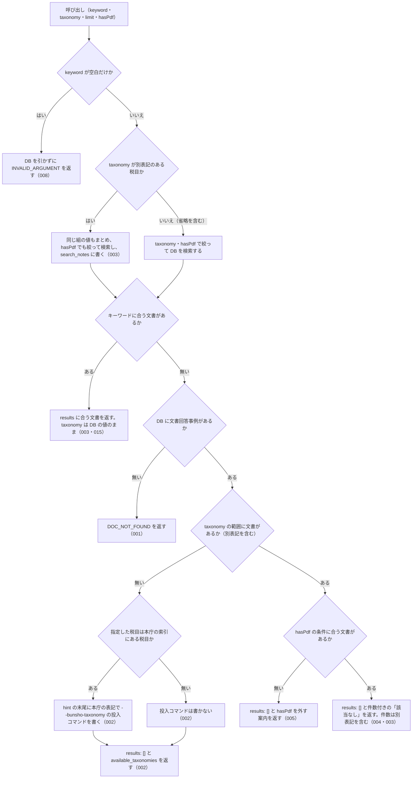

# 機能: nta_search_bunshokaitou（文書回答事例をキーワードで検索する）

- 機能 ID: NTA
- 版: current
- 承認日: 2026-09-26（初版と差分 `20260926-processing-flow`。PR #63）。差分 `20260926-undecided-to-issues` は 2026-09-26（PR #74）。差分 `20260927-search-hit-responses` は 2026-09-27（PR #85）。差分 `20260927-search-keyword-rules` は 2026-09-27（PR #86）。差分 `20260927-search-zero-hits` は 2026-09-27（PR #90）。差分 `20260927-index-status-marks` は 2026-09-27（PR #91）。差分 `20261001-t1-argument-guards` は 2026-10-01（PR #117）
- 起こした元: v0.21.0 の `src/tools/handlers.ts`（`handleNtaSearchBunshokaitou`）、`src/tools/definitions.ts`、`src/tools/tool-args.ts`、`src/constants.ts`、`src/services/db-search.ts`、`src/services/freshness.ts`、`src/services/index-status.ts`、`src/tools/doc-search-zero-hit.test.ts`、`src/tools/handlers.test.ts`
- 関連する Issue: houki-nta-mcp #18（短い語の検索）、#21（通称の展開）、#23（0 件の理由を分ける）、#30（索引から消えた文書の印）

この文書は「このツールは何をするか」を書きます。どう実装しているか（関数名・テーブル名）は書きません。

## アクター

- MCP クライアント（Claude などの LLM、または CLI から呼ぶ人）。`keyword` を渡して、ローカル DB に入っている国税庁の文書回答事例（本庁と国税局の両方）のうちキーワードに合うものの一覧（`docId`・題名・抜粋）を受け取る。本文は `nta_get_bunshokaitou` に `docId` を渡して読む

## 入力

| 引数       | 必須 | 内容                                                                                                                                                                                                                                                                    |
| ---------- | ---- | ----------------------------------------------------------------------------------------------------------------------------------------------------------------------------------------------------------------------------------------------------------------------- |
| `keyword`  | 必須 | 検索キーワード。例: `"電子帳簿"`、`"適格請求書"`、`"災害損失"`。空白で区切ると AND 検索。3 文字以上の語を推奨。空文字・空白だけは不可 |
| `taxonomy` | 任意 | 税目フォルダ名（URL のフォルダ名）で絞り込む。例: `"shotoku"` / `"hojin"` / `"sozoku"` / `"gensen"` / `"joto-sanrin"` / `"shohi"` / `"zoyo"` / `"hyoka"` / `"shozei"` / `"sonota"`。国税局のページの別表記（`"souzoku"` / `"gensenshotoku"` / `"joto_sanrin"`）でもよい。列挙で検査せず、DB に無い値は `available_taxonomies` で正しい値を返す（SPEC-NTA-SEARCH-RULES-018） |
| `limit`    | 任意 | 返す件数。既定 10。1 以上 50 以下の整数 |
| `hasPdf`   | 任意 | 添付 PDF の有無で絞り込む。`true` は PDF 付きだけ、`false` は PDF 無しだけ、省略時は絞らない                                                                                                                                                                            |

検索の対象はローカル DB だけである。事前に `houki-nta-mcp --bulk-download-bunshokaitou` で文書回答事例を DB に入れておく必要がある。国税庁サイトには取りに行かない。

## 処理の流れ

呼び出しを受けてから応答を返すまでに、何をどの順で確かめるかを示します。図の中の番号は「できること」の仕様 ID の末尾 3 桁です。

## できること

### SPEC-NTA-SEARCH-BUNSHOKAITOU-001 文書回答事例が DB に 1 件も無いときは検索できないことをエラーで返す

DB に文書回答事例が 1 件も無いときは、「該当なし」の検索結果ではなく、エラー `DOC_NOT_FOUND` を返す。応答に `results` は付けない。

- `error` は「ローカル DB に文書回答事例が 1 件も無いため、検索できません（「該当なし」という結果ではありません）」
- `tool` は `nta_search_bunshokaitou`
- `hint` に、MCP サーバーが開いている DB ファイルのパスと、投入コマンド `houki-nta-mcp --bulk-download-bunshokaitou` を書く。投入したはずの場合に、bulk download を実行した環境と MCP サーバーとで環境変数 `HOUKI_NTA_DB_PATH` / `XDG_CACHE_HOME` が同じか確かめるよう書く
- `next_actions` の先頭は `action: "cli_bulk_download"`、`example.command` は `houki-nta-mcp --bulk-download-bunshokaitou`

他の種別の文書（質疑応答事例など）だけが DB にあっても、文書回答事例が無ければこのエラーになる。

### SPEC-NTA-SEARCH-BUNSHOKAITOU-002 税目の範囲に文書が無いときは税目の一覧と投入コマンドを案内する

DB に文書回答事例はあるが、`taxonomy` で絞った範囲（別表記を含む。SPEC-NTA-SEARCH-BUNSHOKAITOU-003）に 1 件も無いときは、エラーにせず `results: []` を返す。

- `hint` に、DB の文書回答事例の件数と、`taxonomy="<指定した値>"` の文書が無いこと、`taxonomy` を外すか `available_taxonomies` の値を指定するよう書く
- `available_taxonomies` に、DB の文書回答事例が持つ税目の値の一覧を入れる（別表記もそのまま入る）。例: `["souzoku", "sozoku", "zoyo"]`
- 指定した税目が本庁の索引にある税目（`shotoku` / `gensen` / `joto-sanrin` / `sozoku` / `zoyo` / `hyoka` / `hojin` / `shohi` / `shozei` / `sonota`、またはその別表記）なら、`hint` の末尾に追加の投入コマンド `houki-nta-mcp --bulk-download-bunshokaitou --bunsho-taxonomy=<本庁の表記>` を書く。国税局の別表記で指定したときは本庁の表記に直して書く（`gensenshotoku` → `--bunsho-taxonomy=gensen`）
- 本庁の索引に無い値（例: `zzz`）で指定したときは、投入コマンドは書かない（`available_taxonomies` は付ける）

### SPEC-NTA-SEARCH-BUNSHOKAITOU-003 税目の別表記をまとめて検索し、その旨を search_notes に書く

国税局のページは本庁と違う税目フォルダ名を使うことがあるので、`taxonomy` に次の組のどれかの値を指定したときは、同じ組の値を持つ文書をまとめて検索する。組のどちらの値で指定しても結果は同じである。

| 税目               | 本庁の表記    | 国税局の別表記  |
| ------------------ | ------------- | --------------- |
| 相続税             | `sozoku`      | `souzoku`       |
| 源泉所得税         | `gensen`      | `gensenshotoku` |
| 譲渡所得・山林所得 | `joto-sanrin` | `joto_sanrin`   |

- 結果の各要素の `taxonomy` は DB に入っている値のまま（`sozoku` で検索しても、国税局の文書は `souzoku` で返る）
- まとめて検索したときは、`search_notes` に「`taxonomy="sozoku"` は、同じ税目の別表記 `"souzoku"` の文書もまとめて検索しました」という趣旨の 1 行を入れる
- 別表記の無い税目（例: `zoyo`）や `taxonomy` を省いたときは、この行は入れない（他に注記が無ければ `search_notes` 自体を付けない）
- キーワードに合う文書が無いとき（SPEC-NTA-SEARCH-BUNSHOKAITOU-004）の `hint` の件数も、別表記の文書を含めて数える

### SPEC-NTA-SEARCH-BUNSHOKAITOU-004 キーワードに合う文書が無いときは件数付きの「該当なし」を返す

DB に文書回答事例があり、`taxonomy` と `hasPdf` の範囲にも文書はあるが、キーワードに合うものが無いときは、エラーにせず `results: []` を返す。`hint` は「該当なし。DB の文書回答事例（<絞り込みの条件>）<件数> 件に「<keyword>」に合う文書はありません。別のキーワードで試してください」の形で、件数は絞り込んだ範囲の件数である。

例: `taxonomy: "sozoku"` で DB に `sozoku` 1 件・`souzoku` 1 件があるとき、`hint` は「該当なし。DB の文書回答事例（taxonomy="sozoku"）2 件に「量子暗号通信」に合う文書はありません。別のキーワードで試してください」。絞り込みを指定しなければ「（…）」の部分は付かず、`hasPdf` を指定すれば `hasPdf=true` のように条件に加わる。

### SPEC-NTA-SEARCH-BUNSHOKAITOU-005 `hasPdf` の条件に合う文書が無いときは `hasPdf` を外すよう案内する

`taxonomy` の範囲（別表記を含む。`taxonomy` を省いたときは DB の文書回答事例全体）には文書があるが、`hasPdf` の条件に合う文書が 1 件も無いときは、エラーにせず `results: []` を返す。

- `hint` は `DB の文書回答事例（taxonomy="<指定した値>"）<件数> 件に、PDF 付きの文書はありません。hasPdf を外して検索してください`。`hasPdf: false` なら「PDF 無しの文書はありません」。`taxonomy` を省いたときは `（taxonomy="…"）` の部分を書かない。件数は別表記を含めた `taxonomy` の範囲の件数
- `keyword` と `legal_status` も付く

SPEC-NTA-SEARCH-BUNSHOKAITOU-002（税目の範囲に文書が無い）に当たるときは、そちらを返す。

### SPEC-NTA-SEARCH-BUNSHOKAITOU-006 0 件のときの `freshness` は、0 件の理由ごとに範囲を変える

0 件のとき（SPEC-NTA-SEARCH-BUNSHOKAITOU-002・004・005）の `freshness`（形は SPEC-NTA-SEARCH-RULES-017）は、次の範囲で判定する。

- 税目の範囲に文書が無いとき（002）: DB の文書回答事例全体
- `hasPdf` の条件に合う文書が無いとき（005）と、キーワードに合う文書が無いとき（004）: `taxonomy` で絞った範囲（別表記を含む）。`hasPdf` では絞らない。`taxonomy` を省いたときは DB の文書回答事例全体

### SPEC-NTA-SEARCH-BUNSHOKAITOU-007 `limit` は 1 以上 50 以下の整数で、範囲の外は `INVALID_ARGUMENT` にして丸めない

tools/list の inputSchema の `limit` は `type: "integer"`、`minimum: 1`、`maximum: 50` を持つ（SPEC-NTA-COMMON-ERRORS-012）。0・負の数・小数・51 以上・数値でない値を渡すと、inputSchema の検査で `INVALID_ARGUMENT`（`tool: "nta_search_bunshokaitou"`、`detail.issues[0].path: "limit"`）を返し、DB を引かない。1 件や 50 件に丸めたり、切り捨てたりしない。既定の 10 件は変えない。

例: `{ keyword: "適格請求書", limit: 0 }` は `code: "INVALID_ARGUMENT"`、`detail.issues` は `[{ path: "limit", message: "1 以上で指定してください" }]` で、DB は引かない（v0.21.3 では 1 件に丸めていた）。`limit: 100` は `[{ path: "limit", message: "50 以下で指定してください" }]`（v0.21.3 では 50 件）。`limit: 2.5` と `limit: "10"` は `整数で指定してください`。`limit: 50` は検査を通り、最大 50 件を返す。

### SPEC-NTA-SEARCH-BUNSHOKAITOU-008 keyword が空文字・空白だけのときはDBを引かずに `INVALID_ARGUMENT` を返す

空文字は inputSchema の `minLength: 1` の検査（SPEC-NTA-COMMON-ERRORS-013）で止まり、`INVALID_ARGUMENT`（`tool: "nta_search_bunshokaitou"`、`detail.issues: [{ path: "keyword", message: "空文字は指定できません" }]`）を返す。空白（半角スペース・全角スペース・タブ・改行）だけのときは、ツールの処理がDBを引く前に、SPEC-NTA-COMMON-ERRORS-014 の形の `INVALID_ARGUMENT`（`tool: "nta_search_bunshokaitou"`、`error: "keyword が空です"`、`detail.issues: [{ path: "keyword", message: "空白だけは指定できません" }]`、`hint` に探したい語を渡すよう書く）を返す。

例: `keyword: ""` は `code: "INVALID_ARGUMENT"`・`detail.issues[0].message: "空文字は指定できません"`。`keyword: "　"`（全角スペース）と `keyword: " \n"` は `code: "INVALID_ARGUMENT"`・`error: "keyword が空です"`。どれもDBは引かない。

v0.21.3 では空の `keyword` に `results: []` と「該当なし」の `hint`（SPEC-NTA-SEARCH-BUNSHOKAITOU-004 の形）を返していたが、空の `keyword` は探していないので、004 の対象から外れる。

## できないこと

- 文書の本文を返すこと（結果は `docId`・題名・抜粋まで。本文は `nta_get_bunshokaitou`）
- 国税庁サイトに取りに行くこと（DB に無い文書は、`--bulk-download-bunshokaitou` をもう一度実行して取り込む）
- 発出日や国税局で絞り込むこと（絞り込めるのは `taxonomy` と `hasPdf` だけ。国税局の文書は `docId` の先頭（`tokyo/…` など）で見分ける）
- 索引から消えた文書を結果から除くこと（印を付けて返すだけ。未決 5）
- 回答が今の法令でも成り立つかを判定すること（`legal_status` は文書回答事例が個別事案への回答で一般的な法的拘束力を持たないことを示すだけ）

## 未決

初版起こしで見つけた、意図か不具合かを人が決める項目です。決まったら「できること」に ID を振るか、`specs/changes/` の差分にします。

意図か不具合かの判断が要る項目は houki-nta-mcp の Issue に移し、ここには題と Issue の番号だけを残します。今の振る舞いのままでよくテストが無いだけの項目は、受入テストを書いてから「できること」に ID を振ります。

