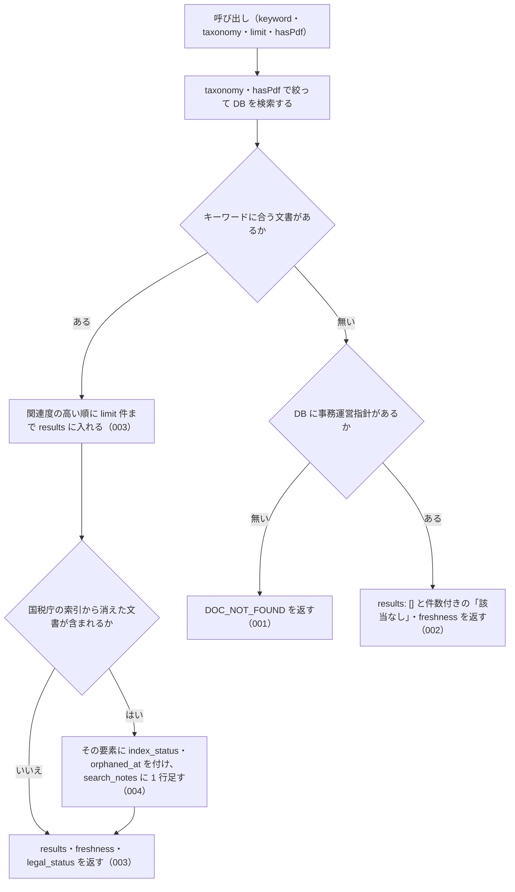

# 機能: nta_search_jimu_unei（事務運営指針をキーワードで検索する）

- 機能 ID: NTA
- 版: current
- 承認日: 2026-06-26（PR #63）
- 起こした元: v0.21.0 の `src/tools/handlers.ts`（`handleNtaSearchJimuUnei`）、`src/tools/definitions.ts`、`src/tools/tool-args.ts`、`src/services/db-search.ts`、`src/services/freshness.ts`、`src/services/index-status.ts`、`src/tools/doc-search-zero-hit.test.ts`、`src/tools/index-status-response.test.ts`、`src/tools/handlers.test.ts`
- 関連する Issue: houki-nta-mcp #18（短い語の検索）、#21（通称の展開）、#23（0 件の理由を分ける）、#30（索引から消えた文書の印）

この文書は「このツールは何をするか」を書きます。どう実装しているか（関数名・テーブル名）は書きません。

## アクター

- MCP クライアント（Claude などの LLM、または CLI から呼ぶ人）。`keyword` を渡して、ローカル DB に入っている国税庁の事務運営指針のうちキーワードに合うものの一覧（`docId`・題名・抜粋）を受け取り、`nta_get_jimu_unei` で本文を読む前の当たりを付ける

## 入力

| 引数       | 必須 | 内容                                                                                                                                                                    |
| ---------- | ---- | ----------------------------------------------------------------------------------------------------------------------------------------------------------------------- |
| `keyword`  | 必須 | 検索キーワード。例: `"書面添付"`、`"重加算税"`。空白で区切ると全部の語を含む文書を探す（AND）。3 文字以上の語を推奨。2 文字の語は本文の部分一致で補い、1 文字の語は外す |
| `taxonomy` | 任意 | 税目フォルダで絞る。例: `"shotoku"` / `"hojin"` / `"sozoku"` / `"shohi"`。値の形は検査しない（DB にある値は、該当が無いときの応答の `available_taxonomies` で分かる）   |
| `limit`    | 任意 | 返す件数。既定 10、最大 50                                                                                                                                              |
| `hasPdf`   | 任意 | 添付 PDF の有無で絞る。`true` = PDF 付きだけ、`false` = PDF 無しだけ、省略 = 絞らない                                                                                   |

検索するのはローカル DB だけである。DB には `houki-nta-mcp --bulk-download-jimu-unei` で入れる。この呼び出しで国税庁サイトには取りに行かない。

## 処理の流れ

呼び出しを受けてから応答を返すまでに、何をどの順で確かめるかを示します。図の中の番号は「できること」の仕様 ID の末尾 3 桁です。

## できること

### SPEC-NTA-SEARCH-JIMU-UNEI-001 DB に事務運営指針が 1 件も無いときはエラー DOC_NOT_FOUND を返す

ローカル DB に事務運営指針が 1 件も入っていないときは、キーワードに関わらずエラー `DOC_NOT_FOUND` を返す。「該当なし」の結果（SPEC-NTA-SEARCH-JIMU-UNEI-002）とは応答の形で区別できる（`results` が無い）。応答は次を持つ。

| フィールド     | 内容                                                                                                                                                                                                                                    |
| -------------- | --------------------------------------------------------------------------------------------------------------------------------------------------------------------------------------------------------------------------------------- |
| `error`        | `ローカル DB に事務運営指針が 1 件も無いため、検索できません（「該当なし」という結果ではありません）`                                                                                                                                   |
| `code`         | `DOC_NOT_FOUND`                                                                                                                                                                                                                         |
| `hint`         | MCP サーバーが開いている DB のパスと、`houki-nta-mcp --bulk-download-jimu-unei` で投入する案内。投入したはずなら、bulk download を実行した環境と MCP サーバーとで環境変数 `HOUKI_NTA_DB_PATH` / `XDG_CACHE_HOME` が同じかを確かめる案内 |
| `next_actions` | 1 件。`action: "cli_bulk_download"`、`example.command: "houki-nta-mcp --bulk-download-jimu-unei"`                                                                                                                                       |
| `tool`         | `nta_search_jimu_unei`                                                                                                                                                                                                                  |

### SPEC-NTA-SEARCH-JIMU-UNEI-002 事務運営指針はあるがキーワードに合わないときは成功で「該当なし」を返す

DB に事務運営指針が 1 件以上あり、キーワードに合う文書が無いときは、エラーにせず次の応答を返す。

| フィールド     | 内容                                                                                                                                                                                                                                                         |
| -------------- | ------------------------------------------------------------------------------------------------------------------------------------------------------------------------------------------------------------------------------------------------------------ |
| `results`      | `[]`                                                                                                                                                                                                                                                         |
| `keyword`      | 渡された `keyword`                                                                                                                                                                                                                                           |
| `hint`         | `該当なし。DB の事務運営指針 <件数> 件に「<keyword>」に合う文書はありません。別のキーワードで試してください`。`taxonomy` や `hasPdf` を渡していたときは、件数の前に `（taxonomy="shotoku"、hasPdf=true）` のように条件を書き、件数はその条件で絞った数になる |
| `freshness`    | DB に入れた日時の範囲（`oldest_fetched_at` / `newest_fetched_at` / `staleness` / `days_since_oldest`。古いときは `warning`）。`taxonomy` を渡していたときはその税目の範囲                                                                                    |
| `search_notes` | 短い語を補った・外したなどの注記があるときだけ付く                                                                                                                                                                                                           |
| `legal_status` | `binds_citizens: false` / `binds_courts: false` / `binds_tax_office: true` と、通達は行政内部文書である旨の注                                                                                                                                                |

例: 事務運営指針が 1 件だけ入っている DB を `keyword: "滞納処分"` で検索すると、`code` は無く、`hint` は `該当なし。DB の事務運営指針 1 件に「滞納処分」に合う文書はありません。別のキーワードで試してください` になる。

### SPEC-NTA-SEARCH-JIMU-UNEI-003 キーワードに合う事務運営指針を results に返す

キーワードに合う文書があるときは、関連度の高い順に `limit` 件まで `results` に入れて返す。応答は次を持つ。

| フィールド     | 内容                                                                                                                                                                                                                                                                                                    |
| -------------- | ------------------------------------------------------------------------------------------------------------------------------------------------------------------------------------------------------------------------------------------------------------------------------------------------------- |
| `keyword`      | 渡された `keyword`                                                                                                                                                                                                                                                                                      |
| `results[]`    | 1 件につき `docType`（`jimu-unei`）・`docId`（`nta_get_jimu_unei` に渡す文書 ID。例: `shotoku/shinkoku/170331`）・`taxonomy`・`title`・`issuedAt`・`sourceUrl`・`snippet`（キーワードの前後を切り出し、合った語を `<b>` で囲んだ抜粋）・`score`（関連度）・`scoreReasons`（関連度の理由の文字列の配列） |
| `freshness`    | DB に入れた日時の範囲（SPEC-NTA-SEARCH-JIMU-UNEI-002 と同じ形）                                                                                                                                                                                                                                         |
| `search_notes` | 注記があるときだけ付く                                                                                                                                                                                                                                                                                  |
| `legal_status` | SPEC-NTA-SEARCH-JIMU-UNEI-002 と同じ                                                                                                                                                                                                                                                                    |

`results` には `total` のような全件数は付けない（返した件数が `results.length`）。

### SPEC-NTA-SEARCH-JIMU-UNEI-004 国税庁の索引から消えた文書は除外せず、印と注記を付ける

DB にはあるが国税庁の索引から消えた（bulk download の再実行で索引に無いことを確かめた）文書は、キーワードに合えば `results` から除外しない。過去の課税期間の判断に使えるようにするためである。その文書の要素には `index_status: "removed_from_index"` と `orphaned_at`（索引から消えたことを最初に確かめた日時。例: `2026-10-01T00:30:00Z`）を付ける。索引にある文書にはこの 2 つを付けない。

`results` に 1 件でもそのような文書があるときは、`search_notes` に `検索結果 <件数> 件のうち <消えた件数> 件は国税庁の索引から外れています（\`index_status: "removed_from_index"\`）。…` の 1 行を足す。注記には、現在の取扱いは最新の通達で確かめること、出典 URL が 404 になることがあることを書く。

例: 索引にある文書 A と索引から消えた文書 B の両方に合うキーワードで検索すると、`results` は A・B の 2 件。A には `index_status` が無く、B には `index_status: "removed_from_index"` と `orphaned_at` が付き、`search_notes` に「2 件のうち 1 件」を含む行が入る。

## できないこと

- 国税庁サイトに取りに行くこと（DB に無い文書は `--bulk-download-jimu-unei` で入れてから検索する）
- 事務運営指針の本文を返すこと（本文は `nta_get_jimu_unei` に `docId` を渡して読む）
- 添付 PDF の中身を検索すること（`hasPdf` は PDF の有無で絞るだけ。PDF の中身は `nta_inspect_pdf_meta` と pdf-reader-mcp で読む）
- キーワードに合う文書の総数を返すこと（`results` は `limit` 件まで。件数を書くのは 0 件のときの `hint` だけ）
- 改正通達・文書回答事例・質疑応答事例を一緒に検索すること（種別ごとに別のツール）
- 事務運営指針が今も有効かを判定すること（`index_status` は国税庁の索引に載っているかどうかを表すだけ）

## 未決

初版起こしで見つけた、意図か不具合かを人が決める項目です。決まったら「できること」に ID を振るか、`specs/changes/` の差分にします。

意図か不具合かの判断が要る項目は houki-nta-mcp の Issue に移し、ここには題と Issue の番号だけを残します。今の振る舞いのままでよくテストが無いだけの項目は、受入テストを書いてから「できること」に ID を振ります。

1. **`taxonomy` の範囲に文書が無いときの応答。** `taxonomy` を渡し、その税目の事務運営指針が DB に無いときは、成功で `results: []`、`hint`（`DB の事務運営指針 <件数> 件のうち、taxonomy="<値>" の文書はありません。taxonomy を外すか、available_taxonomies の値を指定してください`）、`available_taxonomies`（DB にある税目の一覧）、`freshness` を返す。事務運営指針には税目を絞って投入するフラグが無いので、`nta_search_qa` の `--qa-topic` のような追加投入の案内は付かない。このツールの応答としてのテストが無い（同じ形のテストは `nta_search_qa` / `nta_search_bunshokaitou` にある）。ID を振るのは受入テストを書いてから。
2. **`hasPdf` の条件に合う文書が無いときの応答。** 成功で `results: []`、`hint`（`DB の事務運営指針<（taxonomy="…"）> <件数> 件に、PDF 付き|PDF 無しの文書はありません。hasPdf を外して検索してください`）、`freshness` を返す。このツールの応答としてのテストが無い（同じ形のテストは `nta_search_kaisei_tsutatsu` にある）。ID を振るのは受入テストを書いてから。
3. **2 文字の語と 1 文字の語の扱い。** 3 文字未満の語は全文索引に乗らない。2 文字の語は、3 文字以上の語があればその検索結果を本文・題名の部分一致で絞り込み、無ければ部分一致だけで探す（このとき `score` は順位に基づかず、`snippet` は本文から切り出す）。1 文字の語は検索条件から外す。どちらも `search_notes` にその旨の文を入れ、`scoreReasons` に `short token filter (LIKE): …` / `short token search (LIKE, no FTS rank): …` を足す。このツールの応答としてのテストが無い（部分一致の検索側のテストは `src/services/db-search.test.ts` にある）。ID を振るのは受入テストを書いてから。
4. **略称・通称の展開。** `keyword` 全体が houki-abbreviations の辞書にある略称（例: `消基通`）のときは正式名も含めて探す。通称（例: `インボイス`）のときは、元の語で 0 件のときだけ正式名（`消費税法`）に広げて探し直し、広げたときは `search_notes` にその旨の文を入れ、`scoreReasons` に `abbreviation expanded: <元> → <先>` を足す。このツールの応答としてのテストが無い。ID を振るのは受入テストを書いてから。
5. **`limit` の範囲。** → houki-nta-mcp #68
6. **`keyword` が空のときの応答。** → houki-nta-mcp #69
7. **`taxonomy` の値の形を検査しない。** → houki-nta-mcp #67
8. **inputSchema に合わない引数のエラー `INVALID_ARGUMENT`。** `keyword` が無い、型が違う、inputSchema に無い引数がある、のいずれでも `code: "INVALID_ARGUMENT"`・`hint`・`next_actions`（`list_tools`）・`detail.issues` を返し、DB は引かない。全ツールに共通の入力の検査で行うが、このツールを呼ぶテストが無い。ID を振るのは受入テストを書いてから。
9. **`freshness` の `staleness` と `warning`。** DB に入れた最古の日時から 7 日未満は `fresh`、30 日未満は `stale`、それ以上は `outdated` で、`outdated` のときだけ `warning`（`--bulk-download-jimu-unei` で最新化する案内）を付ける。このツールの応答としてのテストが無い（閾値は houki-abbreviations の共通値）。ID を振るのは受入テストを書いてから。
10. **SPEC-NTA-SEARCH-JIMU-UNEI-003 の `results` の要素のフィールド**（`title` / `snippet` / `score` / `scoreReasons` / `freshness` など）は、現在のテストが `docId` しか確かめていない。項目ごとの受入テストを足すか。
