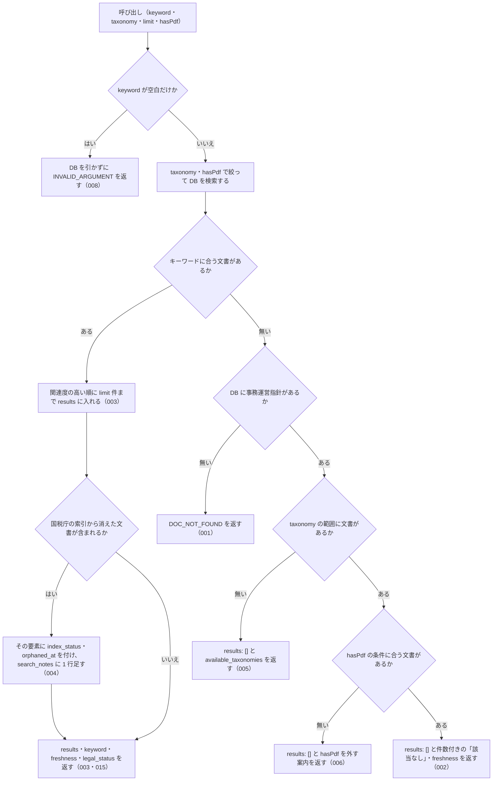

# 機能: nta_search_jimu_unei（事務運営指針をキーワードで検索する）

- 機能 ID: NTA
- 版: current
- 承認日: 2026-09-26（初版と差分 `20260926-processing-flow`。PR #63）。差分 `20260926-undecided-to-issues` は 2026-09-26（PR #74）。差分 `20260927-argument-and-parse-errors` は 2026-09-27（PR #84）。差分 `20260927-search-hit-responses` は 2026-09-27（PR #85）。差分 `20260927-search-keyword-rules` は 2026-09-27（PR #86）。差分 `20260927-search-zero-hits` は 2026-09-27（PR #90）。差分 `20261001-t1-argument-guards` は 2026-10-01（PR #117）。差分 `20261003-specs-current-catchup` は 2026-10-03（PR #132）。差分 `20261003-source-paths` は 2026-10-03（PR #134）
- 起こした元: v0.21.0 の `src/tools/handlers.ts`（`handleNtaSearchJimuUnei`）、`src/tools/definitions.ts`、`src/tools/tool-args.ts`、`src/services/db-search.ts`、`src/services/freshness.ts`、`src/services/index-status.ts`、`src/tools/doc-search-zero-hit.test.ts`、`src/tools/index-status-response.test.ts`、`src/tools/handlers.test.ts`
- 関連する Issue: houki-nta-mcp #18（短い語の検索）、#21（通称の展開）、#23（0 件の理由を分ける）、#30（索引から消えた文書の印）

この文書は「このツールは何をするか」を書きます。どう実装しているか（関数名・テーブル名）は書きません。

## アクター

- MCP クライアント（Claude などの LLM、または CLI から呼ぶ人）。`keyword` を渡して、ローカル DB に入っている国税庁の事務運営指針のうちキーワードに合うものの一覧（`docId`・題名・抜粋）を受け取り、`nta_get_jimu_unei` で本文を読む前の当たりを付ける

## 入力

| 引数       | 必須 | 内容                                                                                                                                                                    |
| ---------- | ---- | ----------------------------------------------------------------------------------------------------------------------------------------------------------------------- |
| `keyword`  | 必須 | 検索キーワード。例: `"書面添付"`、`"重加算税"`。空白で区切ると全部の語を含む文書を探す（AND）。3 文字以上の語を推奨。2 文字の語は本文の部分一致で補い、1 文字の語は外す。空文字・空白だけは不可 |
| `taxonomy` | 任意 | 税目フォルダで絞る。例: `"shotoku"` / `"hojin"` / `"sozoku"` / `"shohi"`。列挙で検査せず、DB に無い値は `available_taxonomies` で正しい値を返す（SPEC-NTA-SEARCH-RULES-018） |
| `limit`    | 任意 | 返す件数。既定 10。1 以上 50 以下の整数 |
| `hasPdf`   | 任意 | 添付 PDF の有無で絞る。`true` = PDF 付きだけ、`false` = PDF 無しだけ、省略 = 絞らない                                                                                   |

検索するのはローカル DB だけである。DB には `houki-nta-mcp --bulk-download-jimu-unei` で入れる。この呼び出しで国税庁サイトには取りに行かない。

## 処理の流れ

呼び出しを受けてから応答を返すまでに、何をどの順で確かめるかを示します。図の中の番号は「できること」の仕様 ID の末尾 3 桁です。

```mermaid
flowchart TD
  A["呼び出し（keyword・taxonomy・limit・hasPdf）"] --> W{"keyword が空白だけか"}
  W -- はい --> E0["DB を引かずに INVALID_ARGUMENT を返す（008）"]
  W -- いいえ --> B["taxonomy・hasPdf で絞って DB を検索する"]
  B --> C{"キーワードに合う文書があるか"}
  C -- ある --> D["関連度の高い順に limit 件まで results に入れる（003）"]
  D --> E{"国税庁の索引から消えた文書が含まれるか"}
  E -- はい --> F["その要素に index_status・orphaned_at を付け、search_notes に 1 行足す（004）"]
  E -- いいえ --> G["results・keyword・freshness・legal_status を返す（003・015）"]
  F --> G
  C -- 無い --> H{"DB に事務運営指針があるか"}
  H -- 無い --> E1["DOC_NOT_FOUND を返す（001）"]
  H -- ある --> I{"taxonomy の範囲に文書があるか"}
  I -- 無い --> E3["results: [] と available_taxonomies を返す（005）"]
  I -- ある --> J{"hasPdf の条件に合う文書があるか"}
  J -- 無い --> E4["results: [] と hasPdf を外す案内を返す（006）"]
  J -- ある --> E2["results: [] と件数付きの「該当なし」・freshness を返す（002）"]
```

## できること

### SPEC-NTA-SEARCH-JIMU-UNEI-001 DB に事務運営指針が 1 件も無いときはエラー DOC_NOT_FOUND を返す

ローカル DB に事務運営指針が 1 件も入っていないときは、キーワードに関わらずエラー `DOC_NOT_FOUND` を返す。「該当なし」の結果（SPEC-NTA-SEARCH-JIMU-UNEI-002）とは応答の形で区別できる（`results` が無い）。応答は次を持つ。

| フィールド     | 内容                                                                                                                                                                                                                                    |
| -------------- | --------------------------------------------------------------------------------------------------------------------------------------------------------------------------------------------------------------------------------------- |
| `error`        | `ローカル DB に事務運営指針が 1 件も無いため、検索できません（「該当なし」という結果ではありません）`                                                                                                                                   |
| `code`         | `DOC_NOT_FOUND`                                                                                                                                                                                                                         |
| `hint`         | MCP サーバーが開いている DB のパスと、`houki-nta-mcp --bulk-download-jimu-unei` で投入する案内。投入したはずなら、bulk download を実行した環境と MCP サーバーとで環境変数 `HOUKI_NTA_DB_PATH` / `XDG_CACHE_HOME` が同じかを確かめる案内 |
| `next_actions` | 1 件。`action: "cli_bulk_download"`、`example.command: "houki-nta-mcp --bulk-download-jimu-unei"`                                                                                                                                       |
| `tool`         | `nta_search_jimu_unei`                                                                                                                                                                                                                  |

### SPEC-NTA-SEARCH-JIMU-UNEI-002 事務運営指針はあるがキーワードに合わないときは成功で「該当なし」を返す

DB に事務運営指針が 1 件以上あり、キーワードに合う文書が無いときは、エラーにせず次の応答を返す。

| フィールド     | 内容                                                                                                                                                                                                                                                         |
| -------------- | ------------------------------------------------------------------------------------------------------------------------------------------------------------------------------------------------------------------------------------------------------------ |
| `results`      | `[]`                                                                                                                                                                                                                                                         |
| `keyword`      | 渡された `keyword`                                                                                                                                                                                                                                           |
| `hint`         | `該当なし。DB の事務運営指針 <件数> 件に「<keyword>」に合う文書はありません。別のキーワードで試してください`。`taxonomy` や `hasPdf` を渡していたときは、件数の前に `（taxonomy="shotoku"、hasPdf=true）` のように条件を書き、件数はその条件で絞った数になる |
| `freshness`    | DB に入れた日時の範囲（`oldest_fetched_at` / `newest_fetched_at` / `staleness` / `days_since_oldest`。古いときは `warning`）。`taxonomy` を渡していたときはその税目の範囲                                                                                    |
| `search_notes` | 短い語を補った・外したなどの注記があるときだけ付く                                                                                                                                                                                                           |
| `legal_status` | `binds_citizens: false` / `binds_courts: false` / `binds_tax_office: true` と、`note: "通達・事務運営指針は行政内部文書であり、納税者・裁判所には直接的拘束力なし。ただし税務署員は職務として守る義務あり（最高裁 昭和43.12.24）"`。`nta_get_jimu_unei` の json の `legal_status`（SPEC-NTA-GET-JIMU-UNEI-005）と同じ値 |

例: 事務運営指針が 1 件だけ入っている DB を `keyword: "滞納処分"` で検索すると、`code` は無く、`hint` は `該当なし。DB の事務運営指針 1 件に「滞納処分」に合う文書はありません。別のキーワードで試してください` になり、`legal_status.note` は `通達・事務運営指針は行政内部文書であり、` で始まる（v0.23.0 では `通達は行政内部文書。` で始まる、基本通達・改正通達と同じ文だった）。キーワードに合う文書があるとき（SPEC-NTA-SEARCH-JIMU-UNEI-003）の `legal_status` も同じ値。

### SPEC-NTA-SEARCH-JIMU-UNEI-003 キーワードに合う事務運営指針を results に返す

キーワードに合う文書があるときは、関連度の高い順に `limit` 件まで `results` に入れて返す。応答は次を持つ。

| フィールド     | 内容                                                                                                                                                                                                                                                                                                    |
| -------------- | ------------------------------------------------------------------------------------------------------------------------------------------------------------------------------------------------------------------------------------------------------------------------------------------------------- |
| `keyword`      | 渡された `keyword`                                                                                                                                                                                                                                                                                      |
| `results[]`    | 1 件につき `docType`（`jimu-unei`）・`docId`（`nta_get_jimu_unei` に渡す文書 ID。例: `shotoku/shinkoku/170331`）・`taxonomy`・`title`・`issuedAt`・`sourceUrl`・`snippet`（キーワードの前後を切り出し、合った語を `<b>` で囲んだ抜粋）・`score`（関連度）・`scoreReasons`（関連度の理由の文字列の配列） |
| `freshness`    | DB に入れた日時の範囲（SPEC-NTA-SEARCH-JIMU-UNEI-002 と同じ形）                                                                                                                                                                                                                                         |
| `search_notes` | 注記があるときだけ付く                                                                                                                                                                                                                                                                                  |
| `legal_status` | SPEC-NTA-SEARCH-JIMU-UNEI-002 と同じ                                                                                                                                                                                                                                                                    |

`results` には `total` のような全件数は付けない（返した件数が `results.length`）。

### SPEC-NTA-SEARCH-JIMU-UNEI-004 国税庁の索引から消えた文書は除外せず、印と注記を付ける

DB にはあるが国税庁の索引から消えた（bulk download の再実行で索引に無いことを確かめた）文書は、キーワードに合えば `results` から除外しない。過去の課税期間の判断に使えるようにするためである。その文書の要素には `index_status: "removed_from_index"` と `orphaned_at`（索引から消えたことを最初に確かめた日時。例: `2026-10-01T00:30:00Z`）を付ける。索引にある文書にはこの 2 つを付けない。

`results` に 1 件でもそのような文書があるときは、`search_notes` に `検索結果 <件数> 件のうち <消えた件数> 件は国税庁の索引から外れています（\`index_status: "removed_from_index"\`）。…` の 1 行を足す。注記には、現在の取扱いは最新の通達で確かめること、出典 URL が 404 になることがあることを書く。

例: 索引にある文書 A と索引から消えた文書 B の両方に合うキーワードで検索すると、`results` は A・B の 2 件。A には `index_status` が無く、B には `index_status: "removed_from_index"` と `orphaned_at` が付き、`search_notes` に「2 件のうち 1 件」を含む行が入る。

### SPEC-NTA-SEARCH-JIMU-UNEI-005 `taxonomy` の範囲に文書が無いときは税目の一覧を返す

DB に事務運営指針はあるが、`taxonomy` で絞った範囲に文書が 1 件も無いときは、エラーにせず次を返す。

- `results`: `[]`
- `keyword`: 渡した `keyword`
- `hint`: `DB の事務運営指針 <件数> 件のうち、taxonomy="<値>" の文書はありません。taxonomy を外すか、available_taxonomies の値を指定してください。`。事務運営指針には税目を絞って投入するフラグが無いので、投入コマンドの案内は書かない
- `available_taxonomies`: DB の事務運営指針が持つ税目の一覧（昇順）
- `freshness`: DB の事務運営指針全体の取得時点（形は SPEC-NTA-SEARCH-RULES-017）
- `legal_status`: 通達の位置付け（`binds_tax_office: true`）

例: `shotoku` の事務運営指針 2 件だけがある DB で `{ keyword: "源泉徴収", taxonomy: "hojin" }` を渡すと、`hint` は `DB の事務運営指針 2 件のうち、taxonomy="hojin" の文書はありません。taxonomy を外すか、available_taxonomies の値を指定してください。`、`available_taxonomies` は `["shotoku"]` になる。

### SPEC-NTA-SEARCH-JIMU-UNEI-006 `hasPdf` の条件に合う文書が無いときは `hasPdf` を外すよう案内する

`taxonomy` の範囲（省いたときは DB の事務運営指針全体）には文書があるが、`hasPdf` の条件に合う文書が 1 件も無いときは、エラーにせず次を返す。

- `results`: `[]`
- `keyword`: 渡した `keyword`
- `hint`: `DB の事務運営指針（taxonomy="<値>"）<件数> 件に、PDF 付きの文書はありません。hasPdf を外して検索してください`。`hasPdf: false` なら「PDF 無しの文書はありません」。`taxonomy` を省いたときは `（taxonomy="…"）` の部分を書かない
- `freshness`: `taxonomy` で絞った範囲の取得時点（`hasPdf` では絞らない）
- `legal_status`

0 件の理由は SPEC-NTA-SEARCH-JIMU-UNEI-001 → 005 → 006 → 002 の順に決める。先に当てはまった理由の応答を返す。

### SPEC-NTA-SEARCH-JIMU-UNEI-007 `limit` は 1 以上 50 以下の整数で、範囲の外は `INVALID_ARGUMENT` にして丸めない

tools/list の inputSchema の `limit` は `type: "integer"`、`minimum: 1`、`maximum: 50` を持つ（SPEC-NTA-COMMON-ERRORS-012）。0・負の数・小数・51 以上・数値でない値を渡すと、inputSchema の検査で `INVALID_ARGUMENT`（`tool: "nta_search_jimu_unei"`、`detail.issues[0].path: "limit"`）を返し、DB を引かない。1 件や 50 件に丸めたり、切り捨てたりしない。既定の 10 件は変えない。

例: `{ keyword: "書面添付", limit: 0 }` は `code: "INVALID_ARGUMENT"`、`detail.issues` は `[{ path: "limit", message: "1 以上で指定してください" }]` で、DB は引かない（v0.21.3 では 1 件に丸めていた）。`limit: 100` は `[{ path: "limit", message: "50 以下で指定してください" }]`（v0.21.3 では 50 件）。`limit: 2.5` と `limit: "10"` は `整数で指定してください`。`limit: 50` は検査を通り、最大 50 件を返す。

### SPEC-NTA-SEARCH-JIMU-UNEI-008 keyword が空文字・空白だけのときはDBを引かずに `INVALID_ARGUMENT` を返す

空文字は inputSchema の `minLength: 1` の検査（SPEC-NTA-COMMON-ERRORS-013）で止まり、`INVALID_ARGUMENT`（`tool: "nta_search_jimu_unei"`、`detail.issues: [{ path: "keyword", message: "空文字は指定できません" }]`）を返す。空白（半角スペース・全角スペース・タブ・改行）だけのときは、ツールの処理がDBを引く前に、SPEC-NTA-COMMON-ERRORS-014 の形の `INVALID_ARGUMENT`（`tool: "nta_search_jimu_unei"`、`error: "keyword が空です"`、`detail.issues: [{ path: "keyword", message: "空白だけは指定できません" }]`、`hint` に探したい語を渡すよう書く）を返す。

例: `keyword: ""` は `code: "INVALID_ARGUMENT"`・`detail.issues[0].message: "空文字は指定できません"`。`keyword: "　"`（全角スペース）と `keyword: " \n"` は `code: "INVALID_ARGUMENT"`・`error: "keyword が空です"`。どれもDBは引かない。

v0.21.3 では空の `keyword` に `results: []` と「該当なし」の `hint`（SPEC-NTA-SEARCH-JIMU-UNEI-002 の形）を返していたが、空の `keyword` は探していないので、002 の対象から外れる。

## できないこと

- 国税庁サイトに取りに行くこと（DB に無い文書は `--bulk-download-jimu-unei` で入れてから検索する）
- 事務運営指針の本文を返すこと（本文は `nta_get_jimu_unei` に `docId` を渡して読む）
- 添付 PDF の中身を検索すること（`hasPdf` は PDF の有無で絞るだけ。PDF の中身は `nta_inspect_pdf_meta` と pdf-reader-mcp で読む）
- キーワードに合う文書の総数を返すこと（`results` は `limit` 件まで。件数を書くのは 0 件のときの `hint` だけ）
- 改正通達・文書回答事例・質疑応答事例を一緒に検索すること（種別ごとに別のツール）
- 事務運営指針が今も有効かを判定すること（`index_status` は国税庁の索引に載っているかどうかを表すだけ）

## 未決

初版起こしで見つけた、意図か不具合かを人が決める項目です。決まったら「できること」に ID を振るか、`specs/changes/` の差分にします。

意図か不具合かの判断が要る項目は houki-nta-mcp の Issue に移し、ここには題と Issue の番号だけを残します。今の振る舞いのままでよくテストが無いだけの項目は、受入テストを書いてから「できること」に ID を振ります。

