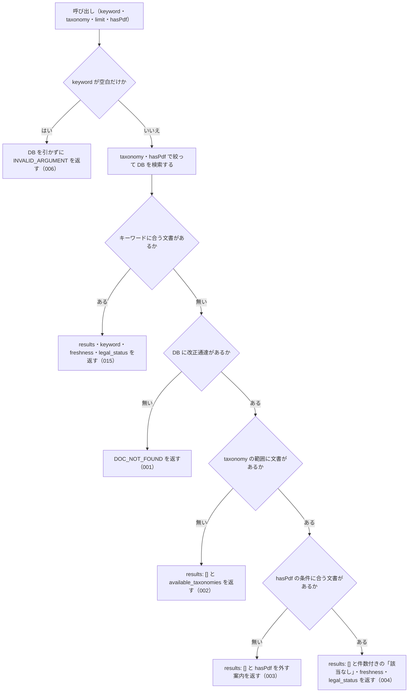

# 機能: nta_search_kaisei_tsutatsu（改正通達をキーワードで検索する）

- 機能 ID: NTA
- 版: current
- 承認日: 2026-09-26（初版と差分 `20260926-processing-flow`。PR #63）。差分 `20260926-undecided-to-issues` は 2026-09-26（PR #74）。差分 `20260927-argument-and-parse-errors` は 2026-09-27（PR #84）。差分 `20260927-search-hit-responses` は 2026-09-27（PR #85）。差分 `20260927-search-keyword-rules` は 2026-09-27（PR #86）。差分 `20260927-index-status-marks` は 2026-09-27（PR #91）。差分 `20261001-t1-argument-guards` は 2026-10-01（PR #117）。差分 `20261003-t5-docs-mismatch` は 2026-10-03（PR #126）。差分 `20261003-specs-current-catchup` は 2026-10-03（PR #132）。差分 `20261004-db-location` は 2026-10-05（PR #142）。差分 `20261006-db-failure-paths` は 2026-10-06（PR #152）
- 起こした元: v0.21.0 の `src/tools/handlers.ts`（`handleNtaSearchKaiseiTsutatsu`・`explainDocZeroHits`）、`src/tools/definitions.ts`、`src/tools/tool-args.ts`、`src/services/db-search.ts`、`src/services/freshness.ts`、`src/services/index-status.ts`、`src/errors.ts`、`src/tools/doc-search-zero-hit.test.ts`
- 関連する Issue: houki-nta-mcp #18（短い語の補完）、#21（通称の展開）、#23（0 件の理由を分ける）、#30（索引から消えた文書の印）、#138（DB の場所の見え方。0.25.0）、#144（DB を開けないときの応答。0.26.0）

この文書は「このツールは何をするか」を書きます。どう実装しているか（関数名・テーブル名）は書きません。

## アクター

- MCP クライアント（Claude などの LLM、または CLI から呼ぶ人）。`keyword` を渡して、ローカル DB に取り込んである国税庁の改正通達（一部改正通達）のうち、キーワードに合う文書の一覧（文書 ID・題名・発遣日・出典 URL・抜粋）を受け取る。本文は `nta_get_kaisei_tsutatsu` で別に取る

## 入力

| 引数       | 必須 | 内容                                                                                                                                                                               |
| ---------- | ---- | ---------------------------------------------------------------------------------------------------------------------------------------------------------------------------------- |
| `keyword`  | 必須 | 検索キーワード。例: `"電子帳簿"` / `"インボイス"` / `"軽減税率"`。空白で区切ると複数の語になる。3 文字以上の語を推奨（2 文字の語は本文の部分一致で補い、1 文字の語は条件から外す）。空文字・空白だけは不可 |
| `taxonomy` | 任意 | 税目フォルダで絞り込む。`shohi` / `shotoku` / `hojin` / `sisan/sozoku` のどれか（例。列挙で検査せず、DB に無い値は `available_taxonomies` で正しい値を返す。SPEC-NTA-SEARCH-RULES-018） |
| `limit`    | 任意 | 返す件数。既定 10。1 以上 50 以下の整数 |
| `hasPdf`   | 任意 | 添付 PDF の有無で絞り込む。`true` は PDF 付きだけ、`false` は PDF 無しだけ、省略は絞らない                                                                                         |

このツールはローカル DB だけを引く。国税庁サイトには取りに行かない。DB には事前に `--bulk-download-kaisei` で改正通達を入れておく。

## 処理の流れ

呼び出しを受けてから応答を返すまでに、何をどの順で確かめるかを示します。図の中の番号は「できること」の仕様 ID の末尾 3 桁です。

## できること

### SPEC-NTA-SEARCH-KAISEI-TSUTATSU-001 DB に改正通達が 1 件も無いときは検索せずにエラーを返す

キーワードに合う文書が無く、かつ DB に改正通達が 1 件も入っていないとき（DB のファイルが無い・版の記録が無い・版が合わない・開けないときを含む）は、エラー `DOC_NOT_FOUND` を返す。「該当なし」という検索結果とは違うことを応答の形で示す（`results` は付けない）。

- `error`: 「ローカル DB に改正通達が 1 件も無いため、検索できません（「該当なし」という結果ではありません）」
- `hint`: DB の状態ごとの文（SPEC-NTA-DB-SCHEMA-029。`<種別>` は `改正通達`、フラグは `--bulk-download-kaisei`）。どの文も開こうとした DB のパスを含む
- `next_actions`: 1 件。`action: "cli_bulk_download"`、`example.command` は `--bulk-download-kaisei` を付けた案内のコマンド（SPEC-NTA-DB-SCHEMA-027。環境変数を付けずに起動したときは `npx -y @shuji-bonji/houki-nta-mcp@latest --bulk-download-kaisei`）。版が新しい・読めない DB と、開けない DB では入れない（SPEC-NTA-DB-SCHEMA-021・029）
- `tool`: `nta_search_kaisei_tsutatsu`
- `retryable`・`detail`: 開けない DB だけ `retryable: false` と `detail.cause`（SPEC-NTA-DB-SCHEMA-029。v0.25.x では SPEC-NTA-COMMON-ERRORS-006 の `INTERNAL_ERROR` だった）

改正通達が 1 件も無いのは、その種別をまだ投入していないとき、`--bulk-download-everything` の途中でその種別だけ失敗したとき、bulk download と MCP サーバーとで別の DB ファイルを開いているときである。他の種別（質疑応答事例など）だけが入っている DB でもこのエラーになる。

例: `HOUKI_NTA_DB_PATH=/tmp/x/cache.db` で起動し、そのファイルが無いときに `{ keyword: "改正" }` を渡すと、`hint` は ``HOUKI_NTA_DB_PATH が指すファイル（/tmp/x/cache.db）がありません。HOUKI_NTA_DB_PATH を投入した DB のファイルに直すか、`HOUKI_NTA_DB_PATH='/tmp/x/cache.db' npx -y @shuji-bonji/houki-nta-mcp@latest --bulk-download-kaisei` でこのパスに改正通達を投入してください``、`next_actions[0].example.command` は `HOUKI_NTA_DB_PATH='/tmp/x/cache.db' npx -y @shuji-bonji/houki-nta-mcp@latest --bulk-download-kaisei`（v0.24.x では `hint` が `MCP サーバーが開いている DB（/tmp/x/cache.db）に改正通達（doc_type="kaisei"）が入っていません。…` で、ファイルが無いことを書かず、コマンドは `houki-nta-mcp --bulk-download-kaisei`）。

### SPEC-NTA-SEARCH-KAISEI-TSUTATSU-002 taxonomy で絞った範囲に文書が無いときは税目の一覧を返す

DB に改正通達はあるが、`taxonomy` で絞った範囲に文書が 1 件も無いときは、エラーにせず次を返す。

- `results`: `[]`
- `keyword`: 渡した `keyword`
- `hint`: 「DB の改正通達 N 件のうち、taxonomy="<値>" の文書はありません。taxonomy を外すか、available_taxonomies の値を指定してください。」。改正通達には税目を絞って投入するフラグが無いので、`--bulk-download-kaisei` に税目を付けて追加する案内（「で追加できます」）は書かない
- `available_taxonomies`: DB の改正通達が持つ税目の一覧（昇順）。例: `["hojin", "shohi"]`
- `freshness`: DB の改正通達全体の取得時点（下の SPEC-NTA-SEARCH-KAISEI-TSUTATSU-004 と同じ形）
- `legal_status`: 通達の位置付け（SPEC-NTA-SEARCH-KAISEI-TSUTATSU-004 と同じ）

例: `shohi` と `hojin` の改正通達だけがある DB で `{ keyword: "改正", taxonomy: "sisan/sozoku" }` を渡すと、`hint` に `taxonomy="sisan/sozoku"` が入り、`available_taxonomies` は `["hojin", "shohi"]` になる。

### SPEC-NTA-SEARCH-KAISEI-TSUTATSU-003 hasPdf の条件に合う文書が無いときは hasPdf を外すよう案内する

`taxonomy` の範囲には文書があるが（`taxonomy` を省いたときは DB の改正通達全体）、`hasPdf` の条件に合う文書が 1 件も無いときは、エラーにせず次を返す。

- `results`: `[]`
- `keyword`: 渡した `keyword`
- `hint`: 「DB の改正通達（taxonomy="<値>"）N 件に、PDF 付き（または PDF 無し）の文書はありません。hasPdf を外して検索してください」。`taxonomy` を省いたときは `（taxonomy="<値>"）` の部分を書かない
- `freshness`: `taxonomy` で絞った範囲の取得時点
- `legal_status`

例: `shohi` の改正通達が PDF 付きの 1 件だけの DB で `{ keyword: "インボイス", taxonomy: "shohi", hasPdf: false }` を渡すと、`hint` は「DB の改正通達（taxonomy="shohi"）1 件に、PDF 無しの文書はありません。hasPdf を外して検索してください」になる。

### SPEC-NTA-SEARCH-KAISEI-TSUTATSU-004 文書はあるがキーワードに合わないときは「該当なし」と件数を返す

`taxonomy` と `hasPdf` の範囲に文書はあるが、`keyword` に合う文書が無いときは、エラーにせず次を返す。

- `results`: `[]`
- `keyword`: 渡した `keyword`
- `hint`: 「該当なし。DB の改正通達（<条件>）N 件に「<keyword>」に合う文書はありません。別のキーワードで試してください」。`<条件>` には渡した絞り込みを `taxonomy="shohi"`、`hasPdf=true` の形で「、」区切りで書く。絞り込みが無いときは括弧ごと書かない。N は絞り込んだ範囲の件数
- `search_notes`: 短い語の補完や通称の展開があったときだけ付く（未決 4・5）
- `freshness`: `taxonomy` で絞った範囲の取得時点。`oldest_fetched_at` / `newest_fetched_at`（ISO 8601）、`staleness`（`fresh` / `stale` / `outdated`）、`days_since_oldest`、`outdated` のときだけ `warning`（`--bulk-download-kaisei` で最新化する案内）
- `legal_status`: `binds_citizens: false` / `binds_courts: false` / `binds_tax_office: true` と、通達は行政内部文書で納税者・裁判所を直接は拘束しないが税務署員は職務として守る旨の `note`

例: PDF 付きの改正通達が 1 件の DB で `{ keyword: "電子帳簿保存", hasPdf: true }` を渡すと、`hint` は「該当なし。DB の改正通達（hasPdf=true）1 件に「電子帳簿保存」に合う文書はありません。別のキーワードで試してください」になる。

0 件の理由は SPEC-NTA-SEARCH-KAISEI-TSUTATSU-001 → 002 → 003 → 004 の順に決める。先に当てはまった理由の応答を返す。

### SPEC-NTA-SEARCH-KAISEI-TSUTATSU-005 `limit` は 1 以上 50 以下の整数で、範囲の外は `INVALID_ARGUMENT` にして丸めない

tools/list の inputSchema の `limit` は `type: "integer"`、`minimum: 1`、`maximum: 50` を持つ（SPEC-NTA-COMMON-ERRORS-012）。0・負の数・小数・51 以上・数値でない値を渡すと、inputSchema の検査で `INVALID_ARGUMENT`（`tool: "nta_search_kaisei_tsutatsu"`、`detail.issues[0].path: "limit"`）を返し、DB を引かない。1 件や 50 件に丸めたり、切り捨てたりしない。既定の 10 件は変えない。

例: `{ keyword: "電子帳簿", limit: 0 }` は `code: "INVALID_ARGUMENT"`、`detail.issues` は `[{ path: "limit", message: "1 以上で指定してください" }]` で、DB は引かない（v0.21.3 では 1 件に丸めていた）。`limit: 100` は `[{ path: "limit", message: "50 以下で指定してください" }]`（v0.21.3 では 50 件）。`limit: 2.5` と `limit: "10"` は `整数で指定してください`。`limit: 50` は検査を通り、最大 50 件を返す。

### SPEC-NTA-SEARCH-KAISEI-TSUTATSU-006 keyword が空文字・空白だけのときはDBを引かずに `INVALID_ARGUMENT` を返す

空文字は inputSchema の `minLength: 1` の検査（SPEC-NTA-COMMON-ERRORS-013）で止まり、`INVALID_ARGUMENT`（`tool: "nta_search_kaisei_tsutatsu"`、`detail.issues: [{ path: "keyword", message: "空文字は指定できません" }]`）を返す。空白（半角スペース・全角スペース・タブ・改行）だけのときは、ツールの処理がDBを引く前に、SPEC-NTA-COMMON-ERRORS-014 の形の `INVALID_ARGUMENT`（`tool: "nta_search_kaisei_tsutatsu"`、`error: "keyword が空です"`、`detail.issues: [{ path: "keyword", message: "空白だけは指定できません" }]`、`hint` に探したい語を渡すよう書く）を返す。

例: `keyword: ""` は `code: "INVALID_ARGUMENT"`・`detail.issues[0].message: "空文字は指定できません"`。`keyword: "　"`（全角スペース）と `keyword: " \n"` は `code: "INVALID_ARGUMENT"`・`error: "keyword が空です"`。どれもDBは引かない。

v0.21.3 では空の `keyword` に `results: []` と「該当なし」の `hint`（SPEC-NTA-SEARCH-KAISEI-TSUTATSU-004 の形）を返していたが、空の `keyword` は探していないので、004 の対象から外れる。

## できないこと

- 国税庁サイトから改正通達を取ること（DB に無い文書は検索に出ない。取り込みは `--bulk-download-kaisei`）
- 改正通達の本文や添付 PDF の内容を返すこと（本文は `nta_get_kaisei_tsutatsu`、PDF の一覧は `nta_inspect_pdf_meta`）
- 基本通達の条項を検索すること（`nta_search_tsutatsu`）。事務運営指針・文書回答事例・質疑応答事例・タックスアンサーも別のツール
- 改正後の通達の本文を組み立てること、改正が今も有効かを判定すること
- 発遣日や文書 ID で絞り込むこと（絞り込めるのは `taxonomy` と `hasPdf` だけ）

## 未決

初版起こしで見つけた、意図か不具合かを人が決める項目です。決まったら「できること」に ID を振るか、`specs/changes/` の差分にします。

意図か不具合かの判断が要る項目は houki-nta-mcp の Issue に移し、ここには題と Issue の番号だけを残します。今の振る舞いのままでよくテストが無いだけの項目は、受入テストを書いてから「できること」に ID を振ります。

