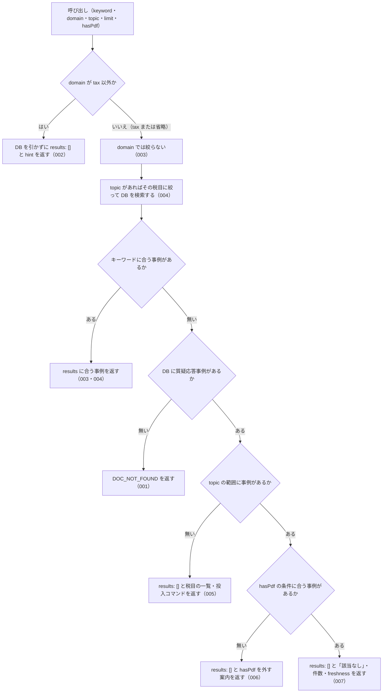

# 機能: nta_search_qa（質疑応答事例をキーワードで検索する）

- 機能 ID: NTA
- 版: current
- 承認日: 2026-09-26（初版と差分 `20260926-processing-flow`。PR #63）。差分 `20260926-undecided-to-issues` は 2026-09-26（PR #74）
- 起こした元: v0.21.0 の `src/tools/handlers.ts`（`handleNtaSearchQa`・`explainDocZeroHits`）、`src/tools/definitions.ts`、`src/services/db-search.ts`、`src/services/freshness.ts`、`src/services/index-status.ts`、`src/tools/doc-search-zero-hit.test.ts`、`src/tools/handlers.test.ts`
- 関連する Issue: houki-nta-mcp #18（短い語の扱い）、#21（通称の展開）、#23（0 件の理由を分ける・`topic` の追加）、#30（索引から消えた文書の印）

この文書は「このツールは何をするか」を書きます。どう実装しているか（関数名・テーブル名）は書きません。

## アクター

- MCP クライアント（Claude などの LLM、または CLI から呼ぶ人）。`keyword` を渡して、ローカル DB に取り込んである国税庁の質疑応答事例（9 税目）のうち、キーワードに合う事例の一覧（題名・事例の番号・出典 URL・抜粋）を受け取る。事例の本文は `nta_get_qa` で読む

## 入力

| 引数      | 必須 | 内容                                                                                                                                                                                                           |
| --------- | ---- | -------------------------------------------------------------------------------------------------------------------------------------------------------------------------------------------------------------- |
| `keyword` | 必須 | 検索キーワード。例: `"社内会議 軽減税率"`、`"テレワーク 必要経費"`。空白で区切った語をすべて含む事例を探す。3 文字以上の語を推奨する                                                                           |
| `domain`  | 任意 | 分野。質疑応答事例はすべて税務なので、`tax` は絞り込まず、それ以外の値は 0 件になる。税目で絞るときは `topic` を使う                                                                                           |
| `topic`   | 任意 | 税目。`shotoku`（所得税）/ `gensen`（源泉所得税）/ `joto`（譲渡所得）/ `sozoku`（相続税・贈与税）/ `hyoka`（財産の評価）/ `hojin`（法人税）/ `shohi`（消費税）/ `inshi`（印紙税）/ `hotei`（法定調書）のどれか |
| `limit`   | 任意 | 返す件数。既定 10、最大 50                                                                                                                                                                                     |
| `hasPdf`  | 任意 | 添付 PDF の有無で絞る（`true` = PDF 付き / `false` = PDF 無し / 省略 = 絞らない）。質疑応答事例は PDF を持たないので、`true` にすると 0 件になる                                                               |

検索の対象はローカル DB に取り込んだ事例だけである。国税庁サイトには取りに行かない。事例は `houki-nta-mcp --bulk-download-qa`（税目を絞るときは `--qa-topic=<topic>`）で取り込む。

## 処理の流れ

呼び出しを受けてから応答を返すまでに、何をどの順で確かめるかを示します。図の中の番号は「できること」の仕様 ID の末尾 3 桁です。

## できること

### SPEC-NTA-SEARCH-QA-001 質疑応答事例が DB に 1 件も無いときはエラー `DOC_NOT_FOUND`

ローカル DB に質疑応答事例が 1 件も入っていないときは、`results` を返さずにエラー `DOC_NOT_FOUND` を返す。「該当なし」という検索結果とは違うことを応答の形で示す。

- `error` に「ローカル DB に質疑応答事例が 1 件も無いため、検索できません（「該当なし」という結果ではありません）」
- `hint` に、MCP サーバーが開いている DB ファイルのパス、投入コマンド `houki-nta-mcp --bulk-download-qa`、投入したはずなら環境変数 `HOUKI_NTA_DB_PATH` / `XDG_CACHE_HOME` が bulk download を実行した環境と同じか確かめるよう書く
- `next_actions` の先頭は `action: "cli_bulk_download"`、`example.command` は `houki-nta-mcp --bulk-download-qa`
- `tool` は `nta_search_qa`

### SPEC-NTA-SEARCH-QA-002 `domain` が `tax` 以外なら DB を引かずに 0 件を返す

`domain` を `tax` 以外の値（例: `labor`）にしたときは、DB を開かずに `results: []` を返す。エラーにはしない。`hint` に、質疑応答事例はすべて税務（`domain="tax"`）の資料なので `domain="labor"` に当たる文書は無いこと、税目で絞るときは `topic` を使うことを書く。応答には `keyword` と `legal_status` も付く。

### SPEC-NTA-SEARCH-QA-003 `domain="tax"` は絞り込まない

`domain` を `tax` にしたときは、`domain` を省いたときと同じ範囲を検索する。例: DB に消費税の事例「会議費と軽減税率」が 1 件あるとき、`keyword: "軽減税率", domain: "tax"` は `results` にその 1 件を返す。

### SPEC-NTA-SEARCH-QA-004 `topic` で税目を絞る

`topic` を指定すると、その税目の事例だけを検索する。例: DB に消費税（`shohi`）の「会議費と軽減税率」と所得税（`shotoku`）の「テレワークの必要経費」があるとき、`keyword: "軽減税率", topic: "shohi"` は `results` に 1 件を返し、`keyword: "軽減税率", topic: "shotoku"` は `results: []` と、`topic="shotoku"` の範囲で該当なしである旨の `hint` を返す（SPEC-NTA-SEARCH-QA-007）。

### SPEC-NTA-SEARCH-QA-005 `topic` の範囲に事例が 1 件も無いときは税目の一覧と投入コマンドを案内する

DB に質疑応答事例はあるが、指定した `topic` の事例が 1 件も無いときは、`results: []` を返す（エラーにはしない）。

- `hint` に、DB の質疑応答事例の件数、`topic="<指定した値>"` の文書が無いこと、`topic` を外すか `available_taxonomies` の値を指定すること、税目を絞って投入する場合は `houki-nta-mcp --bulk-download-qa --qa-topic=<指定した値>` で追加できることを書く
- `available_taxonomies` に、DB の質疑応答事例が持つ税目の一覧を入れる。例: `["shohi", "shotoku"]`
- `freshness` に、DB の質疑応答事例全体の取得時点を付ける

### SPEC-NTA-SEARCH-QA-006 `hasPdf` の条件に合う事例が無いときは `hasPdf` を外すよう案内する

`hasPdf` を指定し、その条件（`topic` があればその範囲の中で）に合う事例が 1 件も無いときは、`results: []` を返す（エラーにはしない）。`hint` に、検索した範囲の件数と、「PDF 付きの文書はありません」（`hasPdf: false` なら「PDF 無しの文書はありません」）、`hasPdf` を外して検索するよう書く。質疑応答事例は PDF を持たないので、`hasPdf: true` は常にこの応答になる。

### SPEC-NTA-SEARCH-QA-007 キーワードに合う事例が無いときは「該当なし」と件数・`freshness` を返す

DB に事例はある（`topic` / `hasPdf` の範囲にも事例がある）が、キーワードに合う事例が無いときは、`results: []` を返す。

- `hint` は「該当なし。DB の質疑応答事例 <件数> 件に「<keyword>」に合う文書はありません。別のキーワードで試してください」。`topic` や `hasPdf` を指定していれば、件数の前に `（topic="shotoku"）` のように条件を書く。投入をやり直すようには案内しない
- `freshness` に、検索した範囲の事例の取得時点を付ける。`staleness` は取り込みからの日数で `fresh` / `stale` / `outdated` のどれか
- `keyword` と `legal_status` も付く

## できないこと

- 事例の本文（照会要旨・回答要旨・関係法令通達）を返すこと（`results` の `docId` を `nta_get_qa` の `topic` / `category` / `id` に分けて読む）
- 国税庁サイトを直接検索すること（DB に無い事例は見つからない。`--bulk-download-qa` で取り込む）
- 件数の合計（`total`）やページ送りを返すこと（`limit` 件までを返す）
- `domain` で税目を絞ること（税目は `topic`。`domain` は `tax` かそれ以外かだけを見る）
- 添付 PDF 付きの事例を返すこと（質疑応答事例は PDF を持たない）

## 未決

初版起こしで見つけた、意図か不具合かを人が決める項目です。決まったら「できること」に ID を振るか、`specs/changes/` の差分にします。

意図か不具合かの判断が要る項目は houki-nta-mcp の Issue に移し、ここには題と Issue の番号だけを残します。今の振る舞いのままでよくテストが無いだけの項目は、受入テストを書いてから「できること」に ID を振ります。

1. **ヒットしたときの応答の形。** `keyword`、`results`（要素は `docType: "qa-jirei"`・`docId`（例: `shohi/02/19`）・`taxonomy`・`title`・`sourceUrl`・`snippet`（合った語を `<b>` で囲んだ抜粋）・`score`・`scoreReasons`）、`freshness`、`legal_status`（`binds_citizens: false` / `binds_courts: false` / `binds_tax_office: false` と注）を返し、`score` の高い順に並べる。このツールの応答としてのテストは `results` の件数を数えるものしか無く、フィールドは確かめていない。ID を振るのは受入テストを書いてから。
2. **`limit` の扱い。** → houki-nta-mcp #68
3. **2 文字の語と 1 文字の語。** 3 文字以上の語で全文検索し、2 文字の語は本文か題名の部分一致で絞り込む（2 文字の語だけのときは部分一致だけで探す）。1 文字の語は検索条件から外す。どちらも、その旨を `search_notes`（文字列の配列）に書く。0 件のときも `search_notes` は付く。検索側のテストは `src/services/db-search.test.ts` にあるが、このツールの応答としてのテストが無い。ID を振るのは受入テストを書いてから。
4. **通称の展開。** キーワード全体が略称辞書の通称（例: `インボイス`）で、そのままでは 0 件のとき、正式名に広げて検索し直し、その旨を `search_notes` に書く。略称そのもの（例: `消基通`）は最初から正式名も含めて検索し、注記しない。このツールの応答としてのテストが無い。ID を振るのは受入テストを書いてから。
5. **国税庁の索引から消えた事例の印。** 索引から外れた事例は除外せずに返し、その要素に `index_status: "removed_from_index"` と `orphaned_at` を付け、`search_notes` に「検索結果 N 件のうち M 件は国税庁の索引から外れています」と注記を書く。このツールの応答としてのテストが無い。ID を振るのは受入テストを書いてから。
6. **`freshness` の `warning`。** 取り込みから 1 か月以上たった事例があるとき、`freshness.warning` に `--bulk-download-qa` で最新化するよう書く。このツールの応答としてのテストが無い。ID を振るのは受入テストを書いてから。
7. **`keyword` が空や記号だけのとき。** → houki-nta-mcp #69
8. **`domain` が `tax` 以外のとき DB を開かない** → houki-nta-mcp #72
9. **`domain` の値の範囲。** → houki-nta-mcp #72
10. **`src/tools/doc-search-zero-hit.test.ts` の「nta_search_qa: 他の種別だけが入っている DB（qa のみ）でタックスアンサーを検索すると DOC_NOT_FOUND」** は名前に `nta_search_qa` とあるが、呼んでいるのは `nta_search_tax_answer` である。このツールの ID は付けない。名前を直すかは人が決める（初版起こしの PR ではテスト名の先頭に ID を足す以外の変更はしない）。
