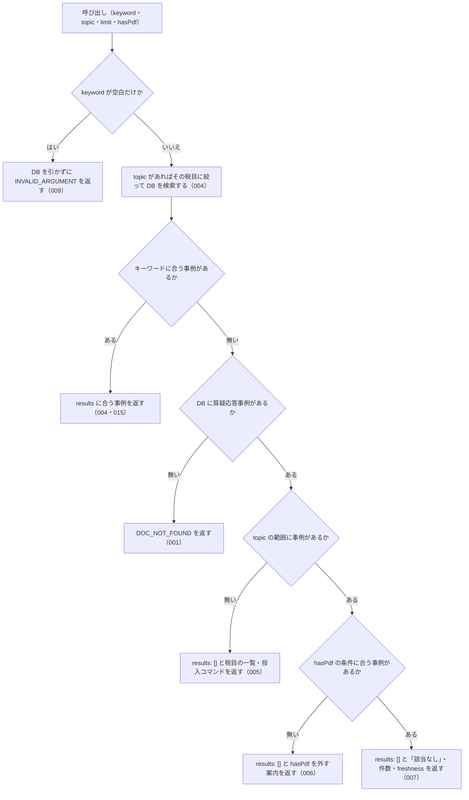

# 機能: nta_search_qa（質疑応答事例をキーワードで検索する）

- 版: current
- 起こした元: v0.21.0 の `src/tools/handlers.ts`（`handleNtaSearchQa`・`explainDocZeroHits`）、`src/tools/definitions.ts`、`src/services/db-search.ts`、`src/services/freshness.ts`、`src/services/index-status.ts`、`src/tools/doc-search-zero-hit.test.ts`、`src/tools/handlers.test.ts`
- 関連する Issue: houki-nta-mcp #18（短い語の扱い）、#21（通称の展開）、#23（0 件の理由を分ける・`topic` の追加）、#30（索引から消えた文書の印）、#72（domain 引数を外す）、#138（DB の場所の見え方。0.25.0）、#144（DB を開けないときの応答。0.26.0）

この文書は「このツールは何をするか」を書きます。どう実装しているか（関数名・テーブル名）は書きません。

## アクター

- MCP クライアント（Claude などの LLM、または CLI から呼ぶ人）。`keyword` を渡して、ローカル DB に取り込んである国税庁の質疑応答事例（9 税目）のうち、キーワードに合う事例の一覧（題名・事例の番号・出典 URL・抜粋）を受け取る。事例の本文は `nta_get_qa` で読む

## 入力

| 引数      | 必須 | 内容                                                                                                                                                                                                           |
| --------- | ---- | -------------------------------------------------------------------------------------------------------------------------------------------------------------------------------------------------------------- |
| `keyword` | 必須 | 検索キーワード。例: `"社内会議 軽減税率"`、`"テレワーク 必要経費"`。空白で区切った語をすべて含む事例を探す。3 文字以上の語を推奨する。空文字・空白だけは不可 |
| `topic`   | 任意 | 税目。`shotoku`（所得税）/ `gensen`（源泉所得税）/ `joto`（譲渡所得）/ `sozoku`（相続税・贈与税）/ `hyoka`（財産の評価）/ `hojin`（法人税）/ `shohi`（消費税）/ `inshi`（印紙税）/ `hotei`（法定調書）のどれか |
| `limit`   | 任意 | 返す件数。既定 10。1 以上 50 以下の整数 |
| `hasPdf`  | 任意 | 添付 PDF の有無で絞る（`true` = PDF 付き / `false` = PDF 無し / 省略 = 絞らない）。質疑応答事例は PDF を持たないので、`true` にすると 0 件になる                                                               |

検索の対象はローカル DB に取り込んだ事例だけである。国税庁サイトには取りに行かない。事例は `houki-nta-mcp --bulk-download-qa`（税目を絞るときは `--qa-topic=<topic>`）で取り込む。

## 処理の流れ

呼び出しを受けてから応答を返すまでに、何をどの順で確かめるかを示します。図の中の番号は「できること」の仕様 ID の末尾 3 桁です。

```mermaid
flowchart TD
  A["呼び出し（keyword・topic・limit・hasPdf）"] --> W{"keyword が空白だけか"}
  W -- はい --> E0["DB を引かずに INVALID_ARGUMENT を返す（009）"]
  W -- いいえ --> D["topic があればその税目に絞って DB を検索する（004）"]
  D --> F{"キーワードに合う事例があるか"}
  F -- ある --> G["results に合う事例を返す（004・015）"]
  F -- 無い --> H{"DB に質疑応答事例があるか"}
  H -- 無い --> E2["DOC_NOT_FOUND を返す（001）"]
  H -- ある --> I{"topic の範囲に事例があるか"}
  I -- 無い --> E3["results: [] と税目の一覧・投入コマンドを返す（005）"]
  I -- ある --> J{"hasPdf の条件に合う事例があるか"}
  J -- 無い --> E4["results: [] と hasPdf を外す案内を返す（006）"]
  J -- ある --> E5["results: [] と「該当なし」・件数・freshness を返す（007）"]
```

## できること

### SPEC-NTA-SEARCH-QA-001 質疑応答事例が DB に 1 件も無いときはエラー `DOC_NOT_FOUND`

ローカル DB に質疑応答事例が 1 件も入っていないとき（DB のファイルが無い・版の記録が無い・版が合わない・開けないときを含む）は、`results` を返さずにエラー `DOC_NOT_FOUND` を返す。「該当なし」という検索結果とは違うことを応答の形で示す。

- `error` に「ローカル DB に質疑応答事例が 1 件も無いため、検索できません（「該当なし」という結果ではありません）」
- `hint` は DB の状態ごとの文（SPEC-NTA-DB-SCHEMA-029。`<種別>` は `質疑応答事例`、フラグは `--bulk-download-qa`）。どの文も開こうとした DB のパスを含む
- `next_actions` の先頭は `action: "cli_bulk_download"`、`example.command` は `--bulk-download-qa` を付けた案内のコマンド（SPEC-NTA-DB-SCHEMA-027。環境変数を付けずに起動したときは `npx -y @shuji-bonji/houki-nta-mcp@latest --bulk-download-qa`）。版が新しい・読めない DB と、開けない DB では入れない（SPEC-NTA-DB-SCHEMA-021・029）
- `tool` は `nta_search_qa`
- 開けない DB では `retryable: false` と `detail.cause` も付ける（SPEC-NTA-DB-SCHEMA-029。v0.25.x では SPEC-NTA-COMMON-ERRORS-006 の `INTERNAL_ERROR` だった）

例: 環境変数を付けずに起動し（ホームディレクトリが `/Users/bonji`）、タックスアンサーだけを入れた DB で `{ keyword: "社内会議" }` を渡すと、`hint` は ``ローカル DB（~/.cache/houki-nta-mcp/cache.db）に質疑応答事例（doc_type="qa-jirei"）が入っていません。`npx -y @shuji-bonji/houki-nta-mcp@latest --bulk-download-qa` で投入してください。…`` で始まり、`next_actions[0].example.command` は `npx -y @shuji-bonji/houki-nta-mcp@latest --bulk-download-qa`（v0.24.x では `hint` が `MCP サーバーが開いている DB（/Users/bonji/.cache/houki-nta-mcp/cache.db）に…` で始まり、コマンドは `houki-nta-mcp --bulk-download-qa`）。

### SPEC-NTA-SEARCH-QA-004 `topic` で税目を絞る

`topic` を指定すると、その税目の事例だけを検索する。例: DB に消費税（`shohi`）の「会議費と軽減税率」と所得税（`shotoku`）の「テレワークの必要経費」があるとき、`keyword: "軽減税率", topic: "shohi"` は `results` に 1 件を返し、`keyword: "軽減税率", topic: "shotoku"` は `results: []` と、`topic="shotoku"` の範囲で該当なしである旨の `hint` を返す（SPEC-NTA-SEARCH-QA-007）。

### SPEC-NTA-SEARCH-QA-005 `topic` の範囲に事例が 1 件も無いときは税目の一覧と投入コマンドを案内する

DB に質疑応答事例はあるが、指定した `topic` の事例が 1 件も無いときは、`results: []` を返す（エラーにはしない）。

- `hint` に、DB の質疑応答事例の件数、`topic="<指定した値>"` の文書が無いこと、`topic` を外すか `available_taxonomies` の値を指定すること、税目を絞って投入する場合は `` `<コマンド>` `` で追加できることを書く。`<コマンド>` は `--bulk-download-qa --qa-topic=<指定した値>` を付けた案内のコマンド（SPEC-NTA-DB-SCHEMA-027）
- `available_taxonomies` に、DB の質疑応答事例が持つ税目の一覧を入れる。例: `["shohi", "shotoku"]`
- `freshness` に、DB の質疑応答事例全体の取得時点と DB のパスを付ける（SPEC-NTA-SEARCH-RULES-017・022）

例: 環境変数を付けずに起動し、`shohi` の事例だけがある DB で `{ keyword: "軽減税率", topic: "shotoku" }` を渡すと、`hint` は ``… 税目を絞って投入した場合は、`npx -y @shuji-bonji/houki-nta-mcp@latest --bulk-download-qa --qa-topic=shotoku` で追加できます`` で終わる（v0.24.x では `houki-nta-mcp --bulk-download-qa --qa-topic=shotoku`）。

### SPEC-NTA-SEARCH-QA-006 `hasPdf` の条件に合う事例が無いときは `hasPdf` を外すよう案内する

`hasPdf` を指定し、その条件（`topic` があればその範囲の中で）に合う事例が 1 件も無いときは、`results: []` を返す（エラーにはしない）。`hint` に、検索した範囲の件数と、「PDF 付きの文書はありません」（`hasPdf: false` なら「PDF 無しの文書はありません」）、`hasPdf` を外して検索するよう書く。質疑応答事例は PDF を持たないので、`hasPdf: true` は常にこの応答になる。

### SPEC-NTA-SEARCH-QA-007 キーワードに合う事例が無いときは「該当なし」と件数・`freshness` を返す

DB に事例はある（`topic` / `hasPdf` の範囲にも事例がある）が、キーワードに合う事例が無いときは、`results: []` を返す。

- `hint` は「該当なし。DB の質疑応答事例 <件数> 件に「<keyword>」に合う文書はありません。別のキーワードで試してください」。`topic` や `hasPdf` を指定していれば、件数の前に `（topic="shotoku"）` のように条件を書く。投入をやり直すようには案内しない
- `freshness` に、検索した範囲の事例の取得時点を付ける。`staleness` は取り込みからの日数で `fresh` / `stale` / `outdated` のどれか
- `keyword` と `legal_status` も付く

### SPEC-NTA-SEARCH-QA-008 `limit` は 1 以上 50 以下の整数で、範囲の外は `INVALID_ARGUMENT` にして丸めない

tools/list の inputSchema の `limit` は `type: "integer"`、`minimum: 1`、`maximum: 50` を持つ（SPEC-NTA-COMMON-ERRORS-012）。0・負の数・小数・51 以上・数値でない値を渡すと、inputSchema の検査で `INVALID_ARGUMENT`（`tool: "nta_search_qa"`、`detail.issues[0].path: "limit"`）を返し、DB を引かない。1 件や 50 件に丸めたり、切り捨てたりしない。既定の 10 件は変えない。

例: `{ keyword: "社内会議 軽減税率", limit: 0 }` は `code: "INVALID_ARGUMENT"`、`detail.issues` は `[{ path: "limit", message: "1 以上で指定してください" }]` で、DB は引かない（v0.21.3 では 1 件に丸めていた）。`limit: 100` は `[{ path: "limit", message: "50 以下で指定してください" }]`（v0.21.3 では 50 件）。`limit: 2.5` と `limit: "10"` は `整数で指定してください`。`limit: 50` は検査を通り、最大 50 件を返す。

### SPEC-NTA-SEARCH-QA-009 keyword が空文字・空白だけのときはDBを引かずに `INVALID_ARGUMENT` を返す

空文字は inputSchema の `minLength: 1` の検査（SPEC-NTA-COMMON-ERRORS-013）で止まり、`INVALID_ARGUMENT`（`tool: "nta_search_qa"`、`detail.issues: [{ path: "keyword", message: "空文字は指定できません" }]`）を返す。空白（半角スペース・全角スペース・タブ・改行）だけのときは、ツールの処理がDBを引く前に、SPEC-NTA-COMMON-ERRORS-014 の形の `INVALID_ARGUMENT`（`tool: "nta_search_qa"`、`error: "keyword が空です"`、`detail.issues: [{ path: "keyword", message: "空白だけは指定できません" }]`、`hint` に探したい語を渡すよう書く）を返す。

例: `keyword: ""` は `code: "INVALID_ARGUMENT"`・`detail.issues[0].message: "空文字は指定できません"`。`keyword: "　"`（全角スペース）と `keyword: " \n"` は `code: "INVALID_ARGUMENT"`・`error: "keyword が空です"`。どれもDBは引かない。

v0.21.3 では空の `keyword` に `results: []` と「該当なし」の `hint`（SPEC-NTA-SEARCH-QA-007 の形）を返していたが、空の `keyword` は探していないので、007 の対象から外れる。1 文字の語だけ・記号だけの `keyword` は、今までどおり SPEC-NTA-SEARCH-RULES-005・006 に従って語を外し、エラーにしない。

### SPEC-NTA-SEARCH-QA-010 `domain` は受け付けず、渡すと DB を引かずに `INVALID_ARGUMENT` を返す

tools/list の inputSchema の `properties` に `domain` は無い。`domain` を渡すと、どの値（`tax` を含む）でも SPEC-NTA-COMMON-ERRORS-004 の `INVALID_ARGUMENT`（`tool: "nta_search_qa"`、`detail.issues: [{ path: "domain", message: "inputSchema に無い引数です" }]`）を返し、DB を引かない。税目で絞るときは `topic`（SPEC-NTA-SEARCH-QA-004）を使う。`nta_search_tsutatsu`（SPEC-NTA-SEARCH-TSUTATSU-001）と houki-egov-mcp の `search_law` / `search_fulltext`（0.18.0、houki-egov-mcp #55）と同じ扱いである。

例: `{ keyword: "軽減税率", domain: "tax" }` は `code: "INVALID_ARGUMENT"`、`error: "引数が tools/list の inputSchema に合いません: domain: inputSchema に無い引数です"`、`detail.issues[0].path: "domain"`（v0.23.0 では `domain` を省いたときと同じ検索結果だった）。`{ keyword: "軽減税率", domain: "labor" }` も同じエラー（v0.23.0 では DB を引かずに `results: []` と `hint`）。`{ keyword: "軽減税率" }` と `{ keyword: "軽減税率", topic: "shohi" }` は今までどおり検索する。

## できないこと

- 事例の本文（照会要旨・回答要旨・関係法令通達）を返すこと（`results` の `docId` を `nta_get_qa` の `topic` / `category` / `id` に分けて読む）
- 国税庁サイトを直接検索すること（DB に無い事例は見つからない。`--bulk-download-qa` で取り込む）
- 件数の合計（`total`）やページ送りを返すこと（`limit` 件までを返す）
- 分野（`domain`）を指定すること（質疑応答事例はすべて税務。税目は `topic` で絞る）
- 添付 PDF 付きの事例を返すこと（質疑応答事例は PDF を持たない）

## 未決

初版起こしで見つけた、意図か不具合かを人が決める項目です。決まったら「できること」に ID を振るか、`specs/changes/` の差分にします。

意図か不具合かの判断が要る項目は houki-nta-mcp の Issue に移し、ここには題と Issue の番号だけを残します。今の振る舞いのままでよくテストが無いだけの項目は、受入テストを書いてから「できること」に ID を振ります。
