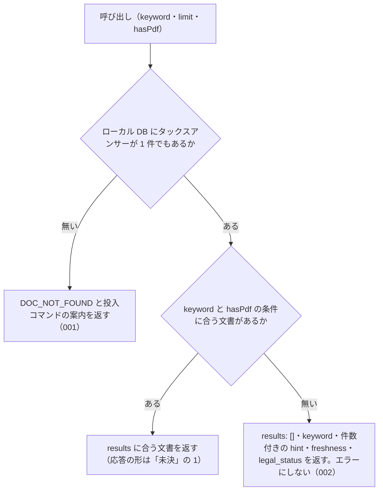

# 機能: nta_search_tax_answer（タックスアンサーをキーワードで検索する）

- 機能 ID: NTA
- 版: current
- 承認日: 2026-09-26（初版と差分 `20260926-processing-flow`。PR #63）。差分 `20260926-undecided-to-issues` は 2026-09-26（PR #74）
- 起こした元: v0.21.0 の `src/tools/handlers.ts`（`handleNtaSearchTaxAnswer`）、`src/tools/definitions.ts`、`src/services/db-search.ts`、`src/services/freshness.ts`、`src/services/index-status.ts`、`src/tools/handlers.test.ts`、`src/tools/doc-search-zero-hit.test.ts`
- 関連する Issue: houki-nta-mcp #18（短い語の扱い）、#21（通称の展開）、#23（0 件の理由を分ける）、#30（索引から消えた文書の印）

この文書は「このツールは何をするか」を書きます。どう実装しているか（関数名・テーブル名）は書きません。

## アクター

- MCP クライアント（Claude などの LLM、または CLI から呼ぶ人）。`keyword` を渡して、ローカル DB に入っている国税庁のタックスアンサー（一般納税者向けの解説、約 750 件）のうちキーワードに合うものの一覧（番号・題名・出典 URL・抜粋）を受け取る。本文は `nta_get_tax_answer` で番号を指定して取る

## 入力

| 引数      | 必須 | 内容                                                                                                                                                                                                           |
| --------- | ---- | -------------------------------------------------------------------------------------------------------------------------------------------------------------------------------------------------------------- |
| `keyword` | 必須 | 検索キーワード。例: `"ふるさと納税"`、`"医療費控除"`。空白で区切ると複数の語になる。3 文字以上の語を推奨する（2 文字の語は本文の部分一致で補い、その旨を `search_notes` に書く。1 文字の語は検索条件から外す） |
| `limit`   | 任意 | 返す件数。既定 10、最大 50                                                                                                                                                                                     |
| `hasPdf`  | 任意 | 添付 PDF の有無で絞る。`true` は PDF 付きだけ、`false` は PDF 無しだけ、省くと絞らない                                                                                                                         |

検索の対象は、`--bulk-download-tax-answer` でローカル DB に入れたタックスアンサーである。このツールは国税庁サイトには取りに行かない。

## 処理の流れ

呼び出しを受けてから応答を返すまでに、何をどの順で確かめるかを示します。図の中の番号は「できること」の仕様 ID の末尾 3 桁です。

## できること

### SPEC-NTA-SEARCH-TAX-ANSWER-001 DB にタックスアンサーが 1 件も無いときは「該当なし」ではなくエラーを返す

ローカル DB にタックスアンサーが 1 件も無い（まだ投入していない、または他の種別の文書だけが入っている）ときは、エラー `DOC_NOT_FOUND` を返す。キーワードに合う文書が無い「該当なし」とは違うことを、応答の形（`results` を持たないエラー）と `error` の文（「該当なし」という結果ではないこと）で示す。

- `tool` は `nta_search_tax_answer`
- `hint` に、MCP サーバーが開いている DB ファイルのパス、投入コマンド `houki-nta-mcp --bulk-download-tax-answer`、投入したはずのときに確かめる環境変数（`HOUKI_NTA_DB_PATH` / `XDG_CACHE_HOME`）を書く
- `next_actions` の先頭は `action: "cli_bulk_download"` で、`example.command` は `houki-nta-mcp --bulk-download-tax-answer`

例: 質疑応答事例だけを入れた DB で `keyword: "医療費控除"` を検索すると、`code: "DOC_NOT_FOUND"` と、その DB のパスを含む `hint` が返る。

### SPEC-NTA-SEARCH-TAX-ANSWER-002 タックスアンサーはあるがキーワードに合わないときは、成功として空の一覧と件数を返す

DB にタックスアンサーはあるが、キーワード（と `hasPdf` の条件）に合う文書が無いときは、エラーにせず次を返す。

| フィールド     | 内容                                                                                                                                                                                                                        |
| -------------- | --------------------------------------------------------------------------------------------------------------------------------------------------------------------------------------------------------------------------- |
| `results`      | 空の配列 `[]`                                                                                                                                                                                                               |
| `keyword`      | 渡した `keyword`                                                                                                                                                                                                            |
| `hint`         | 「該当なし」と、探した範囲の文書の件数（`hasPdf` を指定したときは条件も）。例: `該当なし。DB のタックスアンサー 1 件に「医療費控除」に合う文書はありません。別のキーワードで試してください`                                 |
| `freshness`    | DB に入れた日時の範囲。`oldest_fetched_at` / `newest_fetched_at` / `staleness`（`fresh` / `stale` / `outdated`）/ `days_since_oldest`。`outdated` のときは `--bulk-download-tax-answer` で最新化するよう `warning` を付ける |
| `search_notes` | 2 文字以下の語や通称の展開があったときだけ、その扱いを書いた文字列の配列                                                                                                                                                    |
| `legal_status` | `binds_citizens: false` / `binds_courts: false` / `binds_tax_office: false` と、参考解説資料である旨の注                                                                                                                    |

## できないこと

- 国税庁サイトからタックスアンサーを探すこと（探すのはローカル DB だけ。DB に入れるのは `--bulk-download-tax-answer`）
- タックスアンサーの本文を返すこと（`results` は番号・題名・出典 URL・抜粋まで。本文は `nta_get_tax_answer`）
- 税目（税目フォルダ）で絞ること（`nta_search_qa` の `topic` や `nta_search_kaisei_tsutatsu` の `taxonomy` のような引数は無い）
- 結果が 0 件のときに、検索範囲を国税庁サイトや他の種別の文書に広げること
- 回答が今の法令でも成り立つかを判定すること

## 未決

初版起こしで見つけた、意図か不具合かを人が決める項目です。決まったら「できること」に ID を振るか、`specs/changes/` の差分にします。

意図か不具合かの判断が要る項目は houki-nta-mcp の Issue に移し、ここには題と Issue の番号だけを残します。今の振る舞いのままでよくテストが無いだけの項目は、受入テストを書いてから「できること」に ID を振ります。

1. **キーワードに合う文書があるときの応答。** `results` の要素は `docType`（`tax-answer`）・`docId`（タックスアンサー番号。例: `6101`）・`taxonomy`・`title`・`sourceUrl`・`snippet`（合った語を `<b>` で囲んだ抜粋）・`score`・`scoreReasons` を持ち、`score` の高い順に並ぶ。応答には `keyword`・`freshness`・`legal_status` も付く。このツールの応答としてのテストが無い。ID を振るのは受入テストを書いてから。
2. **`hasPdf` で絞ったとき。** 条件に合う文書だけを返す。条件に合う文書が 1 件も無いときは `results: []` と、`hasPdf` を外すよう案内する `hint`（例: `DB のタックスアンサー 1 件に、PDF 付きの文書はありません。hasPdf を外して検索してください`）を返す。このツールの応答としてのテストが無い（同じ分け方のテストは `nta_search_qa` / `nta_search_kaisei_tsutatsu` にある）。ID を振るのは受入テストを書いてから。
3. **短い語の扱いと `search_notes`。** 2 文字の語は、3 文字以上の語があればその全文検索の結果を本文の部分一致で絞り込み、無ければ本文と題名の部分一致だけで探す（このときは `snippet` が部分一致の周辺の抜粋になる）。1 文字の語は検索条件から外す。どちらも `search_notes` に文で書き、`scoreReasons` にも残す。このツールの応答としてのテストが無い。ID を振るのは受入テストを書いてから。
4. **略称・通称の展開。** `keyword` が略称辞書（houki-abbreviations）の略称そのもの（例: `消基通`）なら正式名も合わせて探す。通称（例: `インボイス` → 消費税法）は、元の語で 0 件のときだけ正式名に広げて探し直し、広げたことを `search_notes` に書く。このツールの応答としてのテストが無い。ID を振るのは受入テストを書いてから。
5. **国税庁の索引から消えた文書の印。** 索引から外れた文書も結果から外さず、その要素に `index_status: "removed_from_index"` と `orphaned_at` を付け、`search_notes` に「検索結果 N 件のうち M 件は国税庁の索引から外れています」の文を足す。このツールの応答としてのテストが無い。ID を振るのは受入テストを書いてから。
6. **`limit` の範囲外の値を黙って丸める。** → houki-nta-mcp #68
7. **空のキーワード。** → houki-nta-mcp #69
8. **`nta_get_tax_answer` へ進む案内が無い。** → houki-nta-mcp #70
