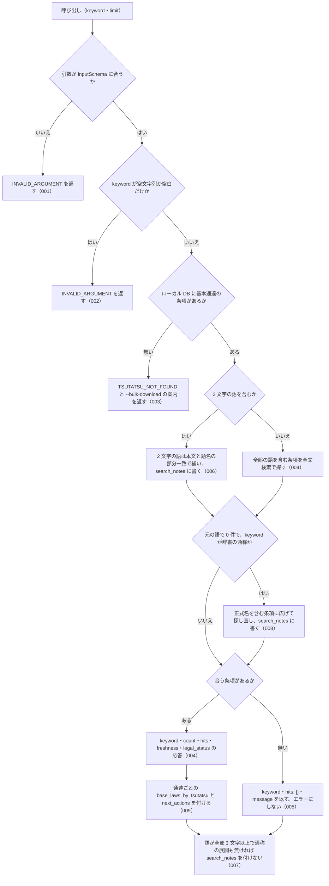

# 機能: nta_search_tsutatsu（基本通達の条項をキーワードで検索する）

- 機能 ID: NTA
- 版: current
- 承認日: 2026-06-26（PR #63）
- 起こした元: v0.21.0 の `src/tools/handlers.ts`（`searchTsutatsu`）、`src/tools/definitions.ts`、`src/tools/tool-args.ts`、`src/services/db-search.ts`、`src/services/relevance-scoring.ts`、`src/services/freshness.ts`、`src/constants.ts`、`src/errors.ts`、`src/tools/handlers.test.ts`、`src/server.test.ts`
- 関連する Issue: houki-nta-mcp #18（2 文字の語の補完）、#20（通達の応答に base_laws）、#21（通称の展開を 0 件のときだけにする）

この文書は「このツールは何をするか」を書きます。どう実装しているか（関数名・テーブル名）は書きません。

## アクター

- MCP クライアント（Claude などの LLM、または CLI から呼ぶ人）。`keyword` を渡して、ローカル DB に入っている基本通達 4 種（消費税法基本通達・所得税基本通達・法人税基本通達・相続税法基本通達）の条項から、キーワードに合う条項の一覧を受け取る

## 入力

| 引数      | 必須 | 内容                                                                                                                                                                                                                                                          |
| --------- | ---- | ------------------------------------------------------------------------------------------------------------------------------------------------------------------------------------------------------------------------------------------------------------- |
| `keyword` | 必須 | 検索キーワード。例: `"軽減税率"`、`"電子帳簿"`、`"棚卸資産"`。空白で区切ると全部の語を含む条項を探す。3 文字以上の語を推奨する。2 文字の語は本文の部分一致で補い、その旨を応答の `search_notes` に書く。略称・通称（`"消基通"`、`"インボイス"` など）も渡せる |
| `limit`   | 任意 | 取得件数。既定 10、最大 50                                                                                                                                                                                                                                    |

検索の対象はローカル DB だけである。国税庁サイトには取りに行かない。DB に条項を入れるのは CLI の `--bulk-download`（通達 1 つ）または `--bulk-download-all`（基本通達 4 種）である。

## 処理の流れ

呼び出しを受けてから応答を返すまでに、何をどの順で確かめるかを示します。図の中の番号は「できること」の仕様 ID の末尾 3 桁です。

## できること

### SPEC-NTA-SEARCH-TSUTATSU-001 inputSchema に合わない引数では検索しない

`keyword` が無い、`inputSchema` に無い引数（`domain`、`type` など）がある、型が合わない、のどれかのときは、エラー `INVALID_ARGUMENT` を返す。DB は引かない。応答には `tool: "nta_search_tsutatsu"`、`hint`（`tools/list` の inputSchema を確かめる案内）、`next_actions`（`action: "list_tools"`）、`detail.issues`（要素は `path` と `message`。inputSchema に無い引数のときは `path` にその引数名）が入る。

例: `{ keyword: "軽減税率", domain: "tax" }` → `code: "INVALID_ARGUMENT"`、`detail.issues[0].path` は `"domain"`。

### SPEC-NTA-SEARCH-TSUTATSU-002 keyword が空なら検索しない

`keyword` が空文字列か空白だけのときは、エラー `INVALID_ARGUMENT` を返す（`error` の文に `keyword` を含む）。DB は引かない。

### SPEC-NTA-SEARCH-TSUTATSU-003 DB に条項が 1 件も無いときは bulk download を案内する

ローカル DB に基本通達の条項が 1 件も入っていないときは、エラー `TSUTATSU_NOT_FOUND`（`error` は「ローカル DB に検索対象がありません」）を返す。`hint` に CLI の `--bulk-download` を実行する案内を書き、`next_actions` に `action: "cli_bulk_download"`（`example.command` は `houki-nta-mcp --bulk-download`）を入れる。

### SPEC-NTA-SEARCH-TSUTATSU-004 キーワードに合う条項があれば count と hits を返す

キーワードに合う条項があるときは、次のフィールドを持つ応答を返す。

| フィールド                               | 内容                                                                                                                                                                                                                                                                                 |
| ---------------------------------------- | ------------------------------------------------------------------------------------------------------------------------------------------------------------------------------------------------------------------------------------------------------------------------------------ |
| `keyword`                                | 渡されたキーワード（前後の空白を除いたもの）                                                                                                                                                                                                                                         |
| `count`                                  | `hits` の件数                                                                                                                                                                                                                                                                        |
| `hits`                                   | 条項の配列。要素は `tsutatsu`（正式名。例 `"法人税基本通達"`）・`abbr`（略称。例 `"法基通"`）・`clauseNumber`（例 `"9-2-1"`）・`title`・`snippet`（一致した語を `<b>…</b>` で囲んだ前後の抜粋）・`sourceUrl`・`score`（0.0〜1.5 の関連度）・`scoreReasons`（関連度の理由の文の配列） |
| `freshness`                              | DB に入れた日時の範囲と鮮度（`oldest_fetched_at` / `newest_fetched_at` / `staleness` / `days_since_oldest`。古いときは `warning`）。基本通達 4 種をまとめて判定する。判定できるものが無ければ付かない                                                                                |
| `legal_status`                           | `binds_citizens: false` / `binds_courts: false` / `binds_tax_office: true` と注（通達は行政内部文書で、納税者・裁判所を直接拘束しない）                                                                                                                                              |
| `base_laws_by_tsutatsu` / `next_actions` | SPEC-NTA-SEARCH-TSUTATSU-009                                                                                                                                                                                                                                                         |
| `search_notes`                           | SPEC-NTA-SEARCH-TSUTATSU-006・008。注記が無ければ付かない                                                                                                                                                                                                                            |

複数の語を空白で区切って渡したときは、全部の語を含む条項だけを返す。

例: `{ keyword: "役員" }` で DB に「役員の範囲」の条項 9-2-1 があれば、`count` は 1、`hits[0].clauseNumber` は `"9-2-1"`、`hits[0].snippet` は `<b>役員</b>` を含む。

### SPEC-NTA-SEARCH-TSUTATSU-005 キーワードに合う条項が無いときはエラーにしない

DB に条項はあるがキーワードに合うものが無いときは、`keyword`・`hits: []`・`message`（`"<keyword>" にマッチする clause はありません`）を返す。`count`・`freshness`・`legal_status`・`base_laws_by_tsutatsu`・`next_actions` は付けない。注記があれば `search_notes` を付ける（SPEC-NTA-SEARCH-TSUTATSU-006・008）。

### SPEC-NTA-SEARCH-TSUTATSU-006 2 文字の語は本文の部分一致で補い、search_notes で知らせる

全文検索の索引には 3 文字以上の語しか乗らない。2 文字の語が含まれるときは、次のように補い、応答の `search_notes` にその旨の文を入れる。ヒットしたときも 0 件のときも入れる。

- 2 文字の語だけのとき: 本文と題名の部分一致で探す。`search_notes` の文は「3 文字未満のため FTS5 (trigram) では検索できません。代わりに本文とタイトルの部分一致 (LIKE) で検索しました」と、語を続けて 3 文字以上にして再検索する推奨を含む
- 2 文字の語と 3 文字以上の語が混ざるとき: 3 文字以上の語で全文検索したうえで、本文か題名に 2 文字の語を含むものに絞る。`search_notes` の文はその旨を含む

例: `{ keyword: "社宅" }` で合う条項が無いときは `hits: []`、`message` は「社宅」を含み、`search_notes[0]` は「3 文字未満」を含む。

### SPEC-NTA-SEARCH-TSUTATSU-007 3 文字以上の語だけなら search_notes を付けない

キーワードの語が全部 3 文字以上で、通称の展開（SPEC-NTA-SEARCH-TSUTATSU-008）も起きなかったときは、応答に `search_notes` を付けない。

例: `{ keyword: "経営に従事" }` → `count: 1`、`search_notes` は無い。

### SPEC-NTA-SEARCH-TSUTATSU-008 通称は、元の語で 0 件のときだけ法令名に広げ、search_notes で知らせる

`keyword` が houki-abbreviations の辞書に通称（`aliases`。例 `"インボイス"` → 消費税法）として登録されているときは、まず元の語だけで検索する。

- 元の語で 1 件以上あれば、広げずにその結果を返す。`search_notes` は付けない
- 元の語で 0 件なら、辞書の正式名（法令名）を含む条項に広げて検索し直す。広げて見つかったときは `search_notes` に「"<元の語>" を含む文書は見つかりませんでした。略称辞書で "<元の語>" は <正式名> の通称として登録されているため、"<正式名>" を含む文書に広げて検索しました。"<正式名>" という語が出てくるだけの文書も含まれます」の文を入れる

例: DB に「適格請求書発行事業者登録簿…」の条項 1-7-2 と「…（消費税法の小規模事業者に係る納税義務の免除）」の条項 1-4-1 があるとき、`{ keyword: "適格請求書発行事業者" }` は 1-7-2 だけを返して `search_notes` は無く、`{ keyword: "インボイス" }` は 1-4-1 を返して `search_notes[0]` に「"消費税法" を含む文書に広げて検索しました」を含む。

### SPEC-NTA-SEARCH-TSUTATSU-009 結果に現れた通達ごとに、解釈の対象になる法律と get_law への案内を付ける

`hits` に現れた通達について、応答に 1 回だけ次を付ける。`hits` の要素には付けない（法律との対応は通達単位の事実であり、条項単位ではないため）。

- `base_laws_by_tsutatsu`: 通達の正式名 → 解釈の対象になる法律・政令・省令の配列（法律 → 施行令 → 施行規則の順）。同じ通達は 1 回だけ、`hits` の出現順
- `next_actions`: 通達ごとに 1 件。`action: "delegate_to_mcp"`、`example` は `{ mcp: "houki-egov", tool: "get_law", law_name: <配列の先頭の法律名> }`

`hits` が空のときは、どちらも付けない。

例: 法人税基本通達 2 件と消費税法基本通達 1 件が当たったとき、`base_laws_by_tsutatsu` は `{ 法人税基本通達: ["法人税法", "法人税法施行令", "法人税法施行規則"], 消費税法基本通達: ["消費税法", "消費税法施行令", "消費税法施行規則"] }`、`next_actions` は `law_name` が `"法人税法"` と `"消費税法"` の 2 件。

## できないこと

- 国税庁サイトを検索すること（対象はローカル DB に入れた条項だけ。DB に入れるのは CLI の `--bulk-download` / `--bulk-download-all`）
- 通達を 1 つに絞って検索すること（`keyword` に通達名を入れても、通達名を本文に含む条項を探すだけで、絞り込みにはならない）
- 基本通達 4 種以外の文書を検索すること（改正通達は `nta_search_kaisei_tsutatsu`、質疑応答事例は `nta_search_qa`、タックスアンサーは `nta_search_tax_answer`、事務運営指針は `nta_search_jimu_unei`、文書回答事例は `nta_search_bunshokaitou`）
- 条項の本文全体を返すこと（`snippet` は抜粋。本文は `nta_get_tsutatsu` で `clauseNumber` を渡して取る）
- 通達の条項と法律の条番号の対応を示すこと（`base_laws_by_tsutatsu` は法令名まで。条は付けない）
- 通達が今も有効かどうかを判定すること（改正の追跡は `nta_search_kaisei_tsutatsu` / `nta_get_kaisei_tsutatsu`）

## 未決

初版起こしで見つけた、意図か不具合かを人が決める項目です。決まったら「できること」に ID を振るか、`specs/changes/` の差分にします。

意図か不具合かの判断が要る項目は houki-nta-mcp の Issue に移し、ここには題と Issue の番号だけを残します。今の振る舞いのままでよくテストが無いだけの項目は、受入テストを書いてから「できること」に ID を振ります。

1. **`limit` の範囲外の値の扱い。** → houki-nta-mcp #68
2. **`score` / `scoreReasons` と並び順。** `hits` は関連度の降順（同点は全文検索の順位順）で並ぶ。関連度は全文検索の順位から作り、`keyword` に条項番号（例 `"9-2-1"`）が含まれていてその条項と一致するときは 0.5 を足す（`scoreReasons` に `"clause exact match"`）。2 文字の語の補完や通称の展開をしたときも `scoreReasons` に理由の文が入る。検索側の単体テストはあるが（`src/services/db-search.test.ts`）、このツールの応答としてのテストが無い。ID を振るのは受入テストを書いてから。
3. **`freshness`。** 基本通達 4 種をまとめて判定し（通達ごとではない）、最も古い取得日時から 7 日未満は `fresh`、30 日未満は `stale`、それ以上は `outdated`（`warning` に `--bulk-download-all` を案内）。このツールの応答としてのテストが無い。ID を振るのは受入テストを書いてから。
4. **`legal_status`。** ヒットしたときだけ付き、0 件のときは付かない。このツールの応答としてのテストが無い。ID を振るのは受入テストを書いてから。
5. **略称そのもの（`"消基通"`、`"消法"` など）の展開。** `keyword` が辞書の略称そのものなら、元の語と正式名の両方を含む条項を探す（OR）。通称と違って 0 件を待たず常に広げ、`search_notes` には書かない。展開の対象は管轄が houki-nta と houki-egov の項目だけで、判例・裁決の略称は広げない。略称が 3 文字未満（`"消法"`）のときは正式名だけで探す。検索側の単体テストはあるが、このツールの応答としてのテストが無い。ID を振るのは受入テストを書いてから。
6. **1 文字の語を外す注記。** `keyword` に 1 文字の語があるときは検索条件から外し、`search_notes` に「1 文字のため検索条件から外しました」の文を入れる。1 文字の語しか無いときは 0 件になる。このツールの応答としてのテストが無い。ID を振るのは受入テストを書いてから。
7. **全角の数字・英字・ハイフン・空白は半角に揃えてから探す。** DB に入れるときも同じ揃え方をしている。このツールの応答としてのテストが無い。ID を振るのは受入テストを書いてから。
8. **`TSUTATSU_NOT_FOUND` の案内するフラグ。** → houki-nta-mcp #70
9. **`keyword` が空のときの `INVALID_ARGUMENT` の形。** → houki-nta-mcp #69
10. **0 件のときの `count`。** → houki-nta-mcp #71
11. **空白で区切った複数の語。** 全部の語を含む条項だけを返す（AND）。検索側の単体テストはあるが、このツールの応答としてのテストが無い。ID を振るのは受入テストを書いてから。
